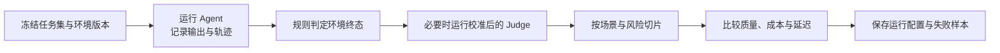

*图：沿图中的节点与箭头阅读，重点是任务成功、轨迹质量、工具正确性、成本与安全拆成可复现指标。*

---

构建一个 Agent 容易，但如何知道它"真的好用"？准确率一个数字远远不够——Agent 在什么任务上失败、失败的代价多大、换个表述方式还能答对吗？这些问题都需要系统化的评估体系来回答。本文介绍智能体性能评估的核心维度、主流基准与方法，以及为什么"单看准确率"会误导决策。

## 为什么需要系统化评估

在开发过程中，我们面临三类核心问题：

1. **能力验证**：Agent 是否真的具备了预期的能力？工具调用会用对吗？推理链是否合理？
2. **横向对比**：换了提示词或换了 LLM 底座之后，是否真的有进步？进步在哪个维度？
3. **可靠性保证**：上线之前，如何量化 Agent 在生产环境的可靠性？

没有系统化评估，这三个问题的答案都是"感觉上好像更好了"——而"感觉"在工程中是不可靠的。[AgentBench](https://arxiv.org/abs/2308.03688) 的跨环境设计说明，智能体能力需要在多类交互任务中测量，而不能由单一静态问答分数代表。

智能体评估面临的独特挑战：

- **输出不确定性**：同一问题可能有多个正确答案，简单的对错判断不够；
- **评估维度多样**：工具调用需要检查函数签名，问答需要评估语义相似度，规划需要检查步骤合理性；
- **评估有资源成本**：模型调用、环境重置、人工标注和 Judge 都会消耗预算，应把评估成本纳入运行记录。

## 核心评估维度

### 任务成功率（Task Success Rate）

最直接的指标——**Agent 是否最终完成了任务**。

对于有明确正确答案的任务（数学题、代码执行），可以用精确匹配（Exact Match）或准确率（Accuracy）：

$$\text{Accuracy} = \frac{\text{正确完成任务数}}{\text{总任务数}}$$

对于开放式任务（文章撰写、代码设计），需要更复杂的评估方法（见后文的 LLM Judge）。

**为什么准确率不够**：
- 不能区分"几乎对"和"完全错"——预测 71 和预测 0 在准确率上等价；
- 无法反映成功路径的质量——用了 20 步工具调用才对，和用 3 步才对，准确率相同；
- 无法捕捉鲁棒性——同一问题换一种表述就答错了，准确率不会告诉你这个。

### 效率（Efficiency）

Agent 完成任务的**资源消耗**，包括：

- **Token 消耗**：总输入 + 输出 token 数，直接对应 API 成本；
- **工具调用次数**：不必要的冗余调用既浪费成本又增加延迟；
- **端到端延迟**：从用户提问到给出答案的总时间；
- **推理步骤数**：对于多步推理任务，步骤数反映了推理效率。

$$\text{平均推理步骤} = \frac{1}{N_{\text{正确}}} \sum_{i \in \text{正确}} \text{steps}_i$$

高准确率但低效率的 Agent 在生产环境中可能无法接受（成本/延迟超标）。

### 鲁棒性（Robustness）

**Agent 在不同条件下的稳定性**：

- **表述鲁棒性**：同一语义的问题，不同表达方式是否都能答对？
- **噪声鲁棒性**：输入包含拼写错误、不相关信息时是否仍然正确？
- **边界条件处理**：输入为空、超出能力范围的任务，是否能优雅失败（而非胡乱瞎答）？
- **故障恢复能力（Failure Recovery）**：工具调用失败后，Agent 是否能自动重试或切换策略？

鲁棒性差的 Agent 在测试集上表现好，但在生产中遇到真实用户的各种奇怪输入时会频繁失败。

### 成本（Cost）

评估**经济可行性**：

- **每次任务成本**：平均 API 费用；
- **Token 效率**：有效信息 / 总 token 数（信噪比）；
- **推理时间**：实际部署的响应时间是否可接受。

准确率更高的 Agent 也可能因延迟或费用超出业务预算而不可用。应在同一任务集、同一价格快照和同一运行配置下比较质量、成本与延迟，而不是使用脱离实验的示例价格下结论。

## 从基准学习如何设计业务评估

公开基准最有价值的不是排行榜数字，而是它们对“任务、环境和判定器”的拆分方式。

### AgentBench：跨环境能力不是单一分数

[AgentBench](https://arxiv.org/abs/2308.03688) 把智能体放入多种交互环境，用环境特定的任务与成功标准观察模型作为 Agent 的行为。工程上的启发是：按能力域建立切片，例如数据库操作、网页交互、规划和工具调用；总分之外保留每个切片的失败明细，避免一个强项掩盖另一个关键能力的退步。

### WebArena：让环境验证实际结果

[WebArena](https://arxiv.org/abs/2307.13854) 构建可执行的网站任务，并用功能正确性检查任务结果。这提示业务评估优先使用可执行判定器：例如确认数据库是否真的写入预期记录、日历是否创建了正确事件、网页状态是否达到目标，而不是只判断 Agent 最终文本“看起来正确”。

### 把基准迁移到自己的业务

迁移时保留三层契约：

| 层次 | 要记录的内容 | 示例判定 |
|------|--------------|----------|
| 任务 | 输入、初始状态、允许的工具 | 用户要求改签且不得重复扣款 |
| 轨迹 | 工具名、参数、返回值、重试与副作用 | 未调用未授权工具，写操作具备幂等键 |
| 结果 | 环境终态和用户可见输出 | 订单状态、金额与通知均符合预期 |

公开基准的结果不能直接外推为生产表现；业务环境、工具 schema、权限和失败成本不同，仍需独立的版本化评估集。

## LLM Judge：开放式评估方法

对于没有精确答案的任务（文章质量、代码设计、数据生成质量等），**LLM Judge** 用强模型作为评委打分：

```python
# LLM Judge 评估流程示意（以官方文档为准）
judge_prompt = """
你是一位严格的评审专家。请从以下维度评估这道数学题的质量：

题目：{generated_question}

评分维度（各 1-5 分）：
1. 正确性：题目本身是否有误
2. 清晰度：题目表述是否清楚
3. 难度匹配：是否符合目标难度
4. 原创性：是否与常见题目雷同

请以 JSON 格式输出评分和理由。
"""

# 优势：
# - 可以评估主观质量
# - 提供详细的评分理由
# - 成本低于人工，但高于规则匹配
```

**LLM Judge 的使用注意事项**：
- 不同 LLM 作为 Judge 可能给出不同结果，评估结果本身存在偏差；
- Judge 是否可靠要用人工标注集校准，并记录模型和 Prompt 版本；
- 需要关注 Judge 对"自己家模型输出"的偏好（Position Bias、Verbosity Bias）。

## Win Rate：相对比较评估

当难以给出绝对分数时，**Win Rate** 用来做两个方案之间的相对比较：

```python
# Win Rate 评估流程
# 给 LLM Judge 两个方案 A 和 B，让它判断哪个更好

compare_prompt = """
请判断方案 A 和方案 B 哪个更好，或者相当：
方案 A：{response_a}
方案 B：{response_b}
请回答 A / B / Tie。
"""

# Win Rate(A vs B) = A 胜利次数 / 总比较次数
# 常用于：改版前后对比、模型升级评估、提示词 A/B 测试
```

Win Rate 适合直接比较两个版本，但不天然更稳定。应交换答案顺序、允许 Tie，并用重复运行或人工样本检查位置偏见与判定一致性。

## 评估实战流程

一个可复现的业务评估流程如下：



```python
async def evaluate(agent, cases, check_result):
    records = []
    for case in cases:
        run = await agent.run(case.input, environment=case.environment)
        records.append({
            "case_id": case.id,
            "passed": check_result(case, run.environment_state),
            "tool_calls": run.tool_calls,
            "input_tokens": run.usage.input_tokens,
            "output_tokens": run.usage.output_tokens,
            "latency_ms": run.latency_ms,
        })
    return records
```

**渐进式评估策略**：先用一个覆盖关键路径的冒烟子集验证评估管道，再按风险切片扩大运行范围。子集大小、放大条件和最终样本量来自覆盖目标、基线方差、最小可检测变化与预算；不能由固定条数或准确率阈值决定。

## 为什么准确率不够：一个完整视角

下面是一个**不带通用数值的决策示例**，展示只看准确率会错过什么：

| Agent | 任务成功 | 平均 Token 消耗 | 鲁棒性（表述变化） | 平均延迟 |
|-------|----------|----------------|-------------------|----------|
| Agent A | 较高 | 中 | 低 | 中 |
| Agent B | 中 | 低 | 高 | 低 |
| Agent C | 最高 | 高 | 中 | 高 |

只看任务成功率会选 C，但实际上：
- C 的成本和延迟可能超出产品预算；
- A 的鲁棒性差，真实用户的各种表述下会频繁失败；
- B 在综合考量下可能是最优选择。

评估维度选取应与**业务目标对齐**：如果成本是最高约束，重点看 Token 效率；如果是客户服务场景，鲁棒性比准确率更重要；如果是研究竞赛，准确率才是第一位。

## 常见误区与最佳实践

**误区 1：测试集越大越好**  
测试集的质量和多样性比盲目堆量更重要。重复样本再多也不能替代关键场景、风险切片和历史失败模式的覆盖。

**误区 2：评估结果是绝对的**  
同一 Agent 在不同测试集、不同测试条件下结果可能差异很大。评估要标注测试集版本、评估日期和具体配置。

**误区 3：忽略错误分析**  
准确率只告诉你"答对了多少"，错误分析（哪类题错、为什么错）才能指导改进方向。

**最佳实践**：
- 为每个业务场景选择对应的评估维度，不要用"通用"评估指标凑数；
- 建立持续评估 CI/CD：每次改动自动触发关键测试集的评估，防止性能退化（Regression）；
- 分类统计错误：工具调用失败、推理错误、格式错误分开统计，问题定位更精准；
- 在发布重大改动前，同时评估准确率、鲁棒性和成本，综合权衡再决策；
- 对于 LLM Judge 评估，做交叉验证（让多个不同 Judge 评分取平均），减少单一 Judge 的偏差。

## 面试常问

- **Q：为什么优先检查环境终态，而不只比较最终文本？**
  Agent 可能声称“已完成”但没有产生正确副作用。环境判定可以直接检查订单、文件或网页状态；[WebArena](https://arxiv.org/abs/2307.13854) 的功能正确性评估就是这种思路。

- **Q：LLM Judge 和人工评估的区别是什么？**  
  LLM Judge 便于自动化，但会受模型、Prompt、答案顺序和采样影响；人工评估同样可能存在分歧与偏见。实践中先用带标注样本校准 Judge，再对高风险或分歧样本做人审，并报告标注一致性。

- **Q：如何在有限预算下设计评估方案？**  
  先覆盖高风险业务路径和历史失败，再用分层抽样补齐常见与长尾场景；确定性判定器优先，昂贵 Judge 和人工复核用于开放或高风险样本。样本量由目标误差、方差、切片覆盖和预算共同决定。

## 参考资料

- [AgentBench: Evaluating LLMs as Agents](https://arxiv.org/abs/2308.03688)
- [WebArena: A Realistic Web Environment for Building Autonomous Agents](https://arxiv.org/abs/2307.13854)
