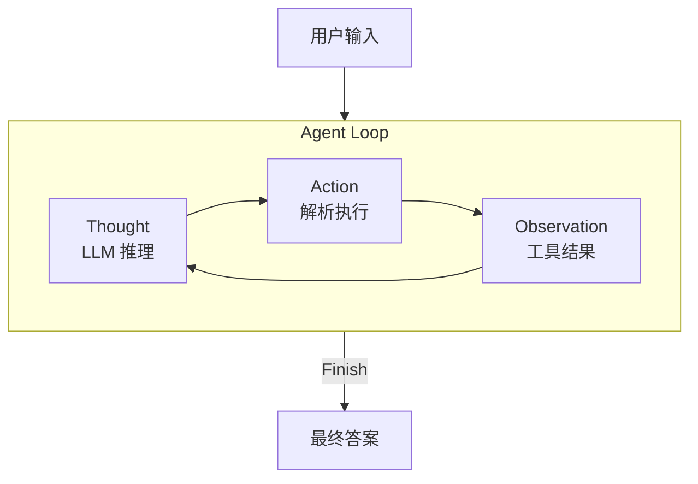

理论讲再多，不如亲手写一遍。本篇带你用 Python 从零搭建一个由真实 LLM 驱动的旅行助手智能体，完整走通 Thought-Action-Observation 循环。代码量不到 120 行，核心机制一目了然。

---

## 目标与任务定义

我们要构建的智能体需要完成这个任务：

> 查询今天北京的天气，然后根据天气推荐一个合适的旅游景点。

这个任务要求智能体展现**多步规划能力**：先查天气（工具调用一），把天气结果作为输入再查景点（工具调用二），最后综合信息输出答案。任何一步都依赖上一步的 Observation，无法跳过。

---

## 整体架构



四个核心部分：

1. **System Prompt**：告诉 LLM 它的角色、可用工具和输出格式
2. **工具函数**：真实调用外部 API 获取天气和景点数据
3. **LLM 客户端**：兼容 OpenAI 接口规范的通用客户端
4. **主循环**：驱动 Thought → Action → Observation 的迭代

---

## 第一步：设计 System Prompt

System Prompt 是智能体的「说明书」，它定义了 LLM 的角色、工具清单和输出格式约定：

```python
AGENT_SYSTEM_PROMPT = """
你是一个智能旅行助手。你的任务是分析用户的请求，使用可用工具一步步解决问题。

# 可用工具
- `get_weather(city: str)`: 查询指定城市的实时天气。
- `get_attraction(city: str, weather: str)`: 根据城市和天气搜索推荐的旅游景点。

# 输出格式（严格遵循）
每次回复必须包含且仅包含一对 Thought 和 Action：

Thought: [你的思考过程和下一步计划]
Action: [具体行动]

Action 格式二选一：
1. 调用工具：function_name(arg_name="arg_value")
2. 结束任务：Finish[最终答案]

重要：每次只输出一对 Thought-Action，Action 必须在同一行。
"""
```

**关键设计原则：**

- 每轮只输出一对 Thought-Action，避免 LLM 一次性「规划过头」
- 明确约定 `Finish[...]` 格式，让主循环能判断任务是否结束
- 工具描述要清晰包含参数名和含义，LLM 才能正确生成调用语句

---

## 第二步：实现工具函数

### 工具一：查询真实天气

使用免费的 `wttr.in` 服务，以 JSON 格式返回指定城市的天气数据：

```python
import requests

def get_weather(city: str) -> str:
    """通过 wttr.in API 查询真实天气信息。"""
    url = f"https://wttr.in/{city}?format=j1"
    try:
        response = requests.get(url, timeout=10)
        response.raise_for_status()
        data = response.json()
        condition = data['current_condition'][0]
        desc = condition['weatherDesc'][0]['value']
        temp = condition['temp_C']
        return f"{city}当前天气：{desc}，气温 {temp} 摄氏度"
    except requests.exceptions.RequestException as e:
        return f"错误：查询天气时网络问题 - {e}"
    except (KeyError, IndexError) as e:
        return f"错误：解析天气数据失败，可能城市名无效 - {e}"
```

注意工具函数始终返回**字符串**——这是转化为 Observation 的最简形式，LLM 直接可读。

### 工具二：搜索旅游景点

使用 Tavily Search API 获取实时搜索结果（需在 [tavily.com](https://www.tavily.com/) 注册获取 API Key）：

```python
import os
from tavily import TavilyClient

def get_attraction(city: str, weather: str) -> str:
    """根据城市和天气，搜索并返回景点推荐。"""
    api_key = os.environ.get("TAVILY_API_KEY")
    if not api_key:
        return "错误：未配置 TAVILY_API_KEY 环境变量。"

    tavily = TavilyClient(api_key=api_key)
    query = f"'{city}' 在 '{weather}' 天气下最值得去的旅游景点推荐"

    try:
        result = tavily.search(
            query=query,
            search_depth="basic",
            include_answer=True
        )
        if result.get("answer"):
            return result["answer"]
        # 降级：格式化原始结果
        items = [f"- {r['title']}: {r['content']}" for r in result.get("results", [])]
        return "根据搜索找到以下信息：\n" + "\n".join(items) if items else "未找到相关景点推荐。"
    except Exception as e:
        return f"错误：Tavily 搜索出错 - {e}"
```

将工具函数收入字典，供主循环按名称调用：

```python
available_tools = {
    "get_weather": get_weather,
    "get_attraction": get_attraction,
}
```

---

## 第三步：实现 LLM 客户端

当前大多数 LLM 服务（OpenAI、Azure、Ollama、vLLM 等）都兼容 OpenAI 接口规范，封装一个通用客户端：

```python
from openai import OpenAI

class OpenAICompatibleClient:
    """可连接任何兼容 OpenAI 接口的 LLM 服务。"""

    def __init__(self, model: str, api_key: str, base_url: str):
        self.model = model
        self.client = OpenAI(api_key=api_key, base_url=base_url)

    def generate(self, prompt: str, system_prompt: str) -> str:
        """调用 LLM 生成回应。"""
        try:
            response = self.client.chat.completions.create(
                model=self.model,
                messages=[
                    {"role": "system", "content": system_prompt},
                    {"role": "user", "content": prompt},
                ],
                stream=False,
            )
            return response.choices[0].message.content
        except Exception as e:
            return f"错误：调用 LLM 时出错 - {e}"
```

实例化时需要三个参数：`API_KEY`、`BASE_URL`、`MODEL_ID`，根据你使用的服务商填写。

---

## 第四步：主循环——驱动 TAO 迭代

这是整个智能体的核心，将上述组件串联起来：

```python
import re

# 配置（替换为你的实际凭证）
llm = OpenAICompatibleClient(
    model="YOUR_MODEL_ID",
    api_key="YOUR_API_KEY",
    base_url="YOUR_BASE_URL",
)
os.environ["TAVILY_API_KEY"] = "YOUR_TAVILY_API_KEY"

# 初始化
user_prompt = "你好，请帮我查询一下今天北京的天气，然后根据天气推荐一个合适的旅游景点。"
history = [f"用户请求：{user_prompt}"]
print(f"用户输入：{user_prompt}\n{'='*40}")

# Agent Loop
for i in range(5):  # 最大 5 轮，防止无限循环
    print(f"\n--- 循环 {i+1} ---")

    # 1. 构建完整 Prompt（历史对话拼接）
    full_prompt = "\n".join(history)

    # 2. 调用 LLM 进行 Thought
    llm_output = llm.generate(full_prompt, system_prompt=AGENT_SYSTEM_PROMPT)

    # 截断多余的 Thought-Action 对（防止 LLM 一次输出多轮）
    match = re.search(
        r"(Thought:.*?Action:.*?)(?=\n\s*(?:Thought:|Observation:)|\Z)",
        llm_output, re.DOTALL
    )
    if match:
        llm_output = match.group(1).strip()

    print(f"模型输出：\n{llm_output}")
    history.append(llm_output)

    # 3. 解析 Action
    action_match = re.search(r"Action:\s*(.*)", llm_output, re.DOTALL)
    if not action_match:
        observation = "错误：未能解析 Action 字段，请确保格式为 'Action: ...'。"
        history.append(f"Observation: {observation}")
        continue

    action_str = action_match.group(1).strip()

    # 4. 判断是否结束
    if action_str.startswith("Finish"):
        final = re.match(r"Finish\[(.*)\]", action_str, re.DOTALL)
        print(f"\n任务完成！\n最终答案：{final.group(1) if final else action_str}")
        break

    # 5. 解析工具调用并执行
    tool_match = re.search(r"(\w+)\((.*)\)", action_str)
    if not tool_match:
        observation = f"错误：无法解析工具调用格式 '{action_str}'"
    else:
        tool_name = tool_match.group(1)
        args_str = tool_match.group(2)
        kwargs = dict(re.findall(r'(\w+)="([^"]*)"', args_str))

        if tool_name in available_tools:
            observation = available_tools[tool_name](**kwargs)
        else:
            observation = f"错误：未定义的工具 '{tool_name}'"

    # 6. 记录 Observation，进入下一轮
    obs_str = f"Observation: {observation}"
    print(f"{obs_str}\n{'='*40}")
    history.append(obs_str)
```

---

## 运行结果分析

成功执行时，输出如下三轮循环：

```
用户输入：你好，请帮我查询一下今天北京的天气，然后根据天气推荐一个合适的旅游景点。
========================================

--- 循环 1 ---
模型输出：
Thought: 首先需要获取北京今天的天气情况，再根据天气推荐旅游景点。
Action: get_weather(city="北京")
Observation: 北京当前天气：Sunny，气温 26 摄氏度
========================================

--- 循环 2 ---
模型输出：
Thought: 北京今天晴朗，气温适中，适合户外游览。下一步根据晴天推荐景点。
Action: get_attraction(city="北京", weather="Sunny")
Observation: 北京晴天最值得去的景点是颐和园（美丽湖景和古建筑）和长城（壮观景色和历史意义）。
========================================

--- 循环 3 ---
模型输出：
Thought: 已获得天气和景点信息，可以给出最终答案。
Action: Finish[今天北京晴朗，气温 26 摄氏度，非常适合外出。推荐颐和园欣赏皇家园林，或前往长城领略壮观历史景观。]

任务完成！
最终答案：今天北京晴朗，气温 26 摄氏度，非常适合外出。推荐颐和园欣赏皇家园林，或前往长城领略壮观历史景观。
```

三轮循环展示了智能体的四项基本能力：

| 能力 | 体现 |
|------|------|
| **任务分解** | 自动将「查天气+推荐景点」拆成两步执行 |
| **工具调用** | 正确识别工具名和参数，传递 `city="北京"` |
| **上下文理解** | 循环二把循环一的天气结果（Sunny）作为 `weather` 参数传入 |
| **结果合成** | 循环三综合两次 Observation 输出完整答案 |

---

## 关键机制深入理解

### 为什么用 History 拼接而不是对话轮次？

主循环用简单的字符串列表 `history` 追踪全部上下文，每轮把 LLM 输出和 Observation 都 append 进去，最后 join 成一个大字符串传给 LLM。

这种方式直观易调试，适合学习理解。生产框架（LangChain、LangGraph 等）会用更结构化的消息格式（`messages=[{"role": "assistant", ...}]`），但核心思路相同：**让 LLM 每轮都能看到完整的历史轨迹**。

### 正则解析的局限

主循环用正则表达式解析 `Action` 字段，这在教学场景够用，但有脆弱性：

- LLM 可能偶尔不严格遵循格式
- 参数值中若包含引号或特殊字符会导致解析失败

生产环境的解决方案是使用 LLM 原生的 **Function Calling / Tool Use** 能力，由模型直接输出结构化 JSON，无需手写解析器。

### 最大循环次数的作用

`for i in range(5)` 的上限不只是「保险措施」，它也隐含了一个设计约束：**如果一个任务需要超过 5 轮才能完成，可能意味着任务分解策略有问题，或者工具返回的信息质量不够**。调整这个数字时要同时审视工具设计。

---

## 可扩展方向

在这个骨架的基础上，可以逐步添加：

```python
# 1. 记忆：让智能体记住用户偏好
user_preferences = {}  # {"budget": "经济型", "interests": ["历史文化"]}

# 2. 错误重试：工具失败时自动换策略
if "错误" in observation:
    # 触发备用工具或请求用户澄清

# 3. 多工具并行：某些步骤可以同时调用多个工具（需框架支持）

# 4. 结果评估：在 Finish 前增加自我审查步骤
# Thought: 答案是否覆盖了用户的所有需求？
```

---

## 常见误区与面试考点

**常见误区：**

- 误区一：「System Prompt 写得越详细越好」。过度约束会让 LLM 的推理僵化，遇到格式边界情况更容易崩溃。保持必要约束，给 LLM 推理空间
- 误区二：「观察结果（Observation）越完整越好」。原始 API 返回通常包含大量冗余字段，喂给 LLM 会占用宝贵的 context window，应精简为关键信息
- 误区三：「解析失败就是 LLM 能力问题」。90% 的解析失败是 Prompt 的格式约束不够明确导致的，先审查 System Prompt 再换模型

**面试常问：**

- Thought-Action-Observation 三者分别是什么？解析器在哪个环节介入？
- 为什么智能体主循环需要保存完整的历史记录？不保存会发生什么？
- 生产环境中如何替代手写正则解析 Action？（Function Calling / Tool Use）
- 如何防止智能体在工具调用失败时无限重试？
- 这个简单实现与 LangChain Agent 的核心区别是什么？

---

