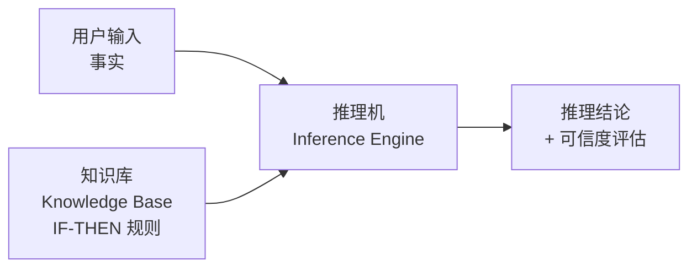
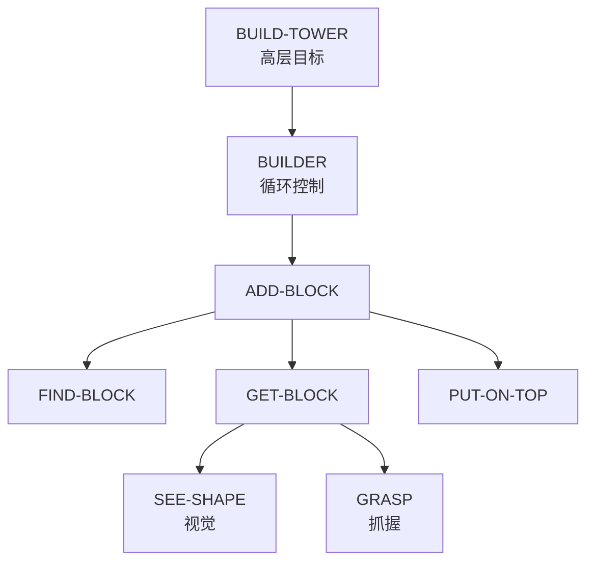
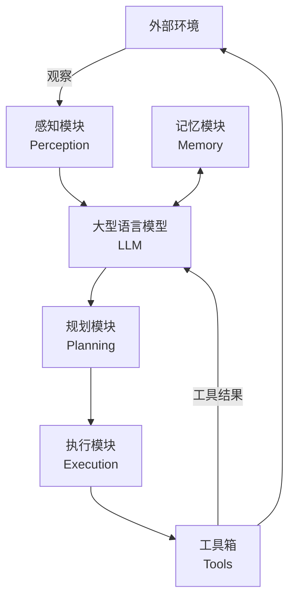

# 智能体发展史

要理解现代 AI 智能体为何长成今天这个样子，必须回溯它走过的路。每一代范式的诞生，都是为了解决上一代的根本局限；而新的解决方案在带来能力跃升的同时，也引入了新的挑战，为下一代的诞生埋下伏笔。这条「问题驱动」的迭代路线，正是智能体技术演进的底层逻辑。

---

## 第一阶段：符号与逻辑的时代（1950s–1980s）

### 物理符号系统假说

人工智能领域的第一个重要范式是**符号主义（Symbolism）**。其理论根基是 1976 年由图灵奖得主**艾伦·纽厄尔（Allen Newell）**和**赫伯特·西蒙（Herbert A. Simon）**共同提出的**物理符号系统假说（Physical Symbol System Hypothesis, PSSH）**。

假说包含两个核心论断：

1. **充分性**：任何物理符号系统，都具备产生通用智能行为的充分手段
2. **必要性**：任何能展现通用智能行为的系统，其本质必然是一个物理符号系统

简而言之：**智能的本质，就是符号的计算与处理。**

这一假说将对人类心智的哲学探讨转化为可工程化的具体问题，为整个符号主义时代注入了强大信心。

### 专家系统与 MYCIN

在 PSSH 的直接影响下，**专家系统（Expert System）**成为符号主义时代最重要的应用成果。其核心架构由两部分组成：

| 组件 | 作用 |
|------|------|
| **知识库** | 存储领域专家提供的「IF-THEN」产生式规则，可达数百上千条 |
| **推理机** | 从已知事实出发（正向链）或从目标假设出发（反向链）进行逻辑推导 |

**MYCIN**（斯坦福大学，1970s）是专家系统的里程碑：约 600 条医学规则，诊断细菌性血液感染的准确率达到人类专家水平。MYCIN 还引入**置信因子（Certainty Factor, CF）**概念，用 -1 到 1 的数值表示结论可信度，首次让机器在医学推理中处理不确定性。

与专家系统「深度」形成互补，**威诺格拉德（Terry Winograd）**于 1968-1970 年开发的 **SHRDLU** 展示了「广度」——在「积木世界」中用自然语言指挥虚拟机械臂，首次将语言理解、规划和记忆三个模块集成于统一系统，其「感知-思考-行动」闭环直接奠定了现代智能体的原型。

### 符号主义的根本局限

从 1980 年代起，符号主义撞上了两堵方法论固有的墙：

- **知识获取瓶颈**：规则需专家访谈逐条提炼，成本高昂且难规模化；专家的直觉性知识根本无法表达为「IF-THEN」规则
- **系统脆弱性**：遇到规则之外的微小变化就完全失灵。SHRDLU 的成功恰恰依赖封闭的积木世界——真实世界充满例外

---

## 第二阶段：ELIZA 与规则驱动的局限（1966）

**约瑟夫·魏泽鲍姆（Joseph Weizenbaum）**于 1966 年发布的 **ELIZA** 是早期 NLP 的著名尝试。其中最知名的脚本「DOCTOR」模仿一位心理治疗师，通过**模式匹配和文本替换**营造出「理解」的幻象——识别用户输入中的关键词（如 `I am`、`I need`），用预设的「IF-THEN」模板生成开放式提问。

ELIZA 清晰暴露了规则驱动系统的三项根本局限：

- **无语义理解**：「I am NOT happy」会被 `I am (.*)` 匹配，产生语义不通的回应
- **无状态记忆**：每次回应仅基于当前输入，无法进行连贯多轮对话
- **规则爆炸**：随着规则增多，冲突和优先级管理复杂度指数上升

尽管如此，ELIZA 产生了著名的「**ELIZA 效应**」——许多用户相信它真的在理解自己，揭示了人类天生的情感投射心理。这也说明：对话 AI 的「智能感」很早就与「真正理解」脱钩了。

---

## 第三阶段：心智社会——从单体到协作（1986）

符号主义的困境促使**马文·明斯基（Marvin Minsky）**在《**心智社会（The Society of Mind）**》（1986）中提出了一个颠覆性的问题：

> "What magical trick makes us intelligent? The trick is that there is no trick. The power of intelligence stems from our vast diversity, not from any single, perfect principle."

### 核心思想：涌现式智能

明斯基不再追求一个全能的推理核心，而是将心智想象为一个由大量**极其简单的智能体**组成的「社会」。这些简单智能体自身「无心」，但通过相互激活与抑制，复杂的智能行为从局部交互中**涌现（Emergence）**出来。

以「搭建积木塔」为例：

`GRASP` 不知道什么是塔，`BUILDER` 不知道如何控制手臂——但当这个「无心」的智能体社会通过简单规则相互作用时，「搭积木塔」这个复杂行为就自然涌现了。

### 对多智能体系统的理论启发

心智社会理论为**多智能体系统（Multi-Agent System, MAS）**提供了核心概念基础：

| 心智社会概念 | MAS 对应 |
|------------|---------|
| 去中心化控制 | 无中央节点的协调机制 |
| 涌现式计算 | 蚁群算法、粒子群优化 |
| 智能体的社会性 | 通信语言（ACL）、协商策略、信任模型 |

明斯基将研究焦点从「如何构建全能的单一智能体」转向「如何设计高效协作的智能体群体」，直接开启了分布式 AI 的研究序幕。

---

## 第四阶段：学习范式的演进（1980s–2010s）

### 联结主义与强化学习

**联结主义（Connectionism）**在 1980 年代重新兴起，模仿生物神经网络，将知识以连接权重的形式分布式存储，通过反向传播从数据自动学习。深度学习的崛起让智能体能直接从原始图像、声音、文本中理解世界——这是符号主义时代难以想象的感知能力。

然而联结主义主要解决感知问题，**强化学习（Reinforcement Learning, RL）**则专注于**序贯决策**：智能体通过「感知状态 → 执行行动 → 获得奖励 → 更新策略」的闭环反复迭代，追求**长期累积奖励**最大化。

**AlphaGo**（DeepMind, 2016）是 RL 的里程碑：数百万次自我对弈，从零掌握围棋，击败人类冠军。AlphaGo Zero 完全不依赖人类棋谱，发现了超越既有认知的创新棋路。

### 预训练范式：大规模知识习得

RL 智能体缺乏「先验世界知识」，需要从零理解任务。解决方案在 NLP 领域浮现——**预训练-微调（Pre-training & Fine-tuning）**：在互联网级别的海量文本上通过自监督学习（「预测下一个词」）训练超大规模模型，再针对下游任务用少量数据微调。

这以全新方式解决了符号主义最棘手的「知识获取瓶颈」——不是手工编码，而是从数据中**自动习得**。当模型规模跨越某个阈值，还会出现预料之外的**涌现能力（Emergent Abilities）**：

- **上下文学习（In-context Learning）**：无需微调，仅凭少量示例（Few-shot）或零示例（Zero-shot）完成新任务
- **思维链（Chain-of-Thought）推理**：引导模型逐步输出推理过程，显著提升复杂推理准确性

---

## 第五阶段：LLM 驱动的现代智能体（2020s–）

### 三大思潮的融合

智能体发展由三条主线交织推进：

| 思潮 | 代表人物/成果 | 贡献 |
|------|-------------|------|
| **符号主义** | 纽厄尔、西蒙 → MYCIN、SHRDLU | 逻辑推理框架、知识表示 |
| **联结主义** | 辛顿 → 深度学习 → Transformer → LLM | 神经网络、感知能力、大规模知识习得 |
| **行为主义（RL）** | DeepMind → AlphaGo → RLHF | 序贯决策、从交互和反馈中学习 |

以 GPT 系列为代表的 LLM 本身是联结主义产物，却成为执行符号推理、工具调用和规划决策的核心大脑——形成了神经-符号结合的现代智能体架构。RLHF（基于人类反馈的强化学习）则让 LLM 对齐人类偏好，是行为主义在 LLM 时代的直接应用。

### LLM 智能体的核心架构

LLM 智能体通过持续迭代的感知-思考-行动循环完成任务：

1. **感知**：通过传感器接收观察（用户指令、API 返回、环境状态）
2. **思考**：LLM 进行规划与推理，输出结构化的 Thought + Action
3. **行动**：执行模块调用工具与外部环境交互
4. **观察**：工具结果反馈，更新记忆，启动新一轮循环

### 当前技术栈全景

得益于 LLM 的突破，Agent 技术栈在 2023-2024 年呈现出前所未有的多样性：

| 层级 | 代表框架/协议 | 定位 |
|------|------------|------|
| **框架层** | LangChain/LangGraph | 通用构建框架，LangGraph 支持有向图状态机 |
| **框架层** | AutoGen、CrewAI、MetaGPT | 多 Agent 协作，各有侧重（对话网络/角色团队/组织化 SOP） |
| **协议层** | MCP（Model Context Protocol） | Anthropic 提出的工具调用标准化协议 |
| **模型层** | GPT-4o、Claude 3.5+、Gemini | 各家持续优化工具调用和推理能力 |

---

## 历史规律

智能体发展中有一条始终成立的规律：**每代范式都在解决上一代的核心痛点**。

符号主义遇到知识获取瓶颈 → 联结主义从数据自动习得知识 → RL 智能体缺乏先验世界知识 → 预训练补足 → 工具调用和动态规划能力不足 → LLM Agent 框架完善这一闭环。

另一条同样值得记住：从明斯基的心智社会（1986）到 CrewAI/AutoGen（2023+），「用多个专门化智能体协作替代单一全能智能体」的思想跨越近 40 年，在 LLM 时代终于找到了工程实现的土壤。

---

## 常见误区与面试考点

**常见误区：**

- **误区一**：「LLM 是全新的发明，与以前的 AI 没有关系」。LLM 是联结主义的产物，其工具调用能力是神经-符号融合，Prompt 工程是符号主义思想的延伸。现代智能体是三大思潮融合的结果
- **误区二**：「符号主义已经死了」。规则引擎、知识图谱在特定领域（金融合规、医疗审批）仍不可替代，「可解释性」是亚符号系统的致命弱点
- **误区三**：「强化学习只用来玩游戏」。RLHF（基于人类反馈的强化学习）是现代 LLM 对齐训练的核心技术，GPT-4、Claude 等模型都依赖 RL 来优化人类偏好对齐

**面试常问：**

- 物理符号系统假说的两个论断是什么？它对早期 AI 有什么影响？
- 专家系统为什么最终没有大规模应用？「知识获取瓶颈」具体指什么？
- 明斯基《心智社会》的核心思想是什么？它如何影响了多智能体系统研究？
- 强化学习的核心循环（State-Action-Reward-Policy）是什么？与监督学习的本质区别是什么？
- 预训练解决了符号主义时代的什么问题？两种范式在「知识表示」上有什么本质区别？
- 符号主义、联结主义、行为主义三大思潮如何在现代 LLM 智能体中融合？

---

> 本文参考《Hello-Agents》(datawhalechina) 整理。
