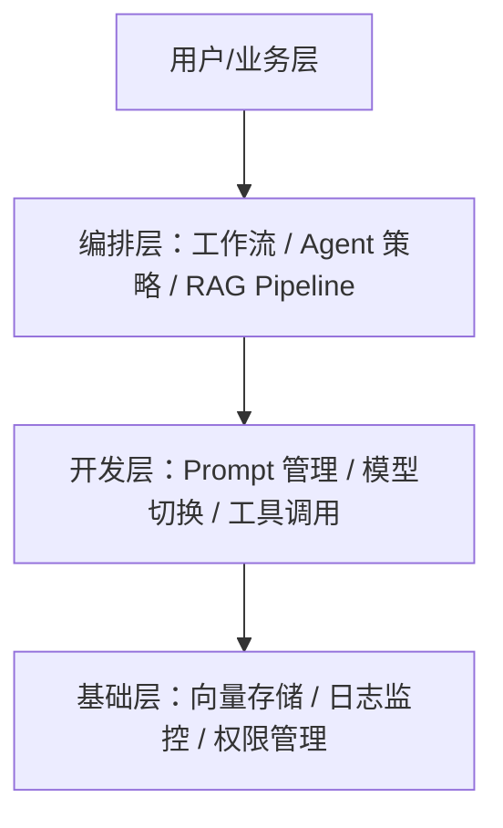
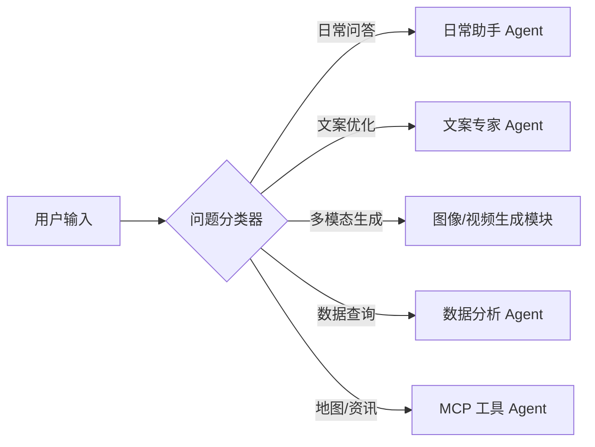
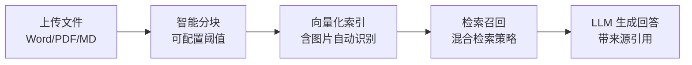
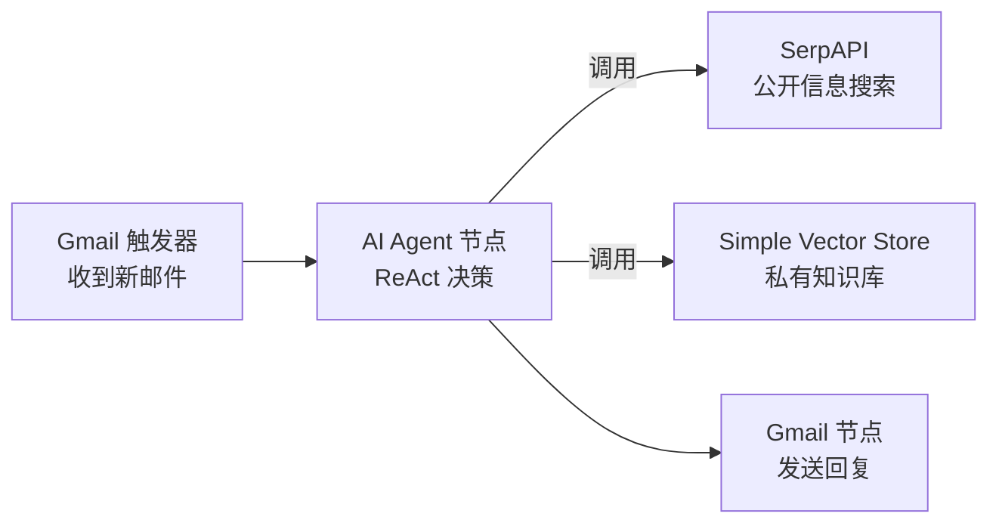
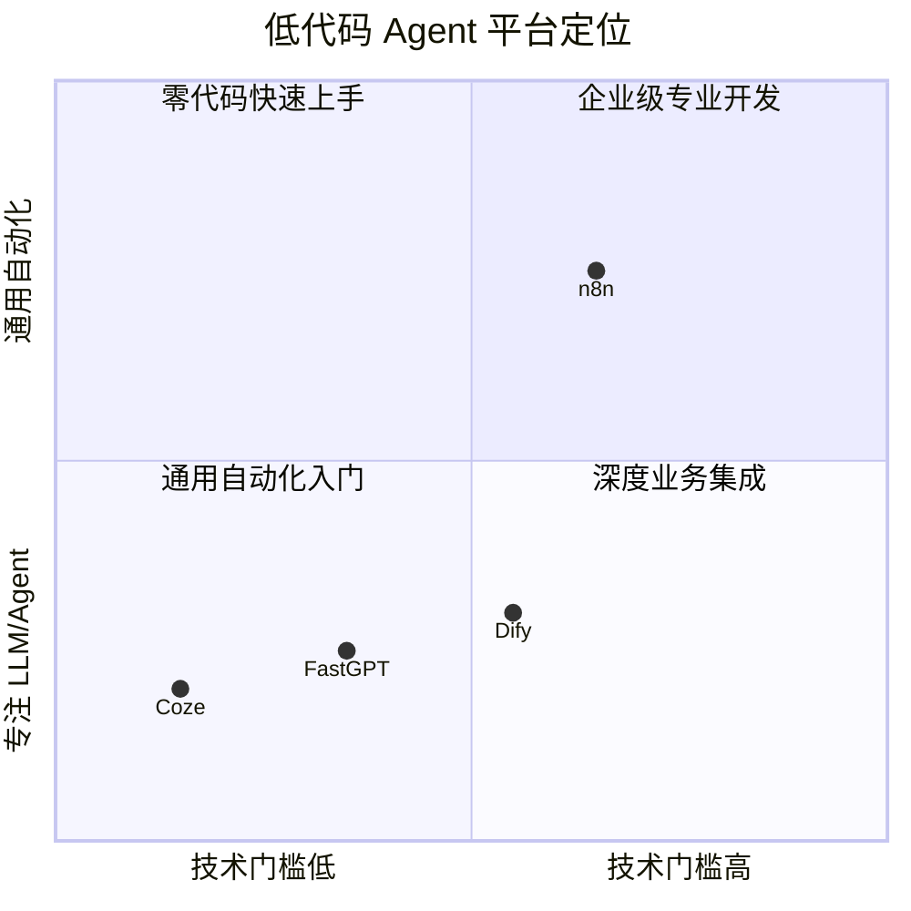

# 低代码平台搭建智能体

智能体的开发并非只有一条路——除了从零手写 ReAct 循环，还可以借助图形化低代码平台快速搭建、调试和发布 Agent 应用。本文梳理低代码/无代码平台搭 Agent 的核心思路、主流平台能力横向对比，以及与代码开发模式的适用边界。

## 为什么需要平台化构建

纯代码方式给了开发者最大自由度，但随着业务复杂度上升，维护成本与迭代周期会急剧增加。低代码平台在更高层次进行了抽象，把 API 调用、状态管理、并发控制等底层细节封装成可拖拽的"节点"。这带来几个关键收益：

1. **降低技术门槛**：产品经理、业务专家无需精通编程，即可参与 Agent 的设计与迭代。
2. **提升原型速度**：从想法到可交互原型的时间从"数天"压缩到"数小时"。
3. **可视化可观测性**：数据在节点间的流转、耗时瓶颈、工具调用失败，都能在画布上一目了然，远比打日志直观。
4. **沉淀最佳实践**：优秀平台内置 ReAct 模板、RAG Pipeline 配置、提示词管理等行业共识，降低"踩坑"概率。

需要强调的是，**低代码并不取代代码**，而是提供互补选择：平台处理标准化流程，代码处理精细化控制——这种"混合开发"思路才是工程化最佳实践。

## 主流平台概览

当前智能体低代码市场已形成明显的分类：

| 平台 | 核心定位 | 适用人群 | MCP 支持 | 部署方式 |
|------|---------|---------|---------|---------|
| **Coze** | 零代码 Agent 构建 + 生态分发 | 非技术用户、内容创作者 | 暂不支持 | 云端 SaaS |
| **Dify** | 全栈 LLM 应用开发平台 | 专业开发者、企业团队 | 支持（SSE 模式） | 云端 + 私有化 |
| **FastGPT** | 企业级知识库问答引擎 | 中小企业、RAG 需求团队 | 原生支持 | 云端 + 私有化 |
| **n8n** | 通用工作流自动化 + AI 节点 | 深度业务集成开发者 | 可自定义 | 云端 + 私有化 |

## Coze：积木式 Agent 搭建

Coze（扣子）是字节跳动推出的零代码 Agent 平台，以可视化编排和丰富插件生态见长。其核心抽象体系可以这样理解：

```
Agent = 模型 + 提示词 + 工具(插件) + 工作流 + 知识库 + 记忆
```

**典型工作流搭建步骤**（以"每日 AI 简报"为例）：

1. 在插件市场搜索并添加 RSS、GitHub、arXiv 等数据源插件，配置各自的参数（RSS 链接、搜索关键词、返回数量等）。
2. 将插件节点作为输入，连接到大模型节点，在系统提示中定义角色（"资深科技媒体编辑"）和输出格式。
3. 在预览界面测试输出，调整提示词后发布到飞书/微信/豆包等渠道。

**Coze 的优势与局限**：

优势：插件生态丰富、界面极度友好、一键多渠道发布。

局限：目前尚不支持 MCP 协议（已列入路线图）；复杂工作流仍需一定的 JS/Python 基础；导出格式为专有 ZIP 而非通用 JSON，平台迁移成本较高。

## Dify：企业级全栈平台

Dify 是开源的 LLM 应用开发平台，融合了 BaaS（后端即服务）和 LLMOps 理念，提供从原型到生产的一站式方案。

**核心架构分层**：



**多 Agent 路由示例**（超级助手案例）：



MCP 工具集成是 Dify 的一大亮点。以高德地图 MCP 为例，在魔搭社区 MCP 市场获取 SSE 端点配置后，填入 Dify 的 MCP 工具管理界面，Agent 即可在 ReAct 模式下自主调用地图、新闻、饮食推荐等外部服务。

**Dify 的优势与局限**：

| 维度 | 评价 |
|------|------|
| 插件生态 | Marketplace 超 8000 个插件，模型中立 |
| 安全合规 | AES-256 加密、RBAC、审计日志，满足企业级要求 |
| 部署灵活 | Docker Compose 一键私有化部署 |
| 学习曲线 | 对零技术背景用户仍有一定门槛 |
| 性能 | 核心服务由 Python 实现，高并发场景需额外优化 |
| API 兼容性 | 格式不兼容 OpenAI，与部分第三方系统集成需适配 |

## FastGPT：RAG 优先的知识库引擎

FastGPT 将知识库问答作为第一等公民，围绕"文件导入 → 智能分块 → 向量检索 → 对话生成"的完整 RAG 链路做了深度优化。

**知识库处理流程**：



与其他平台的关键差异：FastGPT 支持细粒度配置分块参数（原文长度阈值、问答对提取、标题加入索引、图片自动索引），调试界面可直接查看每个分块的内容，极大降低 RAG 精调的门槛。

其 Flow 编排模块支持意图识别、表单输入、条件分支、循环等节点，配合原生 MCP 支持，适合构建如"智能投顾助手"这类需要同时调用私有知识库和实时外部数据的复合场景。

**FastGPT 的优势与局限**：

优势：RAG 链路极致打磨、原生 MCP 支持、模型中立（OpenAI/Claude/通义/DeepSeek 均可对接）。

局限：模板生态相对薄弱；免费版积分与配额有限（100 积分、30 QPM）；社区与英文文档完善度仍在提升中。

## n8n：连接万物的自动化平台

n8n 的本质是通用工作流自动化工具，AI 节点是其众多能力之一。理解这一点是掌握 n8n 的关键——你构建的不是一个 Agent，而是一个更宏大的自动化流程，LLM 只是其中一个处理节点。

**核心概念**：

- **触发节点（Trigger Node）**：流程起点，如"收到新 Gmail 邮件时触发"、"Webhook 接收到请求时触发"。
- **常规节点（Regular Node）**：执行具体操作，如读取数据库、调用 OpenAI、发送邮件。
- **AI Agent 节点**：将模型（Chat Model）、记忆（Memory）、工具（Tools）高度整合在一个节点中，实现自主决策。

**智能邮件助手流程示意**：



Agent 节点的 Prompt 可以注入动态上下文（如当前时间 `{{ new Date().toLocaleString(...) }}`），并指导 Agent 何时调用哪个工具、如何格式化最终输出（如要求输出严格 JSON 便于后续节点解析）。

**n8n 的优势与局限**：

| 维度 | 评价 |
|------|------|
| 连接能力 | 数百个预置节点，可对接几乎任何 SaaS 服务 |
| AI 整合 | AI Agent 节点将模型/记忆/工具一体化，逻辑清晰 |
| 私有化 | 支持完整私有化部署，数据安全性好 |
| 持久化存储 | Simple Memory/Vector Store 基于内存，服务重启即丢失，生产环境需替换为 Redis/Pinecone |
| 版本控制 | 工作流导出为 JSON，但可读性不如 git diff 代码直观 |
| 性能 | 节点调度机制在超高并发下有额外开销 |

## 平台横向对比



**选型建议速查**：

| 场景 | 推荐平台 |
|------|---------|
| 快速原型、非技术用户 | Coze |
| 企业级应用、复杂多模态业务 | Dify |
| 私有知识库问答、智能客服 | FastGPT |
| 深度业务流程集成、IoT/CRM 联动 | n8n |
| 极致性能与定制 | 纯代码（LangChain / LangGraph） |

## 与代码开发的对比

```
低代码平台  ←——————————————————————→  代码开发
快速原型 ✓          均适用          精细控制 ✓
非技术协作 ✓                        复杂状态管理 ✓
可视化调试 ✓                        CI/CD 集成 ✓
平台锁定风险 ✗                      开发门槛高 ✗
扩展上限受限 ✗                      维护成本高 ✗
```

最佳工程实践是根据阶段灵活切换：**用平台快速验证，用代码实现精细化控制**。两者并非对立，而是不同抽象层次的工具箱。

## 常见误区与最佳实践

**常见误区**：
- 误认为"零代码 = 无限制"：平台的边界往往在复杂状态管理、精确错误处理、高并发场景下暴露得最明显。
- 忽视提示词质量：低代码平台不能替代提示工程，平台工具再强大，提示词写得差，输出质量照样低。
- 忽视持久化：n8n/Dify 内置的轻量存储往往是内存级别的，生产环境上线前务必替换为持久化方案。
- 过度依赖单一平台：主流平台都存在某种形式的锁定风险，重要业务逻辑应尽量保持可迁移性。

**最佳实践**：
- 复杂工作流拆分为小节点，每个节点职责单一，方便调试和复用。
- MCP 优先于私有插件：MCP 协议标准化了工具接入方式，优先选择支持 MCP 的平台以保持灵活性。
- 在平台调试满意后，考虑将核心逻辑导出/抽取为代码，以便集成到现有 CI/CD 体系。
- 知识库类应用重视分块策略：分块大小直接影响检索精度，建议多组参数 A/B 测试。

## 面试常问要点

- 低代码平台与纯代码开发的本质区别是什么？分别适用哪些场景？
- Dify、FastGPT、n8n 三者在 RAG 支持上各自的强项是什么？
- MCP（Model Context Protocol）协议解决了什么问题？为什么被视为工具调用的新标准？
- n8n 的 Simple Memory 在生产环境中有什么风险？如何解决？
- 什么是"问题分类器 + 多 Agent 路由"架构？它相比单一 Agent 有什么优势？

> 本文参考《Hello-Agents》(datawhalechina) 整理。
