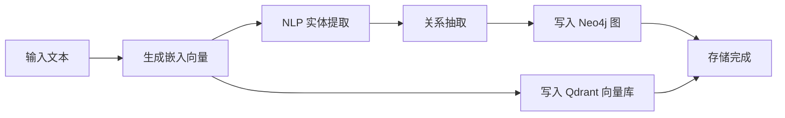
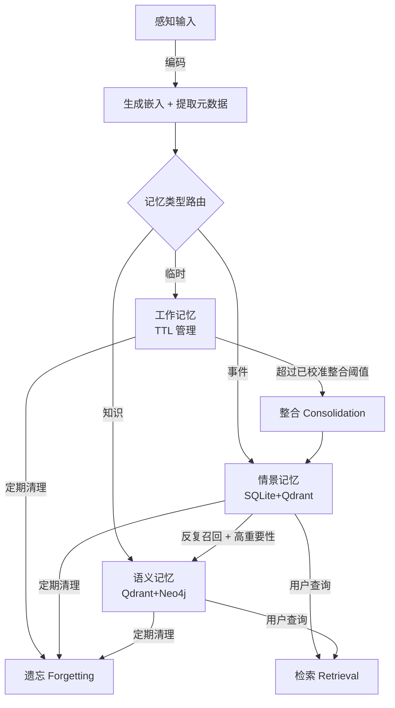

*图：沿图中的节点与箭头阅读，重点是区分工作上下文、情节记忆、语义记忆及检索写回，而不是把所有历史都称作长期记忆。*

---

Agent 的记忆系统决定了它能否跨轮次保持上下文、积累经验、从历史中学习。没有记忆，每次对话都是一次性的——Agent 不知道你是谁，也不记得上一轮说过什么。本文从认知科学的类比出发，系统梳理 Agent 记忆的分类、存储与召回机制、向量检索的核心原理，以及记忆压缩与遗忘策略。

---

## 记忆的分层模型

[MemGPT](https://arxiv.org/abs/2310.08560) 将上下文窗口内外的状态组织成分层存储，并由运行时决定信息的换入与换出，而不是把所有历史永久塞进一次推理。


认知心理学将人类记忆分为三个层次：感觉记忆（极短暂，秒级）、工作记忆（短期，容量有限）、长期记忆（持久，几乎无上限）。长期记忆又分为语义记忆（抽象知识）和情景记忆（具体经历）。

Agent 的记忆系统借鉴了同样的分层设计：

```
┌────────────────────────────────────────────────────┐
│                 Agent Memory System                │
│                                                    │
│  ┌──────────────────┐   ┌────────────────────────┐ │
│  │   工作记忆        │   │       长期记忆           │ │
│  │   Working Memory │   │                        │ │
│  │                  │   │  ┌──────────────────┐  │ │
│  │ · 当前对话上下文  │   │  │  情景记忆           │  │ │
│  │ · 任务中间状态   │◄──┤  │  Episodic Memory  │  │ │
│  │ · 临时变量       │   │  ├──────────────────┤  │ │
│  │                  │   │  │  语义记忆           │  │ │
│  │  TTL 自动清理    │   │  │  Semantic Memory  │  │ │
│  │  容量按预算配置  │   │  ├──────────────────┤  │ │
│  └──────────────────┘   │  │  感知记忆           │  │ │
│                         │  │  Perceptual Memory│  │ │
│                         │  └──────────────────┘  │ │
│                         └────────────────────────┘ │
└────────────────────────────────────────────────────┘
```

| 类型 | 持久性 | 典型内容 | 存储方案 |
|------|--------|----------|----------|
| 工作记忆 | 会话级（TTL） | 当前对话、任务状态 | 纯内存 |
| 情景记忆 | 长期 | 具体交互事件、时序经历 | SQLite + 向量库 |
| 语义记忆 | 长期 | 用户偏好、领域知识、规则 | 向量库 + 知识图谱 |
| 感知记忆 | 动态管理 | 图片、音频等多模态数据 | 多模态向量库 |

---

## 工作记忆：短期上下文管理

工作记忆是 Agent 的"当前工作台"，存放当前会话中的临时信息。它有两个核心约束：

- **容量上限**：按上下文预算、检索延迟和会话并发配置，防止无限增长
- **TTL 机制**：每条记录可带生存时间；时长来自业务有效期与合规要求

当容量接近上限时，系统自动移除优先级最低的记录，而非简单地按先进先出截断。

检索时采用混合策略：优先尝试 TF-IDF 向量化语义检索，失败时回退到关键词匹配。评分综合三个因素：

```
base_relevance = α × vector_score + (1 - α) × keyword_score
final_score = base_relevance × time_decay × importance_weight
# α、衰减参数与 importance 映射都属于 MemoryPolicy，需在目标查询集上校准
```

```python
class WorkingMemory:
    def __init__(self, config: MemoryConfig):
        self.config = config
        self.max_capacity = config.working_memory_capacity
        self.max_age_minutes = config.working_memory_ttl
        self.vector_weight = config.vector_weight
        self.memories = []

    def add(self, memory_item: MemoryItem) -> str:
        self._expire_old_memories()               # 先清过期
        if len(self.memories) >= self.max_capacity:
            self._remove_lowest_priority_memory() # 再清低优先级
        self.memories.append(memory_item)
        return memory_item.id

    def retrieve(self, query: str, limit: int, **kwargs) -> list:
        self._expire_old_memories()
        vector_scores = self._try_tfidf_search(query)
        scored_memories = []
        for memory in self.memories:
            vector_score  = vector_scores.get(memory.id, 0.0)
            keyword_score = self._calculate_keyword_score(query, memory.content)
            base_relevance = vector_score * self.vector_weight + keyword_score * (1 - self.vector_weight) \
                             if vector_score > 0 else keyword_score
            time_decay        = self._calculate_time_decay(memory.timestamp)
            importance_weight = self.config.importance_weight(memory.importance)
            final_score = base_relevance * time_decay * importance_weight
            if final_score > 0:
                scored_memories.append((final_score, memory))
        scored_memories.sort(key=lambda x: x[0], reverse=True)
        return [m for _, m in scored_memories[:limit]]
```

---

## 长期记忆：情景与语义

[Generative Agents](https://arxiv.org/abs/2304.03442) 的原始架构把记忆流、基于相关性/近期性/重要性的检索、反思与规划连接起来，说明长期记忆还需要召回和写回策略。


### 情景记忆（Episodic Memory）

情景记忆存储具体的交互事件，保留完整的时序关系。底层采用 **SQLite + Qdrant** 混合架构：SQLite 处理结构化过滤（时间范围、会话 ID、重要性区间），Qdrant 处理语义向量检索，两路结果合并排序后返回。

检索评分公式：

```
score = (α × vector_similarity + (1 - α) × recency_score) × importance_weight
```

这里的 `α`、时间衰减与重要性映射都是待校准参数。用带“应召回 / 不应召回”标注的业务查询集比较 Recall@k、误召回和时效错误，再确定配置。

情景记忆比工作记忆更强调**时间近因性**（recency），因为"什么时候发生的"本身就是情景知识的核心维度——最近发生的事更可能被当前对话引用。

### 语义记忆（Semantic Memory）

语义记忆存储抽象知识和概念，是 Agent 知识图谱的核心。架构上引入 **Neo4j 图数据库**，将实体和关系以图结构存储，支持多跳推理（找到"A 的同事 B 擅长的领域"之类的关联）。

添加一条语义记忆的完整流程：



检索时并行执行向量检索和图检索，再合并评分排序：

```python
def retrieve(self, query: str, limit: int) -> list:
    candidate_limit = self.config.candidate_limit(limit)
    vector_results = self._vector_search(query, candidate_limit)
    graph_results  = self._graph_search(query, candidate_limit)
    return self._combine_and_rank(vector_results, graph_results, query)[:limit]

# 评分公式中的 vector、graph、importance 权重由检索评估集校准并写入配置
```

图检索能表达向量相似度无法直接回答的显式关系，但不代表它应占固定权重。合并前还要处理两路分数是否可比，并按查询类型验证排序质量。

---

## 向量检索在 Agent 记忆中的应用

向量检索（Vector Retrieval）是长期记忆的技术基石。核心思路：将文本转换为高维稠密向量，在语义空间中计算相似度，找出语义上最相关的记忆，而非依赖关键词字面匹配。

### 嵌入与检索流程


### 三种嵌入方案对比

| 方案 | 精度 | 速度 | 成本 | 离线 | 适用场景 |
|------|------|------|------|------|----------|
| 云端 API（如 DashScope） | 高 | 中（网络延迟） | 有 | 不支持 | 生产环境，精度优先 |
| 本地 Transformer（all-MiniLM-L6-v2 等） | 中高 | 快（GPU 加速） | 无 | 支持 | 离线部署，成本敏感 |
| TF-IDF | 低（词频匹配） | 极快 | 无 | 支持 | 兜底降级，轻量场景 |

工程上常见降级链：云端 API → 本地 Transformer → TF-IDF，保证任意环境下系统可用。嵌入方案一旦确定，**全套系统必须统一使用同一模型**，切换时需要重建全部向量索引。

### 高级检索策略：MQE 与 HyDE

纯向量检索的局限在于查询表述与文档表述可能存在词汇鸿沟（问题是疑问句，文档是陈述句，语义空间有偏差）。两种策略可以缓解这个问题：

**MQE（Multi-Query Expansion，多查询扩展）**：用 LLM 生成语义等价但表述不同的多个查询，并行检索后合并去重。它可能缓解查询与文档的词汇鸿沟，也会增加调用、噪声和合并成本；召回收益必须在目标语料、查询集与固定评测口径上测量，不能套用通用百分比。

```python
def generate_expanded_queries(query: str, n: int) -> list[str]:
    # 以官方 LLM 接口为准
    prompt = f"原始查询：{query}\n请给出 {n} 个不同表述的查询，每行一个。"
    expanded = llm.invoke(prompt)
    return [query] + parse_lines(expanded)
```

**HyDE（Hypothetical Document Embeddings，假设文档嵌入）**：先用 LLM 生成一段假设性答案，再用答案向量检索真实文档。假设答案与真实答案在语义空间中更接近，即使内容不完全准确，关键术语也能有效引导检索。

```python
def generate_hyde_doc(query: str) -> str:
    prompt = f"问题：{query}\n请直接写一段包含关键术语的客观答案段落。"
    return llm.invoke(prompt)
```

两种策略整合到统一的扩展检索框架中：原始查询 + MQE 扩展 + HyDE 假设文档组成候选查询集，并行检索，按分数去重合并返回 top-k。

---

## 记忆存储与召回：生命周期管理

记忆的生命周期对应认知科学的五阶段：编码 → 存储 → 检索 → 整合 → 遗忘：



### 记忆整合（Consolidation）

工作记忆中重要性超过阈值的条目会被"提升"为情景记忆；情景记忆中反复召回、高度重要的内容可进一步提升为语义记忆。这模仿了人类大脑的记忆固化过程（睡眠期间海马体将短期记忆转化为长期记忆）。

```python
# 策略值来自业务配置；下面仅展示接口形状
memory_tool.execute("consolidate",
    from_type="working",
    to_type="episodic",
    importance_threshold=policy.working_to_episodic_threshold,
)

# 将情景记忆中的高价值知识提升为语义记忆
memory_tool.execute("consolidate",
    from_type="episodic",
    to_type="semantic",
    importance_threshold=policy.episodic_to_semantic_threshold,
)
```

---

## 记忆压缩与遗忘

记忆系统如果只增不减，会带来存储膨胀和检索退化两个问题。遗忘机制是保持记忆系统健康的必要手段。

### 三种遗忘策略

| 策略 | 触发条件 | 清理目标 | 适用场景 |
|------|----------|----------|----------|
| 基于重要性（importance_based） | 按需 | importance < threshold 的记忆 | 清理噪声 |
| 基于时间（time_based） | 定时 | 超过 N 天未更新的记忆 | 清理过时信息 |
| 基于容量（capacity_based） | 容量接近上限 | 重要性最低的若干条 | 防止存储溢出 |

```python
# 所有阈值与期限均来自 MemoryPolicy，而不是通用常量
memory_tool.execute("forget", strategy="importance_based", threshold=policy.min_importance)

memory_tool.execute("forget", strategy="time_based", max_age_days=policy.max_age_days)

# 容量管理：清理最不重要的条目
memory_tool.execute("forget", strategy="capacity_based", threshold=policy.capacity_trim_ratio)
```

### 时间衰减模型

感知记忆和情景记忆的检索评分引入了指数衰减的时间近因性分数，模拟艾宾浩斯遗忘曲线：

```python
import math

def calculate_recency_score(timestamp: str, half_life_hours: float, floor: float) -> float:
    age_hours = (datetime.now() - datetime.fromisoformat(timestamp)).total_seconds() / 3600
    return max(floor, math.exp(-math.log(2) * age_hours / half_life_hours))
```

`half_life_hours` 和 `floor` 由信息时效与误召回成本配置；长期有效的事实、临时会话状态和合规到期数据不应共用一条衰减曲线。

---

## 常见误区与最佳实践

**常见误区**

- 将所有对话消息无差别地存入长期记忆，导致噪声淹没有效信息
- 忽略记忆整合步骤，工作记忆满了就直接丢弃，丢失重要上下文
- 嵌入方案混用（不同模型维度不同），向量空间不统一导致检索失效
- 遗忘时只删除文档存储，忘记同步清理向量库，产生"僵尸向量"
- 多用户场景下不做记忆隔离，用户数据相互污染

**最佳实践**

- 为每条记忆设置 `importance` 分值（0.0–1.0），作为整合和遗忘的决策依据
- 工作记忆用纯内存，长期记忆持久化到向量库或关系数据库
- 嵌入模型全系统统一，切换时必须重建所有向量索引
- 定期执行整合（consolidate）与遗忘（forget），维持检索质量
- 多用户部署时通过 `user_id` 和向量库命名空间（namespace/collection）严格隔离

**面试常问要点**

- Agent 记忆为什么要分层？工作记忆与长期记忆各自的工程特点是什么？
- 向量检索如何解决语义匹配的问题？TF-IDF 和稠密向量的核心区别是什么？
- MQE 和 HyDE 分别解决什么问题，适用场景有什么不同？
- 记忆遗忘机制有哪些策略？时间衰减和重要性评分如何结合使用？
- 情景记忆的评分公式为什么比语义记忆更强调时间近因性？
- 多用户 Agent 系统中，记忆隔离的常见方案是什么，需要注意哪些坑？

---

## 参考资料

- [MemGPT: Towards LLMs as Operating Systems](https://arxiv.org/abs/2310.08560)
- [Generative Agents: Interactive Simulacra of Human Behavior](https://arxiv.org/abs/2304.03442)
