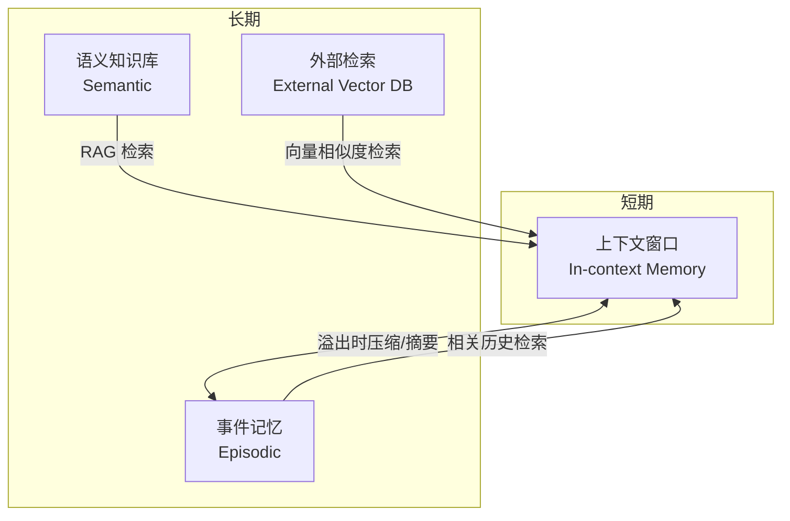

# Agent 记忆系统设计

记忆系统是 AI Agent 能否处理复杂、长周期任务的关键。没有合理的记忆管理，Agent 要么因上下文溢出而崩溃，要么因遗忘历史而反复犯错。

## 四种记忆类型

### In-context Memory（短期/工作记忆）

直接存储在 LLM 上下文窗口中的信息：对话历史、工具调用结果、当前任务状态。访问速度最快，无需额外检索，但容量受限于模型的 context window。

### External Memory（外部记忆）

存储在上下文窗口之外的持久化信息，通过向量相似度检索按需注入。典型实现：向量数据库（Pinecone、Chroma、Qdrant 等）。

### Episodic Memory（事件记忆）

记录 Agent 过去的具体交互片段或任务执行经历，例如"上次用户问过类似问题，我是这样回答的"。帮助 Agent 从历史经验中学习，避免重复错误。

### Semantic Memory（语义知识库）

结构化的领域知识：文档、FAQ、代码库、产品手册等。通常以 RAG（Retrieval-Augmented Generation）形式接入，Agent 主动检索后将相关段落插入上下文。



## 短期记忆管理

上下文窗口是有限资源，常见管理策略：

### 截断（Truncation）

最简单的方式：保留最新的 N 条消息，丢弃更早的历史。缺点是可能丢失重要上下文（如用户在第一条消息中声明的偏好）。

```ts
function truncateMessages(
  messages: Message[],
  maxTokens: number
): Message[] {
  // 始终保留 system prompt 和最新若干条消息
  const systemMessages = messages.filter(m => m.role === 'system');
  const nonSystemMessages = messages.filter(m => m.role !== 'system');

  let tokenCount = estimateTokens(systemMessages);
  const kept: Message[] = [];

  // 从最新消息往前保留
  for (let i = nonSystemMessages.length - 1; i >= 0; i--) {
    const msgTokens = estimateTokens([nonSystemMessages[i]]);
    if (tokenCount + msgTokens > maxTokens) break;
    tokenCount += msgTokens;
    kept.unshift(nonSystemMessages[i]);
  }

  return [...systemMessages, ...kept];
}
```

### 摘要压缩（Summarization）

当消息超过阈值时，调用 LLM 将早期对话压缩成摘要，用摘要替换原始消息。保留信息完整性，但需要额外 LLM 调用。

```ts
async function compressHistory(
  messages: Message[],
  llm: LLMClient,
  threshold: number
): Promise<Message[]> {
  if (estimateTokens(messages) < threshold) return messages;

  const toCompress = messages.slice(0, -10); // 保留最近 10 条原样
  const recent = messages.slice(-10);

  const summary = await llm.generate({
    prompt: `请将以下对话历史压缩成简洁摘要：\n${JSON.stringify(toCompress)}`,
  });

  return [
    { role: 'system', content: `对话历史摘要：${summary}` },
    ...recent,
  ];
}
```

### 滑动窗口（Sliding Window）

固定保留最近 K 条消息，配合重要信息固定（pin）机制，确保关键上下文不被滑走。

## 长期记忆：向量数据库

### 基本原理

将文本转为 embedding 向量存入数据库，查询时将问题也转为向量，通过余弦相似度检索最相关的片段。

常用向量数据库：

| 数据库 | 特点 | 适用场景 |
|--------|------|----------|
| Chroma | 轻量，可本地运行 | 开发/小规模 |
| Pinecone | 全托管，生产级 | 云端生产 |
| Qdrant | 开源，高性能，支持 payload 过滤 | 自托管生产 |
| pgvector | PostgreSQL 扩展 | 已有 PG 数据库 |

### 记忆读写骨架

```ts
interface MemoryStore {
  write(content: string, metadata?: Record<string, unknown>): Promise<string>; // 返回记忆 ID
  retrieve(query: string, topK?: number): Promise<MemoryItem[]>;
}

interface MemoryItem {
  id: string;
  content: string;
  score: number; // 相似度分数
  metadata?: Record<string, unknown>;
}

// 概念性实现骨架
class VectorMemoryStore implements MemoryStore {
  constructor(
    private embedder: EmbeddingModel,
    private vectorDB: VectorDatabase
  ) {}

  async write(content: string, metadata?: Record<string, unknown>): Promise<string> {
    const embedding = await this.embedder.embed(content);
    return this.vectorDB.upsert({ embedding, content, metadata });
  }

  async retrieve(query: string, topK = 5): Promise<MemoryItem[]> {
    const queryEmbedding = await this.embedder.embed(query);
    return this.vectorDB.query({ embedding: queryEmbedding, topK });
  }
}
```

## 记忆读写时机

### 何时写入记忆

- 用户提供了个人偏好或重要信息
- 任务执行产生了有价值的中间结果
- 对话结束后，对本次会话做摘要存档
- 工具调用返回了应长期保留的数据（如用户资料、配置）

### 何时检索记忆

- 每轮对话开始前，用当前用户输入检索相关历史
- Agent 遇到不确定情况时，主动检索过往经验
- 任务规划阶段，检索类似任务的执行记录

```ts
async function agentTurn(
  userMessage: string,
  contextWindow: Message[],
  memory: MemoryStore
): Promise<string> {
  // 1. 检索相关记忆
  const relevantMemories = await memory.retrieve(userMessage, 3);
  const memoryContext = relevantMemories
    .map(m => m.content)
    .join('\n');

  // 2. 将记忆注入上下文
  const augmentedMessages: Message[] = [
    { role: 'system', content: `相关历史记忆：\n${memoryContext}` },
    ...contextWindow,
    { role: 'user', content: userMessage },
  ];

  // 3. LLM 推理
  const response = await llm.chat(augmentedMessages);

  // 4. 写入本次重要信息到长期记忆
  if (isImportant(userMessage)) {
    await memory.write(`用户说：${userMessage}`);
  }

  return response;
}
```

## 面试常问

**上下文溢出怎么处理？**

优先级：先尝试截断（保留系统 prompt + 近期消息），溢出严重时触发摘要压缩，将早期历史换成 LLM 生成的摘要。生产系统通常结合两者：维护一个滑动窗口，定期压缩旧消息。关键原则是 **system prompt 和最近几轮对话不能丢**。

**记忆与 RAG 的区别？**

RAG（Retrieval-Augmented Generation）是一种从外部知识库检索增强的技术，通常面向**静态知识**（文档、手册）。Agent 记忆系统更广泛，除了静态知识检索，还包括**动态的对话历史、任务执行记录**的存储与检索，以及短期工作记忆的管理。RAG 可以看作 Agent 语义记忆的一种实现方式。

**向量检索的局限性？**

- 相似度不等于相关性，可能检索到语义相近但实际无用的内容
- 需要 embedding 模型质量足够高
- 无法精确匹配（如"第3次对话"），需配合元数据过滤
- 对于结构化数据（如数字、日期），向量检索效果不如精确查询
