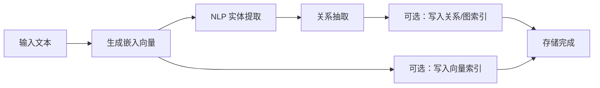
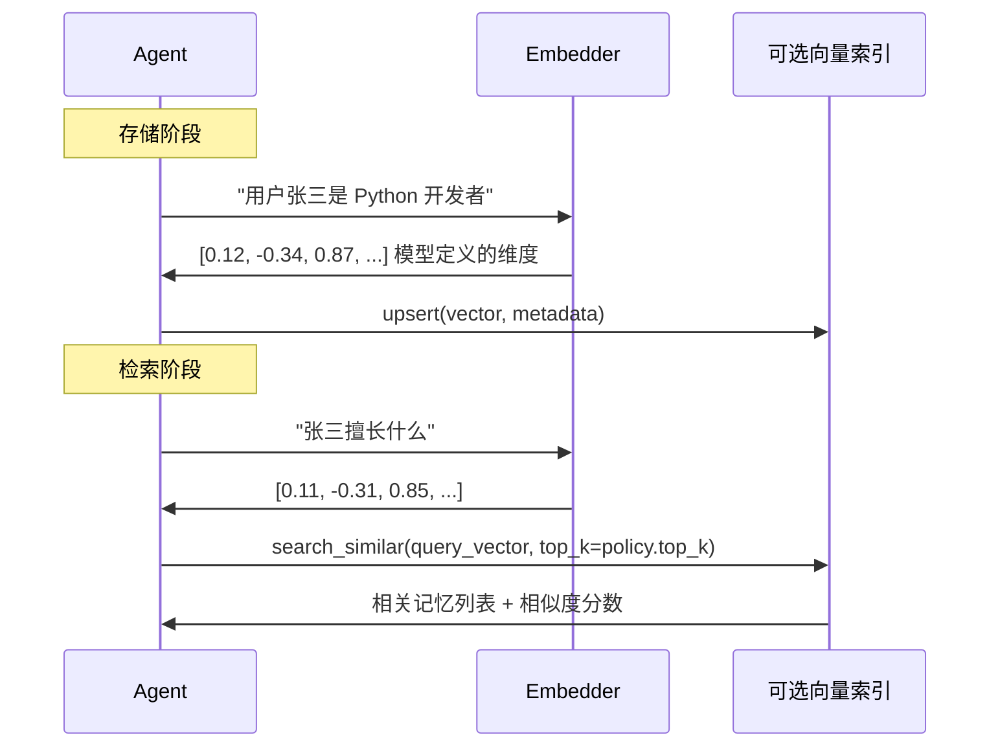
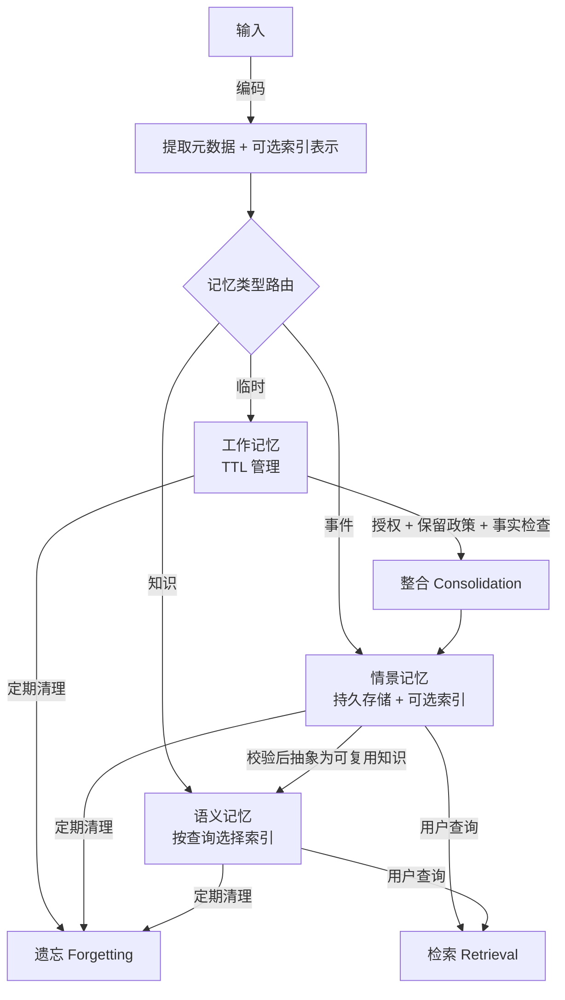

*图：沿图中的节点与箭头阅读，重点是区分工作上下文、情节记忆、语义记忆及检索写回，而不是把所有历史都称作长期记忆。*

---

Agent 的记忆系统决定了它能否跨轮次保持上下文、积累经验、从历史中学习。没有记忆，每次对话都是一次性的——Agent 不知道你是谁，也不记得上一轮说过什么。本文从认知科学的类比出发，系统梳理 Agent 记忆的分类、存储与召回机制、向量检索的核心原理，以及记忆压缩与遗忘策略。

---

## 记忆的分层模型

[MemGPT](https://arxiv.org/abs/2310.08560) 将上下文窗口内外的状态组织成分层存储，并由运行时决定信息的换入与换出，而不是把所有历史永久塞进一次推理。


工程文章常借用工作记忆、情景记忆和语义记忆这些认知术语来区分信息用途；这里使用的是设计类比，不主张 Agent 与人类记忆机制等同。

Agent 的记忆系统借鉴了同样的分层设计：

```
┌────────────────────────────────────────────────────┐
│                 Agent Memory System                │
│                                                    │
│  ┌──────────────────┐   ┌────────────────────────┐ │
│  │   工作记忆        │   │       长期记忆           │ │
│  │   Working Memory │   │                        │ │
│  │                  │   │  ┌──────────────────┐  │ │
│  │ · 当前对话上下文  │   │  │  情景记忆           │  │ │
│  │ · 任务中间状态   │◄──┤  │  Episodic Memory  │  │ │
│  │ · 临时变量       │   │  ├──────────────────┤  │ │
│  │                  │   │  │  语义记忆           │  │ │
│  │  TTL 自动清理    │   │  │  Semantic Memory  │  │ │
│  │  容量按预算配置  │   │  ├──────────────────┤  │ │
│  └──────────────────┘   │  │  感知记忆           │  │ │
│                         │  │  Perceptual Memory│  │ │
│                         │  └──────────────────┘  │ │
│                         └────────────────────────┘ │
└────────────────────────────────────────────────────┘
```

| 类型 | 持久性 | 典型内容 | 存储方案 |
|------|--------|----------|----------|
| 工作记忆 | 会话级（TTL） | 当前对话、任务状态 | 进程内或可恢复状态存储，按故障恢复需求选择 |
| 情景记忆 | 长期 | 具体交互事件、时序经历 | 可过滤的持久存储；是否加检索索引按需求决定 |
| 语义记忆 | 长期 | 用户偏好、领域知识、规则 | 文档、关系、向量或图索引的可配置组合 |
| 感知记忆 | 动态管理 | 图片、音频等多模态数据 | 对象存储与可选的多模态索引 |

---

## 工作记忆：短期上下文管理

工作记忆是 Agent 的"当前工作台"，存放当前会话中的临时信息。它有两个核心约束：

- **容量上限**：按上下文预算、检索延迟和会话并发配置，防止无限增长
- **TTL 机制**：每条记录可带生存时间；时长来自业务有效期与合规要求

当容量接近上限时，策略可以按任务状态、保留期限和可恢复性决定压缩或移除内容，而不是默认只做先进先出截断。

TF-IDF 是**稀疏词法检索**：它按词项统计匹配，不应称为语义检索。工作记忆可以只做词法检索，也可以增加稠密向量、时间或业务字段；候选生成、过滤与排序应由目标查询集决定，而不是套用一个通用加权公式。下面把排序收口到可替换策略，避免示例暗示某组权重普遍有效：

```python
class WorkingMemory:
    def __init__(self, config: MemoryConfig):
        self.config = config
        self.max_capacity = config.working_memory_capacity
        self.max_age_minutes = config.working_memory_ttl
        self.memories = []

    def add(self, memory_item: MemoryItem) -> str:
        self._expire_old_memories()               # 先清过期
        if len(self.memories) >= self.max_capacity:
            self._remove_lowest_priority_memory() # 再清低优先级
        self.memories.append(memory_item)
        return memory_item.id

    def retrieve(self, query: str, limit: int, **kwargs) -> list:
        self._expire_old_memories()
        lexical_candidates = self._tfidf_candidates(query)
        # rank_policy 在带标注的业务查询集上选择特征、过滤条件和顺序。
        return self.config.rank_policy.rank(
            query=query,
            candidates=lexical_candidates,
            limit=limit,
        )
```

---

## 长期记忆：情景与语义

[Generative Agents](https://arxiv.org/abs/2304.03442) 的原始架构把记忆流、基于相关性/近期性/重要性的检索、反思与规划连接起来，说明长期记忆还需要召回和写回策略。


### 情景记忆（Episodic Memory）

情景记忆存储具体交互事件与时间元数据。实现可以从一个支持租户、会话和时间过滤的关系或文档存储开始；只有业务查询需要语义相似召回时，再增加稠密向量索引。时间、相关性和业务重要性可以作为候选特征，但“更新”不等于“更相关”，应以带“应召回 / 不应召回”标注的查询集选择过滤与排序策略。

### 语义记忆（Semantic Memory）

语义记忆存储经授权保留的事实、偏好或规则。具体索引取决于查询：文本相似检索可以使用向量索引，明确实体关系可以使用关系表或图索引，简单键值事实可能根本不需要向量库。下面是一种**可配置示例**，不是每个 Agent 都必须同时建设的架构：

添加一条语义记忆的完整流程：



如果目标查询同时需要相似文本与显式关系，可以分别产生候选，再由经过评估的策略过滤和排序：

```python
def retrieve(self, query: str, limit: int) -> list:
    candidate_limit = self.config.candidate_limit(limit)
    vector_results = self._vector_search(query, candidate_limit)
    graph_results  = self._graph_search(query, candidate_limit)
    return self.config.rank_policy.rank(
        query=query,
        candidates=deduplicate(vector_results + graph_results),
        limit=limit,
    )
```

图检索能表达向量相似度无法直接回答的显式关系，但不代表它应占固定权重。合并前还要处理两路分数是否可比，并按查询类型验证排序质量。

---

## 向量检索在 Agent 记忆中的应用

向量检索（Vector Retrieval）是长期记忆的一种可选索引。它将文本转换为稠密向量，再按相似度产生候选；候选仍要经过租户、权限、时效和业务规则过滤。对精确标识符、否定、数字或权限敏感查询，稀疏词法检索和结构化过滤可能更合适。

### 嵌入与检索流程



### 三种嵌入方案对比

| 方案 | 表示方式 | 运行依赖 | 主要边界 | 评估重点 |
|------|----------|----------|----------|----------|
| 托管嵌入 API | 稠密向量 | 网络与外部服务 | 数据边界、版本与计费 | Recall@k、延迟、失败率与权限隔离 |
| 本地嵌入模型 | 稠密向量 | 本地模型运行时 | 算力、模型升级与索引迁移 | 同一查询集上的召回、吞吐与资源占用 |
| TF-IDF | 稀疏词法向量 | 词表与本地索引 | 同义改写召回较弱 | 标识符、数字、专有名词及词法召回 |

这些方案不是固定降级链。只有使用同一向量索引的文档与查询才需要兼容的嵌入模型和预处理；不同租户、记忆类型或索引可以有各自版本。切换某个稠密嵌入模型时，应为受影响的索引做版本化迁移或重建，避免混用不可比较的向量。

---

## 记忆存储与召回：生命周期管理

工程上可以把生命周期拆成编码、存储、检索、整合和删除，以便分别定义授权、保留与质量检查：



### 记忆整合（Consolidation）

“整合”可以作为业务策略：例如，在用户授权、事实校验与保留期限检查通过后，把会话事件写入长期存储，或将多次出现的候选事实送入人工/规则审核。它不是自动正确的认知规律；召回次数或模型给出的重要性分数都不能单独证明事实应被永久保存。

```python
# 只有授权、事实校验与保留政策都通过，才允许写入长期存储。
memory_tool.execute("consolidate",
    from_type="working",
    to_type="episodic",
    item_id=item_id,
    authorization=policy.authorization_for(item_id),
    validation=policy.validation_for(item_id),
    retention=policy.retention_for(item_id),
)

# 抽象知识也要保留证据与来源版本，不能只看召回次数或模型分数。
memory_tool.execute("consolidate",
    from_type="episodic",
    to_type="semantic",
    item_id=item_id,
    evidence_ids=verified_evidence_ids,
    source_version=source_version,
)
```

---

## 记忆压缩与遗忘

记忆系统如果只增不减，会带来存储膨胀和检索退化两个问题。遗忘机制是保持记忆系统健康的必要手段。

### 三种可配置的删除策略

| 策略 | 触发条件 | 清理目标 | 适用场景 |
|------|----------|----------|----------|
| 基于重要性（importance_based） | 按需 | importance < threshold 的记忆 | 清理噪声 |
| 基于时间（time_based） | 定时 | 超过 N 天未更新的记忆 | 清理过时信息 |
| 基于容量（capacity_based） | 容量接近上限 | 重要性最低的若干条 | 防止存储溢出 |

```python
# 所有阈值与期限均来自 MemoryPolicy，而不是通用常量
memory_tool.execute("forget", strategy="importance_based", threshold=policy.min_importance)

memory_tool.execute("forget", strategy="time_based", max_age_days=policy.max_age_days)

# 容量管理：清理最不重要的条目
memory_tool.execute("forget", strategy="capacity_based", threshold=policy.capacity_trim_ratio)
```

### 时间不是通用排名答案

时间可以用于强制过期、按有效期过滤，或作为某类查询的排序特征，但不应默认套用指数衰减。长期事实、临时会话状态、合规到期数据和“最近一次操作”查询需要不同语义。应先定义查询与失效规则，再用标注集验证是否需要时间特征以及如何使用。

---

## 常见误区与最佳实践

**常见误区**

- 将所有对话消息无差别地存入长期记忆，导致噪声淹没有效信息
- 忽略记忆整合步骤，工作记忆满了就直接丢弃，丢失重要上下文
- 嵌入方案混用（不同模型维度不同），向量空间不统一导致检索失效
- 遗忘时只删除文档存储，忘记同步清理向量库，产生"僵尸向量"
- 多用户场景下不做记忆隔离，用户数据相互污染

**最佳实践**

- 根据业务保留政策选择重要性、时效和授权字段，不把模型分数直接当作保留许可
- 工作记忆与长期记忆的介质按恢复、延迟、合规和查询需求选择
- 对每个向量索引记录嵌入模型与预处理版本；升级时迁移受影响索引
- 定期执行整合（consolidate）与遗忘（forget），维持检索质量
- 多用户部署同时执行授权检查、租户过滤和存储分区；`user_id` 或 namespace 不能替代访问控制

**面试常问要点**

- Agent 记忆为什么要分层？工作记忆与长期记忆各自的工程特点是什么？
- 向量检索如何解决语义匹配的问题？TF-IDF 和稠密向量的核心区别是什么？
- 记忆遗忘机制有哪些策略？时间衰减和重要性评分如何结合使用？
- 为什么“更近”不能直接等同于“更相关”，检索排序应如何用标注集验证？
- 多用户 Agent 系统中，记忆隔离的常见方案是什么，需要注意哪些坑？

---

## 参考资料

- [MemGPT: Towards LLMs as Operating Systems](https://arxiv.org/abs/2310.08560)
- [Generative Agents: Interactive Simulacra of Human Behavior](https://arxiv.org/abs/2304.03442)
