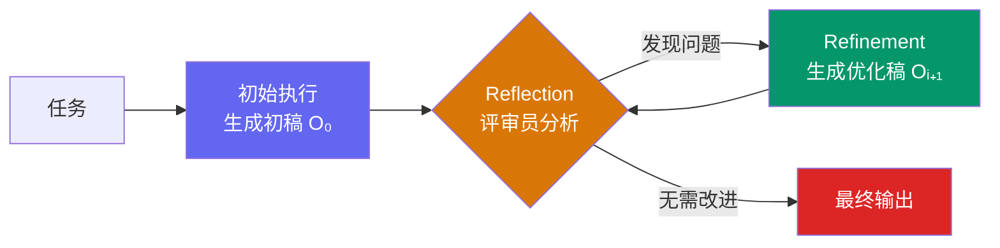
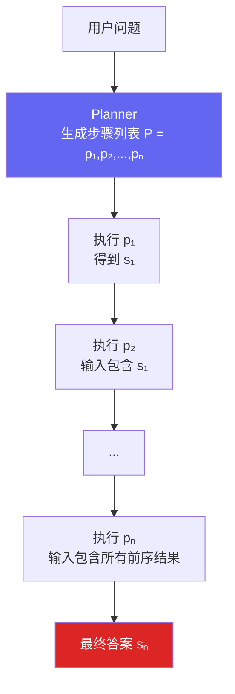
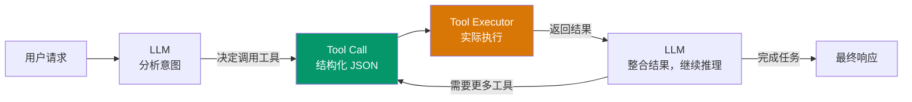
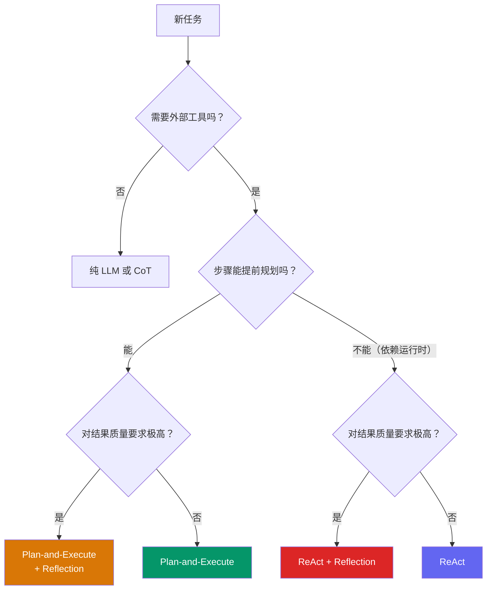

*图：沿图中的节点与箭头阅读，重点是比较 Reflection、Plan-and-Execute、Tool-Use 的控制流与适用边界。*

---

智能体不止一种思考方式。除了 ReAct 的"边想边做"，业界还形成了几种更具针对性的范式：**Reflection（反思范式）**、**Plan-and-Execute（先规划后执行）**、**Tool-Use（工具调用）**。理解它们各自的适用边界，是构建生产级智能体的必要前提。

## 一、Reflection / Self-Refine：反思范式

### 核心思想

人类写作、编程时都有一个习惯：完成初稿后回头检视，发现错误再修改。Reflection 范式就是将这一"事后自我校正"机制引入智能体。

其工作流由三步构成：**执行（Execution）→ 反思（Reflection）→ 优化（Refinement）**，构成一个可重复的迭代循环。

- **执行**：智能体用已有方法（可以是直接生成，也可以嵌套 ReAct）产出初稿。
- **反思**：一个"评审员"角色的 LLM 调用（可以是同一模型加不同 Prompt，也可以是独立模型）对初稿进行批判，输出结构化反馈。
- **优化**：智能体根据反馈修改初稿，生成新版本。

该范式由 Shinn 等人于 2023 年在 Reflexion 框架中系统化（发表于 NeurIPS 2023）。在代码生成、文本写作、数学推理等任务上，Reflection 可以将一个"功能正确但低效"的初稿迭代为"高质量"的最终版本。（参见 [Reflexion: Language Agents with Verbal Reinforcement Learning](https://arxiv.org/abs/2303.11366)）

形式化地，第 $i$ 轮迭代中，反思模型 $\pi_\text{reflect}$ 对当前输出 $O_i$ 生成反馈 $F_i$：

$$
F_i = \pi_\text{reflect}(\text{Task},\, O_i)
$$

优化模型 $\pi_\text{refine}$ 基于任务、旧版输出和反馈生成新输出：

$$
O_{i+1} = \pi_\text{refine}(\text{Task},\, O_i,\, F_i)
$$

直到 $F_i$ 中出现"无需改进"或达到最大迭代次数。



### 三套提示词

Reflection 需要为不同阶段单独设计提示词，这是与其他范式最大的工程差异：

```python
# ── 1. 初始执行提示词 ──────────────────────────────────────────────
INITIAL_PROMPT = """
你是一位资深 Python 工程师。请根据以下要求编写函数，
包含完整函数签名、文档字符串，遵循 PEP 8。

要求: {task}

请直接输出代码，不含多余解释。
"""

# ── 2. 反思提示词（评审员角色） ────────────────────────────────────
REFLECT_PROMPT = """
你是极其严格的代码评审专家，专注于算法效率。
请分析以下 Python 代码的时间复杂度，判断是否存在更优算法。
若存在，请清晰指出瓶颈并给出改进建议。
若算法已最优，回复"无需改进"。

任务: {task}
代码:
```python
{code}
```

直接输出反馈，不含多余说明。
"""

# ── 3. 优化提示词 ──────────────────────────────────────────────────
REFINE_PROMPT = """
你是资深 Python 工程师，正根据评审反馈优化代码。

任务: {task}
上一版代码:
```python
{last_code}
```
评审反馈:
{feedback}

请生成优化后的新版本，直接输出代码。
"""
```

### 短期记忆模块

反思迭代需要记住"历史尝试"，否则每次优化都是无状态的从头来过：

```python
from typing import List, Dict, Any, Optional

class Memory:
    """存储执行与反思的迭代轨迹。"""

    def __init__(self):
        self.records: List[Dict[str, Any]] = []

    def add(self, record_type: str, content: str):
        """record_type: 'execution' | 'reflection'"""
        self.records.append({"type": record_type, "content": content})

    def get_trajectory(self) -> str:
        """序列化为可注入提示词的字符串。"""
        parts = []
        for r in self.records:
            label = "上一轮代码" if r["type"] == "execution" else "评审反馈"
            parts.append(f"--- {label} ---\n{r['content']}")
        return "\n\n".join(parts)

    def last_execution(self) -> Optional[str]:
        for r in reversed(self.records):
            if r["type"] == "execution":
                return r["content"]
        return None
```

### ReflectionAgent 完整实现

```python
class ReflectionAgent:
    def __init__(self, llm_client, max_iterations: int):
        self.llm = llm_client
        self.memory = Memory()
        self.max_iterations = max_iterations

    def _call(self, prompt: str) -> str:
        return self.llm.think([{"role": "user", "content": prompt}]) or ""

    def run(self, task: str) -> str:
        # 1. 初始执行
        initial_code = self._call(INITIAL_PROMPT.format(task=task))
        self.memory.add("execution", initial_code)
        print("初稿生成完毕。")

        # 2. 迭代反思与优化
        for i in range(1, self.max_iterations + 1):
            print(f"\n── 第 {i} 轮迭代 ──")
            last_code = self.memory.last_execution()

            # 反思
            feedback = self._call(REFLECT_PROMPT.format(task=task, code=last_code))
            self.memory.add("reflection", feedback)
            print(f"反馈: {feedback[:80]}...")

            if "无需改进" in feedback:
                print("评审认为已无需改进，提前收敛。")
                break

            # 优化
            refined = self._call(REFINE_PROMPT.format(
                task=task, last_code=last_code, feedback=feedback
            ))
            self.memory.add("execution", refined)

        return self.memory.last_execution() or ""
```

**运行效果示意（素数查找任务）**：

- 初稿：试除法，时间复杂度 $O(n\sqrt{n})$
- 第 1 轮反思：指出效率瓶颈，建议改为埃拉托斯特尼筛法
- 第 1 轮优化：筛法实现，复杂度降至 $O(n \log\log n)$
- 第 2 轮反思：确认算法已达常规最优，输出"无需改进"，循环收敛

### 成本收益分析

| 维度 | 评估 |
|------|------|
| API 调用次数 | 每轮迭代额外 2 次（反思 + 优化），$k$ 次迭代共 $2k+1$ 次调用 |
| 总延迟 | 串行叠加，随每轮模型/工具耗时和迭代次数增长；在目标任务上测量 |
| 输出质量提升 | 显著，尤其在代码生成、技术写作、复杂推理场景 |
| 提示词复杂度 | 高，需要为执行/反思/优化三种角色各自调试 |

**适用场景**：对结果质量要求极高、允许较长延迟的离线任务，如关键代码生成、学术写作、复杂报告撰写。不适合实时对话场景。

---

## 二、Plan-and-Execute：先规划后执行

### 核心思想

Lei Wang 等人于 2023 年提出 Plan-and-Solve Prompting，旨在解决 CoT 在多步骤问题上"中途跑偏"的问题。其策略是将任务处理分为两个明确阶段：（参见 [Plan-and-Solve Prompting](https://arxiv.org/abs/2305.04091)）

1. **规划阶段（Planning）**：LLM 接收完整问题，输出一个分步执行计划。此阶段不执行任何操作，只生成计划列表。
2. **执行阶段（Solving）**：执行器按照计划顺序逐步推进，将每步的结果作为下一步的输入。

形式化地，规划阶段：

$$
P = (p_1, p_2, \ldots, p_n) = \pi_\text{plan}(q)
$$

执行阶段第 $i$ 步：

$$
s_i = \pi_\text{solve}(q,\, P,\, (s_1,\ldots,s_{i-1}))
$$



与 ReAct 的对比：

| 维度 | ReAct | Plan-and-Execute |
|------|-------|-----------------|
| 决策时机 | 每步动态决策 | 先一次性规划，后顺序执行 |
| 中途纠错 | 可以，每步都可调整 | 难，计划一旦生成基本固定 |
| 全局结构性 | 弱 | 强 |
| 适合任务类型 | 探索性、结果依赖未知 | 结构清晰、步骤可提前分解 |
| LLM 调用次数 | 动态（步骤数不确定） | 规划 1 次 + 执行 n 次，可预估 |

### Planner 实现

```python
import ast

PLANNER_PROMPT = """
你是顶级 AI 规划专家。将以下问题分解为逻辑顺序的若干子步骤。
每个步骤必须是独立、可执行的子任务。
输出必须是 Python 列表格式（用 ```python 和 ``` 包裹）。

问题: {question}

```python
["步骤1描述", "步骤2描述", ...]
```
"""

class Planner:
    def __init__(self, llm_client):
        self.llm = llm_client

    def plan(self, question: str) -> list[str]:
        prompt = PLANNER_PROMPT.format(question=question)
        response = self.llm.think([{"role": "user", "content": prompt}]) or ""
        try:
            code_block = response.split("```python")[1].split("```")[0].strip()
            result = ast.literal_eval(code_block)
            return result if isinstance(result, list) else []
        except Exception as e:
            print(f"解析计划失败: {e}")
            return []
```

### Executor 与状态管理

```python
EXECUTOR_PROMPT = """
你是顶级 AI 执行专家，严格按计划逐步解决问题。

原始问题: {question}
完整计划: {plan}
已完成步骤与结果:
{history}

当前步骤: {current_step}

仅输出当前步骤的答案，不含其他内容。
"""

class Executor:
    def __init__(self, llm_client):
        self.llm = llm_client

    def execute(self, question: str, plan: list[str]) -> str:
        history = ""
        last_result = ""

        for i, step in enumerate(plan, 1):
            print(f"执行步骤 {i}/{len(plan)}: {step}")
            prompt = EXECUTOR_PROMPT.format(
                question=question,
                plan="\n".join(f"{j+1}. {s}" for j, s in enumerate(plan)),
                history=history if history else "（尚无）",
                current_step=step
            )
            result = self.llm.think([{"role": "user", "content": prompt}]) or ""
            history += f"步骤{i}: {step}\n结果: {result}\n\n"
            last_result = result
            print(f"  结果: {result}")

        return last_result
```

### 组装 PlanAndExecuteAgent

```python
class PlanAndExecuteAgent:
    def __init__(self, llm_client):
        self.planner  = Planner(llm_client)
        self.executor = Executor(llm_client)

    def run(self, question: str) -> str:
        plan = self.planner.plan(question)
        if not plan:
            return "无法生成有效计划"
        print(f"\n生成计划: {plan}\n")
        return self.executor.execute(question, plan)

# 示例：多步数学题
agent = PlanAndExecuteAgent(llm)
answer = agent.run(
    "水果店周一卖出 15 个苹果，周二是周一的两倍，"
    "周三比周二少 5 个。三天总共卖出多少个？"
)
# 计划: ['计算周二: 15×2=30', '计算周三: 30-5=25', '总计: 15+30+25=70']
# 最终答案: 70
```

### 适用场景

Plan-and-Execute 特别适合以下类型的任务：
- **多步数学或逻辑推理**：步骤之间有严格的前后依赖关系
- **报告生成**：先确定章节结构，再逐章填写内容
- **代码架构设计**：先规划模块划分，再逐模块实现
- **流程自动化**：任务流程固定，每步目标明确

不适合：步骤取决于运行时数据的探索性任务（此类用 ReAct 更合适）。

---

## 三、Tool-Use：工具调用范式

[Toolformer](https://arxiv.org/abs/2302.04761) 研究了语言模型通过自监督方式学习何时调用外部 API 以及如何使用返回结果；它与产品 API 的 function-calling 协议相关，但不是同一个抽象层。


### 核心思想

Tool-Use（工具调用）是一种更通用的范式视角，可以看作是 ReAct 的底层机制抽象。它的核心问题是：**如何让 LLM 知道什么时候、调用哪个工具、用什么参数？**

现代 LLM 的 Function Calling / Tool Use 接口是 Tool-Use 范式的一类产品化实现。它通过结构化 schema 定义工具，并让模型输出结构化调用，可减少应用层正则解析；整体可靠性仍取决于目标模型对 schema 的遵循、API 契约、参数校验与错误恢复，必须在真实任务集上验证。



### 工具定义：三要素

一个良好定义的工具必须包含三个核心要素：

| 要素 | 说明 | 示例 |
|------|------|------|
| **名称（Name）** | 唯一标识符，LLM 在调用时使用 | `web_search` |
| **描述（Description）** | 与名称、参数 schema、对话和系统约束共同帮助模型判断何时使用 | "查询实时信息；不适合数学计算" |
| **参数 Schema（Parameters）** | 结构化描述输入格式，通常是 JSON Schema | `{"query": {"type": "string"}}` |

描述的质量直接影响工具调用准确率，这是 Tool-Use 范式中最需要精心打磨的部分。

### Function Calling 骨架（Python，以 OpenAI 兼容接口为例）

```python
import json
from openai import OpenAI

client = OpenAI()

# 1. 定义工具 schema
tools = [
    {
        "type": "function",
        "function": {
            "name": "web_search",
            "description": "搜索互联网获取实时信息。适用于时事、最新数据；不适合数学计算。",
            "parameters": {
                "type": "object",
                "properties": {
                    "query": {
                        "type": "string",
                        "description": "搜索关键词"
                    }
                },
                "required": ["query"]
            }
        }
    },
    {
        "type": "function",
        "function": {
            "name": "calculator",
            "description": "执行数学表达式计算，返回精确数值结果。",
            "parameters": {
                "type": "object",
                "properties": {
                    "expression": {
                        "type": "string",
                        "description": "合法的数学表达式，如 '(123 + 456) * 789'"
                    }
                },
                "required": ["expression"]
            }
        }
    }
]

# 2. 工具路由层
def dispatch_tool(name: str, args: dict) -> str:
    if name == "web_search":
        return web_search(args["query"])       # 对接真实搜索 API
    elif name == "calculator":
        return str(eval(args["expression"]))   # 生产环境请用沙箱
    return f"Unknown tool: {name}"

# 3. Tool-Use 循环（以官方文档为准）
def run_with_tools(user_message: str) -> str:
    messages = [{"role": "user", "content": user_message}]

    while True:
        response = client.chat.completions.create(
            model="gpt-4o",
            messages=messages,
            tools=tools,
            tool_choice="auto"
        )
        msg = response.choices[0].message

        # 没有工具调用，直接返回
        if not msg.tool_calls:
            return msg.content

        # 追加 assistant 消息（含 tool_calls）
        messages.append(msg)

        # 执行每个工具调用，将结果追加为 tool 消息
        for tc in msg.tool_calls:
            args = json.loads(tc.function.arguments)
            result = dispatch_tool(tc.function.name, args)
            messages.append({
                "role": "tool",
                "tool_call_id": tc.id,
                "content": result
            })
        # 继续循环，让 LLM 整合工具结果

result = run_with_tools("2025 年华为最新旗舰手机的定价是多少元人民币？")
```

### 工具设计的最佳实践

**粒度原则**：工具粒度不应过细（目录过大且功能重叠会增加选择难度），也不应过粗（一个工具塞入无关能力会让参数和权限难以约束）。可同时暴露的工具数没有通用区间，应在目标模型和真实意图集上测工具选择准确率、Prompt token、延迟与误调用成本。

**描述中避免歧义**：两个功能相近的工具（如 `web_search` 和 `knowledge_base_search`）必须在描述中明确区分：前者"适用于实时、最新信息"，后者"适用于内部文档库"。

**错误处理**：工具执行失败时，应返回描述性的错误消息（而非抛出异常），让 LLM 可以根据错误信息进行重试或换一种方式。

**幂等性设计**：LLM 可能因解析问题重复调用同一工具。写操作类工具（发邮件、提交表单）应设计幂等保护，防止重复执行。

---

## 四种范式横向对比

| 维度 | ReAct | Plan-and-Execute | Reflection | Tool-Use（Function Calling） |
|------|-------|-----------------|------------|------------------------------|
| 决策方式 | 动态逐步 | 一次规划，顺序执行 | 生成 → 评审 → 改进循环 | 模型自主选择工具时机 |
| 中途纠错 | 强（每步） | 弱（计划固定） | 强（专门反思阶段） | 中（依赖模型判断） |
| 全局结构 | 弱 | 强 | 中 | 中 |
| 可解释性 | 高（显式 Thought） | 高（计划可读） | 高（反馈可追溯） | 中（Thought 通常隐式） |
| LLM 调用成本 | 中（步数不定） | 可预估（1+n 次） | 高（2k+1 次） | 可预估 |
| 格式解析稳定性 | 低（依赖文本解析） | 中 | 中 | 高（结构化 JSON） |
| 最适合的任务 | 探索性、需要实时工具 | 结构清晰、多步推理 | 高质量生成、迭代优化 | 任何需要工具的场景 |
| 不适合的任务 | 长链规划 | 运行时动态分支 | 实时响应、成本敏感 | 不需要工具的纯文本任务 |

### 场景选择决策树



## 混合范式：组合使用

三种范式并不互斥，高质量的生产系统往往是组合的：

- **Plan-and-Execute + ReAct**：外层 Planner 制定整体结构，内层每个子步骤用 ReAct 动态执行并调用工具。适合"大任务 + 工具密集"的场景，如 AutoGPT 式的自主代理。
- **ReAct + Reflection**：每次完整 ReAct 循环结束后，加一轮反思来评审整体答案质量。适合需要高可靠性的问答场景。
- **Plan-and-Execute + Reflection**：规划与执行完成后，对最终结果进行反思评审，适合代码生成、报告撰写类高质量输出任务。

## 面试常问

**Q：Reflection 和 RLHF 有什么区别？**
RLHF 是通过人类偏好数据微调模型权重，是训练阶段的优化，不改变推理时的行为。Reflection 是推理时的自我校正，通过提示词让模型批判自己的输出并改进，不改变模型权重，可以即插即用。

**Q：Plan-and-Execute 如何处理执行失败？**
标准实现中计划是静态的，一旦某步失败整体中断。改进方案是"动态重规划"：将执行失败和错误信息反馈给 Planner，让其重新生成剩余步骤的计划，类似于 ReAct 的动态纠错。

**Q：Function Calling 和 ReAct 文本解析哪个更好？**
如果所用模型与 SDK 提供结构化 Tool Use，通常应先评估该接口，因为它能把工具名和参数放进机器可解析的契约；但 schema 遵循、并行调用、token 用量和准确率都取决于具体模型与 API，不能宣称普遍更高。文本 ReAct 仍可用于研究、教学或不支持结构化调用的模型；生产系统还要避免把隐藏推理当作必须展示给用户的接口数据。

**Q：工具目录变大后如何优化？**
当全量注入导致 Prompt 膨胀、混淆工具或违反最小权限原则时，可以：(1) **工具检索**：根据用户意图，从工具库中检索候选工具再注入，候选数由召回率和误调用评估校准；(2) **工具分层**：按功能域先路由再选工具；(3) **工具元数据索引**：为名称、描述、schema、权限和版本建立可搜索索引。是否需要这些机制，应由全量目录的基准结果决定，而不是固定数量阈值。

## 参考资料

- [Reflexion: Language Agents with Verbal Reinforcement Learning](https://arxiv.org/abs/2303.11366)
- [Plan-and-Solve Prompting](https://arxiv.org/abs/2305.04091)
- [Toolformer: Language Models Can Teach Themselves to Use Tools](https://arxiv.org/abs/2302.04761)
