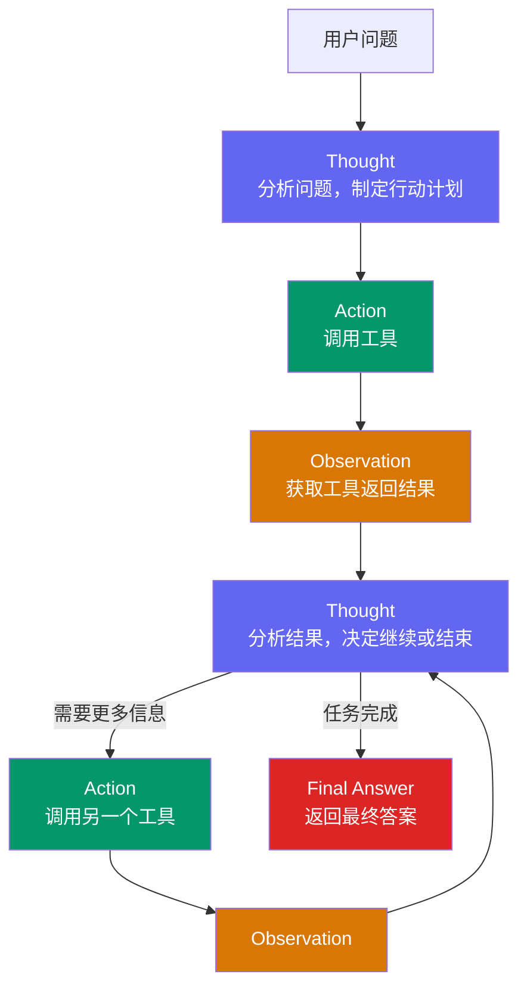

# ReAct 推理与行动框架

ReAct（Reasoning + Acting）是目前最广泛使用的 Agent 推理框架，通过交替生成推理链和工具行动，让 LLM 能够有根据地完成需要外部信息的复杂任务。

## 核心思想

ReAct 来源于 2022 年的论文《ReAct: Synergizing Reasoning and Acting in Language Models》。其核心洞察是：**推理（CoT）和行动（工具调用）应该交织在一起，而不是分开进行**。

纯 CoT（Chain-of-Thought）只让模型推理，无法获取外部信息，容易产生幻觉。ReAct 在推理过程中穿插真实的行动（调用搜索、计算、数据库等），用真实结果锚定推理，显著降低幻觉风险。

| 特性 | 纯 LLM | CoT | ReAct |
|------|--------|-----|-------|
| 推理能力 | 弱 | 强 | 强 |
| 外部信息获取 | 无 | 无 | 有 |
| 幻觉风险 | 高 | 中 | 低 |
| 多步骤任务 | 难 | 有限 | 适合 |
| token 消耗 | 低 | 中 | 高 |

## Thought-Action-Observation 循环

ReAct 的输出格式由三种节拍交替组成：

- **Thought**：LLM 的内部推理，分析当前状态，决定下一步
- **Action**：调用某个工具，指定工具名和参数
- **Observation**：工具执行后的真实返回结果

```
Thought: 我需要查询今天的天气来回答用户问题
Action: search("上海今日天气")
Observation: 晴，28°C，东南风3级

Thought: 已获得天气信息，可以回答了
Action: finish("上海今天晴天，28摄氏度，东南风3级，适合户外活动")
```



## TypeScript 伪代码：ReAct Loop

```ts
interface ReActStep {
  thought: string;
  action?: { tool: string; params: unknown };
  observation?: string;
}

async function reactLoop(
  userQuery: string,
  tools: Map<string, Tool>,
  llm: LLMClient,
  maxIterations = 10
): Promise<string> {
  const history: ReActStep[] = [];
  const messages: Message[] = [
    { role: 'system', content: buildReActSystemPrompt(tools) },
    { role: 'user', content: userQuery },
  ];

  for (let i = 0; i < maxIterations; i++) {
    // 1. 让 LLM 生成下一个 Thought + Action
    const rawOutput = await llm.generate(messages);
    const parsed = parseReActOutput(rawOutput); // 解析 Thought/Action/Final Answer

    // 2. 如果是 Final Answer，结束循环
    if (parsed.type === 'final_answer') {
      return parsed.answer;
    }

    // 3. 执行 Action（调用工具）
    const tool = tools.get(parsed.action.tool);
    if (!tool) {
      // 工具不存在，将错误作为 Observation 返回
      const observation = `Error: tool "${parsed.action.tool}" not found`;
      messages.push({ role: 'assistant', content: rawOutput });
      messages.push({ role: 'tool', content: observation });
      continue;
    }

    const observation = await tool.execute(parsed.action.params);

    // 4. 将 Observation 加入消息历史，进入下一轮
    messages.push({ role: 'assistant', content: rawOutput });
    messages.push({ role: 'tool', content: String(observation) });

    history.push({
      thought: parsed.thought,
      action: parsed.action,
      observation: String(observation),
    });
  }

  throw new Error('Reached max iterations without final answer');
}
```

## 在框架中的实现

### LangChain（概念）

LangChain 的 `createReactAgent` 封装了 ReAct 循环：
- 自动构建包含工具描述的 system prompt
- 解析 LLM 输出中的 Action/Action Input
- 调用对应工具并将 Observation 反馈
- 检测 "Final Answer:" 前缀作为停止条件

开发者主要工作是：定义工具列表、选择 LLM 模型、配置 max_iterations。

### 原生 Function Calling 方式

现代 LLM 的 Function Calling（Tool Use）是对 ReAct 的原生支持：
- Thought 隐式包含在模型内部，不一定显式输出
- Action 通过结构化 JSON 返回（而非文本解析）
- 更稳定，不需要手动 parse LLM 的文本输出

## 优缺点与适用场景

### 优点

- **可解释性强**：每步 Thought 都可以追踪推理过程
- **幻觉风险低**：用工具返回的真实信息锚定推理
- **灵活性高**：工具可以动态扩展
- **实现简单**：核心逻辑不超过百行代码

### 缺点

- **token 消耗大**：每一步都要输出 Thought，多工具调用时成本高
- **延迟高**：串行的 Thought-Action-Observation 循环无法并行
- **对 prompt 质量敏感**：工具描述不清楚会导致错误工具选择
- **停止条件脆弱**：LLM 可能不按预期格式输出 Final Answer

### 适用场景

- 需要查询外部信息才能回答的问题（搜索、数据库查询）
- 多步骤推理任务（先查 A，再根据 A 查 B）
- 代码执行、数学计算等需要精确结果的场景
- **不适合**：纯文本生成任务、实时性要求极高的场景

## 面试常问

**ReAct 如何防止幻觉？**

核心机制是用工具的真实返回结果（Observation）来约束后续推理。LLM 无法凭空捏造工具结果（工具是在外部真实执行的），每一个 Thought 都必须面对真实的 Observation 来调整判断，避免了纯 CoT 中"一推到底"的幻觉累积问题。

**ReAct 的停止条件是什么？**

通常有两类停止条件：
1. **主动停止**：LLM 判断任务完成，输出 `Final Answer:` 格式的回复
2. **被动停止**：达到最大迭代次数（max_iterations）或总 token 预算

生产环境通常两者并用，避免无限循环导致的高额费用。

**ReAct 和 Plan-and-Execute 怎么选？**

ReAct 更适合动态任务，每步决策依赖上一步结果，无法提前规划全部步骤。Plan-and-Execute 适合任务结构固定、可提前分解的场景，执行效率更高，但对规划器的要求也更高。
