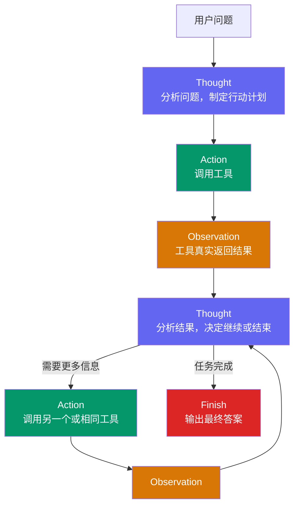
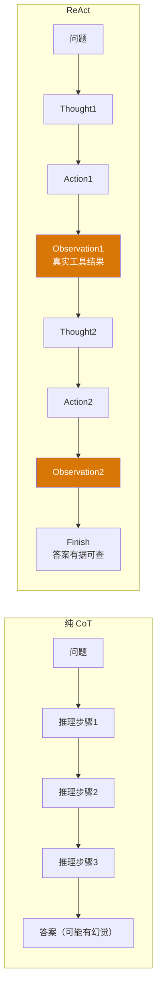

*图：沿图中的节点与箭头阅读；Thought 是原论文描述推理轨迹的记号，生产接口应只暴露结构化 Action、Observation 与经过安全处理的状态。*

---

ReAct（Reasoning + Acting）是智能体领域最具影响力的范式之一，由 Shunyu Yao 等人于 2022 年在论文《ReAct: Synergizing Reasoning and Acting in Language Models》中提出。它的核心洞见很朴素：**让 LLM 同时具备“想”和“做”的能力，而不是二选一**。（参见 [ReAct: Synergizing Reasoning and Acting in Language Models](https://arxiv.org/abs/2210.03629)）

## 从 CoT 到 ReAct：为什么需要行动？

在 ReAct 诞生之前，LLM 增强推理的主流方向是 Chain-of-Thought（思维链，CoT）。CoT 通过引导模型逐步展开中间步骤，显著提升了复杂推理任务的准确率。但 CoT 有一个根本性的缺陷：**它是封闭的**。模型只能依赖训练时的参数记忆，无法获取外部的实时信息，也无法调用计算器、数据库等精确工具，因此在知识时效性和计算准确性上存在天花板。

另一条路线是"纯行动"型（Action-only），直接让模型输出要执行的指令。这种方式能调用工具，但缺乏显式的推理过程，模型没法在行动失败后有条理地重新规划。

ReAct 融合了两者：**推理（Reasoning）指导行动更有目的性，行动（Acting）为推理提供真实的外部依据**。

| 维度 | 纯 LLM | 纯 CoT | 纯行动 | ReAct |
|------|--------|--------|--------|-------|
| 复杂推理 | 弱 | 强 | 弱 | 强 |
| 外部信息获取 | 无 | 无 | 有 | 有 |
| 可观察轨迹 | 少 | 可有文本轨迹 | 行动可记录 | 行动与环境反馈可记录 |
| 外部事实错误风险 | 高 | 仍需核验 | 取决于工具与参数 | 取决于工具、观察与核验 |
| 动态纠错能力 | 无 | 无 | 有限 | 有 |
| token 消耗 | 低 | 中 | 低 | 高 |

## Thought-Action-Observation：三节拍循环

ReAct 的核心是一个严格的三段式格式，每一轮循环由以下三部分组成：

- **Thought（思考）**：原始 ReAct 提示中的文本推理轨迹。只要模型把它生成到响应文本中，它就会被调用方看到；它不等于现代推理模型可能保留在模型侧的隐藏推理。生产系统不应把详细思维链当作 UI、日志或审计接口，通常只记录结构化行动和经过安全处理的进度状态。
- **Action（行动）**：LLM 决定调用的具体工具及其输入参数，格式通常是 `工具名[输入]` 或结构化 JSON。
- **Observation（观察）**：工具实际执行后返回的结果，由外部系统写入，再传回 LLM 作为下一轮推理的上下文。

形式上，可以把整个过程表达为：在时间步 $t$，智能体的策略（即 LLM）根据原始问题 $q$ 和历史轨迹 $(a_1, o_1), \ldots, (a_{t-1}, o_{t-1})$，生成本轮的思考 $th_t$ 和行动 $a_t$：

$$
(th_t, a_t) = \pi\bigl(q,\,(a_1,o_1),\ldots,(a_{t-1},o_{t-1})\bigr)
$$

工具 $T$ 执行行动后返回观察：

$$
o_t = T(a_t)
$$

循环不断进行，直到模型通过可解析的 `finish` 行动声明任务完成，或运行时先触发步数、时间、token 等预算上限。



原论文风格的一段**教学化文本轨迹**可以写成下面这样。它使用不承载真实产品事实的占位内容来解释 Reason–Act–Observe，不应直接作为生产 UI 或详细日志格式：

```
Thought: 用户问的是产品 X 当前的保修政策，这涉及时效性信息，我需要查厂商官方页面。
Action: Search[产品 X 官方保修政策]
Observation: 官方页面返回了政策正文和更新日期。[教学占位结果]

Thought: 还需要确认该政策是否适用于用户所在地区。
Action: Search[产品 X 官方保修政策 地区 Y]
Observation: 地区页面列出了适用范围和例外。[教学占位结果]

Thought: 已有足够的官方信息，可以给出带来源的答复。
Action: Finish[根据厂商页面，结论与例外如下……]
```

## 提示词设计

原始 ReAct 用文本交错推理轨迹与行动。生产实现可以保留同一控制循环，但让模型在内部完成判断，只向编排器返回结构化行动或安全状态：

```python
REACT_PROMPT_TEMPLATE = """
你是一个能够调用外部工具的智能助手。

可用工具如下:
{tools}

请在内部判断下一步，不要输出详细思维链。只返回以下 JSON 之一：
{{"type":"tool","name":"{{tool_name}}","input":"{{tool_input}}","status":"working"}}
{{"type":"finish","answer":"最终答案","status":"completed"}}

现在请解决以下问题:
Question: {question}
History: {history}
"""
```

- **工具清单（`{tools}`）**：告诉 LLM 有哪些工具可用。工具描述的质量直接决定 LLM 能否正确选择工具，这是最容易踩坑的地方。
- **格式规约（Action/Status）**：用 schema 校验工具名、参数和状态；不要依赖详细 Thought 文本或正则提取隐藏推理。
- **动态上下文（`{question}`/`{history}`）**：每一轮都把完整历史注入，让 LLM 可以"看到"之前的所有行动和观察。

## 从零实现一个 ReAct Agent

下面的 Python 代码展示了 ReAct 循环的完整骨架，以供理解原理（实际生产项目建议使用 LangChain、LangGraph 等框架，以官方文档为准）。

### 工具管理器

```python
import ast
import math
import operator
import time
from typing import Dict, Any, Callable

_BIN_OPS = {
    ast.Add: operator.add,
    ast.Sub: operator.sub,
    ast.Mult: operator.mul,
    ast.Div: operator.truediv,
    ast.FloorDiv: operator.floordiv,
    ast.Mod: operator.mod,
    ast.Pow: operator.pow,
}
_UNARY_OPS = {ast.UAdd: operator.pos, ast.USub: operator.neg}

def safe_calculate(expression: str) -> str:
    """只解释数字与白名单算术节点；拒绝名称、调用、属性和下标。"""
    if len(expression) > 256:
        raise ValueError("expression too long")
    tree = ast.parse(expression, mode="eval")

    def evaluate(node):
        if isinstance(node, ast.Expression):
            return evaluate(node.body)
        if isinstance(node, ast.Constant) and type(node.value) in (int, float):
            value = node.value
        elif isinstance(node, ast.UnaryOp) and type(node.op) in _UNARY_OPS:
            value = _UNARY_OPS[type(node.op)](evaluate(node.operand))
        elif isinstance(node, ast.BinOp) and type(node.op) in _BIN_OPS:
            left, right = evaluate(node.left), evaluate(node.right)
            if isinstance(node.op, ast.Pow) and abs(right) > 10:
                raise ValueError("exponent outside policy")
            value = _BIN_OPS[type(node.op)](left, right)
        else:
            raise ValueError(f"disallowed syntax: {type(node).__name__}")
        if not math.isfinite(float(value)) or abs(value) > 1e100:
            raise ValueError("result outside policy")
        return value

    return str(evaluate(tree))

class ToolExecutor:
    """统一管理和调度工具。"""

    def __init__(self):
        self.tools: Dict[str, Dict[str, Any]] = {}

    def register(self, name: str, description: str, func: Callable):
        self.tools[name] = {"description": description, "func": func}

    def execute(self, name: str, tool_input: str) -> str:
        tool = self.tools.get(name)
        if not tool:
            return f"Error: tool '{name}' not found"
        try:
            return tool["func"](tool_input)
        except Exception as e:
            return f"Error executing tool: {e}"

    def get_descriptions(self) -> str:
        return "\n".join(
            f"- {name}: {info['description']}"
            for name, info in self.tools.items()
        )
```

### ReAct Agent 核心循环

```python
class ReActAgent:
    def __init__(
        self,
        llm_client,
        tool_executor: ToolExecutor,
        max_steps: int,
        max_seconds: float,
        max_total_tokens: int,
    ):
        self.llm = llm_client
        self.tools = tool_executor
        self.max_steps = max_steps
        self.max_seconds = max_seconds
        self.max_total_tokens = max_total_tokens

    def run(self, question: str) -> dict[str, str | None]:
        history: list[str] = []
        deadline = time.monotonic() + self.max_seconds
        used_tokens = 0

        for step in range(1, self.max_steps + 1):
            if time.monotonic() >= deadline or used_tokens >= self.max_total_tokens:
                return {"status": "budget_exhausted", "answer": None}
            print(f"\n--- Step {step} ---")

            # 1. 构建提示词并调用 LLM
            prompt = REACT_PROMPT_TEMPLATE.format(
                tools=self.tools.get_descriptions(),
                question=question,
                history="\n".join(history) if history else "(无)"
            )
            # 适配层返回经过 schema 校验的 action，以及本次实际 token 用量。
            action, call_tokens = self.llm.next_action(prompt)
            used_tokens += call_tokens
            if used_tokens > self.max_total_tokens or time.monotonic() >= deadline:
                return {"status": "budget_exhausted", "answer": None}

            # 2. 只消费结构化 Action；不记录或展示模型的隐藏推理。
            if action["type"] == "finish":
                return {"status": "completed", "answer": action["answer"]}

            # 3. 工具名仍由注册表 allowlist 校验。
            tool_name, tool_input = action["name"], action["input"]
            observation = self.tools.execute(tool_name, tool_input)

            # 4. 历史只保留行动与工具观察；日志还应做脱敏和长度限制。
            history.append(f"Action: {tool_name}[{tool_input}]")
            history.append(f"Observation: {observation}")

        return {"status": "step_budget_exhausted", "answer": None}
```

### 运行示例

```python
from dotenv import load_dotenv
load_dotenv()

# 假设 HelloAgentsLLM 已按第四章方式封装
llm = HelloAgentsLLM()

executor = ToolExecutor()
executor.register(
    name="Search",
    description="网页搜索引擎，用于查询时事、事实等知识库之外的信息",
    func=lambda query: web_search(query)  # 对接真实搜索 API
)
executor.register(
    name="Calculator",
    description="数学计算工具，接受数学表达式字符串并返回计算结果",
    func=safe_calculate  # 只允许数字和白名单算术 AST；不执行模型提供的代码
)

agent = ReActAgent(
    llm,
    executor,
    max_steps=runtime_policy.max_steps,
    max_seconds=runtime_policy.max_seconds,
    max_total_tokens=runtime_policy.max_total_tokens,
)
result = agent.run("根据厂商官方页面，产品 X 在地区 Y 的保修政策是什么？")
```

## ReAct 与 CoT 的关键差异



ReAct 把工具或环境返回的 Observation 引入下一步决策，使错误更容易被暴露和追踪；但 Observation 可能来自不可信网页、失败工具或错误适配层，模型也可能误读它，因此这是一条可校验的反馈通道，而不是自动阻断错误的保证。

## 优缺点

### 主要优势

1. **行动可追踪**：结构化 Action、工具参数、Observation 与安全状态可以形成可审计轨迹；这不要求暴露模型隐藏推理。
2. **动态纠错**：Observation 的反馈让智能体可以在中途修正方向，不像一次性规划那样"滑铁卢就全完了"。
3. **工具协同**：LLM 负责推理，工具负责精确执行（搜索、计算、API 调用），各司其职。
4. **实现简洁**：核心逻辑百行以内，没有复杂状态机。

### 固有局限

1. **串行效率低**：Thought → Action → Observation 是严格顺序的，无法并发执行多个工具调用，对于需要大量工具调用的任务延迟较高。
2. **高度依赖底层 LLM**：格式遵循能力差的模型会频繁输出无法解析的响应，导致整个循环中断。
3. **提示词脆弱性**：工具描述稍有歧义，或提示词格式稍微变化，都可能引发模型行为大幅变动。
4. **缺乏全局规划**：步进式决策容易陷入局部最优，对需要提前规划十步以上的复杂任务力不从心。
5. **上下文膨胀**：每步累积的 Action 与 Observation 会消耗 context window；若实现还保留文本推理轨迹，增长更快。

## 常见误区与最佳实践

### 正确理解实验环境

ReAct 论文的交互决策实验使用了 [ALFWorld](https://arxiv.org/abs/2010.03768) 等环境。ALFWorld 把具身任务映射到文本交互，Agent 通过动作改变环境并接收 observation；它是评估 ReAct 行动—反馈闭环的任务环境，不是 ReAct 范式的提出来源。论文结果只说明特定模型、提示、任务与环境下的表现，不能直接外推为所有生产 Agent 的收益。

**误区一：工具描述越短越好。**
工具名称、描述、参数 schema、对话上下文与系统策略会共同影响工具选择。描述应说明"何时用"和"不应在什么情况下用"，例如：`"网页搜索，适用于需要最新时事信息的问题；不适合数学计算"`，并用目标任务集验证是否仍与相邻工具混淆。

**误区二：不限制 max_steps。**
不设上限的循环会在模型陷入死循环时持续消耗 token 和 API 费用。生产环境应同时设置 `max_steps`、单任务墙钟时间和实际 token 总预算；任何一项耗尽都应停止，并返回不含隐藏推理的安全状态。

**误区三：忽视输出解析的鲁棒性。**
基于正则表达式的解析在模型输出格式轻微变化时很容易失败。更稳健的做法是使用 LLM 的原生 Function Calling / Tool Use 接口，用结构化 JSON 代替文本解析。

**最佳实践总结：**
- 工具描述明确区分适用 / 不适用场景
- 同时设置步数、墙钟时间和实际 token 总预算
- 优先使用框架（LangChain、LangGraph）的成熟实现，而非手写解析
- 生产环境使用 Function Calling 而非文本格式解析
- 需要时加入经过评估的 few-shot TAO 示例；示例数量由上下文预算与格式遵循测试决定

## 面试常问

**Q：ReAct 如何防止幻觉？**
ReAct 可以让后续推理接触工具返回的外部证据，从而减少仅依赖参数记忆的情况，但它不能保证消除幻觉。模型可能选错工具、误读或忽略 Observation；工具、网页和中间适配层也可能返回错误、陈旧或恶意内容。生产系统需要验证工具身份与参数、保留原始结果、隔离不可信内容，并在最终回答中把结论追溯到可核验证据。[ReAct 论文](https://arxiv.org/abs/2210.03629)展示的是特定任务下交替推理与行动的收益，不提供“每步截断幻觉”的保证。

**Q：ReAct 和 Plan-and-Execute 怎么选？**
ReAct 适合探索性任务，每步行动取决于上一步结果，无法提前全局规划。Plan-and-Execute 更适合结构清晰、可以提前分解的任务，执行效率更高，但失去了 ReAct 的中途纠错灵活性。实践中两者可以结合：外层用规划范式制定计划，内层每步用 ReAct 动态执行。

**Q：Thought 是否会被用户看到？**
原始 ReAct 的提示轨迹包含文本 Thought，因此接收原始响应的调用方可以看到它；这与模型侧隐藏推理不是一回事。生产接口不应索取、存储或展示详细隐藏推理，只应暴露 schema 校验后的 Action、工具 Observation、最终答案，以及“执行中 / 等待授权 / 预算耗尽”等经过安全处理的状态。

**Q：ReAct 循环失败最常见的原因是什么？**
三类：(1) 格式解析失败（模型不遵循 Thought/Action 格式）；(2) 工具执行出错（参数格式错误、网络超时等）；(3) 陷入无意义的重复循环（同样的 Action 被执行多次但 Observation 没有新信息）。建议在循环中检测重复 Action，视为死循环并提前退出。

## 参考资料

- [ReAct: Synergizing Reasoning and Acting in Language Models](https://arxiv.org/abs/2210.03629)
- [ALFWorld: Aligning Text and Embodied Environments for Interactive Learning](https://arxiv.org/abs/2010.03768)
