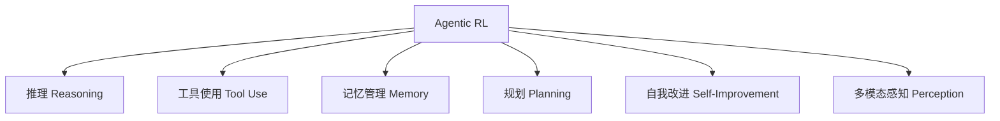
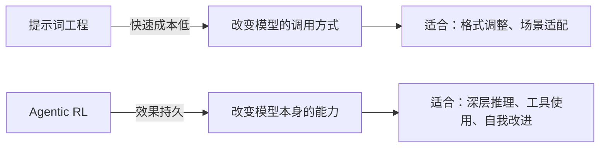

提示词工程（Prompt Engineering）可以让 LLM 更好地遵循格式、调用工具，但它有一个根本天花板：模型只能在预训练知识的范围内发挥，无法超越训练数据的质量。强化学习（Reinforcement Learning，RL）提供了另一条路——让 Agent 通过**试错（Trial and Error）**自主学习，发现比人类标注更好的推理路径。这就是 **Agentic RL** 的核心价值。

## 从 LLM 训练到 Agentic RL

### LLM 训练的三个阶段

一个现代 LLM（如 GPT、Claude、Qwen）的诞生通常经历两大阶段：

**预训练（Pretraining）**：在海量文本上做下一个 Token 预测，最小化负对数似然：

$$\mathcal{L}_{\text{pretrain}} = -\sum_{t=1}^{T} \log P(x_t \mid x_1, \ldots, x_{t-1}; \theta)$$

预训练赋予模型语言理解和世界知识，但模型只会"续写文本"，不会"遵循指令"。

**后训练（Post-training）** 解决这个问题，通常包含三步：

1. **监督微调（SFT，Supervised Fine-Tuning）**：用高质量的（prompt, completion）对训练模型学会对话格式和基本任务；
2. **奖励建模（Reward Modeling，RM）**：训练一个专门评估回答质量的打分模型，学习人类对"好答案"的偏好；
3. **强化学习微调（RLHF / RLAIF）**：用奖励模型驱动策略优化，让模型生成更高质量的回答。

经典的 RLHF（Reinforcement Learning from Human Feedback）流程耗费大量人工标注。RLAIF（RL from AI Feedback）用更强的 AI 模型替代人工打分，成本大幅降低，效果接近甚至超过 RLHF。

### 为什么还需要 Agentic RL

传统后训练（我们可以叫做 PBRFT，Preference-Based Reinforcement Fine-Tuning）优化的是**单轮对话质量**：给定一个问题，模型生成一个回答，然后根据回答质量打分。

这对于"回答助手"够用，但 Agent 面临的场景完全不同：

| 维度 | PBRFT（单轮优化） | Agentic RL（多步优化） |
|------|------------------|----------------------|
| 状态 | 只有用户 prompt | prompt + 历史观察 $o_1, o_2, \ldots$ |
| 行动 | 只有文本生成 | 文本生成 + 工具调用 + 环境操作 |
| 奖励 | 单步奖励 $r(s_0, y)$ | 累积折扣奖励 $\sum_t \gamma^t r(s_t, a_t)$ |
| 时间跨度 | $T = 1$ | $T \gg 1$（多步循环） |
| 核心目标 | 让回答更好 | 让任务完成质量更高 |

在 Agentic RL 的视角下，Agent 就是马尔可夫决策过程（MDP）中的策略 $\pi_\theta$：

$$J_{\text{Agentic}}(\theta) = \mathbb{E}_{\tau \sim \pi_\theta}\left[\sum_{t=0}^{T} \gamma^t r(s_t, a_t)\right]$$

其中 $\tau = (s_0, a_0, s_1, a_1, \ldots, s_T)$ 是完整轨迹，$\gamma \in [0,1]$ 是折扣因子。

## Agentic RL 赋予 Agent 的六大能力



1. **推理（Reasoning）**：通过试错学习更优的推理链，而不只是模仿训练数据中的推理模式；
2. **工具使用（Tool Use）**：学会何时、用哪个、如何组合多个工具，而不仅仅是格式上"会用"；
3. **记忆管理（Memory）**：学会主动决定哪些信息值得保留，何时更新或清理记忆；
4. **规划（Planning）**：通过试错发现有效的行动序列，学会权衡短期与长期收益；
5. **自我改进（Self-Improvement）**：识别自己的错误模式，调整策略，无需人工介入持续提升；
6. **感知（Perception）**：提升视觉推理、多模态工具使用等能力。

## 奖励函数设计

奖励函数（Reward Function）定义了"什么是好的行为"，是 Agentic RL 的核心。以数学推理任务（GSM8K 数据集）为例：

### 准确率奖励（二值奖励）

$$r_{\text{acc}}(a, a^*) = \begin{cases} 1 & \text{if } a = a^* \\ 0 & \text{otherwise} \end{cases}$$

**优点**：简单直接，适合有明确正确答案的任务。  
**缺点**：奖励稀疏，训练初期缺乏梯度信号。

### 长度惩罚奖励

$$r_{\text{length}}(a, a^*, l) = r_{\text{acc}}(a, a^*) - \alpha \cdot \max(0, l - l_{\text{target}})$$

其中 $l$ 是生成文本长度，$l_{\text{target}}$ 是目标长度，$\alpha$ 是惩罚系数（典型值 0.001）。鼓励简洁正确，控制推理成本。

### 步骤奖励

$$r_{\text{step}}(a, a^*, s) = r_{\text{acc}}(a, a^*) + \beta \cdot s$$

$s$ 是检测到的推理步骤数，$\beta$ 是步骤系数（典型值 0.1）。鼓励可解释的分步推理，但需防止模型为凑步骤而生成冗余内容。

### 组合奖励

实际训练中通常组合多个目标：

$$r = r_{\text{acc}} - \alpha \cdot \max(0, l - l_{\text{target}}) + \beta \cdot s$$

**奖励函数设计原则**：
- 清晰定义成功标准，奖励可计算、可验证；
- 防止奖励欺骗（Reward Hacking）——模型找到"作弊"方式刷高奖励但未真正完成任务；
- 多目标时谨慎调整权重，避免某个目标过度主导；
- 奖励信号方差过大会导致训练不稳定，可用归一化缓解。

## SFT 是 RL 的前提

在做 Agentic RL 之前，必须先完成 SFT（监督微调）。原因：

预训练模型的输出是"自由续写文本"，格式混乱，答案无法提取，无法给出有效奖励信号。SFT 让模型学会：
- 输出格式（如"Step 1: ...，Final Answer: ..."）；
- 基本推理模式；
- 任务相关的基线能力。

SFT 之后，强化学习才能在此基础上优化推理策略，超越训练数据的质量上限。

```python
# SFT → GRPO 完整流程示意（以 HelloAgents 框架为例，以官方文档为准）
from hello_agents.tools import RLTrainingTool

rl_tool = RLTrainingTool()

# 第一步：SFT 让模型学会格式
sft_result = rl_tool.run({
    "action": "train",
    "algorithm": "sft",
    "model_name": "Qwen/Qwen3-0.6B",
    "output_dir": "./models/sft_model",
    "max_samples": 7473,    # GSM8K 全量训练数据
    "num_epochs": 3,
    "batch_size": 8,
    "learning_rate": 5e-5,
    "use_lora": True,
    "lora_rank": 16,
    "lora_alpha": 32,
})

# 第二步：GRPO 让模型学会更好地推理
grpo_result = rl_tool.run({
    "action": "train",
    "algorithm": "grpo",
    "model_name": "./models/sft_model",   # 从 SFT 模型出发
    "output_dir": "./models/grpo_model",
    "num_epochs": 3,
    "batch_size": 4,
    "learning_rate": 1e-5,               # 比 SFT 更小的学习率
    "num_generations": 4,                 # 每道题生成 4 个候选答案
    "kl_coef": 0.05,                     # KL 散度惩罚系数
    "reward_type": "accuracy",
    "use_lora": True,
})
```

## GRPO：LLM 友好的强化学习算法

经典的 PPO（Proximal Policy Optimization）需要同时维护四个模型（策略模型、参考模型、价值模型、奖励模型），工程复杂、显存压力大。

**GRPO（Group Relative Policy Optimization）**是专为 LLM 设计的简化版：

- **去掉价值模型（Value Model）**：用**组内相对奖励**代替绝对优势函数；
- **降低训练复杂度**：只需策略模型和参考模型两个；
- **更稳定的训练信号**：相对奖励减少了奖励方差。

**GRPO 的核心思想**——对同一道题，生成 $N$ 个候选答案，计算它们各自的奖励，用相对偏差（而非绝对奖励）作为训练信号：

```python
# GRPO 训练一步的直觉（伪代码）
question = "48 + 24 = ?"
answers = generate_n(model, question, n=4)
# answers = ["72", "72", "70", "72（but very long）"]

rewards = [accuracy_reward(a) for a in answers]
# rewards = [1.0, 1.0, 0.0, 0.8]

avg_reward = sum(rewards) / len(rewards)  # = 0.7

relative_rewards = [r - avg_reward for r in rewards]
# = [+0.3, +0.3, -0.7, +0.1]

# 相对奖励为正 → 增大该答案的概率
# 相对奖励为负 → 减小该答案的概率
```

目标函数为：

$$J_{\text{GRPO}}(\theta) = \mathbb{E}\left[\frac{\pi_\theta(a|s)}{\pi_{\text{ref}}(a|s)} \cdot (r(s,a) - \bar{r}_{\text{group}})\right] - \beta \cdot D_{KL}(\pi_\theta \| \pi_{\text{ref}})$$

**KL 散度惩罚**（系数 $\beta$ 建议 0.05–0.1）防止模型在优化奖励的同时遗忘 SFT 学到的格式和知识。

### GRPO 关键超参数

| 参数 | 作用 | 典型取值 |
|------|------|----------|
| `num_generations` | 每道题生成多少候选答案 | 4–8（越多越稳定但更贵） |
| `learning_rate` | 策略更新步长 | 1e-5 到 5e-5（比 SFT 小） |
| `kl_coef` ($\beta$) | 限制策略偏离程度 | 0.05–0.1 |
| `temperature` | 生成时的随机性 | 0.7–1.0（保持探索性） |
| `clip_range` | 策略更新幅度裁剪 | 0.2 |

## 训练监控

健康的 GRPO 训练应表现为：

- **平均奖励（Average Reward）**：逐渐上升；
- **KL 散度（KL Divergence）**：保持在 0.01–0.1 范围内；
- **准确率（Accuracy）**：逐步提升。

常见问题及排查：

| 现象 | 可能原因 | 解决方向 |
|------|----------|----------|
| 奖励不上升 | 学习率太小 / KL 惩罚太大 | 提高学习率，减小 kl_coef |
| KL 散度爆炸（>0.5） | 学习率太大 / 奖励函数激进 | 降低学习率，增大 kl_coef |
| 准确率上升但格式混乱 | KL 太小，模型偏离 SFT 太远 | 增大 kl_coef，使用组合奖励 |
| 显存 OOM | num_generations 太大 | 减小到 4，batch_size 减至 2 |

## Agentic RL 与提示工程的关系

这两种技术并非对立，而是互补的：



**提示词工程**适合快速迭代、成本低，但只改变模型的调用方式，不改变模型本身；**Agentic RL** 成本高、周期长，但能让模型从根本上习得新的推理策略，超越提示词能达到的天花板。

实际工程中，通常先用提示词工程快速探索，找到瓶颈后再考虑 Agentic RL 提升特定能力。

## 常见误区与最佳实践

**误区：直接对预训练模型做 RL**  
没有 SFT 的模型输出格式混乱，奖励信号无法区分"答案对了格式不对"和"答案错了"，训练发散。必须先 SFT 再 RL。

**误区：把准确率当唯一奖励信号**  
只优化准确率会让模型生成超长、格式混乱但"答对了"的回答。组合奖励（准确率 + 长度惩罚 + 步骤奖励）更符合实际需求。

**最佳实践**：
- 选择有明确正确答案的任务（如数学、代码执行）作为 RL 训练起点，自动评估成本低；
- LoRA 显著降低显存需求（参数量减少 256 倍以上），使 7B 以下模型的 RL 训练在消费级 GPU 上可行；
- 记录每次实验的超参数和指标，用 wandb 或 TensorBoard 可视化训练曲线；
- 从少量样本（100–1000）快速验证奖励函数和训练配置，再扩大数据规模。

## 面试常问

- **Q：为什么不直接用 RLHF 训练 Agent？**  
  RLHF 优化单轮对话质量，不适合多步序贯任务。Agentic RL 将整个任务轨迹作为优化对象，能学习多步工具使用和长期规划策略。

- **Q：GRPO 相比 PPO 的核心改进是什么？**  
  去掉了价值模型（Value Model），用组内相对奖励代替优势函数，减少了 50% 的显存占用和训练复杂度，同时降低了奖励方差，训练更稳定。

- **Q：如何防止奖励欺骗（Reward Hacking）？**  
  使用多目标组合奖励（避免单一指标被作弊）、加 KL 散度惩罚（防止模型走极端）、人工定期检查生成样本质量，以及在奖励函数中加入格式验证。

- **Q：SFT 和 Agentic RL 各自的适用边界是什么？**  
  SFT 适合教会模型新格式、新任务类型；Agentic RL 适合在 SFT 基础上进一步提升特定能力的上限。两者结合，SFT 打基础，RL 突破天花板。

