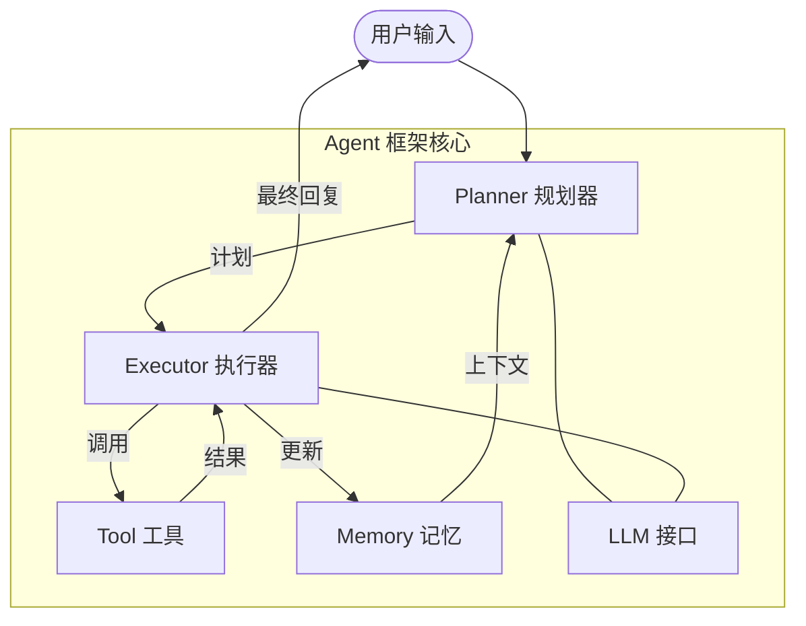

Agent 框架是连接大语言模型（LLM）与真实世界任务的工程骨架。理解它的核心抽象，不仅能让你更好地使用 LangChain、AutoGen 这样的成熟框架，更能在它们满足不了需求时，有能力自己动手裁剪一套。

---

## 为什么要自己搭框架

成熟框架（LangChain、AutoGen 等）提供了极大的便利，但也带来了代价：

- **过度抽象**：Chain、Retriever、Runnable……概念层叠，初学者入门成本高。
- **快速迭代**：商业框架 API 变动频繁，升级后代码常常跑不起来。
- **黑盒化**：核心循环被封装得严严实实，出了问题只能翻 Issue。
- **依赖爆炸**：安装一个框架可能带来上百个间接依赖，与其它项目冲突。

自建框架并不是为了取代它们，而是让你真正理解"框架在做什么"，从使用者跃升为构建者。

---

## 核心抽象：Agent 的五块积木

一个最小可用的 Agent 框架，只需要五个核心组件：



### 1. LLM 接口（Model Layer）

LLM 是 Agent 的"大脑"，框架需要为它抽象一个统一入口，使切换模型提供商（OpenAI、Anthropic、本地 Ollama）不影响上层逻辑。

```python
# llm.py
import os
from openai import OpenAI
from typing import Iterator

class HelloAgentsLLM:
    """统一 LLM 接口，兼容 OpenAI 规范的任何服务"""

    def __init__(self, model: str = None, api_key: str = None, base_url: str = None):
        self.model = model or os.getenv("LLM_MODEL_ID", "gpt-4o-mini")
        self.api_key = api_key or os.getenv("LLM_API_KEY")
        self.base_url = base_url or os.getenv("LLM_BASE_URL", "https://api.openai.com/v1")
        self._client = OpenAI(api_key=self.api_key, base_url=self.base_url)

    def invoke(self, messages: list[dict]) -> str:
        """同步调用，返回完整响应文本"""
        resp = self._client.chat.completions.create(
            model=self.model, messages=messages
        )
        return resp.choices[0].message.content

    def stream_invoke(self, messages: list[dict]) -> Iterator[str]:
        """流式调用，逐 token 返回"""
        stream = self._client.chat.completions.create(
            model=self.model, messages=messages, stream=True
        )
        for chunk in stream:
            delta = chunk.choices[0].delta.content
            if delta:
                yield delta
```

关键设计：所有主流 LLM 服务（OpenAI、DeepSeek、通义、本地 vLLM/Ollama）都暴露了兼容 OpenAI 的接口，因此只需改 `base_url` 和 `model` 即可切换，框架核心代码零修改。

---

### 2. Memory 记忆

记忆管理处理的核心问题是：**如何在上下文窗口有限的情况下，保留最有价值的信息**。

```python
# memory.py
from dataclasses import dataclass, field
from typing import Literal

MessageRole = Literal["user", "assistant", "system", "tool"]

@dataclass
class Message:
    role: MessageRole
    content: str

    def to_dict(self) -> dict:
        return {"role": self.role, "content": self.content}


class ConversationMemory:
    """滑动窗口短期记忆"""

    def __init__(self, max_turns: int = 20):
        self._messages: list[Message] = []
        self.max_turns = max_turns  # 保留最近 N 条

    def add(self, role: MessageRole, content: str):
        self._messages.append(Message(role=role, content=content))
        # 超出窗口时，从最早的非 system 消息开始裁剪
        non_system = [m for m in self._messages if m.role != "system"]
        if len(non_system) > self.max_turns * 2:
            self._messages = [m for m in self._messages if m.role == "system"] \
                           + non_system[-(self.max_turns * 2):]

    def to_messages(self) -> list[dict]:
        return [m.to_dict() for m in self._messages]

    def clear(self):
        self._messages = [m for m in self._messages if m.role == "system"]
```

实际框架中还会有更复杂的策略：摘要压缩（Summary Memory）、向量检索（Vector Memory）、外部持久化（数据库）。但对初学者而言，滑动窗口是最直观、最稳定的起点。

---

### 3. Tool 工具

工具是 Agent 与外部世界（API、文件系统、代码执行环境）交互的唯一通道。一个好的工具抽象应该做到：定义清晰、易于注册、执行安全。

```python
# tool.py
from abc import ABC, abstractmethod

class BaseTool(ABC):
    name: str        # 工具唯一名称，用于 LLM 识别
    description: str # 自然语言描述，影响 LLM 是否选择该工具

    @abstractmethod
    def run(self, input_text: str) -> str:
        """执行工具，输入输出均为字符串"""
        ...


class CalculatorTool(BaseTool):
    name = "calculator"
    description = "执行数学表达式计算，如 '2 + 3 * 4'。只传入合法的数学表达式。"

    def run(self, input_text: str) -> str:
        try:
            # 安全起见只允许数字和运算符
            allowed = set("0123456789+-*/(). ")
            if not all(c in allowed for c in input_text):
                return "错误：只支持基本数学运算"
            return str(eval(input_text))
        except Exception as e:
            return f"计算错误：{e}"


class ToolRegistry:
    """工具注册表，管理工具的注册与执行"""

    def __init__(self):
        self._tools: dict[str, BaseTool] = {}

    def register(self, tool: BaseTool):
        self._tools[tool.name] = tool

    def execute(self, tool_name: str, input_text: str) -> str:
        tool = self._tools.get(tool_name)
        if not tool:
            return f"错误：未找到工具 '{tool_name}'"
        return tool.run(input_text)

    def descriptions(self) -> str:
        return "\n".join(
            f"- {t.name}: {t.description}" for t in self._tools.values()
        )
```

---

### 4. Planner 规划器

规划器负责将复杂问题**拆解成有序的子步骤**。最经典的实现是 Plan-and-Solve：先让 LLM 输出一份计划，再逐步执行。

```python
# planner.py
import ast
import re

PLANNER_PROMPT = """
你是一个规划专家。请将下面的问题分解为若干独立、可执行的步骤。
输出格式必须是 Python 列表，例如：["步骤1", "步骤2", "步骤3"]

问题：{question}
"""

class Planner:
    def __init__(self, llm):
        self.llm = llm

    def plan(self, question: str) -> list[str]:
        prompt = PLANNER_PROMPT.format(question=question)
        response = self.llm.invoke([{"role": "user", "content": prompt}])

        # 从响应中解析 Python 列表
        match = re.search(r'\[.*?\]', response, re.DOTALL)
        if match:
            try:
                return ast.literal_eval(match.group())
            except Exception:
                pass
        # 解析失败时降级：整个问题作为单步骤
        return [question]
```

---

### 5. Executor 执行器

执行器是框架的"发动机"，它驱动 Agent 的核心循环（Agent Loop）：**Thought → Action → Observation → 循环**。

这就是著名的 **ReAct**（Reasoning + Acting）范式。

```python
# executor.py

REACT_PROMPT = """你是一个具备推理和行动能力的 AI 助手。

## 可用工具
{tools}

## 执行规则
每次回应只做一步，严格使用以下格式：
Thought: 分析当前情况，决定下一步
Action: tool_name[input]   （调用工具）
或
Action: Finish[最终答案]   （回答完毕）

## 问题
{question}

## 执行历史
{history}

现在开始："""

class ReActExecutor:
    def __init__(self, llm, tool_registry: ToolRegistry, max_steps: int = 8):
        self.llm = llm
        self.tools = tool_registry
        self.max_steps = max_steps

    def run(self, question: str) -> str:
        history = []

        for step in range(self.max_steps):
            prompt = REACT_PROMPT.format(
                tools=self.tools.descriptions(),
                question=question,
                history="\n".join(history) or "（无）"
            )
            response = self.llm.invoke([{"role": "user", "content": prompt}])

            # 解析 Action
            action_match = re.search(r'Action:\s*(.+?)(?:\n|$)', response)
            if not action_match:
                break

            action = action_match.group(1).strip()

            if action.startswith("Finish"):
                # 提取 Finish[答案] 中的答案
                answer_match = re.search(r'Finish\[(.+)\]', action, re.DOTALL)
                return answer_match.group(1).strip() if answer_match else action

            # 解析工具调用 tool_name[input]
            tool_match = re.search(r'(\w+)\[(.+)\]', action, re.DOTALL)
            if tool_match:
                tool_name, tool_input = tool_match.group(1), tool_match.group(2)
                observation = self.tools.execute(tool_name, tool_input)
                history.append(f"Action: {action}")
                history.append(f"Observation: {observation}")

        return "已达最大步数，无法得出结论。"
```

---

## 拼装一个最小可用框架

有了五块积木，组装 Agent 只需几行：

```python
# agent.py
from abc import ABC, abstractmethod

class Agent(ABC):
    def __init__(self, name: str, llm, system_prompt: str = None):
        self.name = name
        self.llm = llm
        self.memory = ConversationMemory()
        if system_prompt:
            self.memory.add("system", system_prompt)

    @abstractmethod
    def run(self, input_text: str) -> str: ...


class SimpleAgent(Agent):
    """最简单的对话 Agent：无工具，纯对话"""

    def run(self, input_text: str) -> str:
        self.memory.add("user", input_text)
        response = self.llm.invoke(self.memory.to_messages())
        self.memory.add("assistant", response)
        return response


class ReActAgent(Agent):
    """带工具调用的 ReAct Agent"""

    def __init__(self, name, llm, tool_registry: ToolRegistry, **kwargs):
        super().__init__(name, llm, **kwargs)
        self.executor = ReActExecutor(llm, tool_registry)

    def run(self, input_text: str) -> str:
        return self.executor.run(input_text)
```

完整使用示例：

```python
from dotenv import load_dotenv
load_dotenv()

llm = HelloAgentsLLM()

# SimpleAgent
agent = SimpleAgent("助手", llm, system_prompt="你是一个有帮助的 AI 助手")
print(agent.run("Python 的 GIL 是什么？"))

# ReActAgent + 计算器
registry = ToolRegistry()
registry.register(CalculatorTool())

react = ReActAgent("计算专家", llm, tool_registry=registry)
print(react.run("(15 * 8 + 32) / 4 等于多少？"))
```

---

## 框架演进路线

| 阶段 | 新增能力 | 关键技术 |
|------|----------|----------|
| v0 最小框架 | 单轮对话 | LLM + Message |
| v1 基础 Agent | 多轮记忆 + 工具调用 | Memory + ToolRegistry |
| v2 规划执行 | 复杂任务分解 | Planner + ReAct |
| v3 多 Agent | 角色分工协作 | A2A / GroupChat |
| v4 通信协议 | 工具生态互联 | MCP / Function Calling |

---

## 常见误区与最佳实践

**误区一：把 `max_steps` 设太大**
ReAct 循环不收敛时，高上限会产生大量无效 LLM 调用。推荐默认 5-8 步，任务完不成就报错，让用户重新提问。

**误区二：工具描述写得太含糊**
`description` 直接决定 LLM 是否正确选用工具。应当写清楚"适用场景"和"入参格式"，而不是一句话带过。

**误区三：Memory 无限增长**
Context Window 有限，不做裁剪会导致调用失败。滑动窗口、摘要压缩是标配。

**误区四：把框架当银弹**
复杂框架（LangChain/AutoGen）适合特定场景，但它们也增加了调试难度。原型阶段用裸 LLM + 少量工具往往更快。

---

## 面试常问

- **Agent Loop 的核心是什么？** Thought-Action-Observation 循环；终止条件是输出 `Finish` 或达到最大步数。
- **ReAct 与 Plan-and-Solve 的区别？** ReAct 是动态决策（每步根据 Observation 再规划）；Plan-and-Solve 先生成全局计划再逐步执行，适合步骤确定的任务。
- **为什么需要 ToolRegistry？** 解耦工具定义与 Agent 逻辑；LLM 只需要知道工具名和描述，不需要知道实现细节。
- **Memory 的三种策略？** 滑动窗口（最简单）、摘要压缩（节省 token）、向量检索（适合长期知识库）。

---

