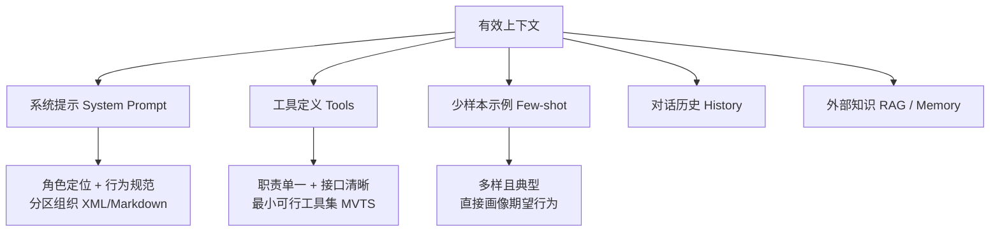
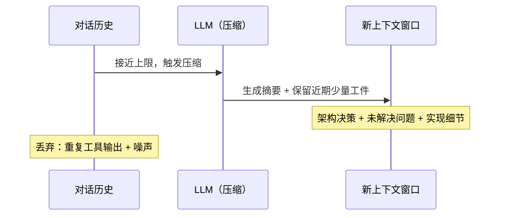

# 上下文工程（Context Engineering）

在构建基于 LLM 的 Agent 系统时，仅靠精心设计的 Prompt 是不够的。随着任务复杂度提升、交互轮次增加，真正的瓶颈在于：**每次调用模型前，如何系统性地为它准备最优的输入上下文**。这正是上下文工程（Context Engineering）要解决的问题——它是提示工程（Prompt Engineering）的自然演进，也是构建稳健 Agent 的工程基础。

---

## 什么是上下文工程

上下文（Context）是指一次 LLM 推理调用中所包含的全部 tokens——系统提示、工具定义、对话历史、外部知识、工具输出等等。上下文工程关注的是：**在推理阶段，如何策划与维护"最优信息集合"，从而稳定地得到预期结果**。

### 与提示工程的区别与联系

两者不是替代关系，而是层次关系：

| 维度 | 提示工程（Prompt Engineering） | 上下文工程（Context Engineering） |
|------|-------------------------------|----------------------------------|
| 关注点 | 如何写出有效的系统提示和指令 | 如何管理整个上下文窗口的信息状态 |
| 时机 | 主要在开发阶段 | 贯穿运行时的每一次推理调用 |
| 范围 | 系统提示的措辞与结构 | 提示 + 工具 + 历史 + 外部数据的整体配置 |
| 典型问题 | "怎么写才能让模型理解我的意图" | "这次调用的上下文里应该放什么，不该放什么" |

提示工程是上下文工程的子集。一个精良的系统提示只是优质上下文的一部分；上下文工程还要管理对话历史的截断与压缩、工具定义的精简、外部知识的按需检索等。

在早期的 LLM 应用中（单轮分类、文本生成），精调提示词已足够。但当 Agent 需要在多轮对话、多次工具调用中持续运作时，管理**整体上下文状态**的重要性就远超单句 Prompt 的措辞。

---

## 为什么上下文工程重要

### 上下文腐蚀（Context Rot）

研究发现，随着上下文窗口中 token 数量增加，LLM 从其中准确回忆信息的能力会下降——这被称为"上下文腐蚀"（Context Rot）。这不是"悬崖式"崩溃，而是**性能梯度**：模型在长上下文下依然强大，但在信息检索和长程推理上的精度有所下降。

根本原因在于 Transformer 架构：每个 token 要与上下文中所有 token 建立关联，两两注意力关系随序列长度以 n² 增长；上下文越长，注意力被"拉薄"，精度自然下降。此外，训练数据中短序列比长序列更常见，模型对长上下文的"经验"更少。

结论：**上下文必须被视作有限资源，且具有边际收益递减**。每新增一个 token，都在消耗有限的注意力预算，因此需要谨慎筛选哪些 token 值得放入。

### 有效上下文的组成

在"有限注意力预算"约束下，优质的上下文工程目标是：**用尽可能少、但高信号密度的 tokens，最大化获得预期结果的概率**。主要围绕以下组件：



**系统提示**：语言清晰直白，避免两个极端——过度硬编码复杂逻辑（脆弱、难维护）与过于空泛（缺少具体信号）。建议使用分区标签（如 `[Role]`、`[Instructions]`、`[Output]`）组织，追求"能完整勾勒期望行为的最小必要信息集"。

**工具**：职责单一、接口语义清晰、相互低重叠。如果连人类工程师都说不清"用哪个工具"，Agent 更不可能做对。精心维护一个最小可行工具集（MVTS）能显著提升长期稳定性。

**示例**：与其把所有边界条件硬写进提示，不如精选几组多样且典型的示例——好的示例胜过千言万语。

---

## 上下文窗口管理

### 信息密度优先

选择放入上下文的内容时，核心原则是：**信息充分但紧致**。不是"越全越好"，而是"每个 token 都值得花"。

常见的上下文浪费来源：
- 冗长的工具调用结果（没有过滤的原始输出）
- 重复出现的历史消息（不必要地复述上下文）
- 过时的或低相关性的知识片段
- 臃肿的工具集定义（几十个工具的定义本身就占很多 token）

### JIT 上下文（Just-in-Time Context）

传统做法是"推理前一次性加载所有相关数据"，但这在信息量大的场景下会迅速耗尽上下文窗口。更好的工程实践是 **JIT 上下文**：

- 不预先加载所有相关数据，而是维护**轻量引用**（文件路径、存储 key、URL）
- Agent 在运行时通过工具动态加载所需数据（`head`/`tail`/`grep` 等）
- 每一步探索产生的新信息，反过来指导下一步决策（渐进式披露）

```
传统预加载：
┌───────────────────────────────────────┐
│ [System] [工具定义 × 30] [全量文档] ... │  ← 上下文很快耗尽
└───────────────────────────────────────┘

JIT 上下文：
┌──────────────────────────────────────────────────┐
│ [System] [工具定义 × 5] [文件引用] [当前探索结果] │  ← 精简、聚焦
└──────────────────────────────────────────────────┘
```

JIT 的代价是运行时探索比预计算检索更慢，且需要工具设计足够完善。在实践中，**混合策略**更有效：预先加载少量"高价值"上下文（如 README、关键配置），同时允许 Agent 通过工具按需探索。

---

## 信息组织与压缩：GSSC 流水线

将零散信息有效地组织成上下文，是上下文工程的工程化实现核心。一个典型的流水线包含四个阶段：**Gather（汇集）→ Select（筛选）→ Structure（结构化）→ Compress（压缩）**，简称 GSSC。


### Gather：多源汇集

从系统提示、记忆系统、RAG 知识库、对话历史等多个来源汇集候选信息，统一封装为 `ContextPacket`：

```python
from dataclasses import dataclass
from datetime import datetime
from typing import Optional, Dict, Any

@dataclass
class ContextPacket:
    content: str
    timestamp: datetime
    token_count: int
    relevance_score: float = 0.5   # 相关性分数 0.0–1.0
    metadata: Optional[Dict[str, Any]] = None
```

每个候选信息包含内容、时间戳、估算 token 数和相关性分数，为后续筛选提供数据基础。

### Select：相关性筛选

核心评分公式综合相关性与时间近因性：

```python
combined_score = relevance_weight * relevance_score + recency_weight * recency_score
# 默认：relevance_weight=0.7, recency_weight=0.3
```

相关性分数可以用简单的词汇重叠（Jaccard 相似度）快速计算，生产环境中可替换为向量相似度。时间近因性采用指数衰减：

```python
import math

def calculate_recency(timestamp: datetime) -> float:
    age_hours = (datetime.now() - timestamp).total_seconds() / 3600
    return max(0.1, math.exp(-0.1 * age_hours / 24))
```

筛选策略为贪心算法：按分数从高到低填充，直到 token 预算耗尽：

```python
selected, current_tokens = system_packets.copy(), system_tokens
for score, packet in sorted_packets:               # 按分数降序
    if current_tokens + packet.token_count <= budget:
        selected.append(packet)
        current_tokens += packet.token_count
    else:
        break                                      # 预算耗尽
```

### Structure：结构化输出

将筛选后的信息按分区组织，生成可读性强、模型友好的结构：

```
[Role & Policies]
你是一位资深 Python 数据工程顾问...

[Task]
如何优化 Pandas 的内存占用？

[Evidence]
Pandas 内存优化策略：使用合适的数据类型...
---
将 int64 降级为 int32 可以节省 50% 内存...

[Context]
user: 我在开发数据分析工具，使用 Python 和 Pandas
assistant: 不错的选择！接下来可以考虑数据清洗...
记忆: 已完成 CSV 读取模块的开发

[Output]
请基于以上信息，提供准确、有据的回答。
```

这种分区设计的优点：人类和模型都易于理解，问题定位更精确，扩展新信息源只需新增分区。

### Compress：兜底压缩

当汇集的信息超出 token 预算时，触发压缩：保持结构完整性，对各分区按优先级截断，并在截断处标注 `[... 内容已压缩 ...]`。生产环境中可升级为 LLM 摘要压缩，而非简单截断。

---

## 长时程任务的上下文策略

单轮对话的上下文管理相对简单，真正的挑战是**长时程任务**——需要 Agent 在多个对话轮次、多次上下文重置中保持连贯性和目标导向。三种核心策略：

### 压缩整合（Compaction）

当对话接近上下文上限时，调用模型将整个对话压缩成高保真摘要，用摘要"重启"一个新的上下文窗口：



调参建议：先优化**召回**（不遗漏关键信息），再优化**精确度**（剔除冗余）。一种"轻触式"压缩是只对"深历史中的工具调用与结果"做清理，保留所有决策性文本。

### 结构化笔记（Structured Note-taking）

Agent 以固定频率将关键信息写入**上下文外的持久化存储**，在需要时按需拉回。典型实现是 Markdown + YAML 格式的笔记文件：

```markdown
---
id: note_20250119_153000_0
title: 重构项目 - 第一阶段
type: task_state
tags: [refactoring, phase1]
created_at: 2025-01-19T15:30:00
---

## 完成情况
已完成数据模型层重构，测试覆盖率 85%。

## 下一步
重构业务逻辑层，解决依赖冲突。
```

笔记按类型管理：`task_state`（进度）、`conclusion`（结论）、`blocker`（阻塞）、`action`（行动项）。每次新对话前，Agent 检索相关笔记注入上下文，实现跨会话的状态持续。

笔记的核心价值：**以极低的上下文开销（每次只加载相关的几条）维持持久状态**。一个跨数十次工具调用、多轮上下文重置的任务，可以靠几百个 token 的笔记摘要保持进度一致性。

### 子代理架构（Sub-agent Architectures）

主代理（Orchestrator）负责高层规划，将具体探索任务分配给子代理（Sub-agents）。子代理在各自干净的上下文窗口中深挖，最后只向主代理回传凝练摘要（通常 1,000–2,000 tokens）：

```
主代理                子代理 A（代码分析）    子代理 B（文档搜索）
   │                        │                      │
   ├──── 任务分派 ──────────►│                      │
   │                        │◄── 代码探索 ─────────►│
   ├──── 任务分派 ──────────────────────────────►   │
   │                        │                      │
   │◄── 摘要（1500 tokens）──┤                      │
   │◄── 摘要（1200 tokens）──────────────────────── ┤
   │
   └── 综合推理 → 最终回答
```

优势：实现关注点分离，庞杂的搜索上下文留在子代理内部，主代理始终保持清晰的推理空间。特别适合需要并行探索的复杂任务（大规模代码库分析、多源研究综合）。

方法取舍的经验法则：

| 策略 | 适用场景 |
|------|----------|
| 压缩整合 | 需要长对话连续性，任务有"接力"需求 |
| 结构化笔记 | 有里程碑/阶段性产出的迭代式开发与研究 |
| 子代理架构 | 复杂研究与分析，能从并行探索中获益 |

---

## 相关性筛选的工程实践

相关性筛选是上下文工程的核心决策：什么信息该进窗口，什么信息该排除？

### 配置参数设计

```python
@dataclass
class ContextConfig:
    max_tokens: int = 3000          # 最大 token 预算
    reserve_ratio: float = 0.2     # 为系统指令预留的比例
    min_relevance: float = 0.1     # 最低相关性阈值（低于此值直接过滤）
    enable_compression: bool = True
    recency_weight: float = 0.3    # 时间近因性权重
    relevance_weight: float = 0.7  # 语义相关性权重
    # 约束：recency_weight + relevance_weight == 1.0
```

`reserve_ratio` 确保系统提示等高优先级信息始终有足够空间，不被其他内容挤占。`min_relevance` 过滤掉明显无关的候选，防止噪声注入。

### 动态相关性计算

简单场景用关键词 Jaccard 相似度，生产环境可替换为向量余弦相似度：

```python
def calculate_relevance(content: str, query: str) -> float:
    # 简单实现：关键词重叠（Jaccard）
    content_words = set(content.lower().split())
    query_words   = set(query.lower().split())
    if not query_words:
        return 0.0
    intersection = content_words & query_words
    union        = content_words | query_words
    return len(intersection) / len(union) if union else 0.0

    # 生产环境可替换为：
    # embedding_similarity(embed(content), embed(query))
```

---

## 常见误区与最佳实践

**常见误区**

- 把"上下文工程"等同于"把更多信息塞进去"——上下文工程的核心恰恰是**精选**，而非堆砌
- 忽视工具集膨胀的问题：50 个工具的定义本身就消耗数千 token，且让 Agent 选错工具
- 系统提示只写角色描述，缺少期望输出的具体信号——模型不会猜测你的意图
- 对话历史不做任何管理，随轮次增加直接导致上下文溢出
- 在长时程任务中依赖单次上下文窗口，不用笔记或压缩维持状态

**最佳实践**

- 系统提示分区组织（`[Role]`、`[Task]`、`[Evidence]`、`[Output]`），每个区块意义明确
- 工具集保持最小可行：先精简到 5-10 个核心工具，再根据失败模式扩展
- 对历史消息设置保留上限（如最近 5-10 轮），超出时触发摘要压缩
- 长时程任务使用结构化笔记记录进度和阻塞，跨会话保持连贯
- 动态调整 token 预算：简单问题用小预算（快），复杂推理任务用大预算（准）
- 用 A/B 测试比较不同的相关性权重配置，而非凭感觉设置

**面试常问要点**

- 上下文工程与提示工程的核心区别是什么？各自关注什么阶段？
- 什么是上下文腐蚀（Context Rot）？它的技术根因是什么？
- GSSC 流水线的四个阶段分别解决什么问题？
- JIT 上下文与预加载上下文各有什么优缺点，如何在实际中权衡？
- 面对长时程任务，压缩整合、结构化笔记、子代理架构分别适合哪些场景？
- 如何设计上下文的相关性筛选？有哪些常见的评分维度？

---

> 本文参考《Hello-Agents》(datawhalechina) 整理。
