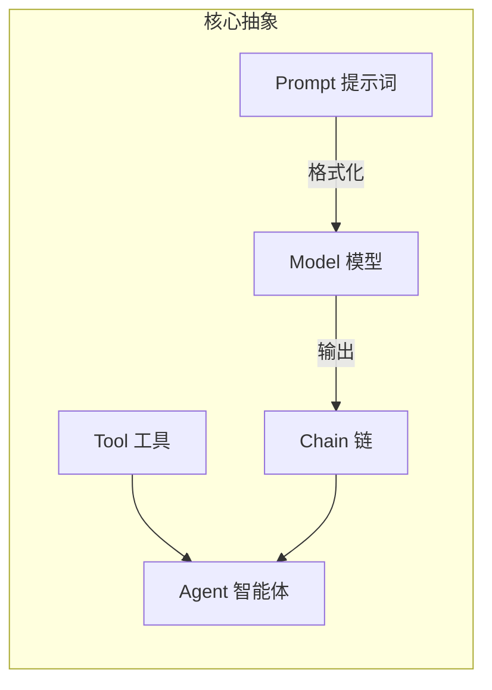
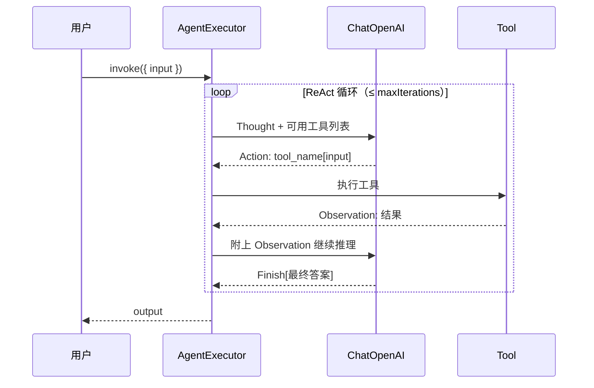

# LangChain.js 入门与实战

LangChain.js 是 LangChain 的 TypeScript/JavaScript 实现，让前端和 Node.js 开发者也能直接在熟悉的生态里构建 LLM 应用和 Agent。它的核心价值在于：**统一抽象不同 LLM 提供商的接口，并提供开箱即用的链（Chain）、工具（Tool）和 Agent 模式**。

> 注意：LangChain.js 更新频繁，本文给出的是典型用法骨架。具体 API、包名和参数以 [官方文档](https://js.langchain.com/docs/) 和 [@langchain/core](https://www.npmjs.com/package/@langchain/core) 最新版本为准。

---

## 核心抽象概览

LangChain.js 的世界由以下几个核心概念构成：



| 抽象 | 职责 | 典型类 |
|------|------|--------|
| **Model** | 封装 LLM / Chat Model 调用 | `ChatOpenAI`, `ChatAnthropic` |
| **Prompt** | 结构化提示词模板 | `ChatPromptTemplate`, `HumanMessagePromptTemplate` |
| **Chain** | 将 Prompt + Model + 后处理串联 | LCEL 管道（推荐）|
| **Tool** | Agent 可调用的外部能力 | `DynamicTool`, 社区工具集 |
| **Agent** | 自主决策 + 工具调用的循环执行器 | `createReactAgent`, `AgentExecutor` |

---

## 安装与基础配置

```bash
# 核心包
npm install langchain @langchain/openai @langchain/core

# 如需使用社区工具
npm install @langchain/community

# 如需 Anthropic
npm install @langchain/anthropic
```

环境变量（推荐放 `.env`）：

```bash
OPENAI_API_KEY=sk-...
# 或其他兼容 OpenAI 接口的服务
OPENAI_BASE_URL=https://api.deepseek.com/v1
```

---

## Model：统一调用 LLM

```ts
import { ChatOpenAI } from "@langchain/openai";

const model = new ChatOpenAI({
  model: "gpt-4o-mini",
  temperature: 0.7,
  // openAIApiKey 默认从 OPENAI_API_KEY 环境变量读取
});

// 单次调用
const response = await model.invoke("介绍一下 ReAct Agent");
console.log(response.content);

// 流式调用
const stream = await model.stream("用三句话解释 RAG");
for await (const chunk of stream) {
  process.stdout.write(chunk.content as string);
}
```

切换到其他提供商只需换一行 import：

```ts
import { ChatAnthropic } from "@langchain/anthropic";
const claude = new ChatAnthropic({ model: "claude-3-5-sonnet-20241022" });
```

---

## Prompt：结构化提示词

```ts
import { ChatPromptTemplate } from "@langchain/core/prompts";

const prompt = ChatPromptTemplate.fromMessages([
  ["system", "你是一名 {role}，请用 {language} 回答问题。"],
  ["human", "{question}"],
]);

// 格式化后查看（调试用）
const formatted = await prompt.format({
  role: "前端架构师",
  language: "中文",
  question: "如何做好首屏优化？",
});
console.log(formatted);
```

---

## Chain：LCEL 管道语法（推荐）

LangChain Expression Language（LCEL）是新版核心，用 `|` 运算符将组件串联，天然支持流式、批量、并行执行：

```ts
import { ChatOpenAI } from "@langchain/openai";
import { ChatPromptTemplate } from "@langchain/core/prompts";
import { StringOutputParser } from "@langchain/core/output_parsers";

const model = new ChatOpenAI({ model: "gpt-4o-mini" });

const prompt = ChatPromptTemplate.fromMessages([
  ["system", "你是一个技术文档写作专家。"],
  ["human", "请为 {topic} 写一段简短介绍（100字以内）"],
]);

// 构建 Chain：prompt → model → 解析为字符串
const chain = prompt.pipe(model).pipe(new StringOutputParser());

const result = await chain.invoke({ topic: "WebAssembly" });
console.log(result);

// 流式调用
const stream = await chain.stream({ topic: "Service Worker" });
for await (const chunk of stream) {
  process.stdout.write(chunk);
}
```

### 带记忆的对话 Chain

```ts
import { MessagesPlaceholder } from "@langchain/core/prompts";
import { HumanMessage, AIMessage } from "@langchain/core/messages";

const chatPrompt = ChatPromptTemplate.fromMessages([
  ["system", "你是一个有帮助的 AI 助手。"],
  new MessagesPlaceholder("history"),
  ["human", "{input}"],
]);

const chatChain = chatPrompt.pipe(model).pipe(new StringOutputParser());

// 手动维护对话历史（实际项目推荐用 RunnableWithMessageHistory）
const history: (HumanMessage | AIMessage)[] = [];

async function chat(input: string) {
  const response = await chatChain.invoke({ input, history });
  history.push(new HumanMessage(input));
  history.push(new AIMessage(response));
  return response;
}

console.log(await chat("我叫 Alex"));
console.log(await chat("我的名字是什么？")); // 应能回忆起 Alex
```

---

## Tool：给 Agent 装上工具

```ts
import { DynamicTool } from "@langchain/core/tools";
import { z } from "zod";
import { tool } from "@langchain/core/tools";

// 方式一：DynamicTool（快速定义，输入为字符串）
const calculatorTool = new DynamicTool({
  name: "calculator",
  description: "执行数学计算，输入为数学表达式字符串，如 '2 + 3 * 4'",
  func: async (input: string) => {
    try {
      // 生产环境应使用安全的表达式解析器
      return String(Function(`"use strict"; return (${input})`)());
    } catch {
      return "计算失败，请检查表达式格式";
    }
  },
});

// 方式二：tool() 工厂函数（支持 Zod Schema 类型校验，LLM Function Calling 效果更佳）
const weatherTool = tool(
  async ({ city }: { city: string }) => {
    // 真实场景接入天气 API
    return `${city} 今天晴，气温 25°C`;
  },
  {
    name: "get_weather",
    description: "查询指定城市的当前天气",
    schema: z.object({
      city: z.string().describe("城市名称，如 '北京'"),
    }),
  }
);
```

---

## Agent：自主决策执行器

LangChain.js 的 `createReactAgent` + `AgentExecutor` 是最常用的 Agent 模式：

```ts
import { createReactAgent } from "langchain/agents";
import { AgentExecutor } from "langchain/agents";
import { ChatOpenAI } from "@langchain/openai";
import { pull } from "langchain/hub";

const model = new ChatOpenAI({ model: "gpt-4o-mini" });
const tools = [calculatorTool, weatherTool];

// 从 LangChain Hub 拉取标准 ReAct 提示词模板
// 也可以完全自定义 prompt
const prompt = await pull("hwchase17/react");

const agent = await createReactAgent({ llm: model, tools, prompt });

const executor = new AgentExecutor({
  agent,
  tools,
  verbose: true,       // 打印每步推理过程（开发调试用，生产关闭）
  maxIterations: 8,    // 防止无限循环
});

const result = await executor.invoke({
  input: "北京今天天气怎么样？另外帮我算一下 (15 * 8 + 32) / 4",
});
console.log(result.output);
```

### Agent 执行流程



---

## 在 Node.js 后端的流式 API

```ts
// routes/chat.ts (Express 示例)
import express from "express";

const router = express.Router();

router.post("/chat", async (req, res) => {
  const { message } = req.body;

  // 设置 SSE 响应头
  res.setHeader("Content-Type", "text/event-stream");
  res.setHeader("Cache-Control", "no-cache");

  try {
    const stream = await executor.stream({ input: message });
    for await (const chunk of stream) {
      // AgentExecutor stream 返回中间步骤和最终输出
      if (chunk.output) {
        res.write(`data: ${JSON.stringify({ text: chunk.output })}\n\n`);
      }
    }
  } catch (err) {
    res.write(`data: ${JSON.stringify({ error: "Agent 出错" })}\n\n`);
  } finally {
    res.end();
  }
});

export default router;
```

---

## 前端直接调用注意事项

LangChain.js 支持在浏览器中运行，但有以下限制：

| 场景 | 建议 |
|------|------|
| API Key 管理 | 绝不在前端暴露，必须走后端代理 |
| 打包体积 | 按需 import，或改用更轻量的 Vercel AI SDK |
| 推荐场景 | 原型验证、内部工具、Electron 桌面应用 |

```ts
// 前端轻量调用：base_url 指向自己的代理服务
import { ChatOpenAI } from "@langchain/openai";

const model = new ChatOpenAI({
  model: "gpt-4o-mini",
  configuration: { baseURL: "/api/llm-proxy" },
  openAIApiKey: "proxy-placeholder",  // 真实 key 在服务端
});
```

---

## 常见误区与最佳实践

**误区一：把整个对话历史无限追加**
`ConversationBufferMemory` 会无限增长导致超出 context window。生产环境用 `ConversationSummaryBufferMemory` 或手动维护滑动窗口。

**误区二：`verbose: true` 留到生产**
会将所有推理步骤输出到 stdout，应关闭并接入结构化日志（如 Langsmith 可观测性平台）。

**误区三：工具 description 写得太含糊**
LLM 完全依赖 `description` 决定是否调用以及如何调用工具。含糊的描述会导致工具选择错误或参数格式不对。

**最佳实践**：
- 优先使用 LCEL 而非旧版 `LLMChain`，流式 + 并行支持更好
- 用 Zod Schema 为工具定义结构化入参，配合 Function Calling 效果更稳定
- Agent 加超时保护 + 最大迭代数，避免失控
- 用 [LangSmith](https://smith.langchain.com/) 做链路追踪和评估

---

## 面试常问

- **LangChain.js 和 Python 版有什么差异？** 功能基本对齐，但 JS 版社区工具数量略少；API 设计更符合 TypeScript 习惯（Promise + 泛型类型）。
- **LCEL 解决了什么问题？** 统一了同步/异步/流式/批量调用的接口；支持并行分支；替代了旧版过于复杂的 Chain 继承体系。
- **AgentExecutor 与 LangGraph 的区别？** AgentExecutor 是简单的线性 ReAct 循环；LangGraph 将流程建模为有向图，天然支持循环、条件分支和复杂多步工作流，适合需要 Reflection 或 Plan-and-Execute 的场景。
- **什么时候不用 LangChain？** 只做简单问答可直接调 SDK；需要极致性能/包体积时，LangChain 的抽象层有额外开销；Next.js 流式场景推荐 Vercel AI SDK。

---

> 本文参考《Hello-Agents》(datawhalechina) 整理。
