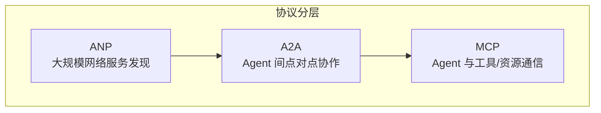
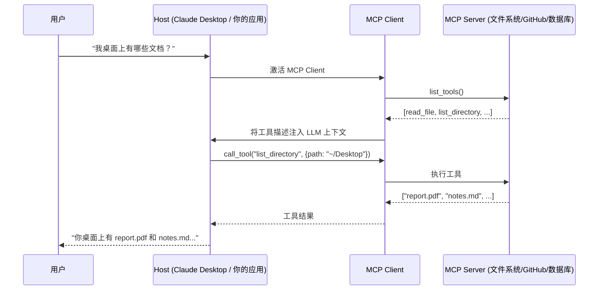
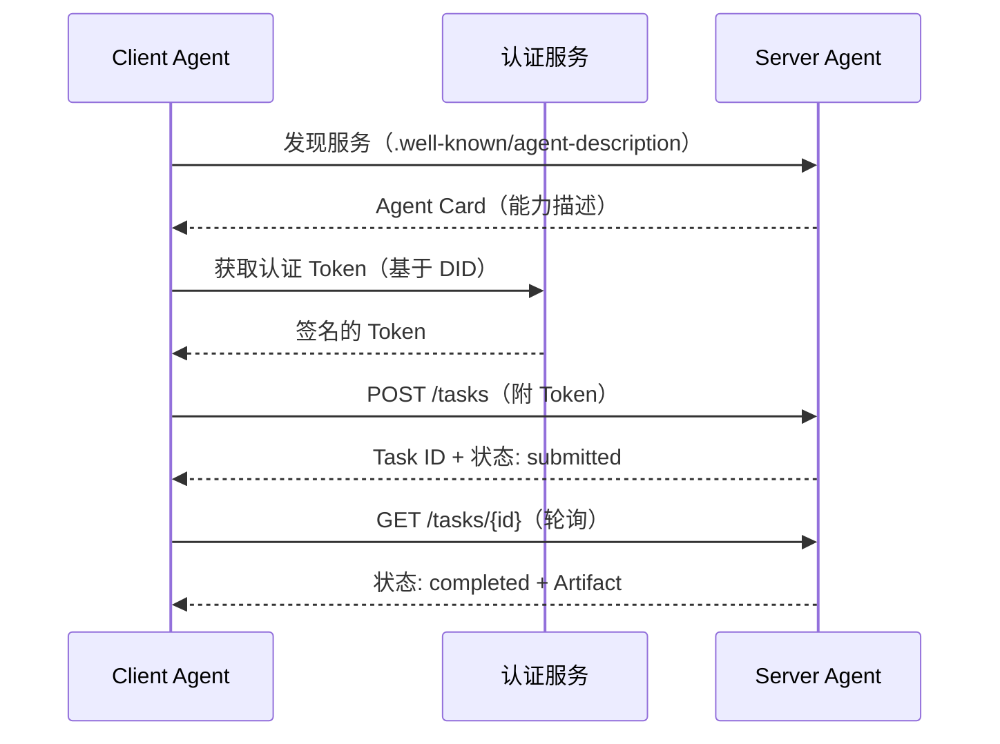
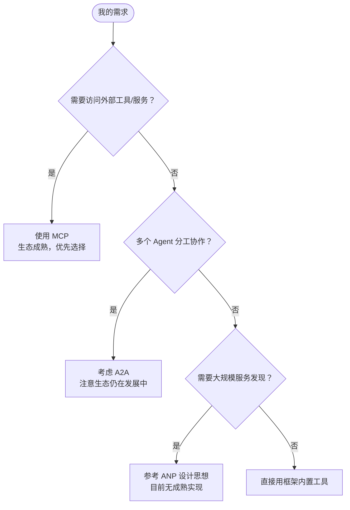

# 智能体通信协议：MCP 与 A2A

构建完一个能推理、会用工具的单体 Agent 之后，下一个挑战是：**如何让 Agent 与更广泛的外部世界高效沟通，以及如何让多个 Agent 之间相互协作？** 这正是智能体通信协议要解决的问题。本文聚焦目前业界最成熟、生态最活跃的两种协议：MCP（Model Context Protocol）和 A2A（Agent-to-Agent Protocol）。

---

## 为什么需要通信协议

在没有标准协议之前，每接入一个新服务，都需要手写一个适配器：

```python
class GitHubTool(BaseTool):
    def run(self, repo_url): ...   # 手写 GitHub API 适配

class DatabaseTool(BaseTool):
    def run(self, query): ...      # 手写数据库适配

class WeatherTool(BaseTool):
    def run(self, location): ...   # 手写天气 API 适配
```

这带来三个痛点：**代码重复**（每个工具都要处理认证、错误处理）、**无法复用**（别人写的工具和你的接口不兼容）、**扩展性差**（接100个服务就写100个适配器）。

通信协议的本质是一套**标准化接口规范**，服务提供方只需实现一次协议，所有支持该协议的 Agent 都能无缝调用——就像 USB-C 统一了设备连接方式一样。

---

## 三种协议的定位



| 协议 | 提出方 | 解决什么问题 | 成熟度 |
|------|--------|------------|--------|
| **MCP** | Anthropic | Agent ↔ 工具/数据源 标准化通信 | 生态成熟，推荐使用 |
| **A2A** | Google | Agent ↔ Agent 点对点协作 | 发展中，Sample Code 阶段 |
| **ANP** | 开源社区 | 大规模 Agent 网络服务发现 | 概念验证阶段 |

选择指南：
- 需要访问外部服务（文件、数据库、API）→ 选 **MCP**
- 多个 Agent 需要相互委托任务 → 考虑 **A2A**
- 构建大规模 Agent 生态系统 → 参考 **ANP**

---

## MCP：智能体的"USB-C"

### 核心设计理念

MCP 不仅仅是一个 RPC（远程过程调用）协议，它更强调**上下文共享**。当 Agent 访问代码仓库时，MCP Server 不仅返回文件内容，还能提供代码结构、依赖关系、提交历史等丰富上下文，让 Agent 做出更智能的决策。

### Host / Client / Server 三层架构



三层职责清晰：
- **Host**：用户界面，管理对话流程
- **Client**：协议通信，负责与 Server 建连、发请求
- **Server**：功能实现，提供具体的工具/资源/提示词

### MCP 的三大核心能力

| 能力 | 特性 | 典型场景 |
|------|------|----------|
| **Tools（工具）** | 主动的，执行操作，有副作用 | 写文件、调 API、执行代码 |
| **Resources（资源）** | 被动的，提供数据，只读 | 读文件内容、数据库记录 |
| **Prompts（提示模板）** | 指导性的，提供预定义模板 | 代码 Review 模板、总结模板 |

### MCP vs Function Calling

很多人会问：我已经用 Function Calling 了，为什么还需要 MCP？

```python
# Function Calling：为不同模型重复实现
openai_tools = [{"type": "function", "function": {"name": "search_github", ...}}]
claude_tools = [{"name": "search_github", "input_schema": {...}}]  # 格式不同！

# MCP：一套实现，所有模型通用
github_client = MCPClient(["npx", "-y", "@modelcontextprotocol/server-github"])
tools = await github_client.list_tools()  # 自动发现，格式统一
```

两者是互补关系：**Function Calling 是 LLM 的能力**（知道何时调用函数）；**MCP 是工程基础设施**（规范工具如何被描述和调用）。类比：Function Calling 是"会打电话"的技能，MCP 是"全球统一电话标准"。

### 用代码使用 MCP 客户端

以 Python 的 HelloAgents 框架为例（以官方 MCP SDK 为准）：

```python
import asyncio
from hello_agents.protocols import MCPClient

async def use_mcp():
    # 连接到文件系统 MCP Server（通过 npx 启动官方 Server）
    client = MCPClient([
        "npx", "-y",
        "@modelcontextprotocol/server-filesystem",
        "."  # 指定根目录
    ])

    async with client:
        # 1. 发现可用工具
        tools = await client.list_tools()
        for tool in tools:
            print(f"{tool['name']}: {tool.get('description', '')}")

        # 2. 调用工具
        content = await client.call_tool("read_file", {"path": "README.md"})
        print(content)

        # 3. 访问资源
        resources = await client.list_resources()

        # 4. 获取提示模板
        prompts = await client.list_prompts()

asyncio.run(use_mcp())
```

### 将 MCP 工具集成到 Agent

```python
from hello_agents import SimpleAgent, HelloAgentsLLM
from hello_agents.tools import MCPTool

agent = SimpleAgent(name="文件助手", llm=HelloAgentsLLM())

# MCPTool 会自动展开 Server 提供的所有工具
fs_tool = MCPTool(
    name="fs",
    description="本地文件系统操作",
    server_command=["npx", "-y", "@modelcontextprotocol/server-filesystem", "."]
)
agent.add_tool(fs_tool)
# 展开后：fs_read_file, fs_write_file, fs_list_directory...

# Agent 现在可以直接操作文件
response = agent.run("请读取 README.md 并总结其主要内容")
```

### MCP 社区生态

MCP 的一大优势是**开箱即用的社区服务器**，无需自己实现工具：

| 服务 | npm 包 | 能力 |
|------|--------|------|
| 文件系统 | `@modelcontextprotocol/server-filesystem` | 读写本地文件 |
| GitHub | `@modelcontextprotocol/server-github` | 搜索仓库、读取代码 |
| PostgreSQL | `@modelcontextprotocol/server-postgres` | 执行 SQL 查询 |
| Playwright | `@playwright/mcp` | 浏览器自动化 |
| Slack | `@modelcontextprotocol/server-slack` | 发送消息、读频道 |

社区资源：
- [Awesome MCP Servers](https://github.com/punkpeye/awesome-mcp-servers) — 社区精选列表
- [mcpservers.org](https://mcpservers.org/) — 官方目录
- [Anthropic 官方 Servers](https://github.com/modelcontextprotocol/servers) — 最高质量

### 传输方式对比

MCP 支持多种传输层（Transport Agnostic 特性）：

| 传输方式 | 场景 | 示例 |
|----------|------|------|
| Stdio | 本地进程，开发调试 | `MCPClient(["python", "server.py"])` |
| Memory | 单元测试，快速原型 | `MCPTool()`（内置演示服务器）|
| HTTP | 生产环境，远程服务 | `MCPClient("http://api.example.com/mcp")` |
| SSE | 实时通信，流式处理 | `MCPClient("http://host/sse", transport_type="sse")` |

---

## A2A：Agent 间的点对点协作

### 设计动机

MCP 解决了 Agent 与工具的通信，但当任务复杂到需要**多个专业 Agent 分工协作**时（研究员 + 撰写员 + 编辑），MCP 不足以支撑这种场景。

传统的中央协调器方案（星型拓扑）有三个问题：
- **单点故障**：协调器崩溃，系统整体瘫痪
- **性能瓶颈**：所有流量经过中心节点
- **扩展困难**：增减 Agent 需要改动中心逻辑

A2A 采用**点对点（P2P）架构**，每个 Agent 既是服务提供方，也是消费方。

### 核心概念：Task 与 Artifact

A2A 与 MCP 最大的区别在于两个核心抽象：

| 概念 | MCP 对应 | A2A 概念 | 说明 |
|------|----------|----------|------|
| 请求单元 | Tool Call | **Task（任务）** | 有状态的工作单元，可跟踪进度 |
| 输出结果 | Tool Result | **Artifact（工件）** | 任务产出物，可传递给其他 Agent |

Task 有完整的生命周期状态机：`创建 → 协商 → 执行中 → 完成 / 失败`。

### A2A 实战骨架

```python
from hello_agents.protocols import A2AServer, A2AClient
import threading, time

# ===== Agent 服务端 =====
researcher = A2AServer(
    name="researcher",
    description="研究员 Agent，负责信息搜集",
    version="1.0.0"
)

@researcher.skill("research")
def do_research(text: str) -> str:
    """处理研究请求"""
    topic = text.replace("research", "").strip()
    return str({
        "topic": topic,
        "findings": f"关于 {topic} 的研究结果...",
        "sources": ["来源1", "来源2"]
    })

# 后台启动服务
threading.Thread(
    target=lambda: researcher.run(host="localhost", port=5000),
    daemon=True
).start()
time.sleep(1)

# ===== Agent 客户端 =====
client = A2AClient("http://localhost:5000")
response = client.execute_skill("research", "research AI在医疗领域的应用")
print(response.get("result"))
```

### 多 Agent 协作网络

```python
# 研究员 → 撰写员 → 编辑 的流水线
def create_content(topic: str):
    researcher_client = A2AClient("http://localhost:5000")
    writer_client = A2AClient("http://localhost:5001")
    editor_client = A2AClient("http://localhost:5002")

    # 步骤1：研究
    research = researcher_client.execute_skill("research", f"research {topic}")
    research_data = research.get("result", "")

    # 步骤2：撰写（基于研究结果）
    article = writer_client.execute_skill("write", f"write {research_data}")
    article_content = article.get("result", "")

    # 步骤3：编辑润色
    final = editor_client.execute_skill("edit", f"edit {article_content}")
    return final.get("result", "")

result = create_content("AI 在教育领域的应用")
```

### A2A 请求生命周期



---

## ANP：去中心化 Agent 网络（概念展望）

ANP（Agent Network Protocol）是面向**大规模 Agent 生态**的基础设施协议，目前仍在早期发展阶段。它解决的核心问题是：在一个包含成百上千个 Agent 的网络中，如何发现你需要的服务？

关键设计：
1. **DID（去中心化身份）**：每个 Agent 有唯一身份标识，基于公私钥对，无需中心化注册机构
2. **标准端点**：每个 Agent 暴露 `.well-known/agent-description`，描述自身能力
3. **语义搜索发现**：基于自然语言描述查找匹配 Agent，而非预先配置

```python
from hello_agents.protocols import ANPDiscovery, register_service

# 注册 Agent 到发现中心
discovery = ANPDiscovery()
register_service(
    discovery=discovery,
    service_id="nlp_agent_1",
    service_type="nlp",
    capabilities=["text_analysis", "sentiment_analysis"],
    endpoint="http://localhost:8001",
    metadata={"load": 0.3, "price": 0.01}
)

# 发现服务：按类型查找，按负载选优
nlp_services = discovery.discover_services(service_type="nlp")
best = min(nlp_services, key=lambda s: s.metadata.get("load", 1.0))
print(f"最佳服务：{best.service_name}（负载：{best.metadata['load']}）")
```

---

## 协议选型建议



---

## 常见误区与最佳实践

**误区一：用 MCP 替代 Function Calling**
两者不是竞争关系。MCP 是工具描述和访问的标准化；Function Calling 是 LLM 理解何时使用工具的能力。实际上 MCP 客户端内部也依赖 Function Calling 来驱动工具选择。

**误区二：A2A 等于微服务**
A2A 中的 Agent 有自己的推理能力和自主性，不是简单的函数调用。Agent 之间可以协商、拒绝任务、提出反方案。

**误区三：所有工具都要 MCP 化**
简单的内部工具（如格式化字符串、简单计算）直接用函数就行，不需要走 MCP 协议开销。MCP 的价值在于**跨团队、跨系统的工具复用**。

**最佳实践**：
- 优先使用 Anthropic 官方维护的 MCP Server，质量和文档更有保障
- MCP Server 中写清晰的工具描述，这是 LLM 正确调用工具的关键
- A2A 服务端做好幂等处理，同一 Task 重复执行结果一致
- 本地开发用 Stdio 传输，生产环境考虑 HTTP/SSE 传输

---

## 面试常问

- **MCP 和 Function Calling 的关系？** 互补，不是竞争。Function Calling 是 LLM 能力，MCP 是工程协议标准，前者决定"何时调用"，后者规范"如何描述和执行"。
- **MCP 的三种原语？** Tools（执行操作）、Resources（读取数据）、Prompts（提示模板）。Tools 有副作用，Resources 只读，Prompts 是预定义模板。
- **A2A 与传统 API 调用的区别？** A2A 中的 Agent 有自主性和推理能力；Task 有状态生命周期；支持 Agent 间协商能力边界；而传统 API 只是被动执行函数。
- **为什么 MCP 选择 Stdio 作为默认传输？** 启动简单，无需部署服务，本地进程间通信性能好，适合开发调试。生产环境可切换为 HTTP/SSE。

---

> 本文参考《Hello-Agents》(datawhalechina) 整理。
