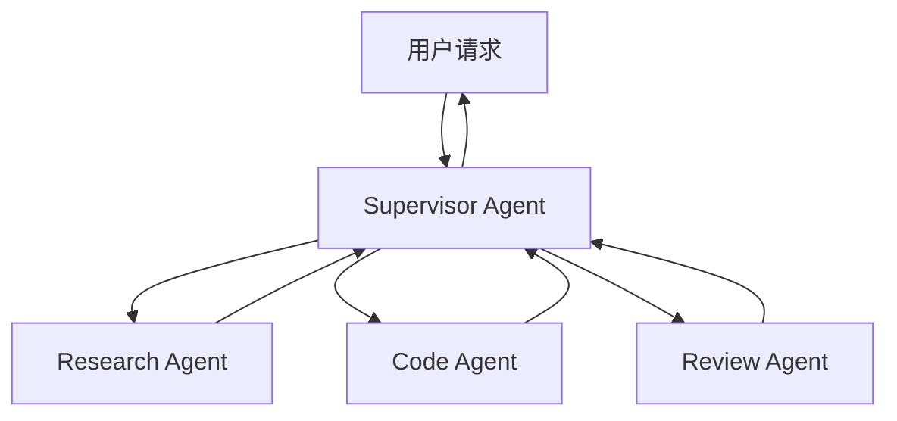

# 多 Agent 编排：AutoGen / LangGraph

单个 Agent 受上下文长度、单线程执行、能力泛化等限制，面对复杂任务往往力不从心。多 Agent 系统通过专业分工、并行执行、相互协作，突破单 Agent 的天花板。

## 多 Agent 系统的动机

- **上下文有限**：复杂任务的信息量超过单次 LLM 上下文窗口，需要拆分处理
- **任务可并行**：相互独立的子任务可以并发执行，大幅降低总延迟
- **专业分工**：用针对特定任务微调或精心设计 Prompt 的 Agent，比万能 Agent 效果更好
- **相互验证**：多个 Agent 从不同角度审查，减少单点错误

## 主流编排模式

### Supervisor（主管模式）

一个中心 Agent 负责理解任务、分派子任务、汇总结果：



适合任务结构不固定、需要动态决策分派的场景。

### Pipeline（流水线模式）

各 Agent 顺序执行，前一个的输出是下一个的输入：

```
用户输入 → 意图提取 Agent → 数据查询 Agent → 格式化 Agent → 输出
```

适合步骤明确、线性的任务（如：采集→分析→报告）。

### 并行 Fan-out

将任务拆分为独立子任务，并发执行后聚合结果：

```
主任务
├── 子任务 A ──┐
├── 子任务 B ──┤ → 聚合 Agent → 最终结果
└── 子任务 C ──┘
```

适合需要从多个数据源收集信息、多角度分析的场景。

### 辩论/反思（Debate / Reflection）

多个 Agent 对同一问题给出答案，互相批评，迭代优化：

```
Agent A 给出初稿 → Agent B 批评 → Agent A 修改 → Agent B 批准 → 输出
```

适合需要高质量输出、容忍额外延迟和成本的场景（如代码生成+审查）。

## AutoGen（Microsoft）

AutoGen 是微软开源的多 Agent 对话框架，核心抽象是 `ConversableAgent`：每个 Agent 都可以发送/接收消息，支持 LLM 驱动或纯代码驱动的 Agent，也支持人工参与（Human-in-the-Loop）。

**核心概念：**
- `ConversableAgent`：基础 Agent 类，支持 LLM 调用和工具执行
- `AssistantAgent`：LLM 驱动的助手 Agent
- `UserProxyAgent`：代理人工用户，可执行代码
- `GroupChat`：多 Agent 群聊，支持自定义发言顺序

AutoGen 特别适合需要代码执行的场景（数据分析、自动化测试），内置代码沙箱。目前主要为 Python 生态，TypeScript SDK 以官方文档为准。

## LangGraph

LangGraph 是 LangChain 生态的 Agent 编排框架，基于有向图（Directed Graph）建模工作流，支持循环（回路）——这是它区别于普通流水线的关键能力。

**核心概念：**
- **State**：贯穿整个图的共享状态对象，每个节点读取并更新状态
- **Node**：执行单元（LLM 调用、工具调用、自定义函数）
- **Edge**：节点间的连接，支持条件边（根据状态动态路由）
- **Graph**：整体编排结构，支持循环（Agent 可以反复思考）

### LangGraph TypeScript 骨架

```ts
import { Annotation, StateGraph, END, START } from "@langchain/langgraph";
import { BaseMessage, HumanMessage, AIMessage } from "@langchain/core/messages";

// 1. 定义状态 Schema
const AgentState = Annotation.Root({
  messages: Annotation<BaseMessage[]>({
    reducer: (x, y) => x.concat(y),  // 消息累加
  }),
  nextStep: Annotation<string>({
    reducer: (_, y) => y,             // 取最新值
  }),
});

type AgentStateType = typeof AgentState.State;

// 2. 定义节点函数
async function callLLM(state: AgentStateType): Promise<Partial<AgentStateType>> {
  // 调用 LLM，决定下一步行动
  const response = await llm.invoke(state.messages);
  return {
    messages: [response],
    nextStep: response.tool_calls?.length ? "tools" : "end",
  };
}

async function executeTools(state: AgentStateType): Promise<Partial<AgentStateType>> {
  const lastMessage = state.messages[state.messages.length - 1] as AIMessage;
  const toolResults = await toolExecutor.batch(lastMessage.tool_calls ?? []);
  return { messages: toolResults, nextStep: "llm" };
}

// 3. 定义条件路由
function routeAfterLLM(state: AgentStateType): string {
  return state.nextStep === "tools" ? "execute_tools" : END;
}

// 4. 构建图
const graph = new StateGraph(AgentState)
  .addNode("llm", callLLM)
  .addNode("execute_tools", executeTools)
  .addEdge(START, "llm")
  .addConditionalEdges("llm", routeAfterLLM)  // 条件边
  .addEdge("execute_tools", "llm")            // 工具执行后回到 LLM（循环）
  .compile();

// 5. 运行
const result = await graph.invoke({
  messages: [new HumanMessage("搜索最新的 AI 新闻并总结")],
  nextStep: "llm",
});
```

**循环的意义**：`execute_tools → llm` 这条边形成了循环，让 Agent 可以反复调用工具，直到 LLM 判断任务完成——这是 ReAct 模式的图化实现。

## AutoGen vs LangGraph 对比

| 维度 | AutoGen | LangGraph |
|------|---------|-----------|
| 编排范式 | 对话式（Agent 互发消息） | 图式（State + Node + Edge） |
| 循环支持 | 通过对话轮次自然支持 | 通过图中的回路显式定义 |
| 可视化 | 有对话流可视化 | 图结构可视化 |
| 代码执行 | 内置沙箱，强项 | 需手动集成工具 |
| 状态管理 | 消息历史为主 | 显式 State，灵活可扩展 |
| TypeScript 支持 | 相对有限（主要是 Python） | 完整支持（@langchain/langgraph） |
| 适用场景 | 对话式协作、代码生成 | 复杂工作流、需精确控制执行路径 |

## 多 Agent 常见挑战

### 通信协议

Agent 间传递什么格式的信息？纯文本（灵活但解析困难）还是结构化 JSON（精确但限制表达）？建议关键步骤用 JSON Schema 约束 Agent 输出。

### 状态共享

多个 Agent 需要访问共享状态时，要注意：

```ts
// ❌ 并发写入共享对象，可能产生竞态
await Promise.all([agentA.run(state), agentB.run(state)]);

// ✅ 只读共享，写入通过聚合节点串行完成
const [resultA, resultB] = await Promise.all([
  agentA.run(readonlyState),
  agentB.run(readonlyState),
]);
const mergedState = merge(resultA, resultB);
```

### 防止死锁和无限循环

```ts
const MAX_STEPS = 20;
let steps = 0;

while (agentState.nextStep !== "end") {
  if (steps++ >= MAX_STEPS) {
    console.warn("Agent loop limit reached, forcing termination");
    break;
  }
  await executeStep(agentState);
}
```

LangGraph 支持在 `compile` 时设置 `recursionLimit`，到达上限自动抛出错误。

### 成本控制

多 Agent 系统的 token 消耗是单 Agent 的倍数。策略：
- 子 Agent 使用小模型，只有 Supervisor 使用强模型
- Agent 间通信尽量传递结构化摘要而非完整上下文
- 设置整体任务的 token 预算，超出则提前终止

## 面试常问

**Q：什么场景适合多 Agent 架构？**
以下场景适合引入多 Agent：
1. 任务可以自然分解为相互独立的子任务（可并行）
2. 不同子任务需要显著不同的能力（专业化）
3. 需要相互验证以提高输出可靠性
4. 单次 LLM 上下文放不下完整任务信息

但多 Agent 也带来更高的延迟、成本和复杂性，不要过度设计——简单任务单 Agent 足够。

**Q：如何避免 Agent 间死循环？**
两层保障：
1. **设置最大步骤数/递归深度**：在框架层（如 LangGraph 的 recursionLimit）或业务层（step counter）强制终止
2. **状态变化检测**：如果连续 N 步状态没有实质变化，视为卡死并终止

此外，设计 Prompt 时明确告知 Agent"如果工具调用失败 2 次请停止尝试并报告错误"，让 Agent 主动退出而非无限重试。

**Q：LangGraph 的 State 和普通变量有什么区别？**
LangGraph 的 State 是带 Reducer 的不可变状态对象：每个节点返回状态的部分更新，框架负责合并（而非直接覆盖）。这使得并发执行、状态回溯（Checkpoint）和调试追踪成为可能，也便于与持久化层（如数据库）集成实现长时任务的断点续跑。
