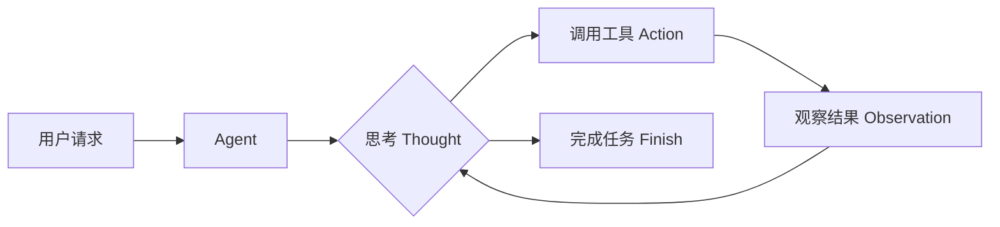
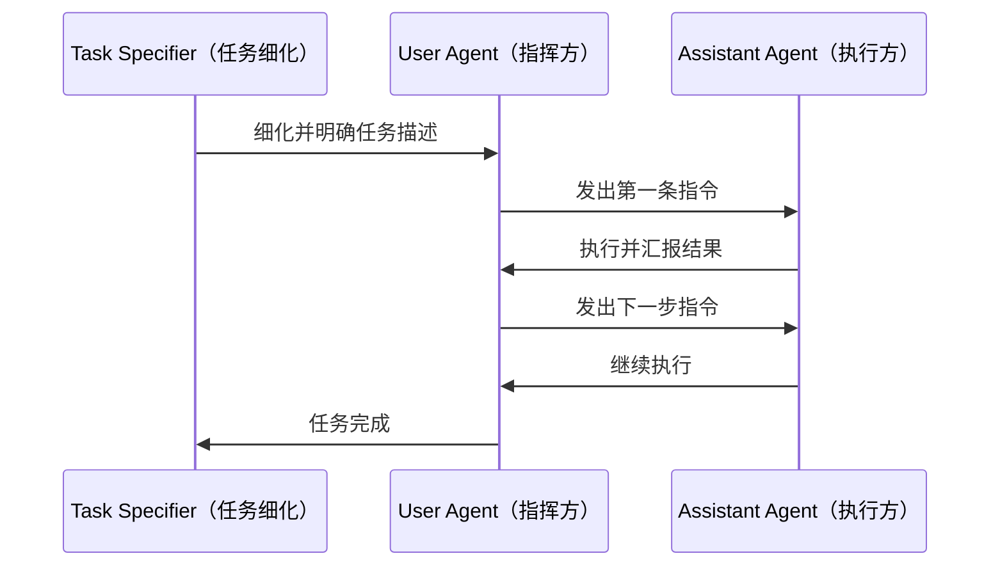
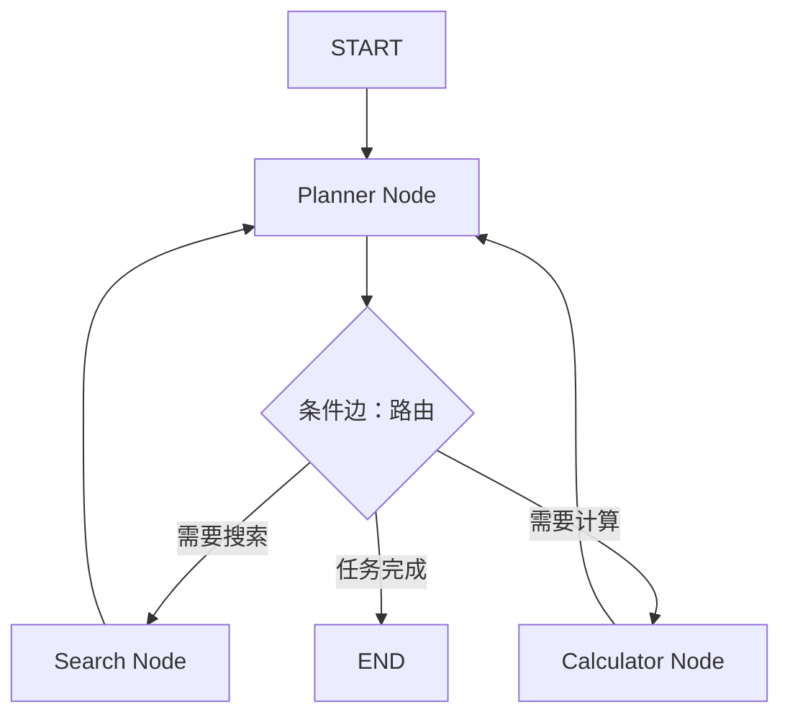

*图：沿图中的节点与箭头阅读，重点是说明何时并行分工真正有收益，以及协调、共享状态、汇总和成本如何限制扩展。*

---

单个 Agent 可以完成工具调用和推理循环，但面对需要并行分工、专业互补的复杂任务时，单体架构会遇到上下文过长、能力单一、错误传播等瓶颈。多智能体系统（Multi-Agent System，MAS）通过让多个 Agent 分工协作完成任务，是突破这些限制的核心范式。（参见 [How we built our multi-agent research system](https://www.anthropic.com/engineering/multi-agent-research-system)）

## 为什么需要多智能体

单体 Agent 的局限来自三个方向：

1. **上下文窗口限制**：大型任务的中间状态动辄数万 token，单 Agent 难以持续追踪；
2. **能力专注度**：同一个 Agent 既要做代码审查又要写产品文档，提示词冲突严重，质量下降；
3. **串行瓶颈**：一些子任务可以并行执行，串行处理浪费时间；
4. **相互验证缺失**：一个 Agent 既是生产者又是评审者，缺乏制衡。

多智能体通过**角色分工**（Role Specialization）、**信息传递**（Message Passing）和**状态共享**（Shared State）来突破这些限制。

## 四大协作范式

[AutoGen 原始论文](https://arxiv.org/abs/2308.08155) 提出以可组合的多智能体会话构建应用，并允许不同 Agent 组合模型、人类输入和工具；收益仍取决于任务能否有效分解。


### 1. 单体自主循环（Autonomous Loop）

最基础的范式，一个 Agent 独立完成任务，用 ReAct（Reason + Act）循环驱动：



**优点**：实现简单，调试方便。  
**适用场景**：单一领域、信息依赖线性的任务（如文档摘要、单步代码生成）。  
**局限**：无法并行，长任务上下文膨胀，缺少专业分工。

### 2. 角色扮演对话（CAMEL 范式）

CAMEL（Communicative Agents for Mind Exploration of Large Language Models）是 2023 年提出的经典多智能体框架，核心思想是**两个 Agent 进行角色扮演式对话**：一个扮演 AI 助手（执行方），一个扮演用户/任务指派方（指挥方），双方通过多轮结构化对话共同推进任务。



CAMEL 的核心洞见：**让每个 Agent 清晰知道自己的角色**，避免角色混淆导致的幻觉和偏离。它证明了 LLM 可以在无人工介入的情况下通过角色扮演自主完成复杂任务，是多智能体协作的理论基础之一。

### 3. 组织化工作流（MetaGPT / CrewAI）

这两个框架都借鉴了真实企业的组织结构，将 Agent 分配到职能角色，通过**工作流（Workflow）**驱动协作。

**MetaGPT** 以软件公司为隐喻，设计了产品经理、架构师、工程师、QA 工程师等角色，每个角色都有明确的输入输出文档格式（称为标准化操作程序，SOP）：

```python
# MetaGPT 角色流水线示意（以官方文档为准）
from metagpt.roles import ProjectManager, Architect, Engineer, QaEngineer

# 各角色通过结构化文档传递信息，而非自由对话：
# ProjectManager  接收 → 用户需求   输出 → PRD 文档
# Architect       接收 → PRD 文档   输出 → 系统设计文档
# Engineer        接收 → 系统设计   输出 → 代码实现
# QaEngineer      接收 → 代码       输出 → 测试报告
```

MetaGPT 的关键创新是**结构化文档传递**：角色间通过规范化文档而非自由对话沟通，大大减少了信息失真和格式混乱。

**CrewAI** 更轻量，聚焦于 Agent 的任务分配和依赖管理：

```python
from crewai import Agent, Task, Crew
# 以官方文档为准

researcher = Agent(
    role="研究员",
    goal="深入研究指定主题",
    backstory="你是一位资深行业分析师",
    tools=[search_tool]
)

writer = Agent(
    role="内容撰稿人",
    goal="将研究成果转化为文章",
    backstory="你擅长把复杂信息写成易懂的内容"
)

research_task = Task(
    description="调研 AI Agent 的最新进展",
    agent=researcher
)

write_task = Task(
    description="基于调研结果，撰写一篇 1000 字的综述",
    agent=writer,
    context=[research_task]  # 声明对前序任务的依赖
)

crew = Crew(agents=[researcher, writer], tasks=[research_task, write_task])
result = crew.kickoff()
```

### 4. 状态图架构（LangGraph）

LangGraph 是 LangChain 团队推出的图结构多智能体框架，将工作流建模为**有向图（Directed Graph）**，每个节点是一个处理步骤（Agent 调用、工具执行等），边代表状态流转条件，支持原生循环。



LangGraph 的核心是 **State**（类型化状态对象）在节点间流动：

```python
from langgraph.graph import StateGraph, END
from typing import TypedDict, Annotated, Sequence
from langchain_core.messages import BaseMessage
import operator
# 以官方文档为准

class AgentState(TypedDict):
    messages: Annotated[Sequence[BaseMessage], operator.add]
    plan: str

def planner_node(state: AgentState) -> AgentState:
    # 处理 state，返回部分更新
    ...

def tools_node(state: AgentState) -> AgentState:
    ...

def should_continue(state: AgentState) -> str:
    # 条件边：决定下一个节点
    last_msg = state["messages"][-1]
    if last_msg.content == "DONE":
        return "end"
    return "tools"

workflow = StateGraph(AgentState)
workflow.add_node("planner", planner_node)
workflow.add_node("tools", tools_node)
workflow.add_conditional_edges("planner", should_continue, {
    "tools": "tools",
    "end": END
})
workflow.add_edge("tools", "planner")  # 形成循环

app = workflow.compile()
```

LangGraph 的核心优势：支持**循环**（Agent 可以反复迭代直到收敛）、**条件分支**（动态路由到不同子图）、**人工介入（Human-in-the-Loop）节点**以及**状态持久化与回溯（Checkpoint）**。

**AutoGen**（微软）采用更灵活的**对话式多智能体**架构，Agent 之间通过异步消息通信，支持动态加入/退出对话，特别擅长代码生成与自动执行场景。

## 四大框架横向对比

| 维度 | CrewAI | AutoGen | MetaGPT | LangGraph |
|------|--------|---------|---------|-----------|
| 核心范式 | 任务分配工作流 | 对话式协作 | SOP 组织化 | 状态图驱动 |
| 上手难度 | 低 | 中 | 中高 | 中高 |
| 适合场景 | 内容生成流水线 | 复杂对话/代码协作 | 软件研发流程 | 有状态复杂工作流 |
| 流程控制 | 顺序/并行任务 | 自由对话轮次 | 角色驱动 SOP | 条件分支图 |
| 循环支持 | 有限 | 支持（对话轮次） | 支持 | 原生支持（图回路） |
| 人工介入 | 有限 | 支持 | 有限 | 原生支持 |
| 状态管理 | 任务上下文 | 对话历史 | 结构化文档 | 类型化 State + Reducer |
| TypeScript 支持 | 有限（主 Python） | 有限（主 Python） | 有限（主 Python） | 完整（@langchain/langgraph） |
| 开源 | 是 | 是 | 是 | 是 |

## 关键设计问题

### 任务分解策略

```python
# 垂直分工：按流程阶段顺序执行
tasks = [
    Task("数据收集", agent=collector),
    Task("数据分析", agent=analyst, depends_on=["数据收集"]),
    Task("报告生成", agent=writer, depends_on=["数据分析"]),
]

# 水平分工：领域并行 + 汇总
tasks = [
    Task("Python 代码审查", agent=python_reviewer),  # 并行执行
    Task("安全漏洞检查", agent=security_reviewer),    # 并行执行
    Task("综合评审报告", agent=synthesizer,
         depends_on=["Python 代码审查", "安全漏洞检查"]),
]
```

### 通信协议选择

Agent 间通信分三种模式：

- **点对点（P2P）**：一个 Agent 直接发消息给另一个，适合简单两两协作；
- **广播**：通知类场景；
- **中央调度（Hub-and-Spoke）**：有一个 Orchestrator 负责分发任务，其他 Agent 只负责执行。MetaGPT 和 CrewAI 都接近这种模式。

建议 Agent 间传递**结构化数据（JSON / Markdown）**而非自由文本，减少解析歧义。

### 避免循环和死锁

多智能体系统容易陷入"Agent A 等待 Agent B，Agent B 等待 Agent A"的死锁：

1. **最大步数限制**：每个 Agent 最多执行 N 步（LangGraph 的 `recursionLimit`）；
2. **超时机制**：任务设定时间上限；
3. **显式终止条件**：在条件边或 Agent 提示词中明确定义"何时停止"，例如"如果工具连续调用失败 2 次，停止并报告错误"。

## 选型决策树

```
需要快速原型 / 简单流水线？
├── 是 → CrewAI（任务依赖配置简单）
└── 否
    ├── 需要精确状态控制 / 循环收敛 / 人工介入？
    │   └── 是 → LangGraph
    ├── 构建软件研发类严格流程自动化？
    │   └── 是 → MetaGPT
    └── 需要灵活的多方对话协商 / 代码自动执行？
        └── 是 → AutoGen
```

## 常见误区与最佳实践

**误区 1：Agent 越多越好**  
每增加一个 Agent 都会引入通信开销和出错概率。先从最少的 Agent 数量验证可行性，再按需扩展。

**误区 2：让 Agent 自由通信**  
无限制的自由对话会导致绕圈、无法收敛。应为每个 Agent 明确定义输入/输出契约（接口约定）。

**误区 3：忽略 Orchestrator 的作用**  
在 CrewAI 等框架中，任务依赖关系设计比单个 Agent 能力设计更重要。

**最佳实践**：
- 每个 Agent 的系统提示词（System Prompt）聚焦**单一职责**；
- 关键步骤用 JSON Schema 约束输出格式；
- 先用单 Agent 验证任务可行性，再拆分为多 Agent；
- 记录每个 Agent 的输入输出，方便追溯和优化；
- 子 Agent 使用小模型降低成本，只有 Orchestrator 使用强模型。

## 面试常问

- **Q：LangGraph 和 LangChain AgentExecutor 有什么区别？**  
  AgentExecutor 是单 Agent 的顺序循环，不支持分支和真正的多节点协作；LangGraph 用图结构支持复杂的状态流转、循环和多节点并发，并且支持状态持久化（Checkpoint）实现长任务断点续跑。

- **Q：MetaGPT 和 CrewAI 最大的差异是什么？**  
  MetaGPT 强调 SOP 和结构化文档传递，适合软件工程类严格流程；CrewAI 更轻量，任务依赖配置简单，适合内容生产类流水线。

- **Q：如何防止多智能体系统的"幻觉传播"？**  
  在关键节点做事实验证（Fact-checking）、用 JSON Schema 约束输出格式、引入人工介入节点审查关键中间结果，以及让下游 Agent 对上游输出的可信度打分后再决定是否采用。

- **Q：什么场景不适合多 Agent？**  
  任务简单、上下文短、延迟敏感（如实时问答）、调试预算有限的场景，单 Agent 更合适。多 Agent 的额外复杂性要有对应的收益才值得引入。

## 参考资料

- [How we built our multi-agent research system](https://www.anthropic.com/engineering/multi-agent-research-system)
- [AutoGen: Enabling Next-Gen LLM Applications via Multi-Agent Conversation](https://arxiv.org/abs/2308.08155)
