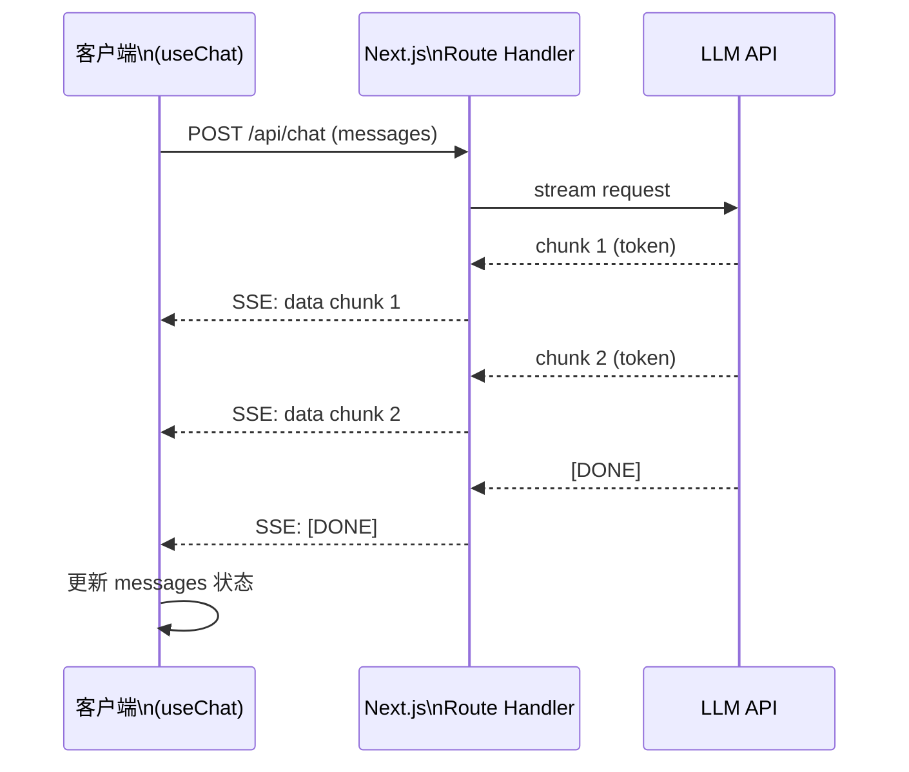

# Vercel AI SDK 深度使用

Vercel AI SDK 是面向 Next.js/React 生态的 AI 集成库，提供统一的 API 来调用多个 LLM 提供商，并内置了流式输出、React hooks 和工具调用等前端常用能力。它把"LLM 接入 Web 应用"这个链路的工程复杂度显著降低。

> 以下内容基于 Vercel AI SDK 的核心设计，具体 API 签名以[官方文档](https://sdk.vercel.ai/docs)为准。

## 核心模块

AI SDK 分为两层：

- **`ai` 核心包**：提供与框架无关的 LLM 调用函数（`generateText`、`streamText`、`generateObject` 等）
- **`@ai-sdk/[provider]`**：各提供商适配器（`@ai-sdk/openai`、`@ai-sdk/anthropic`、`@ai-sdk/google` 等）
- **`ai/react`**：React hooks（`useChat`、`useCompletion`）

```mermaid
graph LR
    subgraph 应用层
        R[React 组件\nuseChat / useCompletion]
        S[Server 函数\ngenerateText / streamText]
    end
    subgraph AI SDK 核心
        C[ai 核心包]
    end
    subgraph 提供商适配器
        O[@ai-sdk/openai]
        A[@ai-sdk/anthropic]
        G[@ai-sdk/google]
    end
    R --> C
    S --> C
    C --> O & A & G
```

## 核心函数

### generateText — 非流式文本生成

适合不需要流式输出的场景（分类、提取、后台任务）：

```ts
import { generateText } from 'ai';
import { openai } from '@ai-sdk/openai';

const { text, usage, finishReason } = await generateText({
  model: openai('gpt-4o-mini'),
  system: '你是一个代码审查助手',
  prompt: '请检查以下代码是否有 bug：\nconst x = null; x.toString();',
});

console.log(text);
console.log(usage); // { promptTokens, completionTokens, totalTokens }
```

### streamText — 流式文本生成

服务端生成流式响应，配合 `toDataStreamResponse()` 直接作为 Next.js Route Handler 的返回值：

```ts
// app/api/chat/route.ts
import { streamText } from 'ai';
import { openai } from '@ai-sdk/openai';

export async function POST(req: Request) {
  const { messages } = await req.json();

  const result = streamText({
    model: openai('gpt-4o'),
    messages, // CoreMessage[] 格式
    system: '你是一个前端技术助手',
    maxTokens: 1024,
  });

  // toDataStreamResponse() 将 stream 转为符合 AI SDK 协议的 HTTP 响应
  return result.toDataStreamResponse();
}
```

### generateObject — 结构化输出

让 LLM 直接返回符合 TypeScript 类型的对象，底层使用 JSON Schema 约束输出：

```ts
import { generateObject } from 'ai';
import { openai } from '@ai-sdk/openai';
import { z } from 'zod';

const { object } = await generateObject({
  model: openai('gpt-4o-mini'),
  schema: z.object({
    sentiment: z.enum(['positive', 'negative', 'neutral']),
    score: z.number().min(0).max(1),
    keywords: z.array(z.string()).max(5),
  }),
  prompt: '分析以下评论的情绪：这个产品太好用了，强烈推荐！',
});

console.log(object.sentiment); // "positive"
console.log(object.score);     // 如 0.95
```

## React Hooks

### useChat — 对话界面

`useChat` 封装了消息管理、流式更新和 API 请求，是构建对话 UI 的最快路径：

```tsx
'use client';
import { useChat } from 'ai/react';

export function ChatInterface() {
  const {
    messages,
    input,
    handleInputChange,
    handleSubmit,
    isLoading,
    error,
    stop,        // 停止流式输出
    reload,      // 重新生成最后一条回复
  } = useChat({
    api: '/api/chat',           // 对应的 Route Handler
    initialMessages: [],
    onFinish: (message) => {
      console.log('完成', message);
    },
    onError: (err) => {
      console.error('出错', err);
    },
  });

  return (
    <div>
      <div className="messages">
        {messages.map(m => (
          <div key={m.id} className={`message ${m.role}`}>
            <span className="role">{m.role}</span>
            <p>{m.content}</p>
          </div>
        ))}
        {isLoading && <div className="loading">思考中...</div>}
      </div>

      <form onSubmit={handleSubmit}>
        <input
          value={input}
          onChange={handleInputChange}
          placeholder="输入消息..."
          disabled={isLoading}
        />
        <button type="submit" disabled={isLoading}>发送</button>
        {isLoading && <button type="button" onClick={stop}>停止</button>}
      </form>
    </div>
  );
}
```

### useCompletion — 单次补全

适合文本补全、翻译、摘要等单次任务场景（非对话）：

```tsx
'use client';
import { useCompletion } from 'ai/react';

export function SummaryTool() {
  const { completion, input, handleInputChange, handleSubmit, isLoading } =
    useCompletion({ api: '/api/completion' });

  return (
    <div>
      <form onSubmit={handleSubmit}>
        <textarea value={input} onChange={handleInputChange} rows={6} />
        <button type="submit" disabled={isLoading}>生成摘要</button>
      </form>
      {completion && <div className="result">{completion}</div>}
    </div>
  );
}
```

## 工具调用（Tool Use）

AI SDK 提供了类型安全的工具定义方式，工具结果可以自动返回给 LLM 继续推理（`maxSteps` 控制循环次数）：

```ts
import { streamText, tool } from 'ai';
import { openai } from '@ai-sdk/openai';
import { z } from 'zod';

// app/api/agent/route.ts
export async function POST(req: Request) {
  const { messages } = await req.json();

  const result = streamText({
    model: openai('gpt-4o'),
    messages,
    maxSteps: 5, // 允许最多 5 轮工具调用
    tools: {
      getWeather: tool({
        description: '获取指定城市的天气信息',
        parameters: z.object({
          city: z.string().describe('城市名称'),
        }),
        execute: async ({ city }) => {
          // 实际调用天气 API
          return { city, temperature: 28, condition: '晴' };
        },
      }),
      searchDatabase: tool({
        description: '搜索内部数据库',
        parameters: z.object({
          query: z.string(),
          limit: z.number().optional().default(5),
        }),
        execute: async ({ query, limit }) => {
          // 实际查询数据库
          return { results: [], total: 0 };
        },
      }),
    },
  });

  return result.toDataStreamResponse();
}
```

客户端 `useChat` 无需额外配置即可处理工具调用流程，SDK 自动处理 tool result 的往返。

## Streaming 原理

AI SDK 的流式传输基于 **ReadableStream + Server-Sent Events（SSE）** 的混合协议：



`toDataStreamResponse()` 将 LLM 的流转换为符合 AI SDK 数据流协议的 HTTP 响应，客户端 `useChat` 内部自动解析该协议，将 token 追加到消息内容中实时渲染。

## 多 Provider 支持

切换 provider 只需替换模型实例，其余代码不变：

```ts
import { anthropic } from '@ai-sdk/anthropic';
import { google } from '@ai-sdk/google';
import { openai } from '@ai-sdk/openai';

// 按需切换，接口完全一致
const model = process.env.AI_PROVIDER === 'anthropic'
  ? anthropic('claude-3-5-sonnet-20241022')
  : process.env.AI_PROVIDER === 'google'
    ? google('gemini-1.5-pro')
    : openai('gpt-4o');

const { text } = await generateText({ model, prompt: '...' });
```

## 面试常问

**Streaming 是如何实现的？**

服务端使用 `ReadableStream` 将 LLM 的 token 逐片推送，通过 HTTP 的 chunked transfer encoding 或 Server-Sent Events 传输到客户端。AI SDK 在服务端用 `toDataStreamResponse()` 序列化流，客户端 `useChat` 用 `fetch` 的 `response.body` 读取 `ReadableStream`，逐 chunk 解析并触发 React 状态更新，实现实时渲染效果。

**与直接调用 OpenAI SDK 的区别？**

| 维度 | 直接调用 OpenAI SDK | Vercel AI SDK |
|------|-------------------|---------------|
| 多 provider | 需要分别集成 | 统一接口，一键切换 |
| React 集成 | 需自己管理状态 | useChat/useCompletion 开箱即用 |
| 流式处理 | 需手写 SSE 逻辑 | toDataStreamResponse() 一行搞定 |
| 工具调用循环 | 需手动实现 loop | maxSteps 自动处理 |
| 类型安全 | 较弱 | Zod schema 强类型 |
| 灵活性 | 高（直接操控） | 中（封装有取舍） |

对于纯 Node.js 后端或非 React 项目，直接用 provider SDK 更合适；Next.js/React 项目推荐 AI SDK。
