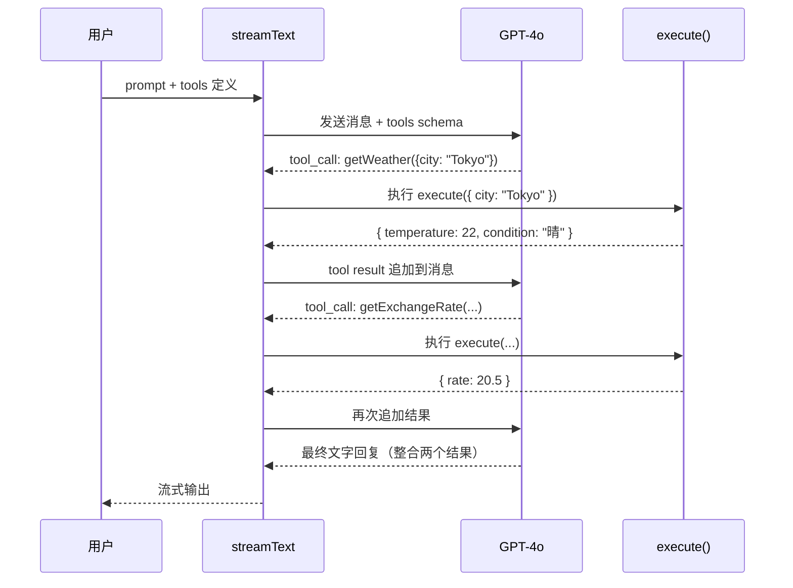

Vercel AI SDK 是专为 Next.js / React 生态设计的 AI 集成库，核心目标是让"把 LLM 接入 Web 应用"这件事变得像接一个普通 API 一样简单。它内置了流式输出、React Hooks、工具调用（Tool Calling）和多模型支持，是前端工程师进入 AI 开发最顺畅的起点。

> 以下内容基于 Vercel AI SDK 核心设计，具体 API 签名以 [官方文档](https://sdk.vercel.ai/docs) 最新版本为准。

---

## 为什么选 Vercel AI SDK

与直接调用 OpenAI API 或使用 LangChain 相比：

| 对比维度 | 裸 OpenAI SDK | LangChain.js | Vercel AI SDK |
|----------|--------------|--------------|---------------|
| 流式输出 | 需手动处理 | 支持 | 一等公民，开箱即用 |
| React Hooks | 无 | 无 | `useChat` / `useCompletion` |
| Next.js 集成 | 手动 | 手动 | 原生 Route Handler |
| 多模型切换 | 手动适配 | Provider 层 | `@ai-sdk/openai`, `@ai-sdk/anthropic`... |
| 打包体积 | 小 | 较大 | 轻量 |
| 工具调用 | 手动解析 | 封装 | 内置 `tool()` + 类型安全 |

---

## 安装

```bash
# 核心运行时
npm install ai

# 选择你的模型 Provider（可多选）
npm install @ai-sdk/openai
npm install @ai-sdk/anthropic
npm install @ai-sdk/google
```

环境变量：

```bash
OPENAI_API_KEY=sk-...
ANTHROPIC_API_KEY=sk-ant-...
```

---

## generateText：一次性文本生成

适合不需要流式输出的场景（批量处理、后台任务）：

```ts
import { generateText } from "ai";
import { openai } from "@ai-sdk/openai";

const { text, usage, finishReason } = await generateText({
  model: openai("gpt-4o-mini"),
  prompt: "用一句话解释什么是向量数据库",
});

console.log(text);
console.log(`Token 消耗: ${usage.totalTokens}`);
```

带系统提示词：

```ts
const { text } = await generateText({
  model: openai("gpt-4o-mini"),
  system: "你是一名资深前端工程师，回答简洁且实用。",
  messages: [
    { role: "user", content: "React 18 的 Concurrent Mode 解决了什么问题？" },
  ],
});
```

---

## streamText：流式文本生成

流式输出是 AI 聊天体验的核心，`streamText` 让它在 Node.js 和 Edge Runtime 上同样简单：

```ts
import { streamText } from "ai";
import { openai } from "@ai-sdk/openai";

const result = streamText({
  model: openai("gpt-4o-mini"),
  prompt: "请详细解释 CSS 容器查询（Container Queries）的使用场景",
});

// 方式一：AsyncIterator，逐 chunk 消费
for await (const chunk of result.textStream) {
  process.stdout.write(chunk);
}

// 方式二：等待全部完成
const fullText = await result.text;
```

### 在 Next.js Route Handler 中使用

```ts
// app/api/chat/route.ts
import { streamText } from "ai";
import { openai } from "@ai-sdk/openai";

export async function POST(req: Request) {
  const { messages } = await req.json();

  const result = streamText({
    model: openai("gpt-4o-mini"),
    system: "你是一个有帮助的 AI 助手。",
    messages,
  });

  // toDataStreamResponse() 将流转为前端 useChat 可消费的格式
  return result.toDataStreamResponse();
}
```

---

## useChat：前端对话 Hook

`useChat` 是 Vercel AI SDK 最有价值的部分——它封装了消息状态管理、流式渲染、错误处理和中断控制：

```tsx
"use client";
import { useChat } from "ai/react";

export function ChatUI() {
  const {
    messages,     // Message[] 对话历史
    input,        // string 当前输入框内容
    handleInputChange,
    handleSubmit, // 发送消息
    isLoading,    // 是否正在等待响应
    stop,         // 中断流式输出
    error,        // 错误信息
  } = useChat({
    api: "/api/chat",          // 对应 Route Handler
    initialMessages: [],        // 预设初始消息
    onFinish: (message) => {    // 生成完成回调
      console.log("AI 回复完成:", message.content);
    },
    onError: (err) => {
      console.error("出错了:", err);
    },
  });

  return (
    <div className="flex flex-col h-screen">
      {/* 消息列表 */}
      <div className="flex-1 overflow-y-auto p-4 space-y-4">
        {messages.map((msg) => (
          <div
            key={msg.id}
            className={`p-3 rounded-lg ${
              msg.role === "user" ? "bg-blue-100 ml-auto" : "bg-gray-100"
            }`}
          >
            {msg.content}
          </div>
        ))}
        {isLoading && <div className="text-gray-400">AI 正在思考...</div>}
      </div>

      {/* 输入框 */}
      <form onSubmit={handleSubmit} className="p-4 border-t flex gap-2">
        <input
          value={input}
          onChange={handleInputChange}
          placeholder="输入消息..."
          className="flex-1 border rounded px-3 py-2"
        />
        <button type="submit" disabled={isLoading}>发送</button>
        {isLoading && (
          <button type="button" onClick={stop}>停止</button>
        )}
      </form>
    </div>
  );
}
```

### useCompletion：单次文本补全 Hook

```tsx
"use client";
import { useCompletion } from "ai/react";

export function TextCompletion() {
  const { completion, complete, isLoading } = useCompletion({
    api: "/api/completion",
  });

  return (
    <div>
      <button onClick={() => complete("请帮我优化这段代码：...")}>
        优化代码
      </button>
      {isLoading ? "生成中..." : <pre>{completion}</pre>}
    </div>
  );
}
```

---

## Tool Calling：让 AI 调用你的函数

Vercel AI SDK 的工具调用使用 `tool()` 配合 Zod 定义结构化参数，LLM 会自动决定何时调用：

```ts
import { streamText, tool } from "ai";
import { openai } from "@ai-sdk/openai";
import { z } from "zod";

const result = streamText({
  model: openai("gpt-4o"),  // 工具调用建议用较强模型
  system: "你是一个旅行助手，可以查询天气和汇率。",
  prompt: "我要去东京旅行，今天天气如何？另外 1 人民币等于多少日元？",
  tools: {
    getWeather: tool({
      description: "获取指定城市的当前天气",
      parameters: z.object({
        city: z.string().describe("城市名称，英文，如 Tokyo"),
        unit: z.enum(["celsius", "fahrenheit"]).default("celsius"),
      }),
      execute: async ({ city, unit }) => {
        // 真实场景调用天气 API
        return { city, temperature: 22, condition: "晴", unit };
      },
    }),

    getExchangeRate: tool({
      description: "查询两种货币之间的汇率",
      parameters: z.object({
        from: z.string().describe("源货币代码，如 CNY"),
        to: z.string().describe("目标货币代码，如 JPY"),
      }),
      execute: async ({ from, to }) => {
        // 真实场景调用汇率 API
        return { from, to, rate: 20.5 };
      },
    }),
  },
  maxSteps: 5,  // 允许多轮工具调用（工具结果 → 继续推理 → 再调用工具）
});

for await (const chunk of result.textStream) {
  process.stdout.write(chunk);
}
```

### 工具调用流程



### 在 Next.js Route Handler 中暴露工具 API

```ts
// app/api/agent/route.ts
import { streamText, tool } from "ai";
import { openai } from "@ai-sdk/openai";
import { z } from "zod";

export async function POST(req: Request) {
  const { messages } = await req.json();

  const result = streamText({
    model: openai("gpt-4o"),
    messages,
    tools: {
      searchDatabase: tool({
        description: "在产品数据库中搜索商品",
        parameters: z.object({
          query: z.string(),
          category: z.string().optional(),
        }),
        execute: async ({ query, category }) => {
          // 实际查询数据库
          return [{ id: 1, name: "示例商品", price: 99 }];
        },
      }),
    },
    maxSteps: 3,
  });

  return result.toDataStreamResponse();
}
```

前端的 `useChat` 无需额外配置即可接收工具调用结果并展示最终回答。

---

## 结构化输出：generateObject

有时不需要自由文本，而是需要符合特定 Schema 的 JSON 输出：

```ts
import { generateObject } from "ai";
import { openai } from "@ai-sdk/openai";
import { z } from "zod";

const { object } = await generateObject({
  model: openai("gpt-4o-mini"),
  schema: z.object({
    title: z.string(),
    summary: z.string().max(200),
    tags: z.array(z.string()).max(5),
    sentiment: z.enum(["positive", "negative", "neutral"]),
  }),
  prompt: "分析这段文字：'Vercel AI SDK 让前端接入 AI 变得非常简单，大大提升了开发效率。'",
});

console.log(object.tags);     // ["AI", "开发效率", "前端"]
console.log(object.sentiment); // "positive"
```

---

## 多模型支持

```ts
import { openai } from "@ai-sdk/openai";
import { anthropic } from "@ai-sdk/anthropic";
import { google } from "@ai-sdk/google";

// 按需切换，业务代码不变
const models = {
  fast: openai("gpt-4o-mini"),
  smart: anthropic("claude-3-5-sonnet-20241022"),
  gemini: google("gemini-1.5-flash"),
};

async function generate(tier: keyof typeof models, prompt: string) {
  const { text } = await generateText({
    model: models[tier],
    prompt,
  });
  return text;
}
```

---

## 常见误区与最佳实践

**误区一：在客户端直接调用 LLM**
所有 LLM 调用（包括 `generateText` / `streamText`）必须在服务端（Route Handler / Server Action）执行，客户端只与自己的 API 通信，避免暴露 API Key。

**误区二：不设置 `maxSteps`**
工具调用默认只执行一次。如果你的任务需要多轮工具调用（Agent Loop），必须设置 `maxSteps > 1`。

**误区三：忽略 `onFinish` 做持久化**
流式响应完成后，完整消息只在 `onFinish` 回调中才能获取，应在这里做数据库写入。

**最佳实践**：
- 前后端消息格式统一用 `Message[]`（`role` + `content`），`useChat` 和 Route Handler 天然匹配
- 使用 Zod 定义工具参数，获得类型安全 + 更好的 LLM 参数理解
- `streamText` 配合 `toDataStreamResponse()` 是 Next.js 最简路径
- 生产环境在工具的 `execute` 中加错误处理，工具失败不应让整个对话崩溃

---

## 面试常问

- **`useChat` 的消息如何持久化？** `useChat` 的消息只在内存中，需要在 `onFinish` 回调里调接口存数据库，刷新后用 `initialMessages` 恢复。
- **`maxSteps` 的作用？** 控制工具调用的最大轮次。每次工具调用 + LLM 继续推理算一步，不设此值则只会调用一次工具。
- **`generateText` vs `streamText`？** 前者等待全部生成完再返回，适合后台任务；后者逐 token 推送，适合实时聊天体验。
- **与 LangChain.js 怎么选？** 场景以 Next.js + React 为主且追求体验流畅度选 Vercel AI SDK；需要复杂 Agent 编排、向量检索或社区工具集成选 LangChain.js。

---

