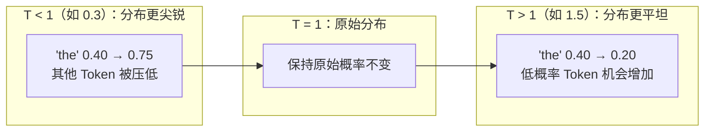
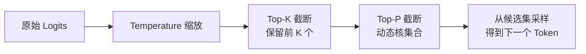

LLM 每次生成 Token 时，先通过模型计算词表上所有 Token 的概率分布（Logits → Softmax），再按某种策略从中**采样**出下一个 Token。Temperature、Top-P、Top-K 是控制这一采样过程的核心参数，它们直接决定了输出的确定性、多样性和创意程度。理解这些参数的原理，是精准调控 LLM 行为的基础。

## 从 Logits 到概率分布

模型最后一层输出 **Logits**（原始得分向量，维度等于词表大小），再经 Softmax 转换为概率分布：

$$p_i = \frac{e^{z_i}}{\sum_{j=1}^{V} e^{z_j}}$$

假设词表中排名靠前的 Token 概率如下：

```
"the"    → 0.40
"a"      → 0.25
"this"   → 0.15
"some"   → 0.08
"any"    → 0.05
…（其余 Token 共 0.07）
```

**贪心解码（Greedy Decoding）** 是最简单的策略：永远选概率最高的 Token（"the"），输出完全确定，但缺乏多样性，容易重复和单调。

**采样（Sampling）** 从概率分布中随机抽取，输出更自然，但也可能产生不连贯的结果。Temperature、Top-P、Top-K 都是在采样过程中对概率分布进行调整或截断的手段。

## Temperature（温度）

Temperature 通过在 Softmax 之前**缩放 Logits** 来控制分布的"尖锐程度"：

$$p_i^{(T)} = \frac{e^{z_i / T}}{\sum_{j} e^{z_j / T}}$$

参数 $T > 0$，对分布的影响如下：



| Temperature 区间 | 输出特征 | 典型场景 |
|----------------|---------|---------|
| **0**（贪心） | 完全确定，每次相同 | 单元测试、复现场景 |
| **0 – 0.3** | 高确定性，保守稳定 | 事实问答、数据提取、代码生成 |
| **0.3 – 0.7** | 平衡，自然流畅 | 日常对话、邮件撰写、技术文档 |
| **0.7 – 1.0** | 一定创意，自然多样 | 内容创作、聊天助手 |
| **1.0 – 2.0** | 高发散，风格多变 | 头脑风暴、诗歌创作、风格迁移 |

**T = 0 是特殊情况**：等价于贪心解码，Top-P 和 Top-K 此时无效（因为只有一个候选）。

```typescript
// 不同场景的 temperature 参考配置
const configs = {
  factualQA:      { temperature: 0.0 },   // 事实问答：完全确定
  codeGeneration: { temperature: 0.2 },   // 代码生成：稳定为主
  chatAssistant:  { temperature: 0.7 },   // 对话助手：自然流畅
  creativeWriting:{ temperature: 1.0 },   // 创意写作：多样发散
  brainstorming:  { temperature: 1.2 },   // 头脑风暴：高度发散
}
```

## Top-K 采样

Top-K 在采样前先**硬截断**候选集：只保留概率最高的 K 个 Token，将其余 Token 的概率置零，再对 K 个候选归一化后采样。

```
K = 3 时，候选集 = ["the", "a", "this"]（概率归一化后采样）
K = 1 时，退化为贪心解码
K = 词表大小时，等价于不截断
```

**优点**：简单直接，有效过滤"离谱"的低概率 Token。

**缺点**：K 是静态值，无法适应概率分布的动态变化：
- 分布**集中**时（高概率 Token 非常突出）：K = 50 仍然保留了很多低质量候选，引入不必要噪声
- 分布**均匀**时（所有 Token 概率相近）：K = 3 过于激进，丢失了合理多样性

## Top-P 采样（Nucleus Sampling）

Top-P（也叫 Nucleus Sampling，核采样）解决了 Top-K 的硬截断问题：**动态确定候选集大小**。

**算法**：将 Token 按概率从高到低排序，依次累加，直到累积概率超过阈值 $P$，以此时的 Token 集合作为候选集，再归一化后采样。

$$\text{候选集} = \min\left\{ S : \sum_{i \in S} p_{(i)} \geq P \right\}$$

```
P = 0.9，从高到低累加：
"the"  (0.40) → 累积 0.40
"a"    (0.25) → 累积 0.65
"this" (0.15) → 累积 0.80
"some" (0.08) → 累积 0.88
"any"  (0.05) → 累积 0.93 ← 超过 0.9，停止

候选集 = ["the", "a", "this", "some", "any"]（5 个）
```

**动态适应性**：
- 分布集中（某 Token 概率 0.95）→ 候选集只有 1 个，精准
- 分布均匀（概率均等）→ 候选集包含更多 Token，保留多样性

这正是 Top-P 被广泛认为优于 Top-K 的原因。常用范围：**0.8 – 0.95**。

## 三者的执行顺序与组合

实际推理时，若同时设置多个参数，执行顺序通常为：



**注意事项**：
- 同时设置 Top-K 和 Top-P 时，候选集取**两者的交集**（先 Top-K 再 Top-P），实际上是更严格的过滤
- 生产实践中通常**只选其中一个**，避免参数组合复杂性
- T = 0 时，Top-P 和 Top-K 均失效（贪心解码不采样）

```typescript
// 使用 Anthropic SDK 的典型配置（以官方文档为准）
import Anthropic from '@anthropic-ai/sdk'

const client = new Anthropic()

// 代码生成场景：低温、高稳定性
const codeResponse = await client.messages.create({
  model: 'claude-opus-4-5',
  max_tokens: 2048,
  temperature: 0.2,
  top_p: 0.95,
  messages: [{ role: 'user', content: '实现一个 debounce 函数' }],
})

// 创意写作场景：高温、高多样性
const creativeResponse = await client.messages.create({
  model: 'claude-opus-4-5',
  max_tokens: 1024,
  temperature: 1.0,
  top_p: 0.95,
  messages: [{ role: 'user', content: '写一首关于秋天的短诗' }],
})
```

## 其他重要参数

### Repetition Penalty（重复惩罚）

防止模型陷入循环生成同一内容。实现方式：在 Logits 层对已出现的 Token 施加惩罚，降低其再次被选中的概率。

不同 API 的实现名称略有差异：
- **OpenAI**：`frequency_penalty`（按出现频次惩罚，越常见惩罚越重）和 `presence_penalty`（只要出现过就惩罚，鼓励引入新词）
- **Anthropic Claude**：暂无独立参数，由模型训练内化处理
- **HuggingFace**：`repetition_penalty`（直接乘法因子，> 1 惩罚重复）

```typescript
// OpenAI API 中的重复惩罚（以官方文档为准）
const response = await openai.chat.completions.create({
  model: 'gpt-4o',
  messages: [...],
  frequency_penalty: 0.5,  // 0-2，惩罚已出现 Token 的频率
  presence_penalty: 0.3,   // 0-2，惩罚已出现过的任意 Token
})
```

### max_tokens / max_new_tokens

限制生成 Token 数的上限。注意：
- 这是**最多生成多少**，不是"恰好生成这么多"
- 模型遇到 EOS（End of Sequence）Token 时会提前停止
- 设置过小会导致输出被截断，通常要预留足够空间

### Stop Sequences（停止序列）

指定让模型提前停止生成的字符串。常用于结构化输出控制：

```typescript
// 用 stop 序列控制结构化 JSON 输出边界
const response = await client.chat.completions.create({
  model: 'gpt-4o',
  messages: [{ role: 'user', content: '提取以下文本中的人名：...' }],
  stop: ['</result>'],  // 遇到关闭标签立即停止
  response_format: { type: 'json_object' },
})
```

## 参数调优速查表

| 场景 | Temperature | Top-P | Top-K | 说明 |
|------|------------|-------|-------|------|
| 事实问答 / 数据提取 | 0.0 – 0.2 | 1.0 | — | 确定性优先，结果可复现 |
| 代码生成 | 0.1 – 0.3 | 0.95 | — | 稳定语法，偶尔探索替代方案 |
| 日常对话助手 | 0.6 – 0.8 | 0.9 | — | 自然流畅，不过于随机 |
| 内容创作 / 文案 | 0.8 – 1.0 | 0.95 | — | 多样表达，避免生硬 |
| 头脑风暴 | 1.0 – 1.3 | 0.95 | — | 高度发散，接受一些不连贯 |
| 调试 / 单元测试 | 0.0 | 1.0 | — | 完全复现，消除随机性 |

> 以上为经验参考值，实际效果受模型版本、任务类型、prompt 质量等多因素影响，建议通过 A/B 测试确定最优配置。

## 常见误区

- **"Temperature = 0 等于 Top-P = 0"**：Temperature = 0 是贪心解码；Top-P = 0 通常无效（候选集为空）。语义完全不同。
- **"更高的 Temperature 一定更有创意"**：Temperature 过高（> 1.5）会产生不连贯的输出，创意和质量往往同时下降
- **"同时设 Top-K 和 Top-P 效果更好"**：叠加使用会让候选集更小（双重过滤），不一定符合预期，建议二选一
- **"Repetition Penalty 越大越好"**：过大的惩罚值会阻止模型正常重复合理词汇（如专有名词、代词），产生语义漂移

## 面试常问

- Temperature = 0 和 Temperature = 0.01 有什么实际区别？
- 为什么 Top-P（Nucleus Sampling）被认为比 Top-K 更鲁棒？
- 想让模型每次输出完全相同，应该怎么设置这些参数？
- Repetition Penalty 是在 Logits 层起作用还是采样层？
- 生产环境中如何系统地确定最优 Temperature 值？
- Top-P 和 Top-K 同时设置时，最终候选集是并集还是交集？

