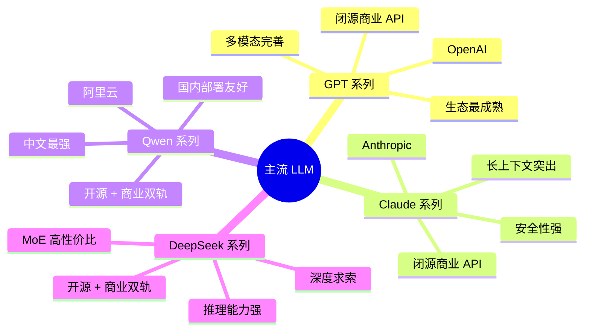
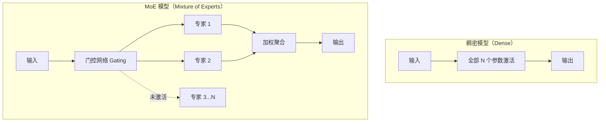

当前 LLM 生态形成了以 OpenAI、Anthropic、阿里云、深度求索为代表的多条主要产品线。本文从工程师视角做**定性多维对比**，聚焦架构取向、能力特点和适用场景，**不列具体跑分数字与精确价格**——这些数据随版本迭代快速变化，请以各官方最新文档和评测为准。

## 四大系列全景概览



## GPT 系列（OpenAI）

OpenAI 的 GPT 系列开创了当前大语言模型时代，从 GPT-3 到 GPT-4o、o 系列推理模型，形成了完整的产品矩阵。

**核心能力特点：**

- **多模态体系完整**：文本、图像、语音、视频输入支持较为完善，且各模态集成紧密
- **工具生态最早成熟**：Function Calling、Structured Outputs、Assistants API 等功能推出早、文档完善，大量第三方框架（LangChain、LlamaIndex 等）优先支持 OpenAI API 格式
- **o 系列推理模型**：o1、o3 等"思维链推理"（Chain-of-Thought Reasoning）模型针对数学、科学、代码等需要逻辑推理的任务有专项优化，采用测试时计算（Test-Time Compute）扩展策略
- **API 稳定性高**：作为行业标准制定者，OpenAI 的 API 格式被大量服务商兼容，迁移成本低

**典型适用场景：** 需要稳定生产级 API、多模态能力、第三方生态深度集成，或需要专项推理能力时。

**主要局限：**
- 国内网络访问受限，需代理或中转
- 数据发往境外服务器，数据主权敏感场景不适用
- 旗舰模型成本相对较高

```typescript
// OpenAI SDK 调用骨架（以官方文档为准）
import OpenAI from 'openai'

const client = new OpenAI({ apiKey: process.env.OPENAI_API_KEY })

const response = await client.chat.completions.create({
  model: 'gpt-4o',  // 具体模型名以官方最新列表为准
  messages: [
    { role: 'system', content: '你是一名专业的前端工程师。' },
    { role: 'user', content: '解释 React 的 Fiber 架构' },
  ],
  temperature: 0.7,
})
```

## Claude 系列（Anthropic）

Anthropic 由前 OpenAI 研究员创立，将"AI 安全"置于核心，Claude 系列以可靠性和长上下文能力著称。

**核心能力特点：**

- **超长 Context Window**：是 Claude 的显著特色，支持数十万乃至更长的 Token 上下文，分析长文档、大型代码库时有明显优势
- **指令遵循稳定**：在需要严格遵循系统提示（System Prompt）、保持角色一致性、处理复杂多步骤指令的任务中表现可靠
- **代码理解能力**：对大型代码库的整体理解和跨文件上下文推理表现突出
- **Constitutional AI 训练**：减少有害输出，安全性较高，但在某些边界内容上拒绝率相对较高，需注意场景匹配
- **Computer Use 能力**：支持操控计算机界面的 Agent 能力（以官方最新支持状态为准）

**典型适用场景：** 超长文档分析（法律合同、学术论文）、大型代码库审查与生成、需要严格遵循系统指令的 Agent 任务。

**主要局限：**
- 国内同样访问受限
- 部分创意生成任务因安全约束相对保守

```typescript
// Anthropic SDK 调用骨架（以官方文档为准）
import Anthropic from '@anthropic-ai/sdk'

const client = new Anthropic({ apiKey: process.env.ANTHROPIC_API_KEY })

const message = await client.messages.create({
  model: 'claude-opus-4-5',  // 具体模型名以官方最新列表为准
  max_tokens: 4096,
  system: '你是一名专业的代码审查工程师。',
  messages: [
    { role: 'user', content: '请审查以下 TypeScript 代码...' },
  ],
})
```

## Qwen 系列（阿里云 / 通义千问）

Qwen（通义千问）是阿里巴巴的大语言模型系列，采用开源与商业 API 双轨策略，在中文场景下有突出优势。

**核心能力特点：**

- **中文能力最强**：在中文理解、生成、文化背景处理上具备天然优势，对中文语境和表达习惯更自然
- **开源可私有化部署**：Qwen2.5 等版本开源权重，可在本地运行，满足数据不出境要求
- **多模态覆盖**：Qwen-VL（视觉语言）、Qwen-Audio 等变体支持图像、音频理解
- **代码与数学**：Qwen-Coder 系列针对代码生成优化，在同量级模型中有竞争力
- **国内低延迟**：通过阿里云 DashScope API 调用，国内访问延迟低，与阿里云技术栈集成方便

**典型适用场景：** 中文为主的业务、需要私有化部署满足合规要求、阿里云技术栈集成、国内用户面向产品。

**主要局限：**
- 英文及小语种能力相比 GPT/Claude 旗舰版仍有差距
- 国际化生态工具链成熟度不及 OpenAI

```typescript
// 通过 DashScope 调用 Qwen（与 OpenAI SDK 兼容接口，以官方文档为准）
import OpenAI from 'openai'

const client = new OpenAI({
  apiKey: process.env.DASHSCOPE_API_KEY,
  baseURL: 'https://dashscope.aliyuncs.com/compatible-mode/v1',
})

const response = await client.chat.completions.create({
  model: 'qwen-plus',  // 具体模型名以官方最新列表为准
  messages: [{ role: 'user', content: '用中文解释一下什么是 RAG' }],
})
```

## DeepSeek 系列（深度求索）

DeepSeek 以极具竞争力的性价比和开源策略在技术社区引发广泛关注，MoE 架构和专项推理模型是其技术亮点。

**核心能力特点：**

- **MoE 架构**：DeepSeek-V 系列采用稀疏混合专家（Mixture of Experts）架构。相比稠密模型，MoE 在推理时只激活部分专家（子网络），总参数量大但激活参数量小，计算效率高，推理成本低。
- **DeepSeek-R 系列（推理增强）**：专注于数学、代码、逻辑推理类任务，采用强化学习训练出自洽的推理过程（类似 OpenAI o 系列思路），在数学竞赛、编程题等任务上表现突出
- **与 OpenAI API 格式兼容**：接口设计与 OpenAI 高度兼容，迁移成本极低
- **开源可商用**：主要模型版本开源（具体协议以官方为准），支持本地部署

**典型适用场景：** 成本敏感的高并发批量处理、数学与代码推理任务、希望用开源模型自托管、从 OpenAI 迁移成本最小化。

**主要局限：**
- 生态工具链相对较新，第三方集成深度不如 OpenAI
- 数据合规与隐私政策需用户自行评估

```typescript
// DeepSeek API 与 OpenAI SDK 兼容（以官方文档为准）
import OpenAI from 'openai'

const client = new OpenAI({
  apiKey: process.env.DEEPSEEK_API_KEY,
  baseURL: 'https://api.deepseek.com',
})

const response = await client.chat.completions.create({
  model: 'deepseek-chat',  // 或 deepseek-reasoner，以官方最新列表为准
  messages: [{ role: 'user', content: '解释 MoE 架构的核心原理' }],
})
```

## 横向对比：多维度定性分析

| 维度 | GPT 系列 | Claude 系列 | Qwen 系列 | DeepSeek 系列 |
|------|---------|------------|----------|--------------|
| **中文能力** | 良好 | 良好 | **优秀** | 良好 |
| **英文能力** | **优秀** | 优秀 | 良好 | 良好 |
| **长上下文** | 支持（很长） | **特别强** | 支持 | 支持 |
| **推理能力** | 强（o 系列） | 强 | 良好 | **强（R 系列）** |
| **代码能力** | 强 | 强 | 良好 | 强 |
| **多模态** | **完善** | 支持 | 支持（VL） | 支持 |
| **开源可选** | 否 | 否 | **是** | **是** |
| **国内访问** | 受限 | 受限 | **友好** | **友好** |
| **生态成熟度** | **最成熟** | 较成熟 | 成长中 | 成长中 |
| **成本定性** | 中高 | 中高 | 中低 | **低** |

> **注意**：以上均为定性评估，具体能力随版本快速迭代，**请以各官方最新文档、独立评测基准（如 LMSYS Chatbot Arena、LiveCodeBench）为准**。

## 架构差异补充：MoE vs 稠密模型

DeepSeek 采用 MoE 架构，值得单独说明其原理：



**MoE 的核心权衡**：
- 总参数多（理论容量大）→ 模型能力强
- 每次推理激活参数少 → 计算量低，成本低
- 但：显存需要加载全部参数，硬件门槛不低；路由策略需精心设计防止专家负载不均

## 选型快速导航

```
中文业务 + 数据合规要求高     → Qwen（私有化部署）
国内高并发 + 成本敏感         → DeepSeek API / Qwen API
数学/代码推理任务              → DeepSeek-R 系列 / GPT o 系列
超长文档分析 + 复杂指令遵循   → Claude
多模态 + 生态集成 + 国际化    → GPT
开源自托管 + 灵活定制          → Qwen / DeepSeek
```

## 面试常问

- MoE 架构为什么在推理成本上有优势，代价是什么？
- Claude 的超长 Context Window 有哪些实际使用限制？（"Lost in the Middle" 效应）
- 开源模型和闭源 API 在商业场景下如何取舍？
- 为什么大多数模型的 API 格式都兼容 OpenAI 格式？有什么好处？
- 如果要从 GPT 迁移到 DeepSeek，主要需要注意哪些兼容性问题？

