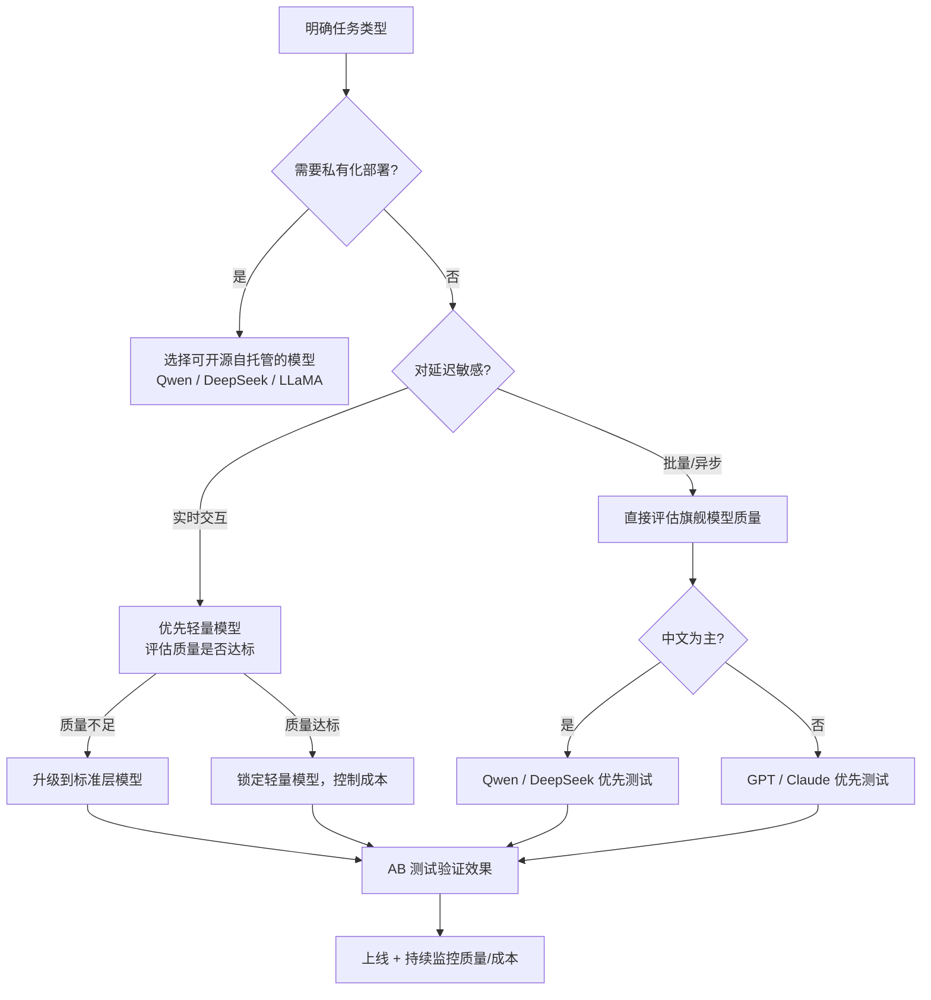

# 如何选择合适的模型和版本

LLM 产品线越来越丰富，每家厂商都提供从"轻量快速"到"旗舰强大"的多个版本。面对具体业务需求，如何系统地做出选型决策，比盲目追旗舰模型更重要。

> 本文只给出决策框架和定性分析，不列具体跑分数字与价格——这些数据变化快，**以各官方最新文档为准**。

## 选型的核心维度

### 1. 任务类型与难度

不同任务对模型能力的要求差异极大：

| 任务类型 | 举例 | 对模型要求 |
|---------|------|-----------|
| 简单分类/提取 | 情感分析、关键词提取 | 低，轻量模型即可 |
| 文本转换 | 翻译、改写、摘要 | 中，对语言质量有要求 |
| 代码生成/审查 | 写函数、找 bug | 中高，需理解语义和语法 |
| 复杂推理 | 数学证明、多步逻辑 | 高，需专项推理模型 |
| 长文档分析 | 合同审查、代码库理解 | 长 context 能力 |
| 多轮对话 Agent | 工具调用、任务规划 | 指令遵循、工具使用能力 |

**原则：用能完成任务的最小模型**，这既节省成本，也往往有更低延迟。

### 2. 延迟要求

```
实时流式对话（< 500ms TTFT）  → 优先轻量快速模型
异步批量处理（允许分钟级）    → 可用旗舰模型换取质量
后台分析任务                 → 成本最优模型 + 批量 API
```

**TTFT（Time to First Token）** 是用户体验的核心指标，旗舰大模型的 TTFT 通常显著高于小模型。

### 3. 成本预算

通常各家厂商的模型档位大致分为三层：

- **轻量层**（如 GPT-4o mini、Claude Haiku、Qwen-Turbo 等命名中带 mini/lite/turbo 的）：成本最低，速度最快，适合高频低复杂度任务
- **标准层**（中间档位）：能力与成本的平衡点，覆盖大多数业务场景
- **旗舰层**（如 GPT-4o、Claude Opus、Qwen-Max 等旗舰版）：最强能力，成本最高，用于高价值、高复杂度任务

> 一个常见误区：默认使用旗舰模型。实测很多任务用中间档或轻量模型效果相差无几，但成本可相差数倍到数十倍。

### 4. 合规与数据主权

```
数据不出境要求       → 私有化部署开源模型（Qwen、DeepSeek 等）
国内业务 + 合规审查  → 国内厂商 API（DashScope、百度千帆等）
GDPR / 数据处理协议  → 确认厂商 DPA，选择有企业协议的服务商
医疗/金融等高敏场景  → 私有化部署 + 本地推理框架
```

### 5. 语言与领域特化

- **中文为主**：Qwen、DeepSeek 在中文任务上有优势
- **英文代码**：GPT、Claude、DeepSeek-Coder 系列表现好
- **数学推理**：选推理增强版（o 系列、R 系列）
- **多模态**：需要视觉/音频时，确认模型支持的模态

## 决策流程



## 版本选择策略

### 稳定性 vs 最新能力

- **生产环境**：指定固定模型版本（如 `gpt-4o-2024-11-20` 而非浮动的 `gpt-4o`），避免厂商静默更新导致行为变化
- **探索/研究**：可以跟最新版本，享受能力提升

```typescript
// 生产环境：锁定具体版本
const PROD_MODEL = 'gpt-4o-2024-11-20'  // 固定，行为可预期

// 开发环境：跟最新
const DEV_MODEL = 'gpt-4o'  // 浮动到最新版本
```

### Routing 策略：按任务路由模型

复杂系统中，不同任务路由到不同模型，是成本优化的有效手段：

```typescript
function selectModel(task: TaskConfig): string {
  if (task.requiresReasoning) return 'o1-mini'
  if (task.isSimpleExtraction) return 'gpt-4o-mini'
  if (task.isLongDocument) return 'claude-3-5-haiku-20241022'
  return 'gpt-4o'  // 默认标准模型
}
```

### 评估方法

不要只靠主观印象选模型，应建立系统的评估流程：

1. **构建评估集**：收集真实业务场景的典型 case（50–200 条）
2. **定义指标**：准确率、格式符合率、人工评分（1-5 分）
3. **多模型对比**：在同一评估集上跑多个候选模型
4. **成本/质量曲线**：找到"够用的最低成本点"
5. **回归测试**：模型版本变更时重跑评估集

## 常见误区

- **追旗舰**：旗舰模型不一定适合每个任务，过度设计浪费成本
- **忽视延迟**：高质量但慢的模型在实时场景中体验差
- **不锁版本**：厂商更新模型后行为可能改变，生产环境务必锁版本
- **单一供应商依赖**：关键业务建议准备备选模型，应对 API 故障
- **只看 benchmark**：公开 benchmark 不等于业务场景表现，必须自测

## 面试常问

- 如何在成本和质量之间做权衡？
- 生产环境中为什么要锁定模型版本？
- 什么情况下应该考虑私有化部署而非调用 API？
- 如何构建一套 LLM 选型评估流程？
- Model Routing 是什么，有哪些实现方式？
