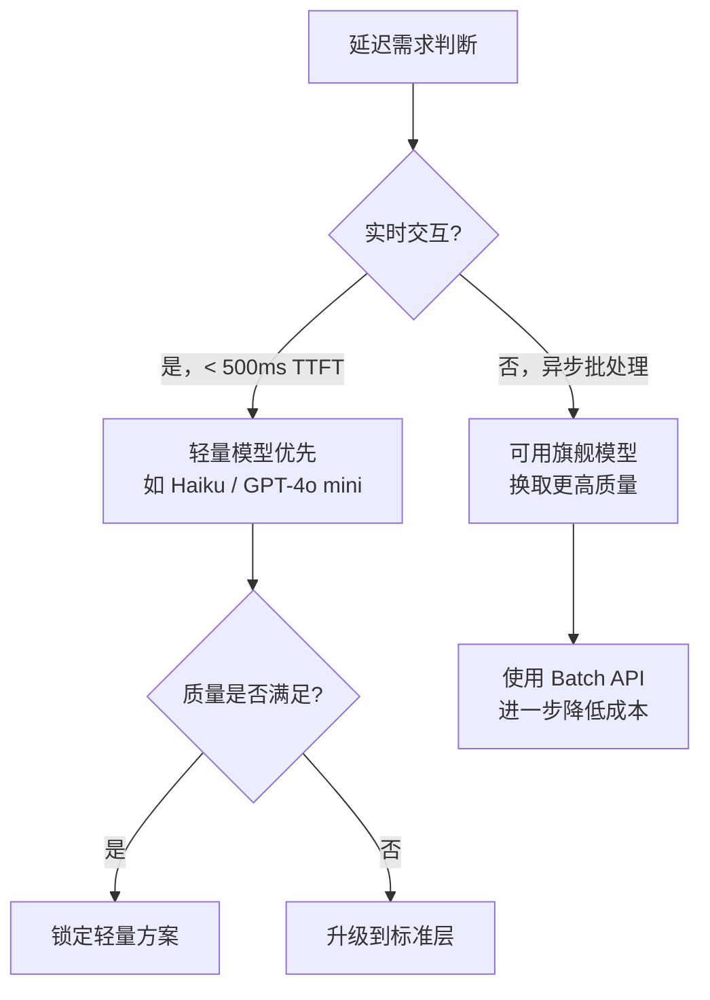
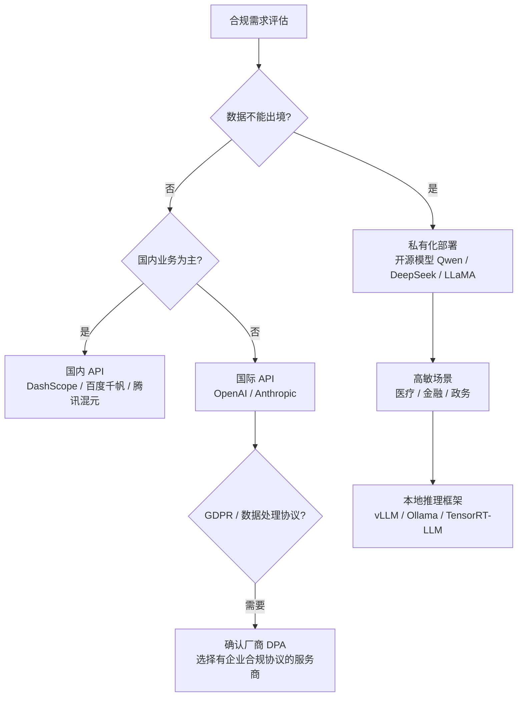
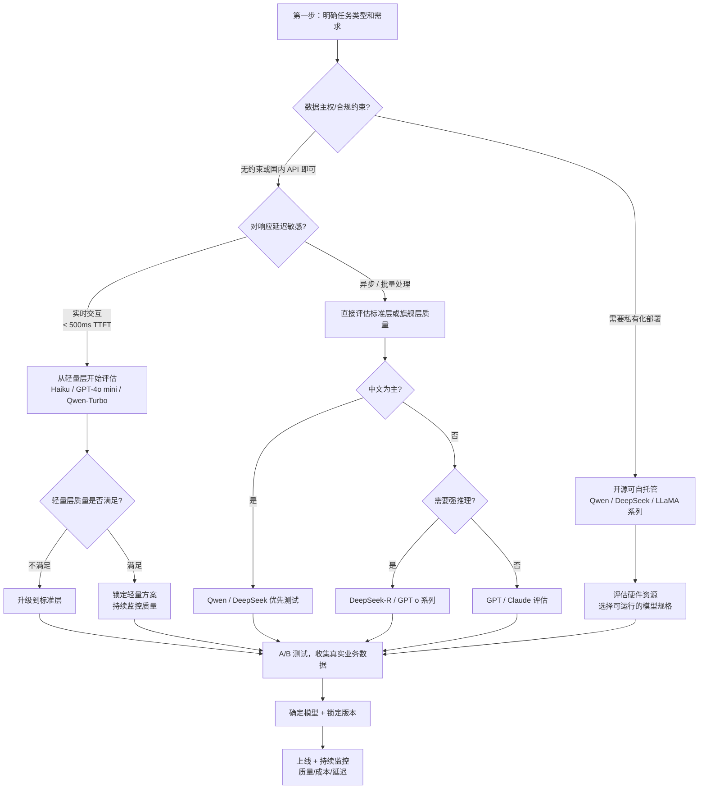

LLM 产品线日益丰富，每家厂商都提供从"轻量快速"到"旗舰强大"的多个版本，新模型几乎每月都有发布。在这种环境下，**系统化的选型框架**比盲目跟随最新旗舰模型更有价值。本文提供一套从任务分析到生产落地的完整决策流程。

> 本文只给出决策框架和定性分析，**不列具体跑分数字与价格**——这些数据变化快，以各官方最新文档和第三方评测（如 LMSYS Chatbot Arena、LiveCodeBench）为准。

## 选型的核心维度

### 1. 任务类型与难度

选型的第一步是**明确任务性质**，不同任务对模型能力的要求差异极大：

| 任务类型 | 具体举例 | 模型需求 |
|---------|---------|---------|
| 简单分类 / 提取 | 情感分析、关键词提取、格式转换 | 低，轻量模型即可 |
| 文本转换 | 翻译、改写、摘要、润色 | 中，对语言质量有要求 |
| 代码生成 / 审查 | 写函数、找 bug、代码补全 | 中高，需理解语义和语法 |
| 复杂推理 | 数学证明、多步逻辑、科学问答 | 高，需专项推理模型 |
| 长文档分析 | 合同审查、论文理解、代码库分析 | 超长 Context 能力 |
| 多轮 Agent | 工具调用、任务规划、流程编排 | 指令遵循、工具使用可靠性 |
| 中文业务 | 客服、内容生产、中文创作 | 强中文能力 |

**核心原则：用能完成任务的最小模型。** 更小的模型往往有更低的延迟和成本，在任务复杂度不需要旗舰能力时，这是显著优势。

### 2. 延迟与响应时间要求



**TTFT（Time to First Token）** 是实时对话体验的核心指标，代表用户发送消息到看到第一个字的时间。旗舰大模型的 TTFT 通常显著高于小模型，在流式输出场景下尤为重要。

**TBT（Time Between Tokens）** 代表每个后续 Token 的生成间隔，影响流式输出的"打字速度"感。

### 3. 成本预算

主流厂商的模型档位大致分为三层，命名规律可作参考：

| 档位 | 命名特征（非完整列举） | 定位 |
|------|---------------------|------|
| **轻量层** | mini、lite、turbo、haiku、flash | 最低成本，最快速度，高频低复杂度任务 |
| **标准层** | sonnet、plus、pro | 能力与成本的平衡点，覆盖大多数业务 |
| **旗舰层** | opus、max、4o、ultra | 最强能力，最高成本，高价值复杂任务 |

**常见误区：默认使用旗舰模型。** 实测中，许多任务（如简单 Q&A、内容提取、格式转换）用轻量层模型效果相差无几，但成本可相差 10-50 倍。

**Batch API（批量请求）**：大多数服务商提供批量异步处理接口，对延迟不敏感的任务（如离线数据处理、夜间批量分析）可进一步降低成本（通常 50% 折扣，以官方为准）。

### 4. 合规与数据主权

数据合规是企业场景下的硬约束，必须在技术选型前明确：



关键检查清单：
- 数据是否可以离开所在国家/地区？
- 是否需要 GDPR 数据处理协议（DPA）？
- 行业监管是否限制第三方 AI 服务使用（金融、医疗、政务）？
- 是否需要审计日志和数据留存？

### 5. 上下文长度需求

Context Window 大小决定了模型能处理的文档规模，这是能力上的硬约束：

| 场景 | 所需上下文 | 参考模型等级 |
|------|---------|------------|
| 普通对话 / 短文本任务 | < 8K tokens | 所有模型均支持 |
| 中等文档（如 API 文档） | 8K–32K tokens | 标准及以上 |
| 长篇报告 / 完整代码文件 | 32K–128K tokens | 需明确确认支持 |
| 书籍 / 大型代码库 / 超长对话 | > 128K tokens | Claude、Gemini 等长上下文专项 |

注意：声称支持某长度不等于在该长度下质量不变，超长上下文时注意"Lost in the Middle"效应（模型对中间内容的利用率下降）。

### 6. 语言与领域特化

| 需求 | 推荐方向 |
|------|---------|
| 中文为主 | Qwen、DeepSeek 在中文语义理解上有优势 |
| 英文代码 | GPT、Claude、DeepSeek-Coder 系列表现好 |
| 数学推理 | DeepSeek-R 系列、GPT o 系列等推理增强版 |
| 多模态（视觉/音频） | 需确认模型支持的模态类型 |
| 特定领域知识 | 考虑基于通用模型 Fine-tuning 或 RAG 增强 |

## 完整决策流程



## 版本管理策略

### 生产环境锁定版本

模型厂商会持续更新模型，即使是同名模型版本之间行为也可能发生变化（提示词响应方式、拒绝阈值、输出格式等）。**生产环境务必指定固定版本**：

```typescript
// 生产环境：指定精确版本，行为可预期
const PROD_MODEL = 'gpt-4o-2024-11-20'  // 固定版本
const PROD_CLAUDE = 'claude-opus-4-5-20251101'  // 固定版本

// 开发/测试环境：跟最新版本
const DEV_MODEL = 'gpt-4o'    // 浮动到最新版本
const DEV_CLAUDE = 'claude-opus-4-5'  // 浮动版本

// 推荐做法：用常量集中管理，方便统一升级
const MODEL_CONFIG = {
  production: {
    default: 'gpt-4o-2024-11-20',
    reasoning: 'o1-2024-12-17',
    fast: 'gpt-4o-mini-2024-07-18',
  },
  development: {
    default: 'gpt-4o',
    reasoning: 'o1',
    fast: 'gpt-4o-mini',
  },
}
```

### Model Routing（模型路由）

复杂系统中，**根据任务类型动态路由到最合适的模型**是成本优化的高效手段：

```typescript
interface TaskConfig {
  type: 'extraction' | 'reasoning' | 'generation' | 'longDocument'
  priority: 'cost' | 'quality' | 'speed'
  inputLength: number
  requiresChinese?: boolean
}

function selectModel(task: TaskConfig): string {
  // 超长文档 → Claude 长上下文
  if (task.inputLength > 100_000) {
    return 'claude-opus-4-5'
  }
  
  // 数学/代码推理 → 推理增强模型
  if (task.type === 'reasoning') {
    return task.priority === 'cost' ? 'deepseek-reasoner' : 'o1-mini'
  }
  
  // 简单提取/分类 → 轻量模型
  if (task.type === 'extraction') {
    return task.requiresChinese ? 'qwen-turbo' : 'gpt-4o-mini'
  }
  
  // 中文生成 → Qwen
  if (task.requiresChinese && task.priority === 'quality') {
    return 'qwen-plus'
  }
  
  // 默认标准模型
  return 'gpt-4o'
}

// 使用示例
const model = selectModel({
  type: 'extraction',
  priority: 'cost',
  inputLength: 2000,
  requiresChinese: false,
})
// → 'gpt-4o-mini'
```

## 系统化评估方法

不要依赖主观印象或单一测试案例做选型，应建立可重复的评估流程：

```mermaid
flowchart LR
    DS[构建评估数据集\n50-200 条真实业务 case] --> M[定义评估指标\n准确率/格式符合率/人工评分]
    M --> Run[多模型并行评估\n同一数据集跑候选模型]
    Run --> Curve[成本-质量曲线\n找"够用的最低成本点"]
    Curve --> Lock[锁定方案]
    Lock --> Reg[版本变更时\n回归测试]
```

**评估数据集构建原则：**
- 覆盖真实业务场景中的典型 case，而非教科书例子
- 包含边界 case（如空输入、超长输入、特殊字符）
- 每类任务至少 20-30 条，保证统计意义

**常见评估指标：**

| 指标 | 适用场景 | 测量方式 |
|------|---------|---------|
| 准确率（Accuracy） | 分类、提取、问答 | 与标准答案对比 |
| 格式符合率 | 结构化输出 | JSON 解析成功率 |
| 人工评分（1-5 分） | 生成类任务 | 双盲评审 |
| 延迟（P50/P95 TTFT） | 实时场景 | 压测工具 |
| Token 效率 | 成本敏感场景 | 每次请求平均 Token 数 |

## 常见误区

**追旗舰陷阱**：旗舰模型不一定适合每个任务。大量简单任务用轻量模型效果无差异，但成本相差数十倍。

**忽视延迟**：离线评测质量高，不等于实时场景体验好。高质量但慢的模型在实时场景中用户体验差。

**不锁版本**：厂商静默更新后行为可能改变，导致线上提示词失效或输出格式变化。生产环境务必锁版本。

**单一供应商依赖**：关键业务建议保持至少两个候选模型（主用 + 备用），应对 API 故障、涨价或服务中断。

```typescript
// 多供应商备份模式示例
async function callWithFallback(prompt: string): Promise<string> {
  const providers = [
    () => callOpenAI(prompt),
    () => callAnthropic(prompt),   // 备用
    () => callDeepSeek(prompt),    // 备用
  ]
  
  for (const provider of providers) {
    try {
      return await provider()
    } catch (error) {
      console.warn('Provider failed, trying next:', error)
    }
  }
  throw new Error('All providers failed')
}
```

**只看公开 Benchmark**：公开基准测试不等于业务场景表现。必须用自己的真实数据测试，"在 MMLU 上领先 2 分"对你的具体任务可能没有意义。

## 面试常问

- 如何在成本和质量之间做系统化权衡？给出一个实际决策流程。
- 生产环境中为什么要锁定模型版本，有哪些风险？
- 什么情况下应该考虑私有化部署而非调用 API？
- 如何构建一套 LLM 选型的评估流程？数据集怎么收集？
- Model Routing 是什么思路，有哪些常见实现方式？
- 多供应商备份策略在技术实现上有哪些挑战？

