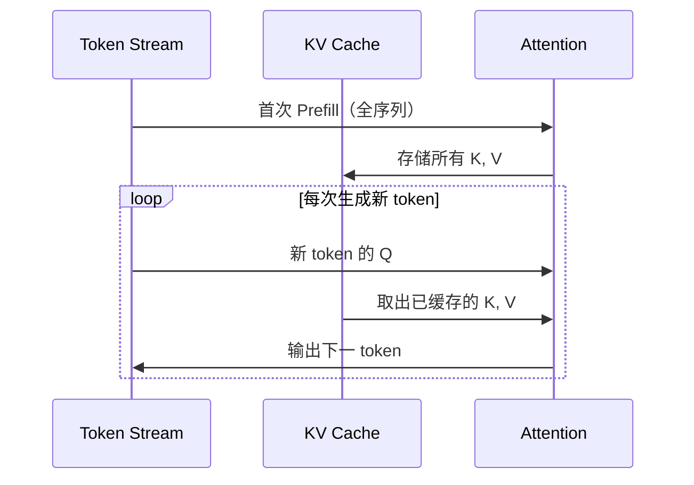

# Token、Context Window 与 KV Cache

Token 是 LLM 处理文本的最小单位，Context Window 决定模型能"记住"多长的上下文，KV Cache 是让推理变得高效的关键工程优化。三者共同决定了 LLM 的能力边界和使用成本。

## Token 是什么

LLM 不直接处理字符，而是将文本切分成 **token**（词元）。常用分词算法包括 BPE（Byte Pair Encoding）和 SentencePiece，它们把高频子词合并为单个 token。

几个经验规律：
- 英文：平均约 1 token ≈ 4 个字符，或约 ¾ 个单词
- 中文：通常 1 个汉字对应 1–2 个 token（因模型词表而异）
- 代码：标识符、缩进、括号都会消耗 token
- 特殊字符、生僻词往往被切成多个 token

```typescript
// 不同模型使用不同 tokenizer，token 数不直接可比
// 可用官方 tokenizer 工具（如 tiktoken、transformers tokenizer）预估
import { encoding_for_model } from 'tiktoken'

const enc = encoding_for_model('gpt-4o')
const tokens = enc.encode('你好，世界！Hello world.')
console.log(tokens.length) // 实际数量取决于分词方案
enc.free()
```

### Token 的实际影响

- **成本**：API 按 token 计费（输入/输出分开计价），prompt 越长越贵
- **速度**：输出 token 逐个生成，输出越多延迟越高
- **限制**：超出 context window 的内容会被截断或报错

## Context Window

Context Window（上下文窗口）是模型在单次推理中能处理的最大 token 数，通常包含 **system prompt + 历史对话 + 当前输入 + 输出空间**。

```
|←────────── Context Window ──────────────────────→|
| System Prompt | History | Current Input | Output  |
```

### 长上下文的挑战

即使模型声称支持很长的上下文，实际使用中仍存在：
- **"Lost in the Middle" 问题**：研究显示 LLM 对上下文中间位置的信息利用率低于开头和结尾
- **计算与显存瓶颈**：Self-Attention 复杂度 $O(n^2)$，长文本推理慢且成本高
- **有效长度 ≠ 声称长度**：超长上下文时模型的理解准确率往往下降

### 实践建议

- 将最关键的信息放在 prompt 的开头或结尾
- 使用 RAG（检索增强生成）替代"把整本书塞进 context"
- 监控 token 用量，避免不必要的历史消息堆积

## KV Cache

KV Cache 是 Transformer 推理的核心加速技术，理解它有助于更好地选择部署方案和解释延迟现象。

### 为什么需要 KV Cache

自回归生成时，模型每次生成新 token 都需要对整个已有序列做 Attention 运算。如果不缓存，前缀部分的 K（Key）和 V（Value）矩阵会被重复计算——代价极高。

KV Cache 的做法：**把每一层的 K、V 矩阵缓存在显存中**，新 token 只需计算自身的 Q，然后与已缓存的 K、V 做 Attention，避免重复计算。



### KV Cache 的代价

缓存大小与序列长度成正比。对于长上下文：

```
KV Cache 显存 ∝ 层数 × 序列长度 × 每层 KV 大小
```

这是为什么长上下文模型对 GPU 显存要求高，也是为什么云服务商对长上下文收费更高——显存是稀缺资源。

### Prefix Caching（前缀缓存）

主流推理框架（vLLM、TensorRT-LLM）和 API 服务商都支持 **Prefix Caching**：对于相同的前缀（如固定的 system prompt），将其 KV Cache 复用于多次请求，显著降低延迟和成本。

```typescript
// 利用 Prefix Caching 的实践建议：
// 1. 将固定 system prompt 放在最前面，且保持不变
// 2. 动态内容（用户历史、检索结果）放在后面
// 这样前缀的 KV Cache 可以在多次请求间复用

const systemPrompt = `你是一名专业的前端工程师助手...` // 固定，触发 cache
const userContext = `用户最近的问题: ${recentHistory}`   // 动态部分
```

## 三者的关联

| 概念 | 影响维度 | 开发者关注点 |
|------|---------|------------|
| Token | 成本、速度、限制 | 控制 prompt 长度，评估 token 用量 |
| Context Window | 能力上限 | 合理分配窗口空间，长文本用 RAG |
| KV Cache | 推理效率 | 固定前缀复用 cache，降低延迟成本 |

## 面试常问

- Token 和字符有什么区别？为什么计费以 token 为单位？
- Context Window 满了之后模型会怎样？
- KV Cache 缓存的是什么？为什么能加速推理？
- Prefill 阶段和 Decode 阶段分别做了什么，延迟来自哪里？
- 为什么长上下文推理比短上下文贵很多？
