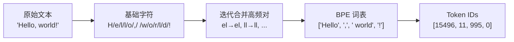
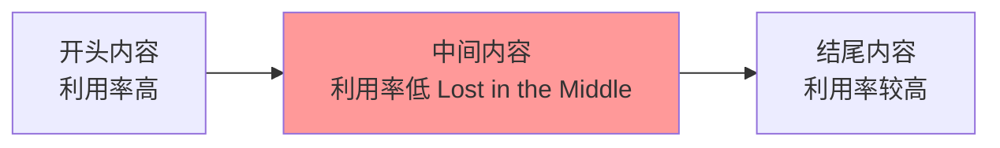
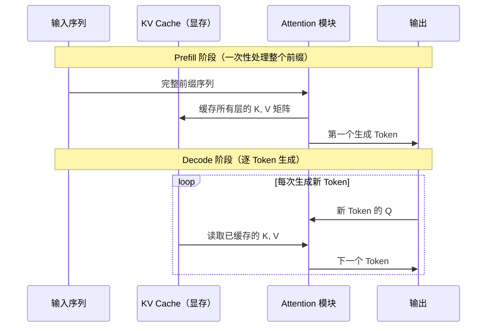
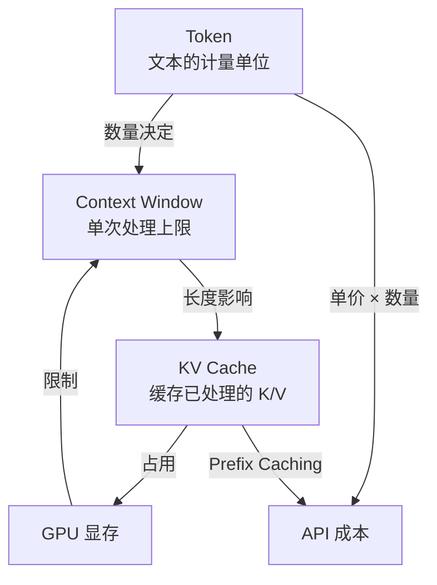

# Token、Context Window 与 KV Cache

Token 是 LLM 处理文本的最小单位，Context Window 决定模型在一次推理中能"看到"多长的上下文，KV Cache 则是让自回归推理从理论可行变为工程可用的关键优化。三者相互关联，共同决定了 LLM 的能力边界、延迟表现和使用成本。

## 什么是 Token

LLM 不直接处理字符或单词，而是将文本切分成**词元（Token）**。分词器（Tokenizer）负责完成这一转换：将原始文本转换为 Token ID 序列，推理完成后再将 ID 序列还原为文本。

### BPE：主流分词算法

**字节对编码（Byte-Pair Encoding，BPE）** 是 GPT 系列等主流模型使用的分词算法，核心思想是贪心合并：

1. 初始化词表为语料库中出现过的所有基本字符
2. 统计所有相邻 Token 对的出现频率
3. 将频率最高的 Token 对合并为一个新 Token，加入词表
4. 重复步骤 2-3，直到词表大小达到预设上限

这样，高频词（如 "the"、"agent"）成为完整的单 Token；罕见词则被拆分为多个子词 Token（如 "tokenization" → ["token", "ization"]）。



**SentencePiece**（Llama、Qwen 等使用）和 **WordPiece**（BERT 使用）是两种常见的变体：

| 算法 | 代表模型 | 特点 |
|------|---------|------|
| BPE | GPT 系列 | 贪心合并高频对，词表可控 |
| SentencePiece | LLaMA、Qwen | 将空格视为普通字符，无语言依赖，分词可逆 |
| WordPiece | BERT | 合并标准是最大化语言模型似然，而非频率 |

### Token 的计量规律

不同语言、不同内容的 Token 效率差异显著：

```
英文：~1 token ≈ 4 个字符，或约 ¾ 个单词
中文：通常 1 个汉字 ≈ 1–2 个 Token（因词表大小而异）
代码：标识符、缩进符、括号各自消耗 Token
特殊符号/生僻词：可能被切分为多个 Token
```

```typescript
// 用 tiktoken 统计 GPT 系列模型的 Token 数
import { encoding_for_model } from 'tiktoken'

const enc = encoding_for_model('gpt-4o')

const texts = [
  'Hello, world!',           // 英文
  '你好，世界！',             // 中文
  'function add(a, b) {}',   // 代码
]

for (const text of texts) {
  const tokens = enc.encode(text)
  console.log(`"${text}" → ${tokens.length} tokens`)
}
enc.free()

// 输出（近似）：
// "Hello, world!" → 4 tokens
// "你好，世界！" → 6 tokens
// "function add(a, b) {}" → 8 tokens
```

### Token 的实际影响

| 影响维度 | 说明 |
|---------|------|
| **API 成本** | 输入/输出 Token 分别计费，长 prompt 直接推高成本 |
| **输出延迟** | 自回归生成逐 Token 输出，Token 数决定生成时间 |
| **上下文限制** | 超出 Context Window 的内容被截断，信息丢失 |
| **模型理解** | 分词方式影响模型对词汇的理解，同义词可能 Token 化方式不同 |

**一个反直觉的陷阱**：模型对 `2 + 2` 和 `2+2` 的处理可能不同，因为它们的分词结果不同。同理，单词大小写也可能产生不同的 Token 序列，影响模型理解。

## Context Window（上下文窗口）

Context Window 是模型在**单次推理**中能处理的最大 Token 数。它不仅包含用户输入，还包括 System Prompt、历史对话和输出空间：

```
|←─────────────── Context Window（如 128K tokens）─────────────────→|
| System Prompt | 历史对话 | 检索文档 | 当前用户输入 | 输出预留空间 |
```

### 上下文长度的演进

| 时间 | 代表模型 | Context Window |
|------|---------|---------------|
| 2020 | GPT-3 | 2K tokens |
| 2023 | GPT-4 | 8K / 32K tokens |
| 2024 | Claude 3 | 200K tokens |
| 2024+ | Gemini 1.5 Pro | 1M tokens |
| 现在 | 部分模型 | 数百万 tokens |

窗口扩大带来的能力：分析长文档、维持超长对话历史、理解大型代码库等。

### 长上下文的实际挑战

即使模型支持超长 Context，使用中仍存在以下问题：

**"Lost in the Middle" 效应**：研究表明 LLM 对上下文中间位置的信息利用率低于开头和结尾。关键信息放在中间时，模型容易"忽略"。



**计算与显存瓶颈**：Self-Attention 复杂度为 $O(n^2)$，序列长度翻倍，计算量增加 4 倍，显存占用和推理时间急剧上升。

**有效长度 ≠ 声称长度**：部分模型在超长上下文时准确率下降，"能处理 100K tokens" 不等于"在 100K tokens 范围内仍准确"。

### 开发实践建议

- 将**最重要的信息放在 prompt 开头或结尾**，避免关键内容埋在中间
- 使用 **RAG（检索增强生成）** 替代将整个知识库塞入 context——先检索再注入
- 监控实际 Token 使用量，为输出预留足够空间（常见问题：context 接近上限时模型截断输出）
- 多轮对话时定期压缩历史，避免无关的早期对话消耗窗口空间

## KV Cache：推理加速的关键

KV Cache 是 Transformer 自回归推理的核心加速技术，理解它有助于解释延迟来源和成本结构。

### 为什么需要 KV Cache

自回归生成时，每次预测新 Token，模型都需要计算整个已有序列的 Self-Attention。如果不做缓存，每步推理都要对所有前缀 Token 重新计算 K（Key）和 V（Value）矩阵——代价随序列长度线性增加。

**KV Cache 的做法**：在 Prefill（预填充）阶段一次性计算所有前缀 Token 的 K、V 矩阵，并缓存在显存中。后续 Decode（解码）阶段每生成一个新 Token，只需计算该 Token 的 Q 向量，然后与已缓存的 K、V 做注意力计算。



### KV Cache 的显存代价

缓存大小与序列长度、层数、头数成正比：

$$\text{KV Cache 显存} \approx 2 \times \text{层数} \times \text{序列长度} \times d_\text{model} \times \text{精度字节数}$$

以 LLaMA-3 70B（fp16 精度）为例：
- 32 层，d_model = 8192
- 每 1K tokens 的 KV Cache ≈ **约 1.5 GB 显存**
- 128K tokens 上下文 ≈ 约 192 GB 显存

这解释了为什么长上下文模型对 GPU 显存要求极高，也是云服务商对长上下文收取更高费用的根本原因。

### 推理的两个阶段

| 阶段 | 操作 | 性能特征 |
|------|------|---------|
| **Prefill（预填充）** | 并行处理全部输入 Token，生成 KV Cache | 计算密集，时间与输入长度正相关 |
| **Decode（解码）** | 逐 Token 自回归生成 | 显存带宽密集，每步时间约相同 |

**TTFT（Time to First Token）**：Prefill 结束后用户看到第一个字的时间，是实时对话体验的核心指标。输入越长，TTFT 越高。

**TPS（Tokens Per Second）**：Decode 阶段的生成速度，取决于显存带宽。

### Prefix Caching（前缀缓存）

主流推理框架（vLLM、TensorRT-LLM）和主要 API 服务商都支持 **Prefix Caching**：对于**完全相同的前缀**（如固定的 System Prompt），其 KV Cache 在多次请求间复用，跳过 Prefill 阶段的重复计算。

```typescript
// 利用 Prefix Caching 的关键：固定前缀 + 动态后缀
const SYSTEM_PROMPT = `
你是一名专业的前端工程师助手。
你需要遵循以下规范：
1. 代码使用 TypeScript
2. 优先使用函数式写法
3. 避免全局变量
`.trim()
// ↑ 这段固定不变，第一次请求后会被 cache

// 动态部分放在 system prompt 之后
const messages = [
  { role: 'system', content: SYSTEM_PROMPT },  // 触发 Prefix Cache
  { role: 'user', content: userMessage },        // 每次不同
]

// 实践原则：
// 1. System Prompt 固定化，保持内容不变
// 2. 将动态内容（历史对话、检索结果）放在固定前缀之后
// 3. Claude、OpenAI 等 API 已自动支持，无需额外参数
```

**Prefix Caching 的收益**：
- 延迟：跳过 Prefill，TTFT 大幅降低
- 成本：部分 API 服务商对 cache hit 的 Token 收费更低（具体以官方为准）

## 三者的关联与工程权衡



| 概念 | 核心影响 | 工程关注点 |
|------|---------|-----------|
| **Token** | 成本、速度、上限 | 控制 prompt 长度，评估 token 用量 |
| **Context Window** | 能力边界、理解范围 | 合理分配窗口，长文本用 RAG 替代堆 context |
| **KV Cache** | 推理效率、显存占用 | 固定前缀触发 cache；长上下文评估显存需求 |

## 常见误区

- **"Context Window 大就一定好"**：更大的窗口意味着更高的显存消耗和更高的每次请求成本，且中间内容利用率低
- **"Prefix Caching 自动生效"**：只有完全相同的前缀才能命中缓存，前缀内容每次变化则 cache miss
- **"Token 数 ≈ 字数"**：中文场景下 Token 数通常多于汉字数，计费时以实际 Token 为准

## 面试常问

- Token 和字符有什么区别？为什么计费以 Token 为单位？
- BPE 和 WordPiece 的核心差异是什么？
- Context Window 满了会怎样？模型会报错还是截断？
- KV Cache 缓存的是什么？为什么能加速推理而不影响结果？
- Prefill 和 Decode 阶段的性能瓶颈分别是什么？
- 为什么长上下文推理比短上下文成本高得多？

> 部分内容参考《Hello-Agents》(datawhalechina) 整理。
