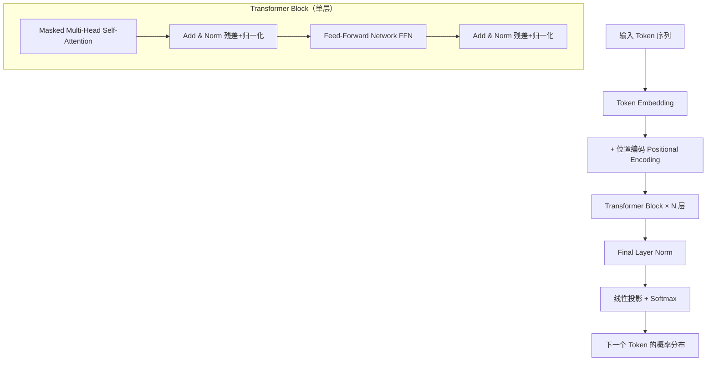
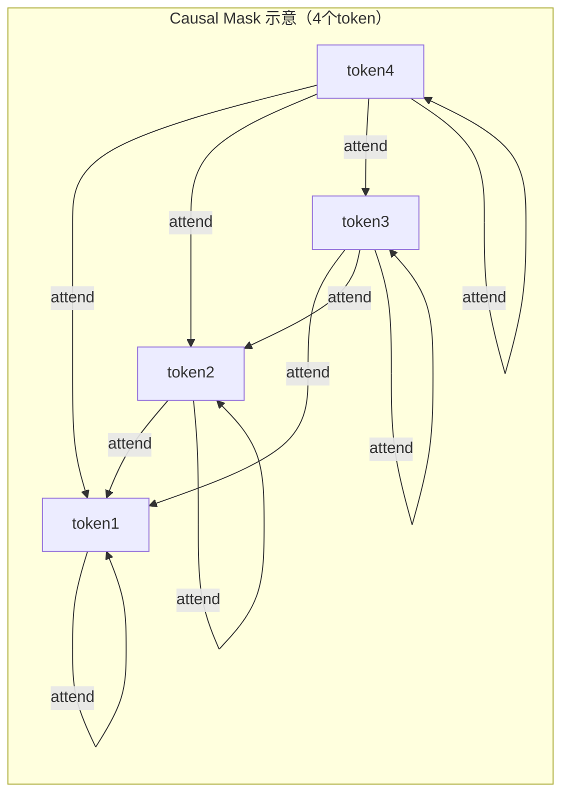
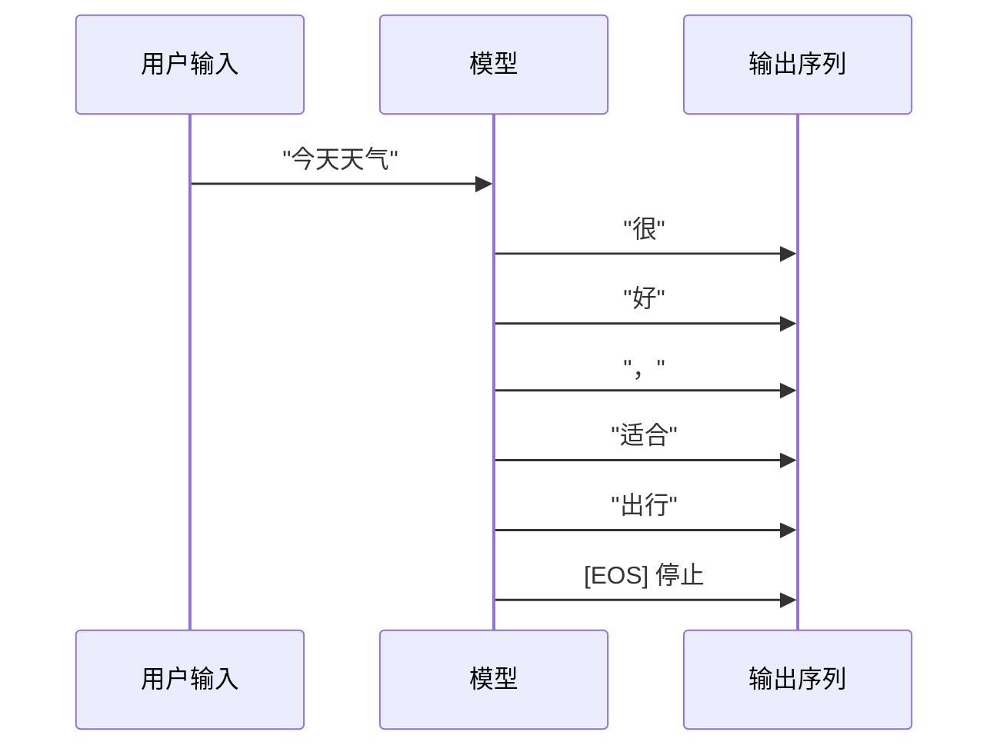

Transformer 是现代大语言模型的核心架构，由 2017 年论文《Attention Is All You Need》提出，彻底改变了序列建模的范式——它完全抛弃了 RNN/LSTM 的循环结构，依靠自注意力机制实现真正的并行计算，并成为 NLP 乃至多模态领域的主干网络。

## 为什么需要 Transformer

在 Transformer 出现之前，主流的序列模型是 RNN 和 LSTM。它们通过"隐藏状态"逐步传递信息，有两个根本缺陷：

1. **顺序依赖**：第 t 步必须等第 t-1 步完成，无法并行，训练极慢。
2. **长距离梯度问题**：序列越长，早期信息传递到末尾时梯度衰减越严重，长距离依赖难以学习。

Transformer 的核心创新是用**自注意力（Self-Attention）**替代循环，让序列中任意两个位置都能直接交互，彻底解决了这两个问题。

## 整体结构

原始 Transformer 是 Encoder-Decoder 架构，为机器翻译设计。当前主流 LLM（GPT、Claude、Qwen、DeepSeek 等）普遍采用纯 **Decoder-only** 架构。



每个 Transformer Block 的处理流程：输入先经过**掩码多头自注意力**，结果与输入做残差相加后归一化；再经过**前馈网络**，同样残差相加后归一化，输出传递给下一层。

## Self-Attention：核心机制

Self-Attention（自注意力）允许模型在处理每个 token 时，同时参考序列中所有其他 token，动态计算它们的重要性权重。

### Q、K、V 的直觉理解

对每个输入 token，通过三组独立的线性变换矩阵（$W^Q, W^K, W^V$）投影出三个向量：

| 向量 | 含义 | 类比 |
|------|------|------|
| **Q（Query，查询）** | 当前 token 想要获取什么信息 | 搜索请求 |
| **K（Key，键）** | 每个 token 对外"暴露"的索引标签 | 搜索引擎的关键词索引 |
| **V（Value，值）** | 匹配命中后实际取出的信息内容 | 搜索结果的正文 |

### 缩放点积注意力公式

$$\text{Attention}(Q, K, V) = \text{softmax}\!\left(\frac{QK^T}{\sqrt{d_k}}\right)V$$

计算步骤：
1. 计算相关性得分：$Q \cdot K^T$（每个查询与所有键做点积）
2. 缩放：除以 $\sqrt{d_k}$，防止向量维度高时点积值过大导致 softmax 梯度消失
3. Softmax 归一化：得到和为 1 的注意力权重
4. 加权聚合：用权重对 V 求加权和，得到包含上下文信息的新表示

```python
import torch
import math

def scaled_dot_product_attention(Q, K, V, mask=None):
    """
    Q, K, V: (batch, heads, seq_len, d_k)
    mask: 因果掩码，上三角置 -inf，防止看到未来 token
    """
    d_k = Q.size(-1)
    # 计算注意力分数
    scores = torch.matmul(Q, K.transpose(-2, -1)) / math.sqrt(d_k)
    
    if mask is not None:
        scores = scores.masked_fill(mask == 0, float('-inf'))
    
    # softmax 归一化
    attn_weights = torch.softmax(scores, dim=-1)
    
    # 加权求和
    output = torch.matmul(attn_weights, V)
    return output
```

### Causal Mask（因果掩码）

Decoder-only 模型在训练时，每个位置**只能 attend 到自身及之前的 token**，不能看到未来。实现方式是在 attention 分数矩阵上叠加一个上三角掩码（将未来位置置为 $-\infty$，softmax 后趋近于 0）。

这保证了训练和推理的一致性——推理时模型本来就只有已生成的前缀，不存在未来 token。



## Multi-Head Attention（多头注意力）

单一注意力头只能从一个"视角"捕捉关系（如指代关系）。Multi-Head Attention 将模型维度 $d_{model}$ 切分成 $h$ 份，每份独立计算一次注意力，最后拼接再投影：

$$\text{MultiHead}(Q, K, V) = \text{Concat}(\text{head}_1, \ldots, \text{head}_h) \cdot W^O$$

$$\text{head}_i = \text{Attention}(QW_i^Q, KW_i^K, VW_i^V)$$

```python
class MultiHeadAttention(torch.nn.Module):
    def __init__(self, d_model: int, num_heads: int):
        super().__init__()
        assert d_model % num_heads == 0
        self.d_k = d_model // num_heads
        self.num_heads = num_heads
        # 合并 Q/K/V 的线性变换，一次计算
        self.W_q = torch.nn.Linear(d_model, d_model)
        self.W_k = torch.nn.Linear(d_model, d_model)
        self.W_v = torch.nn.Linear(d_model, d_model)
        self.W_o = torch.nn.Linear(d_model, d_model)

    def forward(self, x, mask=None):
        B, L, D = x.shape
        # 投影并切分多头：(B, L, D) → (B, heads, L, d_k)
        Q = self.W_q(x).view(B, L, self.num_heads, self.d_k).transpose(1, 2)
        K = self.W_k(x).view(B, L, self.num_heads, self.d_k).transpose(1, 2)
        V = self.W_v(x).view(B, L, self.num_heads, self.d_k).transpose(1, 2)
        
        attn_out = scaled_dot_product_attention(Q, K, V, mask)
        
        # 合并多头：(B, heads, L, d_k) → (B, L, D)
        attn_out = attn_out.transpose(1, 2).contiguous().view(B, L, D)
        return self.W_o(attn_out)
```

**多头的意义**：不同的头可以并行关注不同类型的关系——有的头捕捉语法结构，有的头关注指代关系，有的头追踪实体信息。这极大增强了模型的表达能力。

## Feed-Forward Network（FFN）

每个 Transformer Block 在 Attention 子层后都跟一个逐位置前馈网络（Position-wise FFN）：

$$\text{FFN}(x) = \max(0, xW_1 + b_1) W_2 + b_2$$

关键特性：
- **逐位置**：FFN 独立作用于序列中每个位置的向量，不同位置之间没有交互（位置间的交互已由 Attention 负责）
- **升维再降维**：中间维度 $d_{ff}$ 通常是 $d_{model}$ 的 4 倍，先扩展再压缩，增强特征提取能力
- **存储知识**：研究表明 FFN 的参数承载了模型的大量"事实性知识"，而 Attention 更多负责"路由"

现代模型（LLaMA、Qwen 等）常用 **SwiGLU** 替代 ReLU，效果更好：

$$\text{SwiGLU}(x, W, V, b, c) = \text{Swish}(xW + b) \odot (xV + c)$$

## 残差连接与 Layer Norm

每个子层（Attention、FFN）都被 **Add & Norm** 包裹：

$$\text{output} = \text{LayerNorm}(x + \text{Sublayer}(x))$$

- **残差连接（Add）**：梯度反向传播时可以跳过子层直接流向更早的层，缓解深层网络的梯度消失问题
- **Layer Normalization（Norm）**：对每个样本的特征维度做归一化，稳定训练过程

现代 LLM 多采用 **Pre-Norm**（归一化在子层之前）而非原论文的 Post-Norm，训练更稳定：

```python
# Pre-Norm（现代 LLM 主流）
x = x + self_attn(layer_norm1(x))
x = x + ffn(layer_norm2(x))

# Post-Norm（原始论文）
x = layer_norm(x + self_attn(x))
x = layer_norm(x + ffn(x))
```

## 位置编码

Transformer 的自注意力天然无序——对模型来说 "agent learns" 和 "learns agent" 等价。位置编码（Positional Encoding）向每个 token 的嵌入向量注入位置信息。

### 原始正弦位置编码

$$PE_{(pos, 2i)} = \sin\!\left(\frac{pos}{10000^{2i/d_\text{model}}}\right), \quad PE_{(pos, 2i+1)} = \cos\!\left(\frac{pos}{10000^{2i/d_\text{model}}}\right)$$

特点：固定、不可学习，不同频率的正弦波叠加，理论上可以外推到任意长度。

### RoPE（旋转位置编码）

现代 LLM（LLaMA、Qwen、DeepSeek 等）主流选择。核心思想：不是将位置编码加到词向量上，而是**在 Q/K 的点积计算时，以旋转矩阵的形式注入相对位置信息**。

优点：
- 只编码相对位置，模型更关注 token 间的距离而非绝对位置
- 支持上下文长度外推（YaRN、Dynamic NTK 等扩展技术均基于 RoPE）

| 编码方式 | 代表模型 | 特点 |
|--------|---------|------|
| 正弦固定编码 | 原始 Transformer | 简单，难以外推 |
| 可学习绝对编码 | GPT-2、BERT | 灵活，受训练长度限制 |
| **RoPE** | LLaMA、Qwen、DeepSeek | 相对位置、长上下文友好 |
| ALiBi | BLOOM | 线性偏置，无参数 |

## Decoder-only 与自回归生成

当前主流 LLM 均为 Decoder-only 架构，其生成方式称为**自回归（Autoregressive）生成**：



每次生成一个 token，将其拼接到输入序列末尾，再次输入模型预测下一个。这种方式的优点：
- **训练目标统一**：只需"预测下一个 token"，可在无限量无标注文本上预训练
- **架构简洁易扩展**：去掉了 Encoder 和 Cross-Attention，更容易扩展到千亿参数规模
- **天然契合生成任务**：对话、写作、代码生成都是"给定前文续写"的变体

Decoder-only 与完整 Encoder-Decoder 的对比：

| 维度 | Decoder-only | Encoder-Decoder |
|------|-------------|-----------------|
| 代表模型 | GPT、Claude、LLaMA | T5、BART、原始 Transformer |
| 擅长任务 | 通用生成、对话 | 翻译、摘要（输入输出独立） |
| 训练目标 | 下一个 token 预测（LM） | 序列到序列（Seq2Seq） |
| 参数效率 | 更高（不重复编码） | 对特定任务优化更充分 |

## 计算复杂度与工程含义

Self-Attention 对序列长度 $n$ 的计算复杂度为 $O(n^2 \cdot d)$——每个位置都要与其他所有位置计算注意力。这是长上下文的核心瓶颈：

- 序列长度翻倍 → 计算量增加 4 倍
- 长文本推理慢且昂贵，也是 KV Cache 存在的动机（详见 llm-token-context.md）

## 常见误区与最佳实践

**误区：**
- "Transformer = BERT"：BERT 是双向 Encoder，GPT 是单向 Decoder-only，架构目标完全不同
- "注意力头越多越好"：头数需与模型维度匹配（$d_{model} / h$ 至少 32-64），盲目增加头数反而分散注意力
- "FFN 是简单的分类头"：FFN 参数量通常占模型总量的 2/3，承载核心知识

**最佳实践：**
- 理解 Causal Mask 对推理的影响，有助于解释为什么 prompt 前缀比后缀影响更大
- 选模型时，RoPE 支持与否决定了能否用外推技术拓展上下文长度
- Pre-Norm 架构比 Post-Norm 训练更稳定，是现代大模型的标配

## 面试常问

- Self-Attention 的计算复杂度是 $O(n^2)$，具体是哪里产生了平方项？
- Multi-Head Attention 相比单头有何优势？实际如何实现"多头"？
- 为什么 Decoder-only 架构主导了现代 LLM，而不是 Encoder-Decoder？
- RoPE 与绝对位置编码相比，为什么更适合长上下文？
- 残差连接解决了什么问题？Pre-Norm 和 Post-Norm 的区别？

