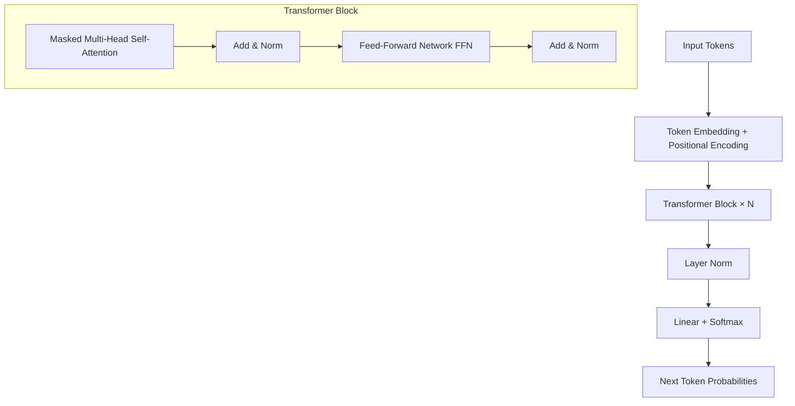

# Transformer 架构原理

Transformer 是现代大语言模型的核心架构，由 2017 年论文《Attention Is All You Need》提出，彻底取代了 RNN/LSTM，成为 NLP 乃至多模态领域的主干网络。理解它的工作方式，是读懂 LLM 行为和局限的基础。

## 整体结构

标准 Transformer 由 **Encoder** 和 **Decoder** 两部分组成，但当前主流 LLM（如 GPT 系列、Claude、Qwen、DeepSeek）普遍采用纯 Decoder 架构（Decoder-only）。下文以 Decoder-only 为主线说明。



## 核心机制：Self-Attention

Self-Attention 让模型在处理每个 token 时，能够"看到"序列中其他所有 token 并分配权重，从而捕捉长距离依赖关系。

### Q / K / V 的直觉

对于输入序列中的每个 token，线性投影出三个向量：
- **Q（Query）**：当前 token 想要查什么
- **K（Key）**：其他 token 提供的"索引标签"
- **V（Value）**：命中后实际取出的信息

注意力分数计算：

$$\text{Attention}(Q, K, V) = \text{softmax}\!\left(\frac{QK^T}{\sqrt{d_k}}\right)V$$

除以 $\sqrt{d_k}$ 是为了防止点积过大导致 softmax 梯度消失。

### Masked Attention（因果掩码）

Decoder-only 模型在训练时采用 **Causal Mask**：每个位置只能 attend 到它自身及之前的 token，保证自回归生成的合法性。推理时逐 token 生成，也天然满足此约束。

### Multi-Head Attention

将 Q/K/V 拆成多个"头"并行计算，再拼接输出：

```python
# 伪代码示意
heads = [attention(Q_i, K_i, V_i) for i in range(num_heads)]
output = linear(concat(heads))
```

多头允许模型从不同子空间同时捕捉语义、句法、指代等不同类型的关系。

## Feed-Forward Network（FFN）

每个 Transformer Block 在 Attention 之后都跟一个两层全连接网络，通常宽度是模型维度的 4 倍（或更大）。FFN 被认为负责存储知识（"记忆槽"），而 Attention 负责路由信息。

## 位置编码

Transformer 本身不感知顺序，需要额外注入位置信息：
- **绝对位置编码（Sinusoidal / Learned）**：早期 BERT/GPT 使用
- **RoPE（Rotary Position Embedding）**：现代 LLM（LLaMA、Qwen、DeepSeek）主流选择，支持长上下文外推
- **ALiBi**：通过在 attention 分数上加线性偏置实现，天然适应变长序列

## 残差连接与 Layer Norm

每个子层（Attention、FFN）都有残差连接（`x = x + sublayer(x)`），加上 Layer Normalization，解决深层网络训练不稳定问题。现代模型多用 **Pre-Norm**（Norm 在子层之前），比 Post-Norm 更稳定。

## 规模化：参数量与层数

模型参数量主要由以下因素决定：
- 层数（depth）× 每层参数（attention 投影矩阵 + FFN 矩阵）
- 词表大小 × 隐藏维度（Embedding 层）

参数量级从数亿到数千亿不等，但架构设计原则高度一致。

## 实践与面试视角

**常见误区：**
- Transformer 不等于 BERT，也不等于 GPT；三者都是 Transformer 变体，但用途（双向理解 vs 自回归生成）和训练目标不同。
- Attention 的时间复杂度是 $O(n^2)$（n 为序列长度），这是长上下文的瓶颈，KV Cache 和稀疏 Attention 都是在解决这个问题。
- FFN 并非简单的"分类头"，其参数量通常占整个模型的大头（约 2/3）。

**面试常问：**
- Self-Attention 的计算复杂度是多少，为什么长文本慢？
- Multi-Head Attention 相比 Single-Head 有什么优势？
- Decoder-only 和 Encoder-Decoder 架构分别适合什么任务？
- RoPE 为什么比绝对位置编码更适合长上下文？
- 残差连接在深层网络中解决了什么问题？
