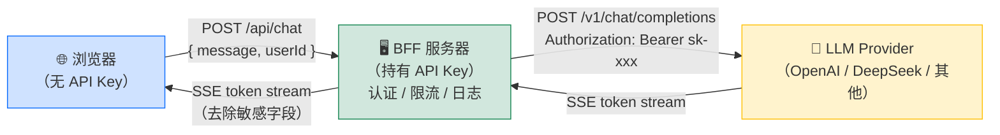
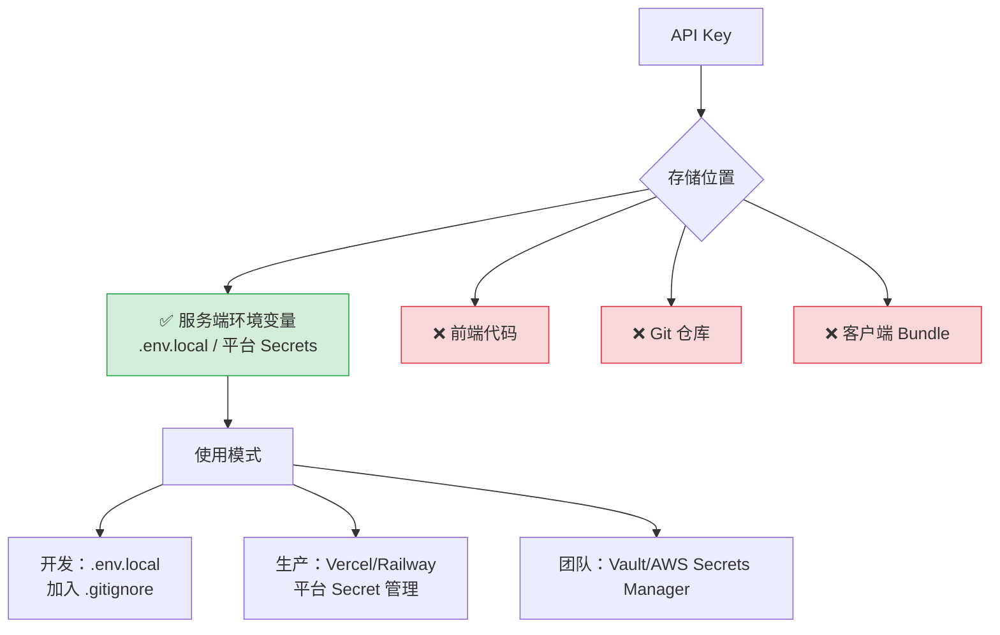
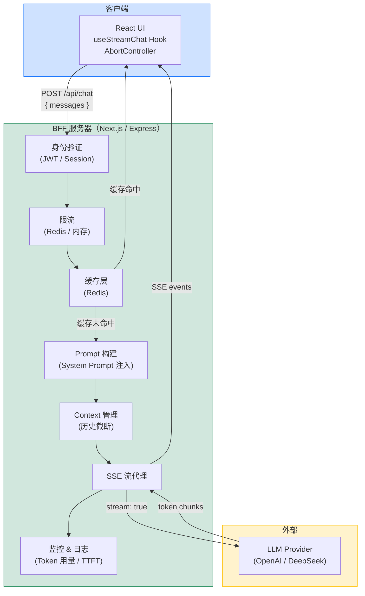

大模型（LLM）正在成为现代 Web 应用的核心能力之一。对前端开发者而言，理解如何安全、高效地将 LLM 集成进来，既是竞争力的体现，也是面试高频考点。

## 黄金法则：永远不要在浏览器中直接调用 LLM API

这是集成大模型的第一原则，没有例外。

```typescript
// ❌ 极度危险：API Key 暴露在客户端
const response = await fetch('https://api.openai.com/v1/chat/completions', {
  method: 'POST',
  headers: {
    'Authorization': 'Bearer sk-xxxxxxxx', // 任何人打开 DevTools 都能看到
    'Content-Type': 'application/json',
  },
  body: JSON.stringify({ model: 'gpt-4o', messages }),
});
```

**为什么绝对不行：**
- API Key 会出现在浏览器 Network 面板、打包产物、JS 源码中
- 攻击者只需 F12 即可提取 Key，随后无限调用，产生巨额账单
- 无法在客户端做身份验证、限流、审计
- 即使通过环境变量注入（如 Vite 的 `import.meta.env`），打包后依然嵌入在 bundle 中

## BFF 代理架构

正确的架构是 BFF（Backend for Frontend，前端专属后端）模式：浏览器只与自己的后端通信，API Key 永远不离开服务端。



BFF 层的职责：
- **认证**：验证用户身份（JWT、Session），拒绝未登录请求
- **限流**：每用户每分钟最多 N 次请求，防滥用
- **日志审计**：记录请求/响应用于监控和合规
- **Prompt 注入**：在服务端拼接 system prompt，前端无法绕过
- **成本控制**：限制 max_tokens，阻断异常大的请求

## BFF 实现模式

### Express 代理

```typescript
import express from 'express';
import OpenAI from 'openai';

const app = express();
app.use(express.json());

const openai = new OpenAI({
  apiKey: process.env.OPENAI_API_KEY, // 只在服务端存在
});

// 简单的内存限流（生产环境用 Redis）
const rateLimitMap = new Map<string, number[]>();

function checkRateLimit(userId: string, maxPerMinute = 10): boolean {
  const now = Date.now();
  const timestamps = (rateLimitMap.get(userId) ?? []).filter(
    (t) => now - t < 60_000
  );
  if (timestamps.length >= maxPerMinute) return false;
  timestamps.push(now);
  rateLimitMap.set(userId, timestamps);
  return true;
}

app.post('/api/chat', async (req, res) => {
  // 1. 身份验证（示意，实际使用 JWT 中间件）
  const userId = req.headers['x-user-id'] as string;
  if (!userId) return res.status(401).json({ error: 'Unauthorized' });

  // 2. 限流检查
  if (!checkRateLimit(userId)) {
    return res.status(429).json({ error: '请求过于频繁，请稍后再试' });
  }

  const { message } = req.body as { message: string };

  // 3. 设置 SSE 响应头
  res.setHeader('Content-Type', 'text/event-stream');
  res.setHeader('Cache-Control', 'no-cache');
  res.setHeader('X-Accel-Buffering', 'no');

  try {
    const stream = await openai.chat.completions.create({
      model: 'gpt-4o-mini',
      messages: [
        { role: 'system', content: '你是一个专业助手，请礼貌、准确地回答问题。' },
        { role: 'user', content: message },
      ],
      stream: true,
      max_tokens: 2048,
    });

    for await (const chunk of stream) {
      const delta = chunk.choices[0]?.delta?.content;
      if (delta) {
        res.write(`data: ${JSON.stringify({ content: delta })}\n\n`);
      }
    }
    res.write('data: [DONE]\n\n');
  } catch (err) {
    res.write(`data: ${JSON.stringify({ error: 'LLM 请求失败' })}\n\n`);
  } finally {
    res.end();
  }
});
```

### Next.js App Router Route Handler

```typescript
// app/api/chat/route.ts
import { NextRequest, NextResponse } from 'next/server';
import OpenAI from 'openai';
import { getServerSession } from 'next-auth'; // 示意

const openai = new OpenAI({ apiKey: process.env.OPENAI_API_KEY });

export async function POST(req: NextRequest) {
  // 身份验证
  const session = await getServerSession();
  if (!session?.user) {
    return NextResponse.json({ error: 'Unauthorized' }, { status: 401 });
  }

  const { messages } = await req.json() as {
    messages: OpenAI.Chat.ChatCompletionMessageParam[];
  };

  const encoder = new TextEncoder();

  const stream = new ReadableStream({
    async start(controller) {
      try {
        const llmStream = await openai.chat.completions.create({
          model: 'gpt-4o-mini',
          messages: [
            { role: 'system', content: '你是一个专业助手。' },
            ...messages,
          ],
          stream: true,
          max_tokens: 2048,
        });

        for await (const chunk of llmStream) {
          const delta = chunk.choices[0]?.delta?.content;
          if (delta) {
            controller.enqueue(
              encoder.encode(`data: ${JSON.stringify({ content: delta })}\n\n`)
            );
          }
        }
        controller.enqueue(encoder.encode('data: [DONE]\n\n'));
      } catch {
        controller.enqueue(
          encoder.encode(`data: ${JSON.stringify({ error: '请求失败' })}\n\n`)
        );
      } finally {
        controller.close();
      }
    },
  });

  return new Response(stream, {
    headers: {
      'Content-Type': 'text/event-stream',
      'Cache-Control': 'no-cache',
    },
  });
}
```

### Vercel / Cloudflare Workers Edge Functions

```typescript
// Vercel Edge Function (app/api/chat/route.ts with edge runtime)
export const runtime = 'edge';

import OpenAI from 'openai';

const openai = new OpenAI({ apiKey: process.env.OPENAI_API_KEY });

export async function POST(req: Request) {
  const { message } = await req.json() as { message: string };

  const response = await openai.chat.completions.create({
    model: 'gpt-4o-mini',
    messages: [{ role: 'user', content: message }],
    stream: true,
  });

  // OpenAI SDK 返回的 stream 可直接用于 Response（以官方文档为准）
  return new Response(response.toReadableStream(), {
    headers: {
      'Content-Type': 'text/event-stream',
      'Cache-Control': 'no-cache',
    },
  });
}
```

## API Key 安全管理



**Key 轮换策略**：
- 定期（建议每季度）主动轮换 API Key
- 发现泄露立即吊销旧 Key，生成新 Key
- 检查 git 历史记录：`git log -p | grep 'sk-'`，如有泄露需强制推送清理历史
- 在 LLM Provider 平台设置用量预警，账单异常时第一时间告警

## 流式 UI 实现

### React useStreamChat Hook

```typescript
import { useState, useRef, useCallback, useEffect } from 'react';

interface Message {
  role: 'user' | 'assistant';
  content: string;
  isStreaming?: boolean;
}

export function useStreamChat() {
  const [messages, setMessages] = useState<Message[]>([]);
  const [isStreaming, setIsStreaming] = useState(false);
  const [error, setError] = useState<string | null>(null);
  const abortRef = useRef<AbortController | null>(null);

  // 组件卸载时取消进行中的请求
  useEffect(() => {
    return () => { abortRef.current?.abort(); };
  }, []);

  const sendMessage = useCallback(async (userInput: string) => {
    if (isStreaming || !userInput.trim()) return;

    abortRef.current?.abort();
    const controller = new AbortController();
    abortRef.current = controller;

    const userMessage: Message = { role: 'user', content: userInput };
    const currentMessages = [...messages, userMessage];

    setMessages([...currentMessages, { role: 'assistant', content: '', isStreaming: true }]);
    setIsStreaming(true);
    setError(null);

    try {
      const response = await fetch('/api/chat', {
        method: 'POST',
        headers: { 'Content-Type': 'application/json' },
        body: JSON.stringify({ messages: currentMessages }),
        signal: controller.signal,
      });

      if (!response.ok) {
        throw new Error(await getErrorMessage(response));
      }
      if (!response.body) throw new Error('No stream');

      const reader = response.body.getReader();
      const decoder = new TextDecoder();
      let buffer = '';

      while (true) {
        const { done, value } = await reader.read();
        if (done) break;

        buffer += decoder.decode(value, { stream: true });
        const lines = buffer.split('\n');
        buffer = lines.pop() ?? '';

        for (const line of lines) {
          if (!line.startsWith('data: ')) continue;
          const payload = line.slice(6).trim();
          if (payload === '[DONE]') break;
          try {
            const { content, error: streamError } = JSON.parse(payload) as {
              content?: string;
              error?: string;
            };
            if (streamError) throw new Error(streamError);
            if (content) {
              setMessages((prev) => {
                const updated = [...prev];
                const last = updated[updated.length - 1];
                if (last.role === 'assistant') {
                  updated[updated.length - 1] = {
                    ...last,
                    content: last.content + content,
                  };
                }
                return updated;
              });
            }
          } catch { /* 忽略非 JSON */ }
        }
      }

      // 流结束后移除 isStreaming 标记
      setMessages((prev) => {
        const updated = [...prev];
        const last = updated[updated.length - 1];
        if (last.role === 'assistant') {
          updated[updated.length - 1] = { ...last, isStreaming: false };
        }
        return updated;
      });
    } catch (err) {
      if (err instanceof Error && err.name === 'AbortError') return;
      const msg = err instanceof Error ? err.message : '请求失败';
      setError(msg);
      // 移除不完整的 assistant 消息
      setMessages((prev) =>
        prev[prev.length - 1]?.isStreaming ? prev.slice(0, -1) : prev
      );
    } finally {
      setIsStreaming(false);
    }
  }, [messages, isStreaming]);

  const stopStream = useCallback(() => {
    abortRef.current?.abort();
    setIsStreaming(false);
  }, []);

  return { messages, isStreaming, error, sendMessage, stopStream };
}

async function getErrorMessage(response: Response): Promise<string> {
  try {
    const data = await response.json() as { error?: string };
    return data.error ?? `HTTP ${response.status}`;
  } catch {
    return `HTTP ${response.status}`;
  }
}
```

## 错误处理与降级策略

```typescript
// 服务端统一错误处理
async function callLLMWithFallback(
  messages: OpenAI.Chat.ChatCompletionMessageParam[]
) {
  const primaryClient = new OpenAI({
    apiKey: process.env.OPENAI_API_KEY,
  });

  try {
    return await primaryClient.chat.completions.create({
      model: 'gpt-4o-mini',
      messages,
      max_tokens: 1024,
    });
  } catch (error) {
    if (error instanceof OpenAI.APIError) {
      // 429: 限流 → 等待重试或切换模型
      if (error.status === 429) {
        await new Promise((r) => setTimeout(r, 2000));
        // 可切换到备用 Provider（如 DeepSeek）
      }

      // 503: 服务不可用 → 降级响应
      if (error.status === 503 || error.status === 500) {
        return null; // 返回 null，前端显示"服务暂时不可用"
      }
    }
    throw error;
  }
}

// 前端接收到错误事件时的处理
function handleStreamError(errorMsg: string): string {
  const errorMap: Record<string, string> = {
    'rate_limit': '请求太频繁，请稍候再试',
    'insufficient_quota': 'AI 服务暂时不可用',
    'Stream failed': '生成过程中断，请重试',
  };

  for (const [key, friendly] of Object.entries(errorMap)) {
    if (errorMsg.includes(key)) return friendly;
  }
  return '出错了，请重试';
}
```

## Context Window 管理

多轮对话时，历史消息全部计入输入 token，需要主动管理避免超出上下文窗口。

### 策略对比

| 策略 | 实现复杂度 | Token 效率 | 信息保留度 | 适合场景 |
|---|---|---|---|---|
| 滑动窗口（保留最近 N 轮） | 低 | 高 | 中 | 大多数聊天应用 |
| 摘要压缩（旧对话摘要化） | 中-高 | 高 | 高 | 长会话、客服系统 |
| 重要消息钉选 | 中 | 高 | 很高 | 代码审查、文档问答 |
| RAG 动态注入 | 高 | 很高 | 很高 | 知识库问答 |

### 滑动窗口实现

```typescript
interface Message {
  role: 'system' | 'user' | 'assistant';
  content: string;
}

/**
 * 粗略估算 token 数（英文约 4 字符/token，中文约 1.5 字符/token）
 * 仅用于近似判断，精确计数需用 tiktoken 库（以官方文档为准）
 */
function estimateTokens(text: string): number {
  const chineseChars = (text.match(/[一-鿿]/g) ?? []).length;
  const otherChars = text.length - chineseChars;
  return Math.ceil(chineseChars / 1.5 + otherChars / 4);
}

function truncateHistory(
  messages: Message[],
  systemPrompt: string,
  maxContextTokens: number
): Message[] {
  const systemTokens = estimateTokens(systemPrompt);
  // 为输出预留空间
  const availableTokens = maxContextTokens - systemTokens - 512;

  let usedTokens = 0;
  const retained: Message[] = [];

  // 从最新的消息开始向前保留
  for (let i = messages.length - 1; i >= 0; i--) {
    const tokens = estimateTokens(messages[i].content);
    if (usedTokens + tokens > availableTokens) break;
    usedTokens += tokens;
    retained.unshift(messages[i]);
  }

  return [
    { role: 'system', content: systemPrompt },
    ...retained,
  ];
}
```

## 缓存策略

```typescript
// 简单的内存缓存（生产用 Redis）
const responseCache = new Map<string, { content: string; expireAt: number }>();

async function cachedChat(
  message: string,
  ttlMs = 5 * 60 * 1000 // 5 分钟
): Promise<string> {
  const cacheKey = message.trim().toLowerCase();
  const cached = responseCache.get(cacheKey);

  if (cached && Date.now() < cached.expireAt) {
    return cached.content;
  }

  const content = await callLLM(message);
  responseCache.set(cacheKey, {
    content,
    expireAt: Date.now() + ttlMs,
  });

  return content;
}

// 语义缓存思路（Semantic Cache）：
// 将 prompt 向量化后存储，新请求与已有 prompt 做相似度匹配
// 相似度超过阈值（如 0.95）时直接返回缓存结果
// 实现较复杂，适合高流量场景
```

## 成本控制

```typescript
// 按任务复杂度选择模型
type TaskComplexity = 'simple' | 'medium' | 'complex';

function selectModel(complexity: TaskComplexity): string {
  // 具体模型 ID 以各 Provider 官方文档为准
  const modelMap: Record<TaskComplexity, string> = {
    simple: 'gpt-4o-mini',    // 分类、提取、简单问答
    medium: 'gpt-4o',         // 代码生成、内容创作
    complex: 'o1-mini',       // 数学推理、逻辑分析
  };
  return modelMap[complexity];
}

// 输入 token 优化：压缩 system prompt
const COMPACT_SYSTEM_PROMPT = '你是专业助手，给出简洁准确的回答。'; // 比长段描述节省 token

// 请求去重：防止同一用户快速重复提交同一问题
const pendingRequests = new Map<string, Promise<string>>();

async function deduplicatedChat(userId: string, message: string): Promise<string> {
  const key = `${userId}:${message}`;
  if (pendingRequests.has(key)) {
    return pendingRequests.get(key)!; // 复用进行中的请求
  }
  const promise = callLLM(message).finally(() => pendingRequests.delete(key));
  pendingRequests.set(key, promise);
  return promise;
}
```

## 监控与可观测性

```typescript
interface LLMRequestLog {
  requestId: string;
  userId: string;
  model: string;
  inputTokens: number;
  outputTokens: number;
  latencyMs: number;
  ttftMs: number;       // 首 token 时延
  success: boolean;
  errorCode?: number;
  timestamp: number;
}

async function trackedLLMCall(
  client: OpenAI,
  params: OpenAI.Chat.ChatCompletionCreateParams,
  userId: string
): Promise<{ stream: AsyncIterable<OpenAI.Chat.ChatCompletionChunk>; log: LLMRequestLog }> {
  const requestId = crypto.randomUUID();
  const startTime = Date.now();
  let ttftMs = 0;
  let outputTokens = 0;
  let firstChunk = true;

  const rawStream = await client.chat.completions.create({
    ...params,
    stream: true,
    stream_options: { include_usage: true }, // 以官方文档为准
  });

  // 包装 stream 以收集指标
  async function* instrumentedStream() {
    try {
      for await (const chunk of rawStream) {
        if (firstChunk) {
          ttftMs = Date.now() - startTime;
          firstChunk = false;
        }
        const delta = chunk.choices[0]?.delta?.content;
        if (delta) outputTokens++;

        // 最后一个 chunk 通常包含 usage 信息
        if (chunk.usage) {
          // 记录最终 token 用量
        }
        yield chunk;
      }
    } finally {
      const log: LLMRequestLog = {
        requestId,
        userId,
        model: params.model as string,
        inputTokens: 0, // 从 usage 中读取
        outputTokens,
        latencyMs: Date.now() - startTime,
        ttftMs,
        success: true,
        timestamp: Date.now(),
      };
      // 上报到监控系统（日志 / Prometheus / 自定义埋点）
      console.log('[LLM]', JSON.stringify(log));
    }
  }

  const log = {
    requestId, userId, model: params.model as string,
    inputTokens: 0, outputTokens: 0, latencyMs: 0, ttftMs: 0,
    success: true, timestamp: startTime,
  };

  return { stream: instrumentedStream(), log };
}
```

**隐私注意事项**：记录用户 prompt 时需遵守隐私法规（GDPR、中国《个人信息保护法》），通常需要：
- 在用户协议中明确说明 AI 对话可能被记录用于改善服务
- 提供用户删除对话记录的能力
- 敏感信息（密码、身份证号）在日志中脱敏处理

## 整体集成架构全景



## 常见错误

**1. 在 Vite/CRA 项目中使用 `VITE_LLM_API_KEY`**：以 `VITE_` 前缀的环境变量会被打包进客户端 bundle，与直接硬编码无异。LLM API Key 必须只存在于服务端。

**2. 未对上下文窗口设置上限**：长对话不截断历史，超出模型上下文限制后报错，且每次请求消耗大量 token。

**3. 流式响应不处理 `AbortError`**：用户取消后组件卸载，后续的 `setState` 调用在已卸载组件上触发 React 警告，甚至引起内存泄漏。

**4. 没有 max_tokens 限制**：模型可能输出超长内容，消耗数倍于预期的 token，产生意外账单。

**5. 服务端未验证用户身份就转发请求**：任何人可以直接调用 `/api/chat` 消耗你的 API 配额。

**6. token 估算用于精确计费**：`text.length / 4` 只是粗略估算，不同语言、模型的 tokenizer 差异显著，精确计数需要使用官方 tokenizer 库（以官方文档为准）。

## 最佳实践

- BFF 层必须做身份验证，即使是内部工具也要有基本认证
- 为每个用户设置独立的每日/每分钟请求限额，防止单用户耗尽配额
- 在服务端设置 `max_tokens` 上限，不信任前端传来的参数
- 多轮对话始终实现历史截断，选择合适的截断策略
- 高频相同问题优先考虑缓存，缓存命中率直接影响成本
- 在 LLM Provider 平台设置账单预警，避免失控消费
- 记录 TTFT 和总延迟，用于识别性能问题和 Provider 对比

## 面试常问

**Q：为什么不能在前端直接调用 LLM API？**

A：两个核心原因：安全性和可控性。安全性上，API Key 会暴露在客户端代码和 Network 面板中，任何人都能提取并滥用，产生巨额账单。可控性上，浏览器端无法做身份验证、限流、日志审计，也无法注入 system prompt 防止绕过。正确做法是通过 BFF（Backend for Frontend）代理层，所有 LLM 调用在服务端发起。

**Q：BFF 模式在 LLM 集成中具体解决了什么问题？**

A：BFF 作为中间层承担了安全守门、成本控制、能力增强三个职责。安全方面持有 API Key、验证用户身份、防止未授权访问；成本方面做限流、context 截断、请求缓存；能力增强方面注入 system prompt、记录监控数据、实现降级逻辑。这些事情都不能在浏览器中完成。

**Q：如何处理上下文窗口超出限制的问题？**

A：主要有两种策略：滑动窗口（保留最近 N 轮对话，实现简单）和摘要压缩（用 LLM 对旧对话生成摘要替换原文，信息密度更高但实现复杂）。实际选择取决于对话长度和信息连贯性要求。无论哪种策略，都需要在服务端执行，并有一个 token 估算机制来判断何时触发截断。

**Q：如何控制 LLM 集成的成本？**

A：从多个层面入手：1）按任务复杂度分层选模型，简单任务用轻量模型；2）压缩 system prompt，减少每次请求的固定 token 消耗；3）对相同问题做缓存（键值缓存或语义缓存）；4）设置 max_tokens 上限；5）前端做防抖防止快速重复提交；6）在 Provider 平台设置用量预警及时发现异常。

**Q：流式响应中，用户点击"停止"后如何避免继续消耗 token？**

A：需要打通完整的取消链路：前端调用 `AbortController.abort()` → fetch 抛出 AbortError → 浏览器关闭 TCP 连接 → 服务端监听到连接断开（Express 的 `req.on('close')`，或 Next.js 的 `req.signal` abort 事件）→ 服务端调用上游 LLM stream 的 `abort()` 方法。每个环节都要处理，遗漏任何一个都会导致上游请求继续运行，继续消耗 token。
