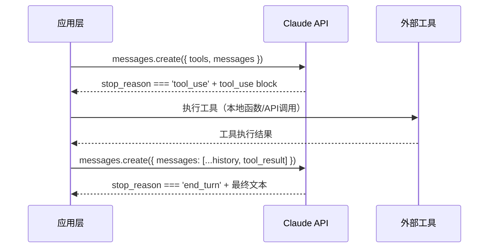
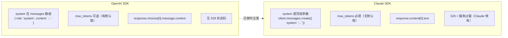

`@anthropic-ai/sdk` 是 Anthropic 官方提供的 TypeScript/Node.js SDK，用于调用 Claude 系列模型（Opus、Sonnet、Haiku）。与 OpenAI SDK 设计相似但存在若干关键结构差异，理解这些差异是接入 Claude 的必要前提，也是面试中考察 LLM 工程经验的高频切入点。

## 安装与初始化（Installation & Initialization）

```bash
npm install @anthropic-ai/sdk
```

推荐将 API Key 存入环境变量，SDK 会自动读取 `ANTHROPIC_API_KEY`：

```bash
# .env 或系统环境变量
ANTHROPIC_API_KEY=sk-ant-...
```

```typescript
import Anthropic from '@anthropic-ai/sdk';

// SDK 自动读取 ANTHROPIC_API_KEY，apiKey 可省略
const client = new Anthropic();

// 也可以显式传入
const client = new Anthropic({
  apiKey: process.env.ANTHROPIC_API_KEY,
});
```

> 生产环境中 API Key 绝对不能硬编码在代码里，应通过 `.env` 文件或 Secret Manager 注入。

---

## Messages API 核心结构差异

这是从 OpenAI SDK 迁移时最容易踩坑的地方，务必牢记以下三点结构差异。

### system 是顶层参数（不在 messages 数组里）

```typescript
// ✅ Claude 正确写法：system 与 messages 平级
const response = await client.messages.create({
  model: 'claude-3-5-sonnet-...',     // 具体 model ID 以官方文档为准
  max_tokens: 1024,                    // ⚠️ 必填，无默认值
  system: '你是一个前端架构师，回答简洁专业。',  // 顶层参数
  messages: [
    { role: 'user', content: '什么是 React Server Components？' },
  ],
});
```

```typescript
// ❌ 错误写法（OpenAI 风格，Claude 不支持）
messages: [
  { role: 'system', content: '你是一个前端架构师...' },  // Claude 会报错
  { role: 'user', content: '...' },
]
```

### max_tokens 是必填项

OpenAI SDK 的 `max_tokens` 有隐式默认值，Claude SDK 中**必须显式指定**，否则请求会报参数校验错误。

### 响应结构：content 数组（ContentBlock[]）

```typescript
// response 类型为 Anthropic.Message
const response = await client.messages.create({ ... });

// 文本内容在 content[0].text，注意先判断类型
const block = response.content[0];
if (block.type === 'text') {
  console.log(block.text);
}

// 终止原因
console.log(response.stop_reason);
// 'end_turn' | 'max_tokens' | 'stop_sequence' | 'tool_use'

// Token 用量
console.log(response.usage);
// { input_tokens: number, output_tokens: number }
```

---

## 模型分层（Model Tiers）

Claude 按能力与速度划分为三个层次，以官方文档为准获取最新的具体 model ID 字符串：

| 系列（Tier） | 定位 | 典型场景 |
|---|---|---|
| **Opus** | 最强推理能力，支持 Extended Thinking | 复杂分析、代码生成、长文档理解 |
| **Sonnet** | 能力与速度均衡，日常首选 | 对话应用、RAG 问答、内容生成 |
| **Haiku** | 极快响应、成本最低 | 简单分类、实时补全、高频轻量任务 |

> 以上为能力层次描述，具体 model ID（如 `claude-opus-4-...`）版本迭代较快，**请以 [官方文档](https://docs.anthropic.com/en/docs/about-claude/models) 为准**。

---

## 多轮对话（Multi-turn Conversation）

### role 交替规则

Claude 的 messages 数组有严格约束：
- **必须以 `user` 角色开头**
- **`user` 和 `assistant` 必须严格交替出现**，不允许连续同角色

```typescript
import Anthropic from '@anthropic-ai/sdk';

const client = new Anthropic();
const history: Anthropic.MessageParam[] = [];

async function chat(userInput: string): Promise<string> {
  history.push({ role: 'user', content: userInput });

  const response = await client.messages.create({
    model: 'claude-3-5-sonnet-...',   // 以官方文档为准
    max_tokens: 1024,
    system: '你是一个代码审查专家，给出简洁的改进建议。',
    messages: history,
  });

  const assistantText =
    response.content[0].type === 'text' ? response.content[0].text : '';

  // 将助手回复追加进历史，维持交替结构
  history.push({ role: 'assistant', content: assistantText });

  return assistantText;
}
```

### 处理 role 违规

当业务逻辑导致连续 user 消息时，有两种处理方式：

```typescript
// 方式一：合并为单条 user 消息（推荐）
{ role: 'user', content: '先问题A\n\n再问题B' }

// 方式二：在两条 user 消息中间插入 assistant 占位消息
{ role: 'assistant', content: '好的，我理解了。' }
```

---

## 流式响应（Streaming）

Claude SDK 提供两种流式接入方式，推荐优先使用 **stream helper**。

### 方式一：stream() helper（推荐）

```typescript
const stream = client.messages.stream({
  model: 'claude-3-5-sonnet-...',   // 以官方文档为准
  max_tokens: 1024,
  messages: [{ role: 'user', content: '解释 CSS Grid 布局。' }],
});

// 事件监听：每个文本 delta 触发一次
stream.on('text', (text) => {
  process.stdout.write(text);
});

// 等待完成，获取最终消息（含完整 usage 统计）
const finalMessage = await stream.finalMessage();
console.log('Token 用量:', finalMessage.usage);
```

### 方式二：for-await 遍历原始事件流

```typescript
const rawStream = await client.messages.create({
  model: 'claude-3-5-sonnet-...',   // 以官方文档为准
  max_tokens: 1024,
  messages: [{ role: 'user', content: '解释 CSS Grid 布局。' }],
  stream: true,
});

for await (const event of rawStream) {
  if (
    event.type === 'content_block_delta' &&
    event.delta.type === 'text_delta'
  ) {
    process.stdout.write(event.delta.text);
  }
}
```

两种方式对比：

| 维度 | stream() helper | create({ stream: true }) |
|---|---|---|
| API 风格 | 事件驱动（.on()） | async iterator（for-await） |
| 获取 usage | `await stream.finalMessage()` | 监听 `message_delta` 事件 |
| 错误处理 | 内置断连重试 | 需手动处理 |
| 推荐场景 | 大多数场景 | 需要精细控制事件流时 |

---

## Tool Use 工具调用

Claude 把 function calling 称为 **Tool Use**，完整流程是一个多轮循环。

### 流程图



### 完整示例

```typescript
import Anthropic from '@anthropic-ai/sdk';

const client = new Anthropic();

// 1. 定义工具（tools 数组）
const tools: Anthropic.Tool[] = [
  {
    name: 'get_weather',
    description: '获取指定城市的当前天气信息',
    input_schema: {
      type: 'object' as const,
      properties: {
        city: { type: 'string', description: '城市名称，如"北京"' },
        unit: {
          type: 'string',
          enum: ['celsius', 'fahrenheit'],
          description: '温度单位',
        },
      },
      required: ['city'],
    },
  },
];

// 2. 初始请求
let messages: Anthropic.MessageParam[] = [
  { role: 'user', content: '北京今天天气怎么样？' },
];

let response = await client.messages.create({
  model: 'claude-3-5-sonnet-...',   // 以官方文档为准
  max_tokens: 1024,
  tools,
  messages,
});

// 3. 检查是否触发工具调用
while (response.stop_reason === 'tool_use') {
  const toolUseBlock = response.content.find(
    (b): b is Anthropic.ToolUseBlock => b.type === 'tool_use'
  )!;

  // 4. 执行工具（实际场景中调用真实 API）
  const toolResult =
    toolUseBlock.name === 'get_weather'
      ? { temperature: 28, condition: '晴天', humidity: '45%' }
      : { error: '未知工具' };

  // 5. 将 assistant 回复 + tool_result 追加进 messages
  messages = [
    ...messages,
    { role: 'assistant', content: response.content },
    {
      role: 'user',
      content: [
        {
          type: 'tool_result',
          tool_use_id: toolUseBlock.id,
          content: JSON.stringify(toolResult),
        },
      ],
    },
  ];

  // 6. 继续对话
  response = await client.messages.create({
    model: 'claude-3-5-sonnet-...',   // 以官方文档为准
    max_tokens: 1024,
    tools,
    messages,
  });
}

// 7. 最终文本回复
const finalText = response.content
  .filter((b): b is Anthropic.TextBlock => b.type === 'text')
  .map((b) => b.text)
  .join('');

console.log(finalText);
```

> `tool_result` 消息格式（`tool_use_id`、`content` 字段）以官方文档为准，版本间有细微变化。

---

## 视觉与多模态（Vision / Multimodal）

Claude 支持在 messages 中传入图像，`content` 字段可以是 `ContentBlock` 数组，包含文本块和图像块混用。

### Base64 图像

```typescript
import fs from 'fs';

const imageData = fs.readFileSync('./screenshot.png').toString('base64');

const response = await client.messages.create({
  model: 'claude-3-5-sonnet-...',   // 以官方文档为准
  max_tokens: 1024,
  messages: [
    {
      role: 'user',
      content: [
        {
          type: 'image',
          source: {
            type: 'base64',
            media_type: 'image/png',       // 'image/jpeg' | 'image/png' | 'image/gif' | 'image/webp'
            data: imageData,
          },
        },
        {
          type: 'text',
          text: '描述这张截图的布局，并指出潜在的可访问性问题。',
        },
      ],
    },
  ],
});
```

### URL 图像

```typescript
const response = await client.messages.create({
  model: 'claude-3-5-sonnet-...',   // 以官方文档为准
  max_tokens: 512,
  messages: [
    {
      role: 'user',
      content: [
        {
          type: 'image',
          source: {
            type: 'url',
            url: 'https://example.com/diagram.png',
          },
        },
        { type: 'text', text: '解释这张架构图。' },
      ],
    },
  ],
});
```

> 支持的 `media_type` 以官方文档为准。图像大小和数量限制也需参考官方文档。

---

## Extended Thinking（扩展思考）

Opus 系列支持 **Extended Thinking**（扩展推理）模式：模型在给出最终回答前，先进行内部"思考链"推导，适用于数学证明、复杂代码生成等高难度任务。启用后响应中会包含 `thinking` 类型的 content block。

```typescript
// Extended Thinking 示例骨架（以官方文档为准）
const response = await client.messages.create({
  model: 'claude-opus-...',       // 以官方文档为准，目前仅 Opus 支持
  max_tokens: 16000,              // 需要较大的 max_tokens 预算
  thinking: {
    type: 'enabled',
    budget_tokens: 10000,         // 思考链的 token 预算
  },
  messages: [{ role: 'user', content: '证明：质数有无穷多个。' }],
});
```

> Extended Thinking 的参数格式、模型支持范围以官方文档为准，特性仍在迭代中。

---

## 错误处理（Error Handling）

```typescript
import Anthropic from '@anthropic-ai/sdk';

const client = new Anthropic();

try {
  const response = await client.messages.create({
    model: 'claude-3-5-sonnet-...',
    max_tokens: 1024,
    messages: [{ role: 'user', content: 'Hello' }],
  });
} catch (error) {
  if (error instanceof Anthropic.APIError) {
    console.error('HTTP 状态码:', error.status);
    console.error('错误信息:', error.message);
    console.error('原始错误体:', error.error);

    switch (error.status) {
      case 401:
        console.error('API Key 无效或未设置');
        break;
      case 429:
        console.error('请求频率超限（Rate Limit），需退避重试');
        break;
      case 529:
        // Claude 特有状态码
        console.error('服务过载（Overloaded），需指数退避重试');
        break;
    }
  }
}
```

### 常见错误状态码

| 状态码 | 含义 | 处理建议 |
|---|---|---|
| 400 | 请求参数错误（如缺少 max_tokens） | 检查参数结构 |
| 401 | API Key 无效或未设置 | 检查环境变量 |
| 429 | 请求频率超限（Rate Limit） | 指数退避重试 |
| **529** | **服务过载（Claude 特有）** | **指数退避重试** |
| 500 | 服务内部错误 | 重试，持续则联系支持 |

> HTTP 529 是 Claude 独有的状态码（非标准 HTTP），表示当前服务器过载，不同于 429 的限速，需要区别对待。

---

## Claude SDK vs OpenAI SDK 对比



| 维度 | OpenAI SDK | Claude SDK |
|---|---|---|
| system prompt 位置 | `messages` 数组内，`role: 'system'` | 顶层参数 `system: string` |
| `max_tokens` | 可选，有默认值 | **必填，无默认值** |
| 响应文本路径 | `response.choices[0].message.content` | `response.content[0].text` |
| 流式 helper | `openai.beta.chat.completions.stream()` | `client.messages.stream()` |
| 工具调用触发条件 | `finish_reason === 'tool_calls'` | `stop_reason === 'tool_use'` |
| 服务过载状态码 | 无 529（用 429） | **529 Overloaded（特有）** |
| 模型参数名 | `model` | `model` |
| SDK 包名 | `openai` | `@anthropic-ai/sdk` |

---

## 常见错误与最佳实践

**常见错误（Common Mistakes）：**

1. **把 `system` 放进 `messages` 数组** — 这是从 OpenAI 迁移时 100% 会犯的错，Claude 会直接报参数错误。
2. **忘记填写 `max_tokens`** — 与 OpenAI 不同，Claude 没有隐式默认值，漏填必报错。
3. **messages 不以 `user` 开头** — 不能直接以 `assistant` 开头，会导致请求被拒绝。
4. **连续相同 role** — 两条连续 `user` 或 `assistant` 消息会导致请求失败，需合并或插入占位消息。
5. **Tool Use 循环中未将 assistant 回复加入历史** — 发送 `tool_result` 时，必须先把上一轮的 assistant content 追加进 messages，否则上下文不完整。
6. **忽略 529 重试** — 生产系统必须处理 529，与 429 一样需要指数退避，否则高并发场景下请求会大量失败。
7. **直接访问 `response.content[0].text` 不检查类型** — 当 `stop_reason === 'tool_use'` 时，`content[0]` 是 `tool_use` 块而非文本块，需先判断 `block.type === 'text'`。

**最佳实践（Best Practices）：**

- 通过环境变量管理 API Key，永不硬编码
- 优先使用 `client.messages.stream()` helper，内置断连重试
- 多轮对话中维护完整 history，并在超出 context window 前进行截断（如保留最近 N 轮）
- Tool Use 实现为循环（`while stop_reason === 'tool_use'`），支持模型连续调用多个工具
- 统一捕获 `Anthropic.APIError`，对 429/529 实现指数退避重试

---

## 面试常问

**Q1：Claude SDK 和 OpenAI SDK 最核心的结构区别是什么？**

最常被考察的是两点：① `system` prompt 的位置不同——OpenAI 把它放在 `messages` 数组里作为 `role: 'system'` 的消息，Claude 把 `system` 作为顶层独立参数；② `max_tokens` 在 Claude 中是**必填项**，没有隐式默认值，OpenAI 中则可省略。

**Q2：为什么 messages 数组不能出现连续同角色消息？**

这是 Claude 模型训练时对话格式的约束——训练数据都是严格的 user/assistant 交替对话格式，偏离格式会导致模型行为不可预测，因此 API 层面直接报错拒绝。实践中若有多条用户输入需合并，或在中间补一条简短 assistant 占位消息。

**Q3：stop_reason 有哪些值，分别代表什么？**

- `end_turn`：模型正常完成输出
- `max_tokens`：达到 `max_tokens` 上限被截断，需增大 `max_tokens` 或分段处理
- `stop_sequence`：触发了用户自定义的停止序列
- `tool_use`：模型请求调用一个或多个工具，需执行工具后把结果以 `tool_result` 追加并继续对话

**Q4：stream() helper 和 create({ stream: true }) 有什么区别，分别适合什么场景？**

`stream()` helper 提供事件驱动接口（`.on('text', ...)`），内置断连重试逻辑，通过 `finalMessage()` 获取完整 usage，适合大多数场景。`create({ stream: true })` 返回原始 async iterator，给开发者更细粒度的事件控制权，适合需要处理 `message_start`、`content_block_start` 等底层事件的场景。

**Q5：Tool Use 循环中，向 API 发送 tool_result 时，messages 数组需要包含哪些内容？**

必须把上一轮 API 返回的 assistant 消息（包含 `tool_use` block 的 `response.content`）先追加进 messages，然后再追加包含 `tool_result` 的 user 消息。如果只发 `tool_result` 而缺少前一条 assistant 消息，API 会因为缺少上下文而报错。

**Q6：HTTP 529 是什么，应该如何处理？**

529 是 Claude 特有的非标准 HTTP 状态码，表示服务器当前过载（Overloaded），与 429（Rate Limit）不同。429 是客户端请求太频繁，529 是服务端压力过大。两者都需要指数退避重试，但语义不同。生产系统中应统一捕获 `Anthropic.APIError`，对 `error.status === 529` 单独记录并以较长的初始等待时间进行重试。

**Q7：Extended Thinking 是什么，适合什么场景？**

Extended Thinking 是 Opus 系列支持的一种推理模式，允许模型在输出最终答案前先进行可见的内部推导（思考链），消耗额外的 token 预算（`budget_tokens`）。适合数学证明、复杂代码设计、多步骤推理等需要深度推导的任务。对于简单问答或轻量任务，开启 Extended Thinking 会造成不必要的 token 消耗和延迟。
