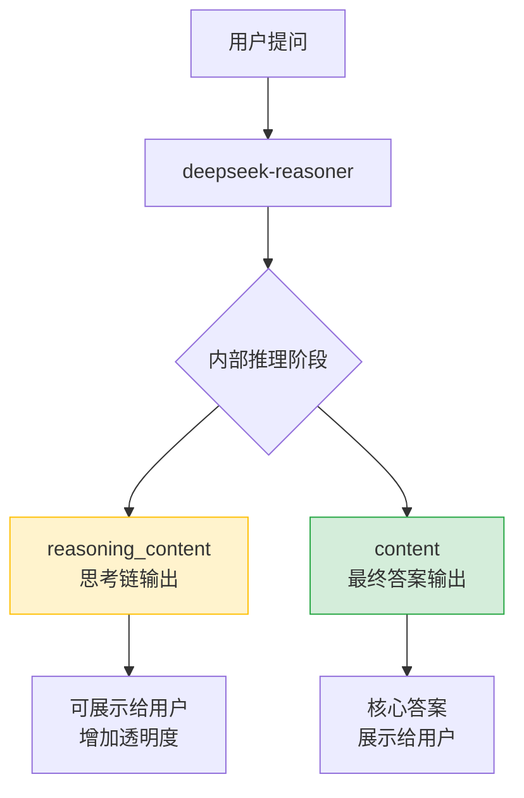
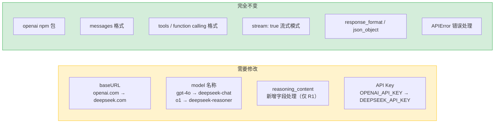

DeepSeek 是国内领先的大语言模型提供商，以极高的性价比著称——在多项基准测试上接近 GPT-4 级别的表现，而 API 调用成本远低于同级产品。对前端或全栈开发者而言，最大的好处是：DeepSeek 提供与 OpenAI 完全兼容的 API，直接复用 `openai` npm 包，**零新增依赖**。

## DeepSeek 模型概览

DeepSeek 目前提供两大主力模型系列（具体模型 ID 以官方文档为准）：

| 模型系列 | 代表模型 | 适用场景 |
|---|---|---|
| Chat | `deepseek-chat`（对应 DeepSeek-V3 架构） | 通用对话、文本生成、代码辅助 |
| Reasoner | `deepseek-reasoner`（对应 DeepSeek-R1 架构） | 复杂推理、数学、逻辑分析、思维链 |

DeepSeek-R1 是推理增强模型（Reasoning Model），在生成最终答案前会输出内部思考过程（Chain-of-Thought），透过非标准字段 `reasoning_content` 暴露给调用方。

### 与 OpenAI 模型的定位对比

```
OpenAI GPT-4o  ←→  DeepSeek-V3 (deepseek-chat)    // 通用对话
OpenAI o1/o3   ←→  DeepSeek-R1 (deepseek-reasoner) // 深度推理
```

## 为什么 DeepSeek 受欢迎：成本视角

DeepSeek 按输入/输出 token 分开计费，官方公布的价格远低于 OpenAI 同级别模型（具体价格以官方文档为准，随时调整）。在实际业务中，这意味着：

- 相同预算可支撑更多次请求
- 大规模批量处理（文档分析、数据标注）场景优势更明显
- 对个人开发者和初创团队更友好

**选型建议**：能用 `deepseek-chat` 解决的任务不要升级到 `deepseek-reasoner`——推理模型会输出长思考链，token 消耗更多、延迟更高，仅在需要复杂推理时才值得使用。

## 环境准备

在 [DeepSeek 开放平台](https://platform.deepseek.com) 注册并申请 API Key，然后安装依赖：

```bash
npm install openai
```

将 API Key 存入服务端环境变量，**切勿硬编码在源码中**：

```env
DEEPSEEK_API_KEY=your_api_key_here
```

## TypeScript 客户端初始化

与 OpenAI 的差异只有两处：`baseURL` 指向 DeepSeek 端点，`apiKey` 读取自己的密钥。

```typescript
import OpenAI from 'openai';

// 以官方文档为准：https://platform.deepseek.com/docs
const client = new OpenAI({
  apiKey: process.env.DEEPSEEK_API_KEY,
  baseURL: 'https://api.deepseek.com/v1', // 以官方文档为准
});
```

这就是迁移所需的全部改动——其余所有调用代码保持不变。

## Chat Completions 基础调用

请求/响应结构与 OpenAI Chat Completions API 完全一致：

```typescript
async function chat(userMessage: string): Promise<string> {
  const response = await client.chat.completions.create({
    model: 'deepseek-chat', // 以官方文档为准
    messages: [
      { role: 'system', content: '你是一个专业的前端开发助手。' },
      { role: 'user', content: userMessage },
    ],
    temperature: 0.7,
    max_tokens: 2048,
  });

  return response.choices[0].message.content ?? '';
}
```

### 与 OpenAI 的差异点

| 维度 | OpenAI | DeepSeek |
|---|---|---|
| `baseURL` | `https://api.openai.com/v1` | `https://api.deepseek.com/v1`（以官方文档为准） |
| 模型名称 | `gpt-4o` / `o1` 等 | `deepseek-chat` / `deepseek-reasoner` 等 |
| `reasoning_content` | 不存在（o1 的思考过程不暴露） | DeepSeek-R1 特有的思维链字段 |
| 请求参数结构 | 标准 OpenAI 格式 | 完全兼容，无额外必填字段 |
| 错误类型 | `OpenAI.APIError` | 同样抛出 `OpenAI.APIError`（同一个 SDK） |

## 推理模型（DeepSeek-R1）与 `reasoning_content`

DeepSeek-R1 在回答前会进行内部推理，思考过程通过非标准扩展字段 `reasoning_content` 返回。这个字段在 OpenAI SDK 的类型定义中不存在，需要类型断言访问：

```typescript
interface DeepSeekMessage {
  role: string;
  content: string | null;
  reasoning_content?: string; // DeepSeek-R1 特有，以官方文档为准
}

async function reasonerChat(question: string) {
  const response = await client.chat.completions.create({
    model: 'deepseek-reasoner', // 以官方文档为准
    messages: [{ role: 'user', content: question }],
  });

  const message = response.choices[0].message as unknown as DeepSeekMessage;

  // reasoning_content：模型的思考过程（Chain-of-Thought）
  if (message.reasoning_content) {
    console.log('思考过程：\n', message.reasoning_content);
  }

  // content：最终答案
  console.log('最终答案：\n', message.content);

  return {
    thinking: message.reasoning_content ?? '',
    answer: message.content ?? '',
  };
}
```

### 推理流程示意



### 流式接收 reasoning_content

流式模式下，推理 token 和答案 token 分别在不同的 delta 字段中出现：

```typescript
async function streamReasoner(question: string) {
  const stream = await client.chat.completions.create({
    model: 'deepseek-reasoner', // 以官方文档为准
    messages: [{ role: 'user', content: question }],
    stream: true,
  });

  let phase: 'thinking' | 'answering' = 'thinking';

  for await (const chunk of stream) {
    const delta = chunk.choices[0]?.delta as Record<string, unknown>;

    // 思考阶段：reasoning_content 有内容
    if (delta?.reasoning_content) {
      if (phase !== 'thinking') {
        phase = 'thinking';
        process.stdout.write('\n[思考中...]\n');
      }
      process.stdout.write(delta.reasoning_content as string);
    }

    // 回答阶段：content 有内容
    if (delta?.content) {
      if (phase !== 'answering') {
        phase = 'answering';
        process.stdout.write('\n[回答]\n');
      }
      process.stdout.write(delta.content as string);
    }
  }
}
```

## 流式响应（Streaming）

与 OpenAI 完全相同的 `stream: true` 模式：

```typescript
async function streamChat(
  userMessage: string,
  onChunk: (text: string) => void
): Promise<void> {
  const stream = await client.chat.completions.create({
    model: 'deepseek-chat',
    messages: [{ role: 'user', content: userMessage }],
    stream: true,
  });

  for await (const chunk of stream) {
    const delta = chunk.choices[0]?.delta?.content;
    if (delta) {
      onChunk(delta); // 推送到前端或 SSE
    }
  }
}
```

在 Next.js App Router 中配合 SSE 使用（详见《SSE 流式响应实现详解》）：

```typescript
// app/api/chat/route.ts
import OpenAI from 'openai';
import { NextRequest } from 'next/server';

const client = new OpenAI({
  apiKey: process.env.DEEPSEEK_API_KEY,
  baseURL: 'https://api.deepseek.com/v1', // 以官方文档为准
});

export async function POST(req: NextRequest) {
  const { message } = await req.json();
  const encoder = new TextEncoder();

  const readable = new ReadableStream({
    async start(controller) {
      try {
        const stream = await client.chat.completions.create({
          model: 'deepseek-chat',
          messages: [{ role: 'user', content: message }],
          stream: true,
        });

        for await (const chunk of stream) {
          const delta = chunk.choices[0]?.delta?.content;
          if (delta) {
            controller.enqueue(
              encoder.encode(`data: ${JSON.stringify({ content: delta })}\n\n`)
            );
          }
        }
        controller.enqueue(encoder.encode('data: [DONE]\n\n'));
      } catch {
        controller.enqueue(
          encoder.encode(`data: ${JSON.stringify({ error: 'Stream failed' })}\n\n`)
        );
      } finally {
        controller.close();
      }
    },
  });

  return new Response(readable, {
    headers: {
      'Content-Type': 'text/event-stream',
      'Cache-Control': 'no-cache',
    },
  });
}
```

## Function Calling / Tool Use

DeepSeek 的工具调用（Tool Use）完全兼容 OpenAI 的 `tools` 格式，包括多轮工具调用循环：

```typescript
import OpenAI from 'openai';

// 工具定义（与 OpenAI 格式完全一致）
const tools: OpenAI.Chat.ChatCompletionTool[] = [
  {
    type: 'function',
    function: {
      name: 'get_weather',
      description: '获取指定城市的当前天气',
      parameters: {
        type: 'object',
        properties: {
          city: { type: 'string', description: '城市名称，如"北京"' },
          unit: { type: 'string', enum: ['celsius', 'fahrenheit'] },
        },
        required: ['city'],
      },
    },
  },
];

// 模拟工具执行
function executeToolCall(name: string, args: Record<string, unknown>): string {
  if (name === 'get_weather') {
    return JSON.stringify({ city: args.city, temperature: 22, condition: '晴' });
  }
  return JSON.stringify({ error: 'Unknown tool' });
}

// 完整的工具调用循环
async function chatWithTools(userMessage: string): Promise<string> {
  const messages: OpenAI.Chat.ChatCompletionMessageParam[] = [
    { role: 'user', content: userMessage },
  ];

  // 最多循环 5 轮，防止无限调用
  for (let i = 0; i < 5; i++) {
    const response = await client.chat.completions.create({
      model: 'deepseek-chat', // 以官方文档为准
      messages,
      tools,
      tool_choice: 'auto',
    });

    const message = response.choices[0].message;
    messages.push(message);

    // 没有工具调用 → 模型已给出最终答案
    if (!message.tool_calls || message.tool_calls.length === 0) {
      return message.content ?? '';
    }

    // 执行所有工具并收集结果
    for (const toolCall of message.tool_calls) {
      const args = JSON.parse(toolCall.function.arguments) as Record<string, unknown>;
      const result = executeToolCall(toolCall.function.name, args);

      messages.push({
        role: 'tool',
        tool_call_id: toolCall.id,
        content: result,
      });
    }
  }

  return '工具调用次数超限';
}
```

## 结构化输出（JSON Mode）

```typescript
async function extractStructuredData(text: string) {
  const response = await client.chat.completions.create({
    model: 'deepseek-chat',
    messages: [
      {
        role: 'system',
        content: '你是数据提取助手，始终以合法 JSON 格式返回结果。',
      },
      {
        role: 'user',
        content: `从以下文本提取姓名、邮箱、电话：\n${text}`,
      },
    ],
    response_format: { type: 'json_object' }, // 以官方文档为准
  });

  const raw = response.choices[0].message.content ?? '{}';
  return JSON.parse(raw) as { name?: string; email?: string; phone?: string };
}
```

## Context Window 与 Token 限制

具体数值以官方文档为准，一般性原则：

- 不同模型的 context window 大小不同，使用前查阅文档
- 多轮对话时，历史消息全部计入输入 token，需手动截断避免超限
- `max_tokens` 控制单次输出长度，不设置时使用模型默认值
- 推理模型（deepseek-reasoner）的 `reasoning_content` 也会消耗 token

## 错误处理与 429 重试

DeepSeek 使用与 OpenAI SDK 相同的错误类型（毕竟是同一个 SDK）：

```typescript
import OpenAI from 'openai';

async function safeChat(
  message: string,
  retries = 3,
  delay = 1000
): Promise<string> {
  for (let attempt = 0; attempt < retries; attempt++) {
    try {
      const response = await client.chat.completions.create({
        model: 'deepseek-chat',
        messages: [{ role: 'user', content: message }],
      });
      return response.choices[0].message.content ?? '';
    } catch (error) {
      if (error instanceof OpenAI.APIError) {
        const status = error.status;

        if (status === 429) {
          // 超出速率限制，指数退避重试
          if (attempt < retries - 1) {
            await new Promise((r) => setTimeout(r, delay * Math.pow(2, attempt)));
            continue;
          }
        }

        if (status === 402) {
          throw new Error('DeepSeek 账户余额不足，请充值后重试');
        }

        if (status !== undefined && status >= 500) {
          // 服务端错误，短暂等待后重试
          if (attempt < retries - 1) {
            await new Promise((r) => setTimeout(r, delay));
            continue;
          }
        }
      }
      throw error;
    }
  }
  throw new Error('超过最大重试次数');
}
```

## 从 OpenAI 迁移到 DeepSeek



迁移清单：

```typescript
// Before（OpenAI）
const client = new OpenAI({
  apiKey: process.env.OPENAI_API_KEY,
  // baseURL 使用默认值
});
const response = await client.chat.completions.create({
  model: 'gpt-4o',
  // ...
});

// After（DeepSeek）
const client = new OpenAI({
  apiKey: process.env.DEEPSEEK_API_KEY,    // ← 改这里
  baseURL: 'https://api.deepseek.com/v1', // ← 改这里（以官方文档为准）
});
const response = await client.chat.completions.create({
  model: 'deepseek-chat',                  // ← 改这里
  // ... 其余完全不变
});
```

## 常见错误

**1. 直接在前端初始化 client**：`apiKey` 会暴露在打包产物和网络请求中，永远只在服务端创建 client。

**2. 混淆 baseURL 格式**：部分版本需要 `/v1` 后缀，部分不需要，务必以官方文档为准，不要猜测。

**3. 忘记处理 `reasoning_content`**：使用 deepseek-reasoner 时，最终答案在 `content` 字段，而非 `reasoning_content`——后者是思考过程，不是结果。

**4. 在 Reasoner 上调 `temperature`**：深度推理模型通常对 temperature 参数不敏感或有特殊处理，以官方文档为准，不要随意调高。

**5. 未处理 402 状态码**：DeepSeek 余额耗尽时返回 402，需要专门捕获并给用户友好提示，而非通用错误信息。

## 最佳实践

- 在 `.env.local` 中存储 `DEEPSEEK_API_KEY`，加入 `.gitignore`，绝不提交到代码仓库
- 生产环境使用平台的 Secret 管理（如 Vercel Environment Variables）
- 封装统一的 `createDeepSeekClient()` 工厂函数，避免在多处重复配置 baseURL
- 针对不同任务复杂度分层选型：简单对话用 `deepseek-chat`，数学/逻辑推理再升级到 `deepseek-reasoner`
- 设置合理的 `max_tokens` 上限，防止意外的超长输出消耗配额
- 对 429 错误实现指数退避重试，对 402 错误立即停止重试并告警

## 面试常问

**Q：DeepSeek 为什么可以直接用 OpenAI SDK 接入？**

A：DeepSeek 的 HTTP API 完整遵循 OpenAI Chat Completions 规范——请求路径、body 结构、响应格式、错误码体系完全一致。`openai` npm 包本质是一个 HTTP 客户端，将 `baseURL` 指向 DeepSeek 端点后，SDK 发出的请求 DeepSeek 服务器完全能够解析和响应。

**Q：DeepSeek-R1 的 `reasoning_content` 是什么？**

A：这是 DeepSeek-R1（推理增强模型）特有的非标准扩展字段，包含模型在给出最终答案前的内部思考过程（Chain-of-Thought）。最终答案仍在标准的 `content` 字段中。使用时需要通过类型断言访问，因为 openai SDK 的 TypeScript 类型中没有这个字段。

**Q：什么时候选 deepseek-chat，什么时候选 deepseek-reasoner？**

A：`deepseek-chat` 适合大多数日常任务——对话、摘要、翻译、代码辅助；`deepseek-reasoner` 适合需要多步推理的场景——复杂数学题、逻辑推断、有明确对错标准的分析任务。推理模型延迟更高、token 消耗更多，不要过度使用。

**Q：从 OpenAI 迁移到 DeepSeek，代码需要改多少？**

A：最少只改两行：`baseURL` 和模型名称。如果用到了 DeepSeek-R1 的推理能力，还需要额外处理 `reasoning_content` 字段。工具调用、流式输出、JSON Mode、错误处理逻辑全部不需要修改。

**Q：如何防止 DeepSeek API Key 泄露？**

A：API Key 只存在服务端环境变量，绝不写入前端代码或 git 仓库。所有 LLM 调用必须经过 BFF（Backend for Frontend）代理层，浏览器只与自己的后端通信。发现泄露后立即在 DeepSeek 平台吊销旧 Key 并生成新 Key，同时检查 git 历史记录是否有敏感信息残留。

**Q：DeepSeek 的 429 错误应该怎么处理？**

A：实现指数退避重试（Exponential Backoff）：第一次重试等 1 秒，第二次等 2 秒，第三次等 4 秒，设置最大重试次数上限（如 3 次）。超过重试次数后向用户显示友好错误提示，而不是继续循环。也可以查看响应头中的 `Retry-After` 字段（如果提供），作为重试等待时间的参考。
