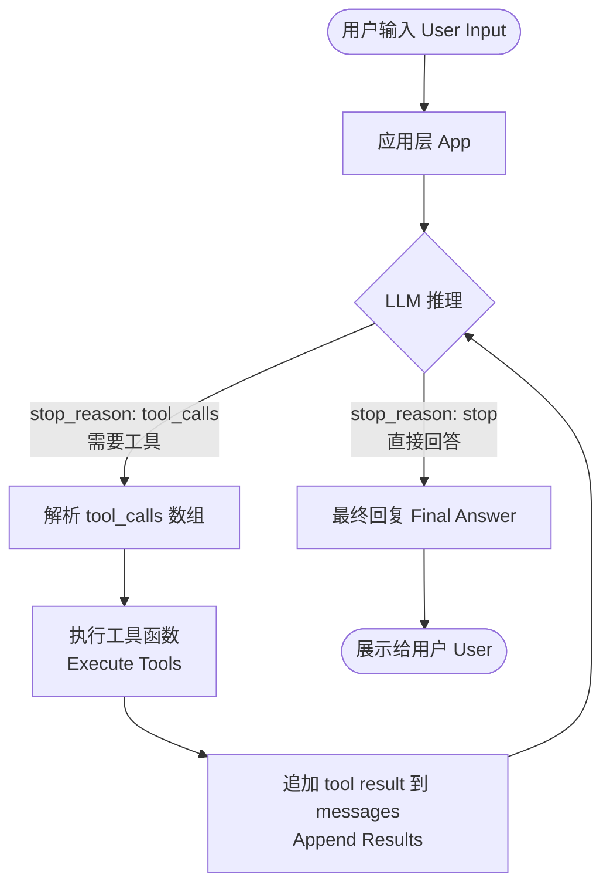
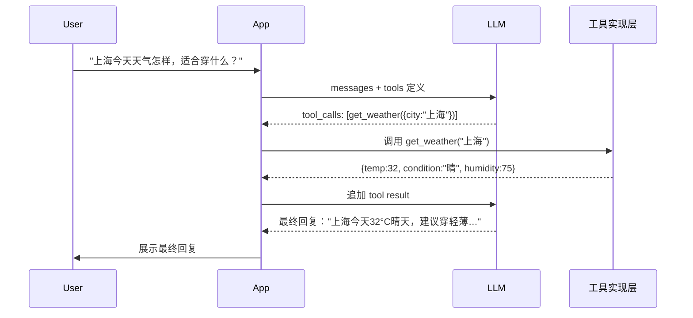

大语言模型（Large Language Model，LLM）本身只能处理文本，无法查询数据库、调用外部 API 或执行代码。Function Calling（函数调用，也称 Tool Use）弥补了这个缺口——它让模型在需要时以结构化 JSON 的形式"请求"调用外部函数，由应用层执行后再把结果回传，从而实现真正与现实世界交互的 AI Agent（智能体）。

## 核心心智模型

Function Calling 最重要的一点经常被初学者误解：**模型永远不会直接执行函数**。模型只是输出一段结构化的意图声明（Intent），告诉你"我想调用 `get_weather`，参数是 `{ city: 'Beijing' }`"——实际的执行逻辑永远在你的应用代码里。

> **一句话心智模型**：LLM 输出意图（Intent），你来执行（Execute）。

这一设计有几个深层含义：
- **安全边界（Security Boundary）**：敏感操作（删除数据、支付、发邮件）在你的代码里执行，你有完全控制权
- **可观测性（Observability）**：所有工具调用都经过你的代码，便于日志、限流、审计
- **可替换性**：同一套工具定义可以接入不同的模型后端，不绑定特定厂商

## 完整调用循环（The Tool Call Loop）



整个循环可能迭代多次（Multi-step Agentic Loop）。每次模型收到工具结果后，可以选择继续调用新工具，或者在信息充足时给出最终自然语言回复。

### 多步示例时序图



## 工具定义（Tool Schema Definition）

工具使用 JSON Schema（JSON 模式）描述参数结构。**`description` 字段是最关键的部分**——模型完全依赖它来判断"何时该调用这个工具"以及"每个参数填什么值"。

### 完整 TypeScript 示例

```typescript
import OpenAI from 'openai';

// 以官方文档为准（OpenAI Chat Completions API）
const tools: OpenAI.Chat.Completions.ChatCompletionTool[] = [
  {
    type: 'function',
    function: {
      name: 'get_weather',
      // 好的 description 应说明：何时调用、返回什么
      description:
        '查询指定城市的实时天气信息。当用户询问天气、气温、是否下雨等问题时调用。' +
        '返回温度、天气状况、湿度等字段。',
      parameters: {
        type: 'object',
        properties: {
          city: {
            type: 'string',
            description: '城市名称，支持中文或英文，例如 "北京" 或 "Shanghai"',
          },
          unit: {
            type: 'string',
            // enum 可以限制枚举值，减少模型幻觉（Hallucination）
            enum: ['celsius', 'fahrenheit'],
            description: '温度单位，不指定时默认返回 celsius（摄氏度）',
          },
        },
        required: ['city'], // 声明必填参数
      },
    },
  },
  {
    type: 'function',
    function: {
      name: 'search_web',
      description:
        '使用搜索引擎查询最新信息。当问题涉及实时新闻、近期事件或需要联网核实的事实时调用。' +
        '返回搜索结果列表，每项包含 title、url、snippet。',
      parameters: {
        type: 'object',
        properties: {
          query: {
            type: 'string',
            description: '搜索关键词，使用简洁的搜索引擎风格短语',
          },
          max_results: {
            type: 'integer',
            description: '最多返回几条结果，默认 5，最大 20',
          },
        },
        required: ['query'],
      },
    },
  },
];
```

### 写好 description 的要点

| 要素 | 说明 | 示例 |
|---|---|---|
| 触发时机 | 何时该调用 | "当用户询问天气时" |
| 返回内容 | 返回什么数据 | "返回温度、湿度" |
| 参数说明 | 每个参数的含义和格式 | "城市名，支持中文或英文" |
| 边界条件 | 不适用的场景（可选） | "不适用于历史天气查询" |
| 枚举约束 | 限制取值范围 | `enum: ['celsius', 'fahrenheit']` |

## 完整工具调用循环（TypeScript 实现）

```typescript
import OpenAI from 'openai';

const client = new OpenAI({ apiKey: process.env.OPENAI_API_KEY });

type Message = OpenAI.Chat.Completions.ChatCompletionMessageParam;

// 工具实现映射表（实际项目中可能是 API 调用、数据库查询等）
const toolImplementations: Record<
  string,
  (args: Record<string, unknown>) => Promise<unknown>
> = {
  async get_weather(args) {
    // 实际调用天气 API，此处仅作示意
    return { temp: 28, condition: '晴', city: args.city, unit: args.unit ?? 'celsius' };
  },
  async search_web(args) {
    // 实际调用搜索 API
    return [{ title: '示例结果', url: 'https://example.com', snippet: '...' }];
  },
};

const MAX_STEPS = 10; // 防止无限循环（Infinite Loop Guard）

async function runWithTools(userMessage: string): Promise<string> {
  const messages: Message[] = [{ role: 'user', content: userMessage }];

  for (let step = 0; step < MAX_STEPS; step++) {
    const response = await client.chat.completions.create({
      model: 'gpt-4o', // 以官方文档为准
      messages,
      tools,
      tool_choice: 'auto',
    });

    const message = response.choices[0].message;
    // 必须将 assistant 消息追加到历史，保持对话上下文
    messages.push(message);

    // finish_reason 为 'stop' 表示模型给出了最终答案
    if (!message.tool_calls || message.tool_calls.length === 0) {
      return message.content ?? '';
    }

    // 模型返回了 tool_calls，并发执行所有工具（见下节）
    const toolResults = await Promise.all(
      message.tool_calls.map(async (toolCall) => {
        const fn = toolImplementations[toolCall.function.name];
        let result: unknown;
        if (!fn) {
          result = { error: `Unknown tool: ${toolCall.function.name}` };
        } else {
          try {
            const args = JSON.parse(toolCall.function.arguments) as Record<string, unknown>;
            result = await fn(args);
          } catch (err) {
            result = { error: String(err) };
          }
        }
        return { toolCall, result };
      }),
    );

    // 将所有工具结果追加到 messages
    for (const { toolCall, result } of toolResults) {
      messages.push({
        role: 'tool',
        tool_call_id: toolCall.id, // 必须与 tool_call.id 对应
        content: JSON.stringify(result),
      });
    }
    // 继续循环，将结果发回模型
  }

  throw new Error(`Exceeded MAX_STEPS (${MAX_STEPS}), possible infinite loop`);
}
```

## 并发工具调用（Parallel Tool Calls）

模型在一次响应中可以同时返回多个 `tool_calls`（数组形式）。例如用户问"北京和上海今天天气如何？"，模型可能一次返回两个 `get_weather` 调用。

应用层应当**并发执行**所有工具调用，而不是串行，以降低整体延迟：

```typescript
// 并发执行所有 tool_calls（关键性能优化）
const toolResults = await Promise.all(
  message.tool_calls.map(async (toolCall) => {
    const args = JSON.parse(toolCall.function.arguments) as Record<string, unknown>;
    const result = await toolImplementations[toolCall.function.name]?.(args)
      ?? { error: 'Tool not found' };
    return { id: toolCall.id, result };
  }),
);

// 收集全部结果后，一次性追加到 messages
for (const { id, result } of toolResults) {
  messages.push({ role: 'tool', tool_call_id: id, content: JSON.stringify(result) });
}
```

## tool_choice 参数

`tool_choice` 控制模型是否以及如何使用工具，以官方文档为准：

| 值 | 行为 |
|---|---|
| `"auto"` | 默认值，模型自行决定是否调用工具 |
| `"none"` | 禁止调用工具，强制给出文字回答 |
| `"required"` | 强制模型必须调用至少一个工具 |
| `{ type: "function", function: { name: "xxx" } }` | 强制调用指定函数 |

```typescript
// 强制调用特定工具（用于结构化数据提取场景）
const response = await client.chat.completions.create({
  model: 'gpt-4o', // 以官方文档为准
  messages,
  tools,
  tool_choice: { type: 'function', function: { name: 'extract_entity' } },
});
```

## Claude Tool Use（Anthropic）

Anthropic 的 Claude 实现了相同的概念，但 API 形态（API Shape）不同。以官方文档为准，核心差异如下：

```typescript
import Anthropic from '@anthropic-ai/sdk';

const client = new Anthropic();

// Claude 用 input_schema 替代 parameters
const tools: Anthropic.Tool[] = [
  {
    name: 'get_weather',
    description: '查询指定城市的实时天气',
    input_schema: {  // 注意：不是 parameters，是 input_schema
      type: 'object' as const,
      properties: {
        city: { type: 'string', description: '城市名称' },
      },
      required: ['city'],
    },
  },
];

const response = await client.messages.create({
  model: 'claude-opus-4-5', // 以官方文档为准
  max_tokens: 1024,
  tools,
  messages: [{ role: 'user', content: '北京今天天气如何？' }],
});

// Claude 用 stop_reason: 'tool_use' 而非 finish_reason: 'tool_calls'
if (response.stop_reason === 'tool_use') {
  const toolUseBlock = response.content.find((b) => b.type === 'tool_use');
  if (toolUseBlock && toolUseBlock.type === 'tool_use') {
    const result = await getWeather(toolUseBlock.input as { city: string });

    // 追加工具结果时，content 类型为 tool_result
    const nextMessages: Anthropic.MessageParam[] = [
      { role: 'assistant', content: response.content },
      {
        role: 'user',
        content: [
          {
            type: 'tool_result',    // 注意：不是 role: 'tool'
            tool_use_id: toolUseBlock.id,
            content: JSON.stringify(result),
          },
        ],
      },
    ];
    // 继续请求...
  }
}
```

### OpenAI vs Claude API 差异对比

| 概念 | OpenAI | Claude（Anthropic） |
|---|---|---|
| 工具参数字段 | `parameters` | `input_schema` |
| 工具调用标志 | `finish_reason: 'tool_calls'` | `stop_reason: 'tool_use'` |
| 工具结果角色 | `role: 'tool'` | `role: 'user'` + `type: 'tool_result'` |
| 工具调用内容 | `message.tool_calls[]` | `content[]` 中 `type: 'tool_use'` 块 |

## 结构化输出 vs Function Calling

两者都能让模型输出 JSON，但适用场景不同：

| 维度 | 结构化输出（Structured Output） | Function Calling |
|---|---|---|
| 核心目的 | 让模型回复符合固定 Schema 的 JSON | 触发外部工具执行 |
| 是否执行代码 | 否，只是格式约束 | 是，触发实际函数调用 |
| 适用场景 | 数据提取、信息解析、表单填充 | 查询 API、数据库、执行操作 |
| 是否需要多轮 | 通常单轮即可 | 可能多轮循环 |
| 工具调用跟踪 | 无 `tool_call_id` | 有 `tool_call_id` 追踪 |

**选择建议**：如果只需要从文本中提取结构化数据（如解析简历、提取订单信息），用结构化输出更简单；如果需要与外部系统交互（查天气、查数据库），用 Function Calling。

## 参数验证（Argument Validation with Zod）

模型生成的 `arguments` 有小概率出现格式错误（类型不对、多余字段、JSON 语法错误）。生产环境中必须用 Zod 做运行时验证（Runtime Validation）：

```typescript
import { z } from 'zod';

// 定义 Zod Schema，与 JSON Schema 保持一致
const WeatherArgsSchema = z.object({
  city: z.string().min(1, '城市名不能为空'),
  unit: z.enum(['celsius', 'fahrenheit']).optional().default('celsius'),
});

async function safeGetWeather(rawArgs: string) {
  let parsed: unknown;

  // 第一层：JSON.parse 可能抛出 SyntaxError
  try {
    parsed = JSON.parse(rawArgs);
  } catch {
    throw new Error(`模型返回了无效的 JSON: ${rawArgs}`);
  }

  // 第二层：Zod 校验参数结构和类型
  const result = WeatherArgsSchema.safeParse(parsed);
  if (!result.success) {
    throw new Error(`参数校验失败: ${result.error.message}`);
  }

  const { city, unit } = result.data;
  return fetchWeatherAPI(city, unit);
}
```

`safeParse` 相比 `parse` 不会抛出异常，便于优雅降级（Graceful Degradation）。

## 安全注意事项（Security Considerations）

Function Calling 把模型的意图转化为真实的系统操作，安全是首要考虑：

**1. 危险操作需要人工确认**

```typescript
async function executeFunction(name: string, args: Record<string, unknown>) {
  const DANGEROUS_TOOLS = ['delete_file', 'send_payment', 'drop_table'];

  if (DANGEROUS_TOOLS.includes(name)) {
    // 在 UI 层显示确认对话框，等待用户授权
    const confirmed = await showConfirmDialog(
      `AI 请求执行 ${name}，参数：${JSON.stringify(args)}`,
    );
    if (!confirmed) {
      return { error: '用户拒绝了该操作' };
    }
  }
  // ...继续执行
}
```

**2. 输入清洗（Input Sanitization）**

不要将模型返回的参数直接拼接到 SQL 语句或 Shell 命令中——即使参数看起来无害，也需要通过参数化查询（Parameterized Query）或白名单过滤：

```typescript
// 危险写法（SQL 注入风险）
const query = `SELECT * FROM users WHERE name = '${args.name}'`;

// 正确写法（参数化查询）
const result = await db.query('SELECT * FROM users WHERE name = $1', [args.name]);
```

**3. 最小权限原则（Principle of Least Privilege）**

每个工具只应拥有完成其功能所需的最小权限，避免给工具函数赋予过宽的系统权限。

**4. 工具数量控制**

工具越多，模型选择准确率越低，建议单次请求工具数不超过 10 个（以官方文档推荐为准）。

## 多步 Agentic Loop 与无限循环防护

复杂任务中，模型可能连续调用多个工具，形成 Agentic Loop（智能体循环）。必须设置最大步数防止意外死循环：

```typescript
const MAX_STEPS = 10;
let step = 0;

while (step < MAX_STEPS) {
  step++;
  const response = await callLLM(messages);

  if (response.finish_reason === 'stop') {
    break; // 正常结束
  }

  if (response.finish_reason === 'tool_calls') {
    await executeAndAppendTools(response, messages);
    continue;
  }

  // 其他 finish_reason（如 length、content_filter）需要特殊处理
  break;
}

if (step >= MAX_STEPS) {
  // 记录告警，通知用户任务可能未完成
  logger.warn('Agentic loop exceeded MAX_STEPS', { step, messages });
}
```

检测潜在无限循环的信号：
- 模型持续调用同一个工具（参数完全相同）
- 工具始终返回错误但模型继续重试
- `messages` 数组长度超过上下文窗口（Context Window）限制

## 真实使用场景

| 场景 | 工具函数 | 关键参数 | 注意事项 |
|---|---|---|---|
| 网络搜索 | `search_web` | query, max_results | 防止 prompt 注入（Prompt Injection） |
| 代码执行 | `run_code` | code, language | 沙箱隔离（Sandbox）必须 |
| 数据库查询 | `query_database` | sql / filter | 只读权限，参数化查询 |
| 文件操作 | `read_file`, `write_file` | path, content | 限制路径白名单 |
| 外部 API 调用 | `call_api` | endpoint, method, body | 限速（Rate Limit），认证隔离 |
| 邮件/消息发送 | `send_email` | to, subject, body | 人工确认，防止垃圾邮件 |
| 日历操作 | `create_event` | title, time, attendees | 人工确认，权限最小化 |

## 常见错误（Common Mistakes）

**1. 忘记将 assistant 消息追加到 messages**

```typescript
// 错误：丢失了 assistant 消息，下一轮请求上下文不完整
messages.push(...toolResults);

// 正确：先追加 assistant 消息，再追加 tool 结果
messages.push(message);         // assistant 消息（含 tool_calls）
messages.push(...toolResults);  // tool result 消息
```

**2. tool_call_id 不对应**

每个 `tool` 角色消息必须有 `tool_call_id`，且必须与对应的 `tool_calls[i].id` 完全匹配，否则模型无法将结果与调用对应。

**3. description 写得太简短**

`description: '查天气'` 远不如 `description: '查询指定城市的实时天气，当用户询问天气、温度、降雨概率时调用'`。模型的选择准确率高度依赖 description 的质量。

**4. 没有处理 JSON.parse 失败**

模型有小概率返回格式错误的 arguments，直接 `JSON.parse` 不做 try-catch 会导致程序崩溃。

**5. 串行执行多个 tool_calls**

当模型一次返回多个 tool_calls 时，应当并发执行（`Promise.all`）而非串行循环，否则延迟累积。

**6. 没有设置 MAX_STEPS**

在 `while (true)` 循环中无 break 条件，一旦工具持续报错而模型持续重试，会造成无限调用和费用失控。

## 最佳实践

- **description 即提示工程**：把工具的 description 当成系统提示（System Prompt）的一部分来精心撰写，说明触发时机、参数含义、返回格式
- **用 Zod 做运行时校验**：不信任模型输出的参数，始终校验类型和格式
- **并发执行多 tool_calls**：用 `Promise.all` 而非 `for...of` 串行
- **设置 MAX_STEPS**：建议 5～15 步，超出后告警并终止
- **危险操作加人工确认**：删除、支付、发送类操作必须用户二次确认
- **输入清洗**：参数不直接拼接 SQL / Shell，始终使用参数化处理
- **工具数量适度**：单次请求不超过 10 个工具，功能高度相关的可合并
- **记录所有工具调用**：便于调试、监控和计费审计
- **区分结构化输出与 Function Calling**：数据提取用结构化输出，外部交互用 Function Calling
- **测试工具 schema**：用边界输入（空字符串、超长内容、特殊字符）验证模型是否能正确识别参数

## 面试常问

**Q1：Function Calling 和直接让模型在 prompt 里输出 JSON 有什么本质区别？**

本质上都是让模型输出结构化数据，但 Function Calling 是厂商原生支持的协议——模型经过专门的微调（Fine-tuning），输出结构更稳定，且框架提供了 `tool_call_id` 跟踪机制，支持多工具并发调用时的结果对应。Prompt 输出 JSON 完全依赖提示工程，当工具数量多、参数复杂时可靠性明显下降，且没有内置的结果追踪机制。

**Q2：模型会直接执行函数吗？为什么这么设计？**

不会。模型只输出一段意图声明（JSON 格式的 tool_calls），实际执行始终在开发者的应用代码里。这样设计的原因：安全控制（开发者可以在执行前做权限校验、人工确认）、可观测性（所有调用都经过应用层，可以日志记录、限流）、以及模型无法直接访问外部网络或文件系统。

**Q3：多个工具调用可以并发吗？如何实现？**

可以。当模型一次响应返回多个 `tool_calls` 时，这些调用之间没有依赖关系，可以用 `Promise.all` 并发执行，收集全部结果后统一追加到 messages，再发起下一轮请求。串行执行会导致延迟线性增加，并发执行使延迟等于最慢的那个工具。

**Q4：如何防止 Agentic Loop 失控？**

设置 `MAX_STEPS`（建议 5～15）作为循环次数上限，超出后抛出错误并记录告警。同时可以检测重复调用信号：如果同一工具以相同参数连续调用超过 N 次，或者 messages 长度接近上下文窗口限制，提前终止并告知用户。生产环境还应设置单次对话的最大 Token 消耗上限。

**Q5：OpenAI 的 Function Calling 和 Claude 的 Tool Use 有哪些关键 API 差异？**

主要有三点：(1) 工具参数定义字段不同，OpenAI 用 `parameters`，Claude 用 `input_schema`；(2) 工具调用的信号不同，OpenAI 用 `finish_reason: 'tool_calls'`，Claude 用 `stop_reason: 'tool_use'`；(3) 工具结果的追加方式不同，OpenAI 追加 `role: 'tool'` 的消息，Claude 则在 `role: 'user'` 的消息中追加 `type: 'tool_result'` 的 content block。核心心智模型是一样的，换 SDK 时注意这三点差异。

**Q6：为什么需要用 Zod 验证模型返回的参数？**

模型的参数生成并非 100% 可靠：可能返回类型不对（数字变字符串）、多余字段、缺少必填字段，甚至偶发 JSON 语法错误。在生产环境不做校验会导致运行时异常。Zod 的 `safeParse` 可以在不抛出异常的情况下检测错误，便于优雅降级：将校验错误作为工具结果返回给模型，让模型有机会修正参数后重试。

**Q7：什么时候应该用 tool_choice: "required"？**

当你需要强制模型走工具路径时，例如：构建结构化数据提取 pipeline（强制调用 `extract_entity`）、需要确保每次响应都有可解析的 JSON 输出、或者在测试工具定义的准确性时。注意 `"required"` 不指定具体工具，模型仍可自由选择调用哪个工具；如果需要强制指定特定函数，使用 `{ type: "function", function: { name: "xxx" } }`。
