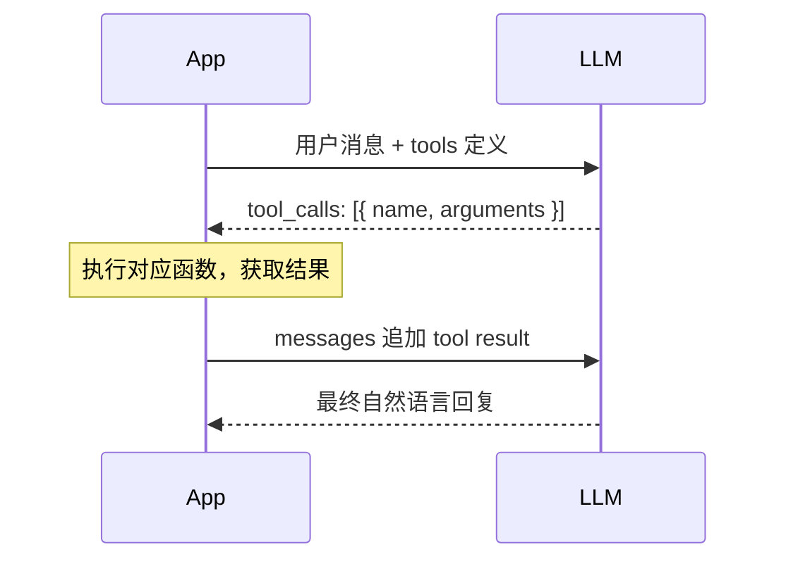

# Function Calling 工具调用

大语言模型本身只能处理文本，无法查询数据库、调用 API 或执行代码。Function Calling（也称 Tool Use）弥补了这个缺口——它让模型在需要时"请求"调用外部函数，由应用层执行后再把结果回传，从而实现真正与现实世界交互的 AI Agent。

## 核心概念

Function Calling 的本质是一种**结构化输出协议**：你在请求中告诉模型"有哪些工具可以用、每个工具接收什么参数"，模型决定是否调用以及如何调用，但**实际执行永远在你的代码里**，模型只是提出请求。

这一点经常被误解：模型不会直接执行函数，它只是输出一段结构化的 JSON，告诉你"我想调用 `get_weather`，参数是 `{ city: 'Beijing' }`"。

## 请求/响应循环



整个过程可能循环多次（multi-step tool use），每次模型都可以继续调用新工具，直到它认为信息足够，给出最终回复。

## 定义工具（Tool Schema）

工具使用 JSON Schema 描述参数结构，这部分需要足够清晰——模型会根据 `description` 判断何时使用该工具：

```typescript
import OpenAI from 'openai';

const tools: OpenAI.Chat.Completions.ChatCompletionTool[] = [
  {
    type: 'function',
    function: {
      name: 'get_weather',
      description: '查询指定城市的实时天气。当用户询问天气相关问题时调用。',
      parameters: {
        type: 'object',
        properties: {
          city: {
            type: 'string',
            description: '城市名称，例如 "北京" 或 "Shanghai"',
          },
          unit: {
            type: 'string',
            enum: ['celsius', 'fahrenheit'],
            description: '温度单位，默认 celsius',
          },
        },
        required: ['city'],
      },
    },
  },
];
```

关键点：
- `description` 越精准，模型调用越准确；这是提示工程的一部分
- `required` 数组声明必填参数
- 支持 `enum` 限制枚举值，减少模型幻觉

## 完整 TypeScript 实现

以下是一个包含完整工具调用循环的示例：

```typescript
const client = new OpenAI({ apiKey: process.env.OPENAI_API_KEY });

type Message = OpenAI.Chat.Completions.ChatCompletionMessageParam;

// 模拟的工具实现（实际项目中可能是 API 调用、数据库查询等）
async function executeFunction(name: string, args: Record<string, unknown>) {
  if (name === 'get_weather') {
    return { temp: 28, condition: '晴', city: args.city };
  }
  return { error: `Unknown tool: ${name}` };
}

async function runWithTools(userMessage: string): Promise<string> {
  const messages: Message[] = [{ role: 'user', content: userMessage }];

  // 工具调用循环
  while (true) {
    const response = await client.chat.completions.create({
      model: 'gpt-4o-mini', // 以官方文档为准
      messages,
      tools,
      tool_choice: 'auto',
    });

    const message = response.choices[0].message;
    messages.push(message);

    // 没有工具调用，模型给出了最终答案
    if (!message.tool_calls || message.tool_calls.length === 0) {
      return message.content ?? '';
    }

    // 执行所有工具调用（可并发）
    for (const toolCall of message.tool_calls) {
      const args = JSON.parse(toolCall.function.arguments);
      const result = await executeFunction(toolCall.function.name, args);

      messages.push({
        role: 'tool',
        tool_call_id: toolCall.id,
        content: JSON.stringify(result),
      });
    }
    // 循环继续，将结果发回模型
  }
}
```

## 多步工具调用（Agentic Loop）

复杂任务中，模型可能连续调用多个工具。例如"查询上海天气然后推荐穿衣"：

1. 第一轮：模型调用 `get_weather`
2. 获得天气数据后，模型基于结果给出穿衣建议（无需再次调用工具）

更复杂的场景可以是：先搜索、再提取、再计算。只要保持消息历史完整地循环回传，模型就能追踪上下文继续推理。建议设置 `MAX_STEPS`（如 10）防止意外死循环。

## 常见使用场景

| 场景 | 工具示例 |
|---|---|
| 实时数据查询 | 天气、股价、汇率 |
| 知识库检索 | 向量搜索、文档 RAG |
| 精确计算 | 计算器（避免 LLM 算术误差） |
| 数据库操作 | 查询用户订单、库存 |
| 第三方 API | 发送邮件、创建日历事件 |

## 最佳实践与注意事项

**tool_choice 参数**

- `"auto"`（默认）：模型自行决定是否调用
- `"none"`：禁止调用工具，强制文本回答
- `"required"`：强制必须调用至少一个工具
- 指定具体函数：`{ type: "function", function: { name: "get_weather" } }`

**安全考虑**

函数执行发生在开发者侧，对于敏感操作（删除数据、支付），执行前要加入用户确认环节，不能盲目信任模型输出的参数。

**参数验证**

模型生成的 arguments 有小概率格式错误，用 `zod` 校验可以提升健壮性：

```typescript
import { z } from 'zod';

const WeatherArgs = z.object({
  city: z.string(),
  unit: z.enum(['celsius', 'fahrenheit']).optional(),
});

const args = WeatherArgs.parse(JSON.parse(toolCall.function.arguments));
```

**工具数量**：通常不超过 10 个，过多会降低模型的选择准确率。

## 面试常问

**Q: Function Calling 和 prompt 里直接让模型输出 JSON 有什么区别？**

本质上都是结构化输出，但 Function Calling 是原生支持的协议——模型经过专门训练，输出更稳定；同时框架层面提供了 `tool_call_id` 跟踪机制，多工具并发调用时不会混乱。Prompt 输出 JSON 则完全依赖提示工程，可靠性较低。

**Q: 多个工具可以并发调用吗？**

模型在一次响应中可以返回多个 `tool_calls`（数组形式）。应用层可以并发执行所有工具（`Promise.all`），收集全部结果后一起追加到 messages，再发起下一轮请求，效率更高。

**Q: tool 和 function 是什么关系？**

目前主流 API 中，tool 是 function 的容器，`type` 固定为 `"function"`。这是为了未来扩展其他工具类型（如代码解释器）预留的结构设计。
