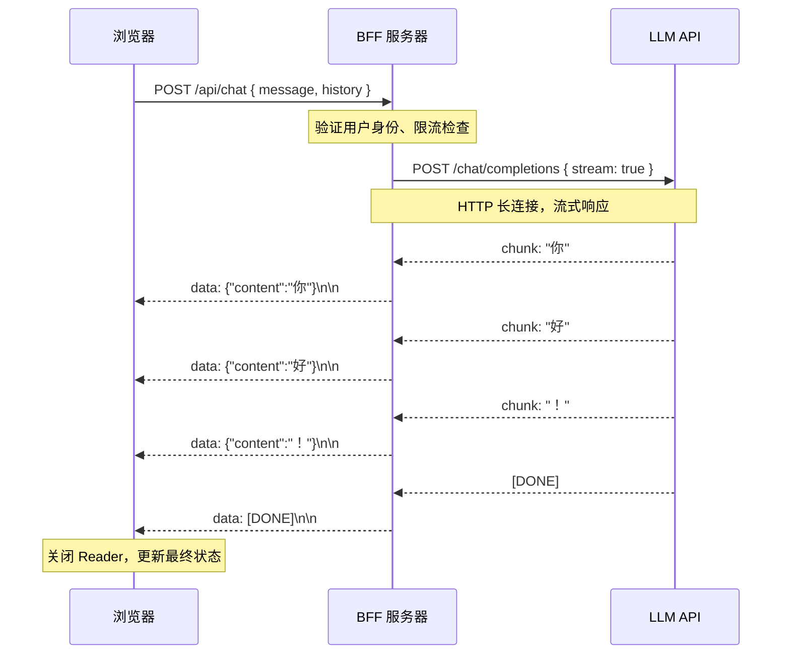

大语言模型生成文本是逐 token 输出的，如果等全部生成完再返回，用户面对的是长达数秒甚至数十秒的空白等待。SSE（Server-Sent Events）让服务端能将 token 实时推送到浏览器，用户感知到文字"流"出来，体验提升显著。

## 为什么流式响应对 LLM 至关重要

衡量 LLM 响应体验的关键指标不是总生成时间，而是 **TTFT（Time to First Token，首 token 时延）**——用户从提交问题到看到第一个字所需的时间。

- **非流式**：TTFT = 全文生成时间（可能 10-30 秒），用户面对空白页面
- **流式**：TTFT = 通常 300-800ms，用户立即看到输出开始，感知等待时间大幅降低

实际延迟（Actual Latency）没有变化，但感知延迟（Perceived Latency）显著改善——这是流式响应的核心价值。

## SSE 协议深度解析

SSE 是基于 HTTP 的单向推送协议，服务端通过持续不断地写入响应体来推送事件。

### HTTP 响应头

```
HTTP/1.1 200 OK
Content-Type: text/event-stream
Cache-Control: no-cache
Connection: keep-alive
X-Accel-Buffering: no   ← 关键：告知 Nginx 不要缓冲响应
```

`X-Accel-Buffering: no` 在经过 Nginx 反向代理时至关重要——不设置的话 Nginx 默认会缓冲响应，导致流式效果失效。

### 事件格式

SSE 消息由若干字段行 + 一个空行组成：

```
event: customType\n       ← 可选：事件类型（默认 message）
id: 42\n                  ← 可选：事件 ID，用于断点续传
retry: 3000\n             ← 可选：断线后重连等待时间（毫秒）
data: {"content":"你"}\n  ← 必须：消息数据
\n                        ← 空行：标志一条消息结束
```

多行数据用多个 `data:` 行表示，浏览器会自动拼接（用换行符连接）：

```
data: 第一行\n
data: 第二行\n
\n
```

以 `:` 开头的行是注释，浏览器忽略（常用于保持连接活跃的心跳包）：

```
: heartbeat\n
\n
```

LLM 流式 API 通常每个 chunk 发一条 `data:` 行，内容是 JSON，遵循 OpenAI Chat Completions 的 `delta` 模式。流结束时发送 `data: [DONE]`。

### 连接管理

- 浏览器 `EventSource` 会在连接断开后**自动重连**，间隔由 `retry` 字段指定
- 每次重连时，浏览器会携带 `Last-Event-ID` 请求头，服务端可据此断点续传
- LLM 场景通常不需要断点续传，让用户重新提问即可

## 整体数据流



## 服务端实现

### Node.js / Express

```typescript
import express from 'express';
import OpenAI from 'openai';

const app = express();
app.use(express.json());

const openai = new OpenAI({ apiKey: process.env.OPENAI_API_KEY });

app.post('/api/chat', async (req, res) => {
  const { message } = req.body;

  // SSE 必须的响应头
  res.setHeader('Content-Type', 'text/event-stream');
  res.setHeader('Cache-Control', 'no-cache');
  res.setHeader('Connection', 'keep-alive');
  res.setHeader('X-Accel-Buffering', 'no'); // 关键：禁止 Nginx 缓冲

  // 检测客户端断开，终止上游请求
  let aborted = false;
  req.on('close', () => {
    aborted = true;
  });

  try {
    const stream = await openai.chat.completions.create({
      model: 'gpt-4o-mini',
      messages: [{ role: 'user', content: message }],
      stream: true,
    });

    for await (const chunk of stream) {
      if (aborted) {
        // 客户端已断开，停止消耗上游 token
        stream.controller.abort();
        break;
      }
      const delta = chunk.choices[0]?.delta?.content;
      if (delta) {
        res.write(`data: ${JSON.stringify({ content: delta })}\n\n`);
      }
    }

    if (!aborted) {
      res.write('data: [DONE]\n\n');
    }
  } catch (error) {
    if (!aborted) {
      res.write(`data: ${JSON.stringify({ error: 'Stream failed' })}\n\n`);
    }
  } finally {
    res.end();
  }
});
```

### Next.js App Router

Next.js App Router 的 Route Handler 返回 `ReadableStream`，框架负责设置 chunked transfer 传输：

```typescript
// app/api/chat/route.ts
import OpenAI from 'openai';

const openai = new OpenAI({ apiKey: process.env.OPENAI_API_KEY });

export async function POST(req: Request) {
  const { message } = await req.json();
  const encoder = new TextEncoder();

  // 通过 AbortController 传递客户端取消信号到上游
  const abortController = new AbortController();

  // req.signal 在客户端断开时触发
  req.signal.addEventListener('abort', () => {
    abortController.abort();
  });

  const stream = new ReadableStream({
    async start(controller) {
      try {
        const llmStream = await openai.chat.completions.create(
          {
            model: 'gpt-4o-mini',
            messages: [{ role: 'user', content: message }],
            stream: true,
          },
          { signal: abortController.signal }
        );

        for await (const chunk of llmStream) {
          const delta = chunk.choices[0]?.delta?.content;
          if (delta) {
            controller.enqueue(
              encoder.encode(`data: ${JSON.stringify({ content: delta })}\n\n`)
            );
          }
        }

        controller.enqueue(encoder.encode('data: [DONE]\n\n'));
      } catch (err) {
        // AbortError 是正常取消，不需要写错误事件
        if (!(err instanceof Error && err.name === 'AbortError')) {
          controller.enqueue(
            encoder.encode(`data: ${JSON.stringify({ error: 'Stream failed' })}\n\n`)
          );
        }
      } finally {
        controller.close();
      }
    },
  });

  return new Response(stream, {
    headers: {
      'Content-Type': 'text/event-stream',
      'Cache-Control': 'no-cache',
      'X-Accel-Buffering': 'no',
    },
  });
}
```

### Hono（Edge 兼容）

Hono 的 `streamSSE` 辅助函数适合部署在 Cloudflare Workers / Vercel Edge 的场景：

```typescript
import { Hono } from 'hono';
import { streamSSE } from 'hono/streaming';
import OpenAI from 'openai';

const app = new Hono();
const openai = new OpenAI({ apiKey: process.env.OPENAI_API_KEY });

app.post('/api/chat', (c) => {
  const body = c.req.json();

  return streamSSE(c, async (stream) => {
    const { message } = await body;

    const llmStream = await openai.chat.completions.create({
      model: 'gpt-4o-mini',
      messages: [{ role: 'user', content: message }],
      stream: true,
    });

    for await (const chunk of llmStream) {
      const delta = chunk.choices[0]?.delta?.content;
      if (delta) {
        // streamSSE 自动处理 SSE 格式
        await stream.writeSSE({ data: JSON.stringify({ content: delta }) });
      }
    }

    await stream.writeSSE({ data: '[DONE]' });
  });
});
```

## 客户端消费

### 方式一：EventSource API（局限场景）

浏览器原生 API，使用简单，但有严重限制：

```typescript
// ❌ EventSource 只支持 GET，无法携带请求体
const source = new EventSource('/api/stream?userId=123');

source.onmessage = (event) => {
  if (event.data === '[DONE]') {
    source.close();
    return;
  }
  const { content } = JSON.parse(event.data);
  appendToUI(content);
};

// 监听自定义事件类型
source.addEventListener('error-event', (event) => {
  console.error('Stream error:', event.data);
  source.close();
});

source.onerror = () => source.close();
```

`EventSource` 不适合 LLM 聊天场景，因为无法通过 POST 发送对话历史。

### 方式二：fetch + ReadableStream（推荐）

支持 POST、自定义请求头，适合绝大多数 LLM 场景：

```typescript
async function streamChat(
  message: string,
  signal: AbortSignal,
  onChunk: (text: string) => void
): Promise<void> {
  const response = await fetch('/api/chat', {
    method: 'POST',
    headers: { 'Content-Type': 'application/json' },
    body: JSON.stringify({ message }),
    signal, // 传入 AbortSignal 支持取消
  });

  if (!response.ok) {
    throw new Error(`HTTP ${response.status}: ${response.statusText}`);
  }
  if (!response.body) {
    throw new Error('No response body');
  }

  const reader = response.body.getReader();
  const decoder = new TextDecoder();
  let buffer = ''; // 关键：用于拼接不完整的行

  try {
    while (true) {
      const { done, value } = await reader.read();
      if (done) break;

      // 将新数据追加到缓冲区
      buffer += decoder.decode(value, { stream: true });

      // 按完整行处理（以 \n 分割）
      const lines = buffer.split('\n');

      // 最后一个元素可能是不完整的行，保留到下次处理
      buffer = lines.pop() ?? '';

      for (const line of lines) {
        if (!line.startsWith('data: ')) continue;
        const payload = line.slice(6).trim();
        if (payload === '[DONE]') return;
        try {
          const { content } = JSON.parse(payload) as { content?: string };
          if (content) onChunk(content);
        } catch {
          // 忽略无法解析的行
        }
      }
    }
  } finally {
    reader.releaseLock();
  }
}
```

### 为什么朴素的 `split('\n')` 会漏数据

```mermaid
flowchart TD
    A["网络层 chunk 1\n'data: {\"co'"] --> C[TextDecoder]
    B["网络层 chunk 2\n'ntent\":\"你\"}\n\ndata: {\"content\":\"好\"}\n\n'"] --> C
    C --> D["buffer 拼接结果\n'data: {\"content\":\"你\"}\n\ndata: {\"content\":\"好\"}\n\n'"]
    D --> E["split('\n') 后正确解析"]

    A2["❌ 朴素做法：直接对 chunk 1 split"] --> F["只有 'data: {\"co'"]
    F --> G["JSON.parse 失败，丢失 token"]

    style A2 fill:#f8d7da,stroke:#f5c6cb
    style G fill:#f8d7da,stroke:#f5c6cb
    style E fill:#d4edda,stroke:#28a745
```

网络层的 chunk 边界和 SSE 消息边界**完全不对齐**。一个 `reader.read()` 调用返回的数据可能截断一条 SSE 消息，也可能包含多条完整消息。必须通过 buffer 拼接机制，以 `\n` 为分隔符逐行处理。

## 完整的 TypeScript SSE 解析器

```typescript
/**
 * 健壮的 SSE 解析器，处理：
 * 1. 跨 chunk 的不完整行
 * 2. 多行 data 字段
 * 3. 注释行（: heartbeat）
 * 4. 自定义 event 类型
 */
interface SSEEvent {
  type: string;   // event 字段，默认 'message'
  data: string;   // 拼接后的完整 data
  id?: string;    // 事件 ID
}

async function* parseSSEStream(
  body: ReadableStream<Uint8Array>
): AsyncGenerator<SSEEvent> {
  const reader = body.getReader();
  const decoder = new TextDecoder();

  let buffer = '';
  // 当前正在累积的事件字段
  let eventType = 'message';
  let dataLines: string[] = [];
  let eventId: string | undefined;

  try {
    while (true) {
      const { done, value } = await reader.read();
      if (done) break;

      buffer += decoder.decode(value, { stream: true });

      // 按行处理，保留不完整的尾行
      const lines = buffer.split('\n');
      buffer = lines.pop() ?? '';

      for (const line of lines) {
        // 空行 → 派发当前累积的事件
        if (line === '') {
          if (dataLines.length > 0) {
            yield {
              type: eventType,
              data: dataLines.join('\n'),
              id: eventId,
            };
          }
          // 重置当前事件状态
          eventType = 'message';
          dataLines = [];
          eventId = undefined;
          continue;
        }

        // 注释行，忽略
        if (line.startsWith(':')) continue;

        // 解析字段
        const colonIndex = line.indexOf(':');
        if (colonIndex === -1) continue;

        const field = line.slice(0, colonIndex);
        // 字段值前可能有一个空格
        const value = line.slice(colonIndex + 1).replace(/^ /, '');

        switch (field) {
          case 'data':
            dataLines.push(value);
            break;
          case 'event':
            eventType = value;
            break;
          case 'id':
            eventId = value;
            break;
          case 'retry':
            // retry 字段：建议重连间隔（毫秒），可选处理
            break;
        }
      }
    }
  } finally {
    reader.releaseLock();
  }
}

// 使用示例
async function consumeStream(response: Response, onChunk: (text: string) => void) {
  if (!response.body) return;

  for await (const event of parseSSEStream(response.body)) {
    if (event.data === '[DONE]') break;
    try {
      const { content } = JSON.parse(event.data) as { content?: string };
      if (content) onChunk(content);
    } catch {
      // 忽略非 JSON 数据
    }
  }
}
```

## AbortController：用户取消与组件卸载

```typescript
// useStreamChat 中的完整 AbortController 使用模式
import { useState, useRef, useCallback } from 'react';

export function useStreamChat() {
  const [content, setContent] = useState('');
  const [isStreaming, setIsStreaming] = useState(false);
  const [error, setError] = useState<string | null>(null);
  const abortControllerRef = useRef<AbortController | null>(null);

  const startStream = useCallback(async (message: string) => {
    // 取消上一次未完成的请求
    abortControllerRef.current?.abort();

    const controller = new AbortController();
    abortControllerRef.current = controller;

    setContent('');
    setIsStreaming(true);
    setError(null);

    try {
      const response = await fetch('/api/chat', {
        method: 'POST',
        headers: { 'Content-Type': 'application/json' },
        body: JSON.stringify({ message }),
        signal: controller.signal, // 关联 AbortSignal
      });

      if (!response.ok) throw new Error(`HTTP ${response.status}`);
      if (!response.body) throw new Error('No stream body');

      const reader = response.body.getReader();
      const decoder = new TextDecoder();
      let buffer = '';

      while (true) {
        const { done, value } = await reader.read();
        if (done) break;

        buffer += decoder.decode(value, { stream: true });
        const lines = buffer.split('\n');
        buffer = lines.pop() ?? '';

        for (const line of lines) {
          if (!line.startsWith('data: ')) continue;
          const payload = line.slice(6).trim();
          if (payload === '[DONE]') return;
          try {
            const { content: delta } = JSON.parse(payload) as { content?: string };
            if (delta) setContent((prev) => prev + delta);
          } catch { /* 忽略 */ }
        }
      }
    } catch (err) {
      if (err instanceof Error && err.name === 'AbortError') {
        // 用户主动取消，不显示错误
        return;
      }
      setError(err instanceof Error ? err.message : '请求失败');
    } finally {
      setIsStreaming(false);
    }
  }, []);

  // 用户点击"停止"或组件卸载时调用
  const stopStream = useCallback(() => {
    abortControllerRef.current?.abort();
    setIsStreaming(false);
  }, []);

  return { content, isStreaming, error, startStream, stopStream };
}
```

**组件卸载清理**：

```typescript
useEffect(() => {
  return () => {
    // 组件卸载时终止进行中的请求，避免内存泄漏和状态更新
    stopStream();
  };
}, [stopStream]);
```

## 流中途出错与重连策略

流式传输过程中可能遭遇的错误：

```typescript
async function streamWithRetry(
  message: string,
  onChunk: (text: string) => void,
  maxRetries = 2
): Promise<void> {
  let attempt = 0;

  while (attempt <= maxRetries) {
    try {
      await streamChat(message, new AbortController().signal, onChunk);
      return; // 成功完成
    } catch (err) {
      attempt++;

      // AbortError 不重试
      if (err instanceof Error && err.name === 'AbortError') throw err;

      // 网络错误或 5xx 才重试
      if (attempt > maxRetries) throw err;

      // 指数退避
      await new Promise((r) => setTimeout(r, 500 * Math.pow(2, attempt - 1)));
    }
  }
}
```

## SSE vs 其他推送技术对比

| 对比维度 | SSE | WebSocket | Long Polling | HTTP/2 Push |
|---|---|---|---|---|
| 通信方向 | 服务端 → 客户端（单向） | 双向全双工 | 客户端拉取 | 服务端推送 |
| 协议基础 | 标准 HTTP/1.1 | 独立协议（ws://） | 标准 HTTP | HTTP/2 |
| 断线重连 | 浏览器自动重连 | 需手动实现 | 客户端控制 | 不支持 |
| 自定义请求头 | fetch 方式支持 | 握手时支持 | 完全支持 | 受限 |
| 代理/CDN 兼容性 | 极好 | 需特殊配置 | 好 | 差（少量支持） |
| 实现复杂度 | 低 | 中-高 | 低 | 高 |
| 适合 LLM 场景 | 最佳选择 | 过度设计 | 不推荐（延迟高） | 不推荐（浏览器支持差） |
| 适合其他场景 | 通知、进度更新 | 实时协作、游戏 | 低频状态轮询 | 静态资源预推送 |

**LLM 流式输出选 SSE 的理由**：请求是单向的（服务端推 token），HTTP 基础设施（Nginx、CDN、负载均衡）天然支持，无需协议升级，代码复杂度最低。

## 生产环境注意事项

### Nginx 配置

```nginx
location /api/chat {
    proxy_pass http://backend;

    # SSE 关键配置
    proxy_buffering off;          # 禁止缓冲，实时转发响应
    proxy_cache off;
    proxy_read_timeout 300s;      # 超时设置：比最长 LLM 响应时间更长
    proxy_send_timeout 300s;
    proxy_http_version 1.1;       # HTTP/1.1 支持 keep-alive
    proxy_set_header Connection ''; # 移除 Connection: close

    # 转发客户端真实 IP
    proxy_set_header X-Real-IP $remote_addr;
    proxy_set_header X-Forwarded-For $proxy_add_x_forwarded_for;

    # 禁止 Nginx 缓冲（双重保险）
    add_header X-Accel-Buffering no;
}
```

### Keep-Alive 设置

```nginx
# 上游长连接，减少握手开销
upstream backend {
    server 127.0.0.1:3000;
    keepalive 32;
}
```

### CDN 直通

大多数 CDN（Cloudflare、Fastly 等）默认会缓冲 SSE 响应，需要：
- 配置路由规则绕过 CDN 缓存（设置 `Cache-Control: no-store`）
- 或在 CDN 规则中将 `/api/chat` 路径设置为 "bypass cache"
- Cloudflare 需要开启 "Disable Buffering" 选项

### 心跳包保活

长时间无输出时（如 LLM 在思考），连接可能被中间件超时断开：

```typescript
// 每 20 秒发送一条注释行作为心跳
const heartbeatInterval = setInterval(() => {
  if (!res.writableEnded) {
    res.write(': heartbeat\n\n');
  }
}, 20_000);

// 流结束时清除心跳
try {
  // ... 流式处理
} finally {
  clearInterval(heartbeatInterval);
  res.end();
}
```

## 常见错误

**1. 直接对 chunk 执行 `split('\n')` 不用缓冲区**：导致跨 chunk 的 SSE 消息被截断，JSON.parse 失败，丢失 token。

**2. 忘记设置 `X-Accel-Buffering: no`**：经过 Nginx 的响应被缓冲，用户看不到流式效果，像非流式一样等待。

**3. `TextDecoder` 不加 `{ stream: true }`**：多字节字符（如中文）跨 chunk 时会出现乱码。

**4. 组件卸载后继续调用 setState**：流式请求进行中组件被卸载，`onChunk` 回调仍在更新已卸载组件的状态，导致内存泄漏。必须在 `useEffect` 清理函数中调用 `abort()`。

**5. EventSource 用于 POST 场景**：EventSource 只支持 GET，无法发送请求体，LLM 聊天场景必须用 `fetch + ReadableStream`。

## 最佳实践

- 始终在客户端实现 buffer 拼接，绝不假设 chunk 边界与 SSE 消息边界对齐
- 服务端在捕获到 `req.on('close')` 时立即终止上游 LLM 调用，避免消耗不必要的 token
- 生产 Nginx 配置务必设置 `proxy_buffering off` 和足够长的 `proxy_read_timeout`
- 用 `AbortController` 实现取消，在 React useEffect 清理函数中调用 `abort()`
- 推理模型（如 DeepSeek-R1）思考时间可能很长，心跳包保活不可省略
- 对流中途的错误（5xx、网络抖动）实现有限次数的重试，不要无限重试

## 面试常问

**Q：TTFT 是什么，为什么对 LLM 产品重要？**

A：TTFT（Time to First Token）是用户提交问题到看到第一个输出字符所需的时间。LLM 实际生成时间可能需要 10-30 秒，但流式响应让用户在 300-800ms 内就看到第一个 token，感知等待时间大幅降低。这是流式响应最核心的价值——改变的是感知延迟，不是实际延迟。

**Q：SSE 和 WebSocket 的本质区别是什么？LLM 场景为什么选 SSE？**

A：WebSocket 是双向全双工协议，需要握手升级；SSE 是单向推送，基于普通 HTTP。LLM 流式输出是典型的单向场景：客户端发一次请求，服务端持续推 token。WebSocket 的双向能力用不上，而 SSE 更轻量，对 Nginx、CDN、负载均衡等 HTTP 基础设施天然兼容，实现复杂度更低。

**Q：为什么不能用朴素的 `text.split('\n')` 解析 SSE？**

A：`reader.read()` 返回的是网络层的原始字节块，其边界与 SSE 消息边界完全无关。一次读取可能包含多条完整 SSE 消息，也可能把一条消息截断在两次读取之间。必须维护一个 buffer，将新读取的数据追加到 buffer，再从 buffer 中按完整行逐条提取和解析 SSE 消息。

**Q：AbortController 在 SSE 场景中的完整作用链是什么？**

A：浏览器端 `controller.abort()` → fetch 抛出 AbortError，`reader.read()` 停止 → 浏览器关闭 TCP 连接 → 服务端 `req` 触发 `close` 事件（Express）或 `req.signal` 触发 abort（Next.js）→ 服务端终止对上游 LLM 的请求。整条链路打通后，用户取消操作才能真正停止 token 消耗。

**Q：SSE 流在经过 Nginx 时为什么会失效？如何修复？**

A：Nginx 默认开启 `proxy_buffering`，会将上游响应缓存后再一次性转发给客户端，导致流式效果消失。修复方案：在 Nginx 的 location 配置中设置 `proxy_buffering off`，或在响应头中添加 `X-Accel-Buffering: no`（Nginx 识别此头后会禁止缓冲该响应）。同时要将 `proxy_read_timeout` 调高，避免长时间生成被超时中断。
