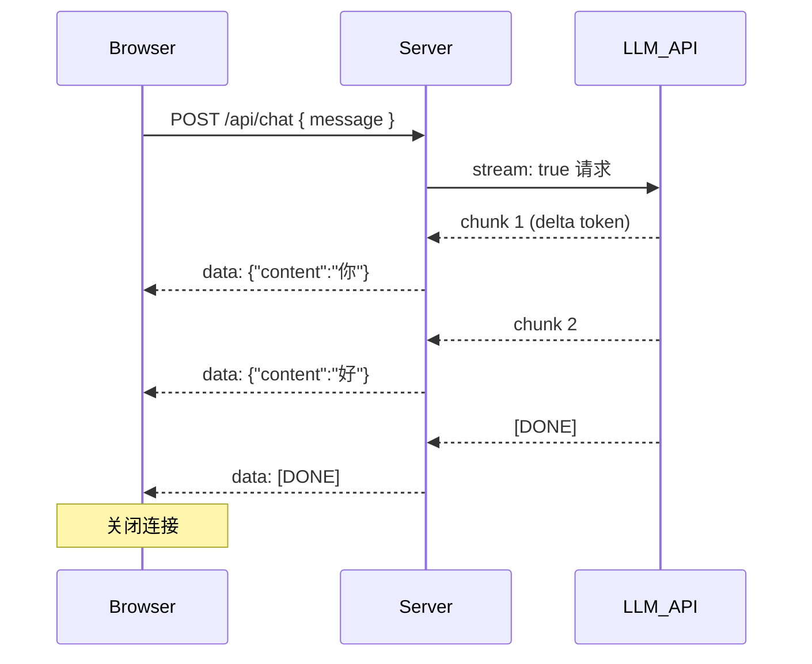

大语言模型生成文本是逐 token 输出的，如果等全部生成完再返回，用户面对的是长达数秒的空白等待。SSE（Server-Sent Events）让服务端能将 token 实时推送到浏览器，用户看到文字"流"出来，感知延迟从"等待完成"变成"立刻开始"，体验提升显著。

## SSE 协议基础

SSE 是基于 HTTP 的单向推送协议，响应 Content-Type 为 `text/event-stream`。服务端持续写入文本，客户端通过 `EventSource` 或 `fetch + ReadableStream` 接收。

消息格式极简：

```
data: 这是一条消息\n\n
```

每条消息以两个换行结束。可选字段：

```
event: customEvent
data: {"key": "value"}
id: 42

```

LLM 流式 API 通常每个 chunk 发一条 `data:` 行，内容是 JSON，字段结构遵循 OpenAI Chat Completions 的 `delta` 模式。流结束时发送 `data: [DONE]`。

## 整体数据流



## 服务端实现

### Node.js / Express

```typescript
import express from 'express';
import OpenAI from 'openai';

const app = express();
app.use(express.json());

const openai = new OpenAI({ apiKey: process.env.OPENAI_API_KEY });

app.post('/api/chat', async (req, res) => {
  const { message } = req.body;

  // 设置 SSE 响应头
  res.setHeader('Content-Type', 'text/event-stream');
  res.setHeader('Cache-Control', 'no-cache');
  res.setHeader('Connection', 'keep-alive');

  try {
    const stream = await openai.chat.completions.create({
      model: 'gpt-4o-mini',
      messages: [{ role: 'user', content: message }],
      stream: true,
    });

    for await (const chunk of stream) {
      const delta = chunk.choices[0]?.delta?.content;
      if (delta) {
        // SSE 格式：data: <内容>\n\n
        res.write(`data: ${JSON.stringify({ content: delta })}\n\n`);
      }
    }

    res.write('data: [DONE]\n\n');
  } catch (error) {
    res.write(`data: ${JSON.stringify({ error: 'Stream failed' })}\n\n`);
  } finally {
    res.end();
  }
});
```

### Next.js App Router

Next.js 的 Route Handler 可以直接返回 `ReadableStream`，无需手动管理响应头：

```typescript
// app/api/chat/route.ts
import OpenAI from 'openai';

const openai = new OpenAI({ apiKey: process.env.OPENAI_API_KEY });

export async function POST(req: Request) {
  const { message } = await req.json();

  const encoder = new TextEncoder();

  const stream = new ReadableStream({
    async start(controller) {
      try {
        const llmStream = await openai.chat.completions.create({
          model: 'gpt-4o-mini',
          messages: [{ role: 'user', content: message }],
          stream: true,
        });

        for await (const chunk of llmStream) {
          const delta = chunk.choices[0]?.delta?.content;
          if (delta) {
            controller.enqueue(
              encoder.encode(`data: ${JSON.stringify({ content: delta })}\n\n`)
            );
          }
        }

        controller.enqueue(encoder.encode('data: [DONE]\n\n'));
      } catch {
        controller.enqueue(
          encoder.encode(`data: ${JSON.stringify({ error: 'failed' })}\n\n`)
        );
      } finally {
        controller.close();
      }
    },
  });

  return new Response(stream, {
    headers: {
      'Content-Type': 'text/event-stream',
      'Cache-Control': 'no-cache',
    },
  });
}
```

## 客户端消费

### 方式一：EventSource（简单场景）

`EventSource` 是浏览器原生 API，但只支持 GET 请求，无法发送请求体，**不适合需要传参的聊天场景**：

```typescript
const source = new EventSource('/api/stream');
source.onmessage = (event) => {
  if (event.data === '[DONE]') {
    source.close();
    return;
  }
  const { content } = JSON.parse(event.data);
  appendToUI(content);
};
source.onerror = () => source.close();
```

### 方式二：fetch + ReadableStream（推荐）

支持 POST 请求，更灵活，适合绝大多数 LLM 场景：

```typescript
async function streamChat(message: string, onChunk: (text: string) => void) {
  const response = await fetch('/api/chat', {
    method: 'POST',
    headers: { 'Content-Type': 'application/json' },
    body: JSON.stringify({ message }),
  });

  if (!response.body) throw new Error('No response body');

  const reader = response.body.getReader();
  const decoder = new TextDecoder();

  while (true) {
    const { done, value } = await reader.read();
    if (done) break;

    const text = decoder.decode(value, { stream: true });
    // 按行解析 SSE 格式
    for (const line of text.split('\n')) {
      if (!line.startsWith('data: ')) continue;
      const payload = line.slice(6).trim();
      if (payload === '[DONE]') return;
      try {
        const { content } = JSON.parse(payload);
        if (content) onChunk(content);
      } catch {
        // 忽略非 JSON 行
      }
    }
  }
}

// React 中的使用示例
const [output, setOutput] = useState('');
await streamChat(input, (chunk) => {
  setOutput((prev) => prev + chunk);
});
```

## 错误处理与资源清理

流式场景有几个容易忽略的问题：

**用户中途取消请求**：使用 `AbortController`，在组件卸载或用户点击"停止"时中止请求，避免后台继续消耗 token：

```typescript
const controller = new AbortController();

fetch('/api/chat', {
  method: 'POST',
  signal: controller.signal,
  body: JSON.stringify({ message }),
});

// 取消
controller.abort();
```

服务端检测到请求断开后，应终止对上游 LLM API 的请求：

```typescript
req.on('close', () => {
  stream.controller.abort(); // 视 SDK 支持情况而定
});
```

**网络抖动重连**：SSE 协议原生支持 `id` 字段配合 `Last-Event-ID` 请求头实现断点续传，但 LLM 场景通常不需要，让用户重新提问即可。

## SSE vs WebSocket

| 对比维度 | SSE | WebSocket |
|---|---|---|
| 通信方向 | 服务端 → 客户端（单向） | 双向 |
| 协议 | 标准 HTTP | 独立协议，需握手升级 |
| 断线重连 | 浏览器自动重连 | 需手动实现 |
| 实现复杂度 | 低 | 较高 |
| 适合场景 | LLM 流式输出、通知推送 | 实时协作、游戏、聊天室 |

对于 LLM 流式输出，SSE 是更自然的选择：请求是单向的（服务端推送 token），HTTP 基础设施（CDN、负载均衡）天然支持，复杂度也更低。

## 面试常问

**Q: SSE 和轮询有什么区别？**

轮询由客户端定时发起请求，有延迟且浪费连接。SSE 是服务端主动推送，连接建立后持续复用，延迟低、效率高。

**Q: 为什么 LLM 场景不用 WebSocket？**

LLM 流式输出是典型的单向推送：用户发一条消息，服务端流式返回响应。WebSocket 的双向能力在这里是多余的，而 SSE 更轻量，基础设施兼容性更好。

**Q: `ReadableStream` 解析 SSE 时为什么要按行处理？**

`reader.read()` 返回的是网络层的原始 chunk，一次读取可能包含多个 SSE 消息，也可能一条消息被截断跨越两次读取。必须按 `\n` 分割并拼接不完整行，才能正确解析每条 `data:` 消息。
