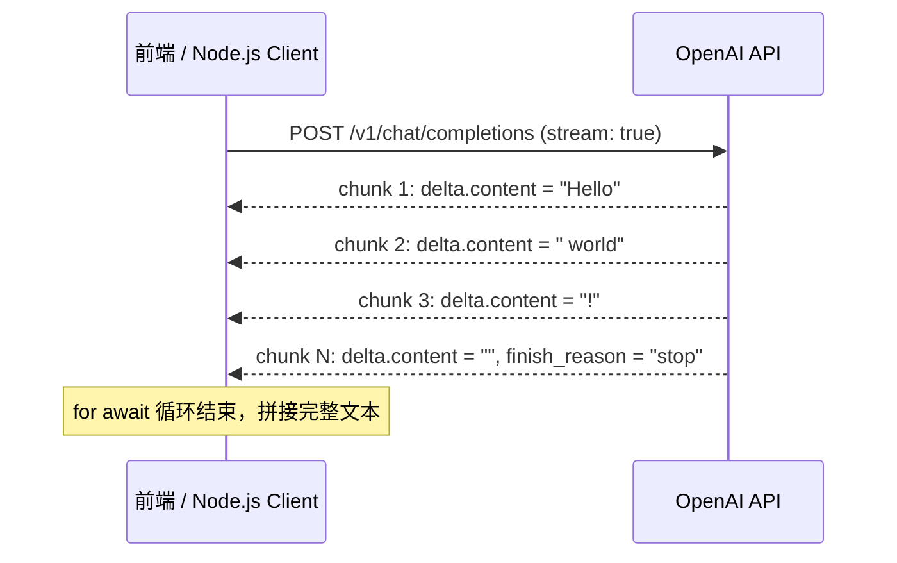
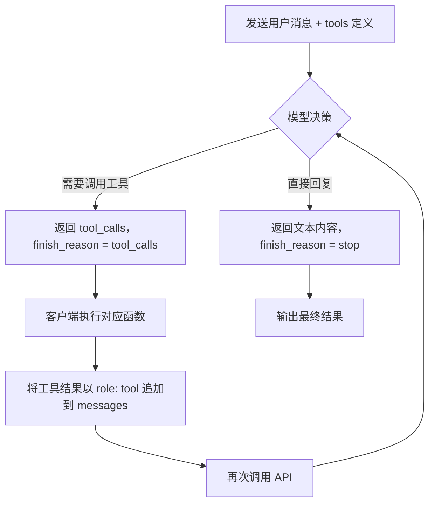

OpenAI 官方提供了 Node.js / TypeScript SDK（npm 包名 `openai`），让前端与全栈开发者可以用几行代码调用 GPT 系列模型完成文本生成、多轮对话、工具调用（Tool Calling）等任务。本文从安装到高阶用法系统梳理，适合有 TypeScript 基础、初次或进阶使用 OpenAI SDK 的开发者。

## 安装与客户端初始化（Installation & Client Init）

```bash
npm install openai
```

### 基础初始化

```typescript
import OpenAI from 'openai';

// SDK 会自动读取 OPENAI_API_KEY 环境变量，apiKey 可省略
const client = new OpenAI({
  apiKey: process.env.OPENAI_API_KEY,
});
```

### 组织 / 项目支持与自定义代理（Org / Project / Custom baseURL）

企业账号通常需要指定 Organization ID 和 Project ID；国内开发者或私有部署场景常需要替换 `baseURL` 以指向代理地址：

```typescript
const client = new OpenAI({
  apiKey: process.env.OPENAI_API_KEY,
  organization: process.env.OPENAI_ORG_ID,      // 可选：组织 ID
  project: process.env.OPENAI_PROJECT_ID,        // 可选：项目 ID
  baseURL: 'https://your-proxy.example.com/v1',  // 代理 / 私有部署地址
  timeout: 30_000,   // 请求超时，单位 ms
  maxRetries: 2,     // SDK 内置重试次数（非 429 场景）
});
```

> 以官方文档为准：`organization`、`project` 字段的实际键名请核对当前 SDK 版本。

**最佳实践：**
- 所有密钥通过环境变量注入，配合 `.env` + `dotenv`，绝不硬编码。
- `baseURL` 末尾不需要加 `/`，SDK 会自动拼接路径。

---

## Chat Completions API — 消息结构与多轮对话

### messages 数组结构（Message Roles）

Chat Completions API 的核心是 `messages` 数组，每条消息包含 `role` 和 `content`：

| Role | 说明 | 使用场景 |
|------|------|----------|
| `system` | 系统指令，设定模型行为和角色 | 放在数组第一位，定义 Persona、约束格式 |
| `user` | 用户输入 | 每轮用户消息 |
| `assistant` | 模型历史回复 | 多轮对话时追加，让模型保持上下文 |
| `tool` | 工具调用结果 | Tool Calling 流程中返回工具执行结果 |

```typescript
import OpenAI from 'openai';

const client = new OpenAI();

const response = await client.chat.completions.create({
  model: 'gpt-4o',   // 可用模型以官方文档为准
  messages: [
    { role: 'system', content: '你是一个前端开发助手，回答简洁专业，默认使用中文。' },
    { role: 'user',   content: '解释一下 JavaScript 的事件循环。' },
  ],
  temperature: 0.7,
  max_tokens: 1024,
});

const text = response.choices[0].message.content;
console.log(text);
```

### 多轮对话管理（Multi-turn Conversation）

OpenAI 的 Chat Completions 本身是**无状态**的，多轮对话需要客户端自己维护 `messages` 历史，每次请求都携带完整上下文：

```typescript
import OpenAI from 'openai';

const client = new OpenAI();

// 使用 SDK 导出的类型，类型安全
const history: OpenAI.ChatCompletionMessageParam[] = [
  { role: 'system', content: '你是一个代码审查专家。' },
];

async function chat(userInput: string): Promise<string> {
  history.push({ role: 'user', content: userInput });

  const response = await client.chat.completions.create({
    model: 'gpt-4o',
    messages: history,
  });

  const reply = response.choices[0].message.content ?? '';
  // 将模型回复追加进历史，下次请求携带
  history.push({ role: 'assistant', content: reply });
  return reply;
}

// 示例调用
await chat('帮我审查这段代码的安全性：...');
await chat('如果我要修复刚才的问题，应该怎么做？');
```

**注意：** 随着对话轮次增加，`history` 会越来越长，超过模型 context window 时会报 `400` 错误。生产环境需做**上下文截断（Context Truncation）** 或**历史摘要（History Summarization）**策略。

---

## Responses API — 有状态会话（Stateful Sessions）

Responses API 是 OpenAI 推出的较新接口，内置**服务端会话持久化（Server-side Session Persistence）**，无需客户端手动维护 `messages` 数组。

| 特性 | Chat Completions | Responses API |
|------|-----------------|---------------|
| 状态管理 | 客户端维护 messages | 服务端维护，通过 `session_id` / `previous_response_id` 关联 |
| 适用场景 | 精确控制对话历史 | 快速构建有状态助手、Agent |
| 工具支持 | 手动 Tool Calling | 内置 `file_search`、`code_interpreter` 等 |

```typescript
// 以下为概念骨架，具体字段以官方文档为准
const response = await client.responses.create({
  model: 'gpt-4o',
  input: '你好，帮我总结一下 React 18 的新特性',
});

// 继续同一会话
const followUp = await client.responses.create({
  model: 'gpt-4o',
  previous_response_id: response.id,  // 关联上一次响应
  input: '刚才说的并发特性能举个例子吗？',
});
```

> 以官方文档为准：Responses API 仍在持续演进，字段名与可用功能请以发布时的官方文档为准。

---

## Streaming 流式响应

### 基础流式调用

`stream: true` 后 `create()` 返回一个异步迭代器，可用 `for await...of` 逐块处理：

```typescript
const stream = await client.chat.completions.create({
  model: 'gpt-4o',
  messages: [{ role: 'user', content: '写一首关于编程的短诗。' }],
  stream: true,
});

let fullText = '';

for await (const chunk of stream) {
  const delta = chunk.choices[0]?.delta?.content ?? '';
  fullText += delta;
  process.stdout.write(delta); // 打字机效果

  // 检测结束原因
  const finishReason = chunk.choices[0]?.finish_reason;
  if (finishReason === 'stop') {
    console.log('\n--- 生成完成 ---');
  } else if (finishReason === 'length') {
    console.log('\n--- 已达 max_tokens 上限，回复被截断 ---');
  }
}
```

### 使用 AbortController 中断流

```typescript
const controller = new AbortController();

// 5 秒后中断
const timer = setTimeout(() => controller.abort(), 5000);

try {
  const stream = await client.chat.completions.create(
    {
      model: 'gpt-4o',
      messages: [{ role: 'user', content: '写一部长篇小说...' }],
      stream: true,
    },
    { signal: controller.signal }  // 传入 AbortSignal
  );

  for await (const chunk of stream) {
    process.stdout.write(chunk.choices[0]?.delta?.content ?? '');
  }
} catch (error) {
  if (error instanceof Error && error.name === 'AbortError') {
    console.log('用户中断了流式输出');
  } else {
    throw error;
  }
} finally {
  clearTimeout(timer);
}
```

**流式时序图（Sequence Diagram）：**



---

## Tool Calling — 工具调用（Function Calling）

Tool Calling 让模型可以"调用"开发者定义的函数，是构建 Agent 的核心机制。

### 工具调用完整流程图



### 定义工具（JSON Schema）

```typescript
import OpenAI from 'openai';

const client = new OpenAI();

const tools: OpenAI.ChatCompletionTool[] = [
  {
    type: 'function',
    function: {
      name: 'get_weather',
      description: '获取指定城市的当前天气信息',
      parameters: {
        type: 'object',
        properties: {
          city: {
            type: 'string',
            description: '城市名称，例如 "北京"、"上海"',
          },
          unit: {
            type: 'string',
            enum: ['celsius', 'fahrenheit'],
            description: '温度单位',
          },
        },
        required: ['city'],
      },
    },
  },
];
```

### 工具调用循环（Tool Call Loop）

```typescript
// 模拟工具执行函数
async function executeToolCall(name: string, args: Record<string, unknown>): Promise<string> {
  if (name === 'get_weather') {
    const { city } = args as { city: string };
    return JSON.stringify({ city, temperature: 25, condition: '晴天' });
  }
  throw new Error(`未知工具: ${name}`);
}

async function runAgentLoop(userMessage: string): Promise<string> {
  const messages: OpenAI.ChatCompletionMessageParam[] = [
    { role: 'user', content: userMessage },
  ];

  while (true) {
    const response = await client.chat.completions.create({
      model: 'gpt-4o',
      messages,
      tools,
      tool_choice: 'auto',  // 模型自动决定是否调用工具
    });

    const message = response.choices[0].message;
    messages.push(message);  // 追加 assistant 消息（含 tool_calls）

    // 判断是否结束
    if (response.choices[0].finish_reason === 'stop') {
      return message.content ?? '';
    }

    // 处理工具调用（支持并行调用 Parallel Tool Calls）
    if (message.tool_calls && message.tool_calls.length > 0) {
      const toolResults = await Promise.all(
        message.tool_calls.map(async (tc) => {
          const args = JSON.parse(tc.function.arguments) as Record<string, unknown>;
          const result = await executeToolCall(tc.function.name, args);
          return {
            role: 'tool' as const,
            tool_call_id: tc.id,
            content: result,
          };
        })
      );
      messages.push(...toolResults);
    }
  }
}

const answer = await runAgentLoop('北京今天天气怎么样？');
console.log(answer);
```

**关键点：** 多个工具调用通过 `Promise.all` 并行执行，显著减少延迟。

---

## 结构化输出（Structured Output）

`response_format: { type: 'json_schema' }` 配合 JSON Schema 可以约束模型输出为固定格式，推荐用 [zod](https://zod.dev/) 生成 Schema 并做运行时校验。

```typescript
import OpenAI from 'openai';
import { z } from 'zod';
import { zodToJsonSchema } from 'zod-to-json-schema';

const client = new OpenAI();

// 定义期望的输出结构
const ProductSchema = z.object({
  name: z.string().describe('产品名称'),
  price: z.number().describe('价格（人民币）'),
  features: z.array(z.string()).describe('主要特性列表'),
  inStock: z.boolean().describe('是否有货'),
});

type Product = z.infer<typeof ProductSchema>;

const response = await client.chat.completions.create({
  model: 'gpt-4o',   // 需要支持 Structured Output 的模型，以官方文档为准
  messages: [
    { role: 'user', content: '生成一个虚构的智能耳机产品信息' },
  ],
  response_format: {
    type: 'json_schema',
    json_schema: {
      name: 'product',
      strict: true,
      schema: zodToJsonSchema(ProductSchema, { target: 'openAi' }),
    },
  },
});

// 解析并校验
const raw = response.choices[0].message.content ?? '{}';
const parsed: Product = ProductSchema.parse(JSON.parse(raw));
console.log(parsed.name, parsed.price);
```

> 以官方文档为准：`strict: true` 模式下模型保证输出完全符合 Schema，但对 Schema 本身有约束（如不支持 `additionalProperties: true`），使用前仔细阅读官方限制说明。

**常见错误：**
- 忘记安装 `zod-to-json-schema`，或使用了不兼容的 schema 导致 `400` 错误。
- `strict: true` 时传入了 zod 的 `.optional()` 字段却没有在 schema 中声明 `nullable`，导致模型输出不一致。

---

## 错误处理与重试（Error Handling & Retry）

### APIError 子类（APIError Subclasses）

SDK 提供了层级化的错误类型：

```typescript
import OpenAI from 'openai';

const client = new OpenAI();

async function safeCreate() {
  try {
    return await client.chat.completions.create({
      model: 'gpt-4o',
      messages: [{ role: 'user', content: 'Hello' }],
    });
  } catch (error) {
    if (error instanceof OpenAI.APIError) {
      console.error('HTTP Status:', error.status);
      console.error('Error Code:', error.code);
      console.error('Message:', error.message);

      if (error instanceof OpenAI.RateLimitError) {
        // 429 — 请求频率超限或余额不足
      } else if (error instanceof OpenAI.AuthenticationError) {
        // 401 — API Key 无效
      } else if (error instanceof OpenAI.InternalServerError) {
        // 500/503 — 服务端错误，可重试
      } else if (error instanceof OpenAI.BadRequestError) {
        // 400 — 请求参数有误
      }
    }
    throw error;
  }
}
```

### 指数退避重试（Exponential Backoff）

针对 `429` 和 `5xx` 实现手动指数退避：

```typescript
async function withRetry<T>(
  fn: () => Promise<T>,
  maxAttempts = 4,
  baseDelayMs = 1000
): Promise<T> {
  for (let attempt = 1; attempt <= maxAttempts; attempt++) {
    try {
      return await fn();
    } catch (error) {
      const isRetryable =
        error instanceof OpenAI.RateLimitError ||
        error instanceof OpenAI.InternalServerError;

      if (!isRetryable || attempt === maxAttempts) throw error;

      const delay = baseDelayMs * 2 ** (attempt - 1) + Math.random() * 500;
      console.warn(`第 ${attempt} 次失败，${delay.toFixed(0)}ms 后重试...`);
      await new Promise((resolve) => setTimeout(resolve, delay));
    }
  }
  throw new Error('不可达'); // TypeScript 需要
}

// 使用
const result = await withRetry(() =>
  client.chat.completions.create({
    model: 'gpt-4o',
    messages: [{ role: 'user', content: 'Hello' }],
  })
);
```

> SDK 自带 `maxRetries` 选项，但仅针对网络错误自动重试；对 `429` 的退避需自行实现或使用第三方库（如 `p-retry`）。

---

## 关键参数表（Key Parameters）

以下参数均通过 `client.chat.completions.create()` 传入。以官方文档为准，不同模型对参数的支持和默认值可能有差异。

| 参数 | 类型 | 说明 | 典型值 |
|------|------|------|--------|
| `temperature` | `number` | 控制输出随机性，0 为确定性输出，越高越发散 | `0.7`（创意任务）、`0`（结构化提取）|
| `top_p` | `number` | 核采样，只从累计概率达 p 的 token 集合中采样 | `1`（默认，不截断）|
| `max_tokens` | `number` | 限制输出 token 数，超出则 `finish_reason = 'length'` | 视任务而定 |
| `stop` | `string \| string[]` | 遇到该字符串时停止生成 | `['\n\n']`、`['</output>']` |
| `n` | `number` | 同时生成几个候选回复，增加 token 消耗 | `1`（默认）|
| `frequency_penalty` | `number` | 惩罚已出现 token 的再次出现频率，减少重复 | `-2.0` ~ `2.0`，默认 `0` |
| `presence_penalty` | `number` | 惩罚已出现过的 token（无论频率），鼓励话题多样性 | `-2.0` ~ `2.0`，默认 `0` |
| `seed` | `number` | 尽量产生可复现的输出（不保证完全一致） | 任意整数 |
| `stream` | `boolean` | 开启流式输出 | `true` / `false` |

**temperature 与 top_p 的选择：** OpenAI 建议只调整其中一个，同时修改会叠加影响，结果难以预期。

---

## TypeScript 类型导出（TypeScript Types）

`openai` 包导出了完整的类型定义，直接从包中引用，不需要额外安装 `@types/*`：

```typescript
import OpenAI from 'openai';

// 消息参数类型（涵盖所有 role）
type MessageParam = OpenAI.ChatCompletionMessageParam;

// 完整响应对象
type Completion = OpenAI.ChatCompletion;

// 流式 chunk 类型
type StreamChunk = OpenAI.ChatCompletionChunk;

// 单条选择
type Choice = OpenAI.ChatCompletion.Choice;

// 工具定义
type Tool = OpenAI.ChatCompletionTool;

// 工具调用结果
type ToolCallResult = OpenAI.ChatCompletionToolMessageParam;

// 创建请求参数（完整参数对象类型）
type CreateParams = OpenAI.ChatCompletionCreateParamsNonStreaming;
```

**最佳实践：** 优先使用 SDK 导出的类型而非自定义接口，以保证随 SDK 版本升级自动同步类型变更。

---

## 常见错误与最佳实践（Common Mistakes & Best Practices）

**常见错误：**

1. **API Key 硬编码** — 源码提交后泄露密钥，应通过环境变量或 Secrets Manager 管理。
2. **忽略 `finish_reason`** — `'length'` 表示回复被截断，代码中直接当完整结果使用会导致逻辑错误。
3. **多轮对话不携带历史** — 每次只发一条消息，模型无上下文，回答质量差。
4. **不处理 429 错误** — 高并发场景下不做退避，会被封禁或造成大量失败请求堆积。
5. **Structured Output 不做运行时校验** — 即使使用 `strict: true`，仍应用 zod 做 `parse()` 校验，防止边界情况。
6. **流式响应不处理 `AbortController`** — 用户关闭页面后继续消耗 token 和带宽。
7. **context 无限增长** — 长对话不截断历史，最终超出 context window 导致 `400` 错误。

**最佳实践：**

- 使用 `.env` + `dotenv`（Node.js）或平台 Secrets（Vercel / AWS）管理密钥。
- 封装统一的 `llmClient` 模块，集中处理错误、重试和日志，不要在业务代码里散落 `try/catch`。
- 工具调用使用 `Promise.all` 并行执行，减少总延迟。
- 使用 `zod` 做结构化输出的 Schema 定义和校验，类型安全且维护成本低。
- 生产环境记录每次调用的 `usage`（prompt_tokens、completion_tokens），便于成本监控。
- 对用户暴露流式输出时，前端用 `ReadableStream` 或 SSE 接收，提升感知速度。

---

## 面试常问（Interview Q&A）

**Q1：messages 里 system、user、assistant、tool 各有什么作用，顺序有要求吗？**

`system` 设定模型行为规则，通常放在数组第一位；`user` 是用户输入；`assistant` 是模型的历史回复，多轮对话需要追加以维持上下文；`tool` 是工具调用返回的结果，必须跟在包含对应 `tool_calls` 的 `assistant` 消息之后。顺序必须符合对话逻辑，否则会报 `400` 错误。

**Q2：temperature 和 top_p 的区别是什么，能同时设置吗？**

`temperature` 通过缩放 logits 分布影响采样随机性，值越高输出越发散；`top_p` 通过截断累计概率集合来限制候选 token 范围。两者都影响随机性但机制不同，OpenAI 建议只调整其中一个——同时调整会叠加效果，结果难以预期和调试。

**Q3：streaming 时如何判断生成结束？如何区分正常结束和被截断？**

通过 `chunk.choices[0].finish_reason` 判断：值为 `null` 表示仍在生成；`'stop'` 表示正常结束；`'length'` 表示达到 `max_tokens` 上限被截断；`'tool_calls'` 表示模型要进行工具调用。应在代码中明确处理 `'length'` 情况，提示用户或增大 `max_tokens`。

**Q4：Tool Calling 的完整流程是什么？为什么要循环调用？**

流程：① 发送 `messages` + `tools` 定义；② 模型返回 `finish_reason: 'tool_calls'`，附带 `tool_calls` 数组；③ 客户端执行对应函数，将结果以 `role: 'tool'` 追加进 `messages`；④ 再次调用 API；⑤ 重复直到 `finish_reason: 'stop'`。需要循环是因为模型可能连续调用多个工具，或工具结果触发新的工具调用，单次往返无法覆盖所有场景。

**Q5：Structured Output 和直接让模型输出 JSON 有什么区别？**

直接在 prompt 里说"请输出 JSON"属于"best effort"，模型可能不遵守格式，也可能在 JSON 外面加多余的解释文字。`response_format: { type: 'json_schema', json_schema: { strict: true } }` 是 API 层面的强制约束，模型在解码阶段就按 Schema 引导输出，保证格式符合定义，适合需要机器可靠解析的场景。

**Q6：如何处理 Rate Limit（429）错误？SDK 自带的 maxRetries 够用吗？**

SDK 的 `maxRetries` 主要针对网络级别的临时错误（如连接超时），对 `429` Rate Limit 的处理需要自行实现指数退避（exponential backoff）——每次重试等待时间翻倍并加随机抖动（jitter），避免多个请求同时重试造成"惊群效应"（thundering herd）。也可以使用 `p-retry` 等库简化实现。

**Q7：Chat Completions 和 Responses API 的主要区别是什么？分别适合什么场景？**

Chat Completions 是无状态 API，对话历史由客户端维护，适合需要精确控制上下文、自定义多轮逻辑的场景。Responses API 内置服务端会话持久化，通过 `previous_response_id` 关联上下文，还内置了 `file_search`、`code_interpreter` 等工具，适合快速构建有状态助手和 Agent，无需手动管理 messages 数组。
