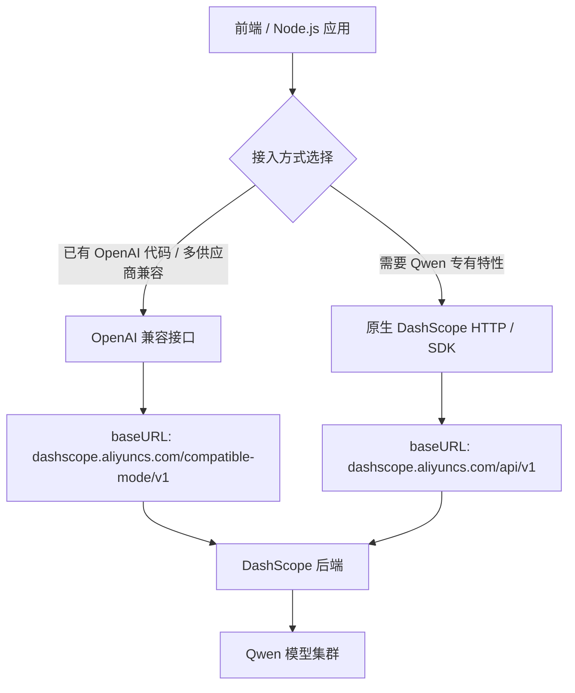
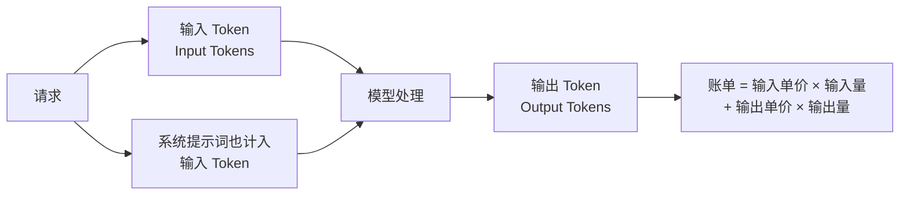

DashScope 是阿里云推出的大模型服务平台（Model-as-a-Service），通义千问（Qwen）系列作为其旗舰产品，在中文理解、代码生成和长文档处理上具备较强竞争力，也是国内开发者在 OpenAI 之外的主流选择之一。

## DashScope 平台概览

DashScope 不仅承载 Qwen 文本对话模型，还覆盖图像、音频、向量等多模态能力：

| 模态 | 代表能力 | 典型使用场景 |
|------|----------|--------------|
| 文本对话 | Qwen 系列 | 问答、代码生成、摘要 |
| 视觉语言 | Qwen-VL 系列 | 图片理解、OCR、表格解析 |
| 音频 | Paraformer、CosyVoice | ASR、TTS |
| 向量嵌入 | text-embedding-v* | RAG、语义搜索 |
| 图像生成 | Wanx 系列 | 文生图 |

所有模型通过统一的 DashScope 鉴权体系（API Key）管理，调用路径高度一致。

## 两种接入方式

DashScope 提供两条接入路径，适合不同场景。



**OpenAI 兼容接口**：请求格式与 OpenAI Chat Completions API 完全相同，只需替换 `baseURL`，适合已有 OpenAI 代码迁移或多供应商工厂模式。

**原生 DashScope 接口**：通过 HTTP 直调或 dashscope npm 包，支持 `enable_search`（联网搜索）、`incremental_output` 等 Qwen 专有参数，功能最全。

## 安装与认证

### 依赖安装

推荐优先使用 OpenAI SDK 搭配自定义 `baseURL`，无需额外依赖：

```bash
# 主流方案：复用 openai SDK
npm install openai

# 备选：原生 SDK（API 以官方文档为准，版本更新频繁）
npm install dashscope
```

### 认证配置（DASHSCOPE_API_KEY）

在阿里云控制台「DashScope > API Key 管理」中创建密钥，存入环境变量：

```bash
# .env（勿提交到 Git）
DASHSCOPE_API_KEY=sk-xxxxxxxxxxxxxxxx
```

Node.js 中读取：

```ts
// 确保在应用启动前已加载环境变量（如 dotenv）
const apiKey = process.env.DASHSCOPE_API_KEY;
if (!apiKey) throw new Error("DASHSCOPE_API_KEY is not set");
```

> **安全原则**：API Key 只能在服务端使用，前端浏览器代码中绝不能直接暴露。

## OpenAI 兼容接口接入（推荐）

### 客户端初始化

```ts
import OpenAI from "openai";

// 以官方文档为准，baseURL 路径可能更新
const client = new OpenAI({
  apiKey: process.env.DASHSCOPE_API_KEY!,
  baseURL: "https://dashscope.aliyuncs.com/compatible-mode/v1",
});
```

### 基础 Chat Completions 调用

```ts
async function chat(userMessage: string): Promise<string> {
  const response = await client.chat.completions.create({
    model: "qwen-turbo", // 具体模型 ID 以官方文档为准
    messages: [
      { role: "system", content: "你是一名资深前端工程师，回答简洁专业。" },
      { role: "user", content: userMessage },
    ],
    max_tokens: 2048,
    temperature: 0.7,
  });

  return response.choices[0].message.content ?? "";
}
```

返回结构与 OpenAI 格式完全一致，`response.usage` 包含 `prompt_tokens`、`completion_tokens` 等计费信息。

## Qwen 模型档次

Qwen 系列按能力和成本分为多个档次，**具体模型名称和版本号以官方文档为准**：

| 模型系列 | 定位 | 典型适用场景 |
|----------|------|--------------|
| `qwen-turbo` | 速度快、成本最低 | 简单问答、分类标注、低延迟应用 |
| `qwen-plus` | 能力与成本均衡 | 日常对话、轻量代码生成 |
| `qwen-max` | 最强推理与指令遵循 | 复杂逻辑、长文档分析、高质量创作 |
| `qwen-long` | 超长上下文（百万 token 级） | 长文档、代码库分析 |
| `qwen-coder-*` | 代码专用垂直模型 | IDE 辅助、代码补全、代码审查 |
| `qwen-vl-*` | 视觉语言（Vision-Language） | 图片问答、截图分析 |

> 所有模型 ID 和可用区域以[官方文档](https://help.aliyun.com/zh/dashscope/)为准，不要硬编码版本字符串。

## 流式输出（Streaming）

### 方式一：OpenAI 兼容接口流式

```ts
import OpenAI from "openai";

async function streamChat(prompt: string): Promise<void> {
  const stream = await client.chat.completions.create({
    model: "qwen-plus", // 以官方文档为准
    messages: [{ role: "user", content: prompt }],
    stream: true,
  });

  for await (const chunk of stream) {
    const delta = chunk.choices[0]?.delta?.content ?? "";
    process.stdout.write(delta); // 或推送给前端 SSE
  }

  // 获取最终用量（stream 结束后 chunk 中携带）
  // chunk.usage 字段需确认模型是否支持，以官方文档为准
}
```

### 方式二：原生 HTTP 流式（Server-Sent Events）

```ts
import fetch from "node-fetch";

async function* nativeStream(prompt: string): AsyncGenerator<string> {
  const res = await fetch(
    "https://dashscope.aliyuncs.com/api/v1/services/aigc/text-generation/generation",
    {
      method: "POST",
      headers: {
        Authorization: `Bearer ${process.env.DASHSCOPE_API_KEY}`,
        "Content-Type": "application/json",
        // SSE 流式需要此头，以官方文档为准
        "X-DashScope-SSE": "enable",
      },
      body: JSON.stringify({
        model: "qwen-turbo", // 以官方文档为准
        input: { messages: [{ role: "user", content: prompt }] },
        parameters: { incremental_output: true },
      }),
    }
  );

  const reader = res.body!;
  for await (const chunk of reader) {
    const line = chunk.toString().trim();
    if (line.startsWith("data:")) {
      const data = JSON.parse(line.slice(5));
      const text = data?.output?.text ?? "";
      if (text) yield text;
    }
  }
}
```

> 原生接口的请求体结构、响应字段和 SSE 协议细节以官方文档为准。

## 系统提示词、多轮对话与上下文管理

### 系统提示词（System Prompt）

```ts
const messages: OpenAI.Chat.ChatCompletionMessageParam[] = [
  {
    role: "system",
    content: `你是一个专业的前端代码审查助手。
- 只关注代码质量和安全问题
- 回答使用中文，代码使用英文
- 回答简洁，不超过 300 字`,
  },
];
```

### 多轮对话（Multi-turn Conversation）

DashScope 本身是无状态的，多轮对话需要客户端维护完整历史：

```ts
class ConversationManager {
  private history: OpenAI.Chat.ChatCompletionMessageParam[] = [];

  constructor(private systemPrompt: string) {
    this.history.push({ role: "system", content: systemPrompt });
  }

  async send(userMessage: string): Promise<string> {
    this.history.push({ role: "user", content: userMessage });

    const response = await client.chat.completions.create({
      model: "qwen-plus", // 以官方文档为准
      messages: this.history,
      max_tokens: 1024,
    });

    const assistantMessage = response.choices[0].message.content ?? "";
    this.history.push({ role: "assistant", content: assistantMessage });

    return assistantMessage;
  }

  // 上下文裁剪：保留 system + 最近 N 轮
  trimHistory(keepRounds = 10): void {
    const system = this.history[0];
    const recent = this.history.slice(-(keepRounds * 2));
    this.history = [system, ...recent];
  }
}
```

### 上下文管理策略

| 策略 | 实现方式 | 适用场景 |
|------|----------|----------|
| 滑动窗口 | 保留最近 N 轮消息 | 普通对话 |
| Token 预算裁剪 | 统计 token 数超限时删除旧消息 | 精确控制成本 |
| 摘要压缩 | 将历史摘要化后插回 system | 超长会话 |
| 向量检索 | 将历史存入向量库，按相关性召回 | 知识库问答 |

## 特色功能

### 联网搜索（enable_search）

通过原生接口可为 Qwen 开启实时网络搜索，适合需要时效性信息的场景：

```ts
// 注意：enable_search 是 Qwen 专有参数，OpenAI SDK extra_body 传递
const response = await client.chat.completions.create({
  model: "qwen-plus", // 以官方文档为准
  messages: [{ role: "user", content: "今天 A 股市场最新动态？" }],
  // @ts-ignore — extra_body 不在 OpenAI 类型定义中
  extra_body: {
    enable_search: true,
  },
});
```

> `enable_search` 等扩展参数的支持情况因模型而异，以官方文档为准。

### 视觉语言模型（VL Models）

Qwen-VL 系列支持图文混合输入，典型用途包括截图分析、表格提取：

```ts
const response = await client.chat.completions.create({
  model: "qwen-vl-plus", // 以官方文档为准
  messages: [
    {
      role: "user",
      content: [
        {
          type: "image_url",
          image_url: {
            url: "https://example.com/screenshot.png",
            // 或 base64: "data:image/png;base64,..."
          },
        },
        { type: "text", text: "这张截图中有哪些性能问题？" },
      ],
    },
  ],
});
```

### 长上下文模型（Long Context）

`qwen-long` 等超长上下文模型适合处理完整代码库、长文档：

```ts
// 读取整个文件内容传入模型（注意 token 成本）
const fileContent = await fs.readFile("./large-codebase.ts", "utf-8");

const response = await client.chat.completions.create({
  model: "qwen-long", // 以官方文档为准
  messages: [
    { role: "system", content: "分析以下代码的架构问题。" },
    { role: "user", content: fileContent },
  ],
});
```

## Token 计费原理

DashScope 采用输入 + 输出 token 分开计费的模式：



**关键要点：**

- **输入 token（Input Tokens）**：包含 system prompt + 历史消息 + 当前用户消息，多轮对话时历史越长成本越高
- **输出 token（Output Tokens）**：模型生成内容，价格通常高于输入
- **中文 token 密度**：中文每个汉字约 1.5～2 个 token，比英文占用更多，规划上下文窗口时需额外预留
- **具体定价以[官方价格页](https://help.aliyun.com/zh/dashscope/)为准**，不同模型、不同 tier 差异显著

```ts
// 通过 response.usage 监控 token 消耗
const response = await client.chat.completions.create({ /* ... */ });

console.log({
  prompt_tokens: response.usage?.prompt_tokens,
  completion_tokens: response.usage?.completion_tokens,
  total_tokens: response.usage?.total_tokens,
});
```

## 限流、错误码与重试策略

### 常见错误码

| HTTP 状态码 | DashScope 错误码 | 含义 | 处理方式 |
|-------------|-----------------|------|----------|
| 429 | `Throttling.RateQuota` | 超出每分钟请求限制 | 指数退避重试 |
| 429 | `Throttling.AllocationQuota` | 超出月度/日度配额 | 充值或申请提额 |
| 400 | `InvalidParameter` | 请求参数不合法 | 检查 model ID、messages 格式 |
| 401 | `InvalidApiKey` | API Key 无效或无权限 | 检查 Key 和模型开通状态 |
| 503 | `ServiceUnavailable` | 服务暂时不可用 | 重试，建议熔断 |

### 指数退避重试

```ts
async function withRetry<T>(
  fn: () => Promise<T>,
  maxRetries = 3,
  baseDelayMs = 1000
): Promise<T> {
  let lastError: unknown;

  for (let attempt = 0; attempt <= maxRetries; attempt++) {
    try {
      return await fn();
    } catch (err: unknown) {
      lastError = err;

      // OpenAI SDK 将 HTTP 错误封装为 OpenAI.APIError
      const isRateLimit =
        err instanceof Error && "status" in err && (err as { status: number }).status === 429;

      if (!isRateLimit || attempt === maxRetries) throw err;

      const delay = baseDelayMs * Math.pow(2, attempt) + Math.random() * 500;
      console.warn(`Rate limited. Retrying in ${delay.toFixed(0)}ms...`);
      await new Promise((r) => setTimeout(r, delay));
    }
  }

  throw lastError;
}

// 使用
const result = await withRetry(() =>
  client.chat.completions.create({
    model: "qwen-turbo",
    messages: [{ role: "user", content: "Hello" }],
  })
);
```

## DashScope vs OpenAI API 对比

| 维度 | DashScope（Qwen） | OpenAI API |
|------|------------------|------------|
| 主力模型 | qwen-max / qwen-plus / qwen-turbo | GPT-4o / GPT-4o-mini |
| 中文能力 | 原生优化，中文理解强 | 较好，但非原生优化 |
| 网络访问 | 国内直连，低延迟 | 国内需代理 |
| 数据合规 | 数据不出境，国内法规友好 | 数据传至美国服务器 |
| 兼容性 | 提供 OpenAI 兼容接口 | OpenAI 原生 |
| 定价 | 以官方为准，通常较低 | 以官方为准 |
| 联网搜索 | 原生支持 `enable_search` | 需通过 tools / web_search_preview |
| 长上下文 | qwen-long 支持超长窗口 | GPT-4o 支持 128K |
| 生态 | 阿里云生态集成 | 海外 SaaS 生态更广 |
| SDK | openai SDK 可复用 + dashscope npm | openai 官方 SDK |

## 多 Provider 工厂模式

实际项目中常需要同时支持多个 LLM 提供商，工厂模式可统一管理：

```ts
import OpenAI from "openai";

type Provider = "openai" | "qwen" | "deepseek";

interface ProviderConfig {
  apiKey: string;
  baseURL?: string;
}

const PROVIDER_CONFIGS: Record<Provider, ProviderConfig> = {
  openai: {
    apiKey: process.env.OPENAI_API_KEY!,
  },
  qwen: {
    apiKey: process.env.DASHSCOPE_API_KEY!,
    baseURL: "https://dashscope.aliyuncs.com/compatible-mode/v1",
  },
  deepseek: {
    apiKey: process.env.DEEPSEEK_API_KEY!,
    baseURL: "https://api.deepseek.com/v1",
  },
};

function createLLMClient(provider: Provider): OpenAI {
  const config = PROVIDER_CONFIGS[provider];
  if (!config.apiKey) throw new Error(`Missing API key for provider: ${provider}`);
  return new OpenAI(config);
}

// 切换供应商时只改 provider 和 model，业务代码不动
const client = createLLMClient("qwen");
const response = await client.chat.completions.create({
  model: "qwen-plus", // 以官方文档为准
  messages: [{ role: "user", content: "你好" }],
});
```

## 常见错误与最佳实践

### 常见错误

1. **API Key 暴露在前端**：浏览器 Network 面板可见，导致 Key 被盗用。必须走后端代理，前端只调用自己的 API。

2. **多轮对话忘记追加历史**：每次请求都只传当前消息，模型没有上下文。应维护并传递完整 `messages` 数组。

3. **硬编码模型 ID 字符串**：如 `"qwen-turbo-2024-11-01"`，官方随时可能下线旧版本。应将模型名统一管理在配置文件中。

4. **忽略 token 计费**：System Prompt 越长、历史越多，每次请求成本越高。应定期裁剪历史，对长 System Prompt 考虑缓存（如官方 Prompt Cache 功能，以文档为准）。

5. **不处理 429 限流**：直接抛错给用户。应实现指数退避重试或队列缓冲。

6. **`max_tokens` 设置过小**：导致模型输出被截断，JSON 等结构化输出损坏。根据实际需要合理预估并设置。

### 最佳实践

- 将 `baseURL`、`model` 等配置抽取到环境变量或配置模块，避免散落在业务代码中
- 用 TypeScript 封装一个统一的 `llmService`，隐藏供应商差异
- 对流式输出实现背压（backpressure）控制，避免前端渲染堆积
- 在 CI/CD 中验证 `DASHSCOPE_API_KEY` 环境变量存在，早于运行时报错
- 记录每次请求的 `usage` 字段，接入成本监控告警

## 面试常问

**Q1：为什么推荐 OpenAI 兼容接口，而不是 dashscope 原生 SDK？**

OpenAI 兼容接口让同一套代码可以无缝切换 OpenAI、Qwen、DeepSeek 等多个供应商，只需修改 `baseURL` 和 `apiKey`，团队已有的 OpenAI 使用经验完全复用。原生 SDK 才在需要 `enable_search` 等专有功能时引入。

**Q2：DashScope 如何保证数据合规（数据不出境）？**

阿里云 DashScope 服务部署在中国大陆数据中心，请求不经过境外节点，天然符合国内数据安全和个人信息保护法规，适合对数据出境敏感的金融、政务场景。

**Q3：多轮对话下如何控制 token 成本不失控？**

核心思路是上下文裁剪：保留 system prompt + 最近 N 轮，超出阈值时删除最旧的消息对；或先将旧消息总结为摘要再插入上下文；精确场景可以 tiktoken 统计 token 数后再决定裁剪策略。

**Q4：前端应用如何正确接入 DashScope，而不暴露 API Key？**

前端只调用自己服务的后端 API（如 `/api/chat`），后端持有 `DASHSCOPE_API_KEY` 并转发给 DashScope，返回结果给前端。流式场景后端可用 Node.js 的 `Response`（Server-Sent Events）把 chunk 推送给浏览器。

**Q5：qwen-turbo / qwen-plus / qwen-max 如何选型？**

开发调试阶段用 `qwen-turbo` 降低成本；功能测试阶段用 `qwen-plus` 验证效果；生产中对质量要求高的核心链路（如合同摘要、代码审查）用 `qwen-max`。也可 A/B 测试后根据质量/成本比决定最终模型。

**Q6：如何实现在 Next.js App Router 中的流式输出？**

在 Route Handler 中使用 `ReadableStream` 封装 DashScope 的 async iterator，配合 `new Response(stream)` 返回给前端；前端使用 `fetch` + `response.body.getReader()` 逐块读取并更新 UI 状态。注意设置 `Content-Type: text/event-stream`。

**Q7：DashScope 的 enable_search 和 RAG 有什么区别？**

`enable_search` 是模型级别的实时联网检索，由阿里云控制搜索源和召回策略，开发者无需维护；RAG（检索增强生成）是应用级架构，开发者自行管理向量库、检索逻辑和上下文拼接，可控性更强，适合企业私有知识库场景。两者可以结合使用。
