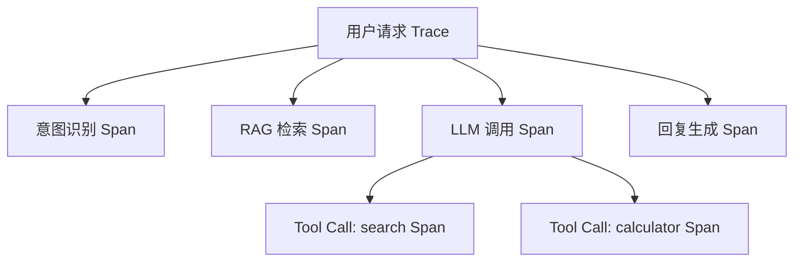

LLM 应用上线后，调用链不透明、成本失控、质量无从评估是三大核心痛点。可观测性（Observability）让你能够回答"这次请求为什么慢"、"这条回答为什么差"、"上个月花了多少钱"。

## 为什么 AI 应用需要可观测性

传统 Web 应用的可观测性已经成熟，但 LLM 应用有其独特挑战：

- **调用不透明**：一次用户请求可能触发多次 LLM 调用、工具调用、RAG 检索，中间链路难以追踪
- **成本不可控**：token 计费模型下，单次 Agent 调用可能消耗数千 token，没有监控就无法发现异常
- **质量难评估**：LLM 输出是自然语言，没有明确的"通过/失败"标准，需要专门的评估机制
- **非确定性**：同样的输入可能产生不同输出，需要大量样本才能判断系统整体质量

## 核心观测维度

### Traces 与 Spans

Trace 是一次完整请求的调用链，由多个 Span 组成。每个 Span 代表一个操作节点：



每个 Span 记录：开始/结束时间、输入输出、token 用量、错误信息。

### 关键指标定义

| 指标 | 含义 | 典型监控方式 |
|------|------|-------------|
| P50/P95 延迟 | 50%/95% 请求的响应时间 | 直方图统计 |
| Token/请求 | 每次请求的平均 token 消耗 | 累计求平均 |
| Cost/会话 | 每个用户会话的平均成本 | token 数 × 单价 |
| 错误率 | LLM 调用失败 / 超时比例 | 计数器 |
| 评分分布 | 用户反馈 / 自动评估分数 | 评分直方图 |

## LangSmith

LangSmith 是 LangChain 官方可观测平台，与 LangChain / LangGraph 深度集成。

**核心特性：**
- 自动追踪 LangChain 链路，零代码侵入（设置环境变量即可）
- 支持构建数据集，批量运行评估（Evaluation）
- 内置 Prompt Hub，管理和版本化 Prompt
- 支持人工标注与 LLM-as-Judge 自动评估

**快速接入（LangChain 项目）：**

```ts
// 设置环境变量即可，无需修改业务代码
process.env.LANGCHAIN_TRACING_V2 = "true";
process.env.LANGCHAIN_API_KEY = "your-api-key";
process.env.LANGCHAIN_PROJECT = "my-project";

// 之后所有 LangChain 调用自动上报
```

## Langfuse

Langfuse 是开源可观测平台，支持任意 LLM 框架，可自托管（Docker / Kubernetes）。

**核心特性：**
- 框架无关：支持 OpenAI、Anthropic、LangChain、自定义 HTTP 调用
- 完整开源，可部署在自有基础设施（数据不出域）
- 支持 Prompt 版本管理、A/B 测试
- 内置评分系统（人工标注 + 自动评分）

**TypeScript 集成骨架**（以 Langfuse SDK 为例，以官方文档为准）：

```ts
import Langfuse from "langfuse";

const langfuse = new Langfuse({
  publicKey: "pk-...",
  secretKey: "sk-...",
  baseUrl: "https://cloud.langfuse.com", // 或自托管地址
});

async function handleUserQuery(userId: string, query: string) {
  // 创建 Trace
  const trace = langfuse.trace({
    name: "user-query",
    userId,
    input: { query },
  });

  // 创建 Span：RAG 检索
  const retrievalSpan = trace.span({
    name: "rag-retrieval",
    input: { query },
  });
  const docs = await retrieveDocuments(query);
  retrievalSpan.end({ output: { docCount: docs.length } });

  // 创建 Generation：LLM 调用
  const generation = trace.generation({
    name: "llm-call",
    model: "gpt-4o",
    input: [{ role: "user", content: query }],
  });
  const response = await callLLM(query, docs);
  generation.end({
    output: response.content,
    usage: {
      promptTokens: response.usage.input_tokens,
      completionTokens: response.usage.output_tokens,
    },
  });

  // 更新 Trace 输出
  trace.update({ output: { answer: response.content } });

  // 确保数据上报
  await langfuse.flushAsync();
  return response.content;
}
```

## LangSmith vs Langfuse 对比

| 维度 | LangSmith | Langfuse |
|------|-----------|----------|
| 开源性 | 商业闭源（有免费层） | 完全开源（Apache 2.0） |
| 自托管 | 企业版支持 | 官方支持，文档完善 |
| 集成方式 | 与 LangChain 深度集成，也支持通用 SDK | 框架无关，SDK 覆盖主流语言 |
| 评估功能 | 数据集评估、Prompt Playground | 评分系统、人工标注、LLM-as-Judge |
| Prompt 管理 | Prompt Hub，支持版本化 | Prompt 版本管理，支持 A/B 测试 |
| 适用场景 | LangChain 技术栈为主 | 任意框架，数据主权要求高 |

## 多步 Agent 调用链追踪

Agent 执行时，调用链可能涉及多轮 LLM 调用和工具调用。正确的追踪姿势是将所有操作挂载到同一个 Trace 下：

```ts
async function runAgent(userInput: string) {
  const trace = langfuse.trace({ name: "agent-run", input: { userInput } });

  let step = 0;
  while (true) {
    const thinkSpan = trace.span({ name: `think-step-${step}` });
    const decision = await llmDecide(userInput);
    thinkSpan.end({ output: decision });

    if (decision.action === "finish") break;

    const toolSpan = trace.span({ name: `tool-${decision.tool}` });
    const toolResult = await executeTool(decision.tool, decision.args);
    toolSpan.end({ output: toolResult });

    step++;
  }

  await langfuse.flushAsync();
}
```

## 面试常问

**Q：如何追踪多步 Agent 调用链？**
将整个 Agent 运行绑定到一个 Trace，每次 LLM 调用和工具调用创建子 Span，并记录完整的输入/输出。关键是保持 trace_id 在整个执行过程中的一致性，方便在可观测平台上还原完整调用路径。

**Q：如何评估 LLM 输出质量？**
主要有三种方式：
1. **人工标注**：成本高但准确，适合构建黄金数据集
2. **LLM-as-Judge**：用另一个强模型（如 GPT-4）对输出打分，需注意偏差问题
3. **确定性断言**：对结构化输出验证格式、关键字段是否存在

**Q：可观测性数据如何存储和查询？**
Trace 数据通常存储在时序数据库或列存储中，配合可观测平台的查询界面。自托管 Langfuse 使用 PostgreSQL + ClickHouse，前者存元数据，后者做分析查询。
