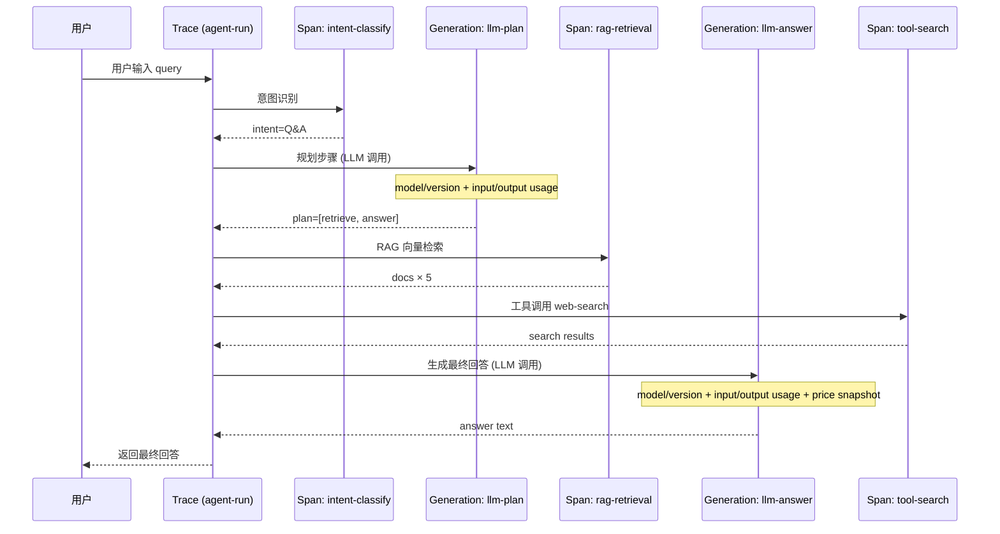
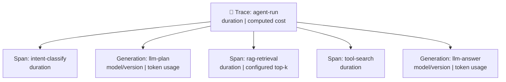
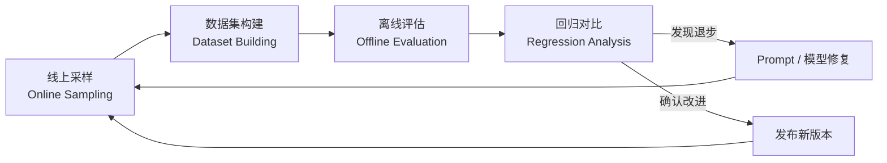

*图：沿图中的节点与箭头阅读，重点是OpenTelemetry 信号模型统一 request、model、tool、retrieval 与 agent step 的 trace 关系，并避免记录敏感正文。*

---

LLM 应用上线后，调用链不透明、成本失控、质量无从评估是三大核心痛点。可观测性（Observability）让你能够回答「这次请求为什么慢」「这条回答为什么差」「上个月花了多少钱」，是 AI 系统从实验走向生产的必要基础设施。

## 为什么 LLM 应用需要专门的可观测性

传统 Web 服务的可观测性三支柱——日志（Logs）、指标（Metrics）、链路追踪（Traces）——已有成熟工具链（Prometheus、Jaeger、OpenTelemetry）。但 LLM 应用有其特殊挑战，导致传统方案不足以应对：（参见 [OpenTelemetry traces](https://opentelemetry.io/docs/concepts/signals/traces/)）

**非确定性输出**：同一个 Prompt 在不同时间可能产生截然不同的回答。没有明确的"通过/失败"断言，质量判断需要语义层面的评估，而非简单的状态码检查。

**多步调用链**：一次用户请求可能触发意图识别、RAG 检索、多轮 LLM 调用和工具执行。仅追踪 HTTP 延迟不足以回答某次模型或工具调用如何影响最终结果，因此还要把业务允许记录的模型、用量和质量元数据关联到同一 Trace。

**以 token 计费的成本模型**：Agent 的重试和循环可能放大 token 消耗。记录每一步 usage、模型版本和价格快照，才能把异常请求与账单变化对应起来。

**Prompt 迭代与回归**：修改一个 Prompt 可能在某类问题上提升效果，却在另一类问题上退步。需要系统化的评估闭环，而非依赖工程师的人工感知。

### 与传统监控的核心差异

| 维度 | 传统服务监控 | LLM 应用可观测性 |
|------|-------------|----------------|
| 核心关注点 | 延迟、错误率、吞吐量 | 上述指标 + token 消耗、输出质量、Prompt 版本 |
| 成功判断标准 | HTTP 200、业务异常码 | 语义正确性、任务完成率、用户满意度 |
| 调试方式 | 查日志、看堆栈 | 回放完整 Prompt、重现对话上下文 |
| 成本单位 | 机器资源（CPU/内存） | 每次调用的 token 数量 × 模型单价 |
| 质量保障 | 单元测试、集成测试 | 数据集评估、LLM-as-Judge、人工标注 |

## 核心概念：Trace 与 Span 的层级结构

[OpenTelemetry Trace API](https://opentelemetry.io/docs/specs/otel/trace/api/) 规定 span 的创建、属性、事件、状态与 links；模型调用、retrieval 和 tool call 应作为可关联的 span，而不是彼此孤立的日志行。


LLM 可观测平台借鉴了分布式追踪的 Trace/Span 模型，并针对 LLM 做了扩展。

**Trace（追踪）**：代表一次完整的用户请求生命周期，从用户输入到最终输出。每个 Trace 有全局唯一的 `trace_id`，可挂载元数据（userId、sessionId、环境标签等）。

**Span（跨度）**：Trace 内的单个操作节点，记录起止时间和输入/输出。Span 之间可以形成父子关系，反映调用的嵌套结构。

**Generation（生成，LLM 特有）**：Span 的特殊子类型，专门用于记录 LLM 调用，额外携带：
- 模型名称与版本（model）
- 输入 Prompt 与输出内容（input / output）
- token 用量（prompt_tokens / completion_tokens / total_tokens）
- 计算成本（cost，由平台根据模型单价换算）
- 首 token 延迟（time_to_first_token，流式场景关键指标）

### LLM 特有的关键指标

| 指标 | 含义 | 监控价值 |
|------|------|---------|
| P50/P95 TTFT | Time to First Token 的分位数 | 流式体验的感知延迟 |
| Token/请求 | 每次调用的平均 token 消耗 | 成本趋势、Prompt 效率 |
| Cost/会话 | 每个对话的平均费用 | 按用户/功能拆分成本 |
| 错误率 | LLM 调用失败或超时比例 | 稳定性基线 |
| 评分分布 | 自动或人工评估分数分布 | 输出质量趋势 |
| 工具调用次数 | Agent 单次运行的平均工具调用轮数 | 识别失控的 Agent 循环 |

### 一次 Agent 调用的完整 Trace 结构





## LangSmith：LangChain 官方可观测平台

LangSmith 是 LangChain 团队提供的可观测与评估平台。当前接入方式、环境变量和 SDK 示例应以 [LangSmith observability quickstart](https://docs.langchain.com/langsmith/observability-quickstart) 为准；不要把某个版本的产品能力或部署方式写死在业务封装里。

### 架构要点

托管版与自托管版的网络、存储和许可边界不同。[LangSmith self-hosted 文档](https://docs.langchain.com/langsmith/self-hosted)列出了当前部署前提；选型时应直接核对组织的区域、保留期、加密、备份和运维责任，而不是从客户端 SDK 推断服务端拓扑。

核心模块：
- **Tracing**：自动或手动捕获调用链
- **Datasets & Evaluation**：构建测试数据集，批量运行评估实验
- **Prompt Hub**：中央化 Prompt 版本管理
- **Playground**：在 UI 上交互式调试 Prompt

### Python SDK 接入（自动追踪 LangChain）

使用 LangChain 的项目只需设置环境变量，框架会自动 hook 所有 LLM 调用：

```python
import os
os.environ["LANGCHAIN_TRACING_V2"] = "true"
os.environ["LANGCHAIN_API_KEY"] = "ls__your_api_key"
os.environ["LANGCHAIN_PROJECT"] = "production-agent"

from langchain_openai import ChatOpenAI
from langchain_core.prompts import ChatPromptTemplate

# 以下所有调用自动上报到 LangSmith，无需修改业务逻辑
llm = ChatOpenAI(model="gpt-4o")
prompt = ChatPromptTemplate.from_messages([
    ("system", "你是一个专业的技术问答助手"),
    ("user", "{question}"),
])
chain = prompt | llm
result = chain.invoke({"question": "什么是 RAG？"})
```

对于非 LangChain 代码，使用 `@traceable` 装饰器手动标注：

```python
from langsmith import traceable, Client

client = Client()

@traceable(name="rag-retrieval", run_type="retriever")
def retrieve_documents(query: str) -> list[dict]:
    # 向量检索逻辑
    return vector_store.similarity_search(query, k=5)

@traceable(name="llm-generate", run_type="llm")
def generate_answer(question: str, context: str) -> str:
    response = openai_client.chat.completions.create(
        model="gpt-4o",
        messages=[
            {"role": "system", "content": f"基于以下上下文回答：{context}"},
            {"role": "user", "content": question},
        ]
    )
    return response.choices[0].message.content

@traceable(name="qa-pipeline")
def qa_pipeline(question: str) -> str:
    docs = retrieve_documents(question)
    context = "\n".join(d["content"] for d in docs)
    return generate_answer(question, context)
```

### TypeScript SDK 接入

```typescript
import { Client, traceable } from "langsmith";

const client = new Client({
  apiKey: process.env.LANGCHAIN_API_KEY,
});

// 使用 wrapOpenAI 自动追踪 OpenAI 调用
import OpenAI from "openai";
import { wrapOpenAI } from "langsmith/wrappers";

const openai = wrapOpenAI(new OpenAI());

// 手动创建 run tree 管理复杂链路
import { RunTree } from "langsmith";

async function agentRun(userInput: string) {
  const rt = new RunTree({
    name: "agent-run",
    run_type: "chain",
    inputs: { userInput },
  });

  const retrievalRt = await rt.createChild({
    name: "rag-retrieval",
    run_type: "retriever",
    inputs: { query: userInput },
  });
  const docs = await retrieveDocuments(userInput);
  await retrievalRt.end({ outputs: { docs } });
  await retrievalRt.postRun();

  const llmRt = await rt.createChild({
    name: "llm-generate",
    run_type: "llm",
    inputs: { messages: [{ role: "user", content: userInput }] },
  });
  const response = await openai.chat.completions.create({
    model: "gpt-4o",
    messages: [{ role: "user", content: userInput }],
  });
  await llmRt.end({ outputs: { response } });
  await llmRt.postRun();

  await rt.end({ outputs: { answer: response.choices[0].message.content } });
  await rt.postRun();
}
```

## Langfuse：开源框架无关的可观测平台

Langfuse 同时提供托管服务与开源自托管方案。是否适合高合规场景取决于实际部署、密钥、网络、保留期、备份和访问控制，不能仅凭“可自托管”下结论。

### 架构要点

按当前 [Langfuse self-hosting architecture](https://langfuse.com/self-hosting)，主要数据组件各有不同职责：

- **PostgreSQL**：事务型主数据库；
- **ClickHouse**：保存 trace、observation、score 等分析数据；
- **Redis / Valkey**：队列与缓存；
- **S3 兼容 Blob Storage**：接收事件、保存多模态对象和大型导出。

这些组件不是“按需加一个 ClickHouse”那么简单。生产部署需要把队列积压、对象存储耐久性、数据库备份和时区配置一起纳入运行手册。

核心功能：
- **Observations**：Trace 下的 Span 和 Generation 统称 Observation
- **Scores（评分）**：可在任意 Observation 上打分，支持 numeric / boolean / categorical 类型
- **Prompt Management**：版本化 Prompt，支持 A/B 测试流量分配
- **Datasets**：构建测试集，运行 Dataset Runs（评估实验）

### Python SDK 接入

Langfuse Python SDK v4 已基于 OpenTelemetry 重写；[`langfuse-python` 官方仓库](https://github.com/langfuse/langfuse-python)的当前入口是 `get_client` / `observe`，短生命周期进程使用同步 `flush()`。

```python
from langfuse import get_client, observe

# 通过 LANGFUSE_PUBLIC_KEY、LANGFUSE_SECRET_KEY、LANGFUSE_BASE_URL 配置
langfuse = get_client()

@observe(name="qa-pipeline")
def qa_pipeline(question: str) -> str:
    with langfuse.start_as_current_observation(
        as_type="span", name="rag-retrieval"
    ) as retrieval:
        docs = retrieve_documents(question)
        retrieval.update(output={"doc_count": len(docs)})

    with langfuse.start_as_current_observation(
        as_type="generation", name="llm-answer", model=MODEL_ID
    ) as generation:
        answer = generate_answer(question, docs)
        generation.update(output=answer)

    return answer

if __name__ == "__main__":
    print(qa_pipeline("如何验证 RAG 回答？"))
    # CLI / serverless teardown 等短生命周期边界；常驻服务放在 shutdown hook
    langfuse.flush()
```

### TypeScript SDK 接入

JS/TS SDK v5 已拆为多个 `@langfuse/*` 包并基于 OpenTelemetry。当前包名和迁移入口见 [`langfuse-js` 官方仓库](https://github.com/langfuse/langfuse-js)；下面假设 `./instrumentation` 已按官方文档初始化 SDK 与 exporter。

```typescript
import { startActiveObservation } from "@langfuse/tracing";
import { sdk } from "./instrumentation";

async function handleUserQuery(userId: string, query: string): Promise<string> {
  return startActiveObservation("user-query", async (root) => {
    root.update({ input: { userId, query } });

    const docs = await startActiveObservation("rag-retrieval", async (span) => {
      const result = await retrieveDocuments(query);
      span.update({ output: { docCount: result.length } });
      return result;
    });

    const answer = await generateAnswer(query, docs);
    root.update({ output: { answer } });
    return answer;
  });
}

async function main(): Promise<void> {
  const answer = await handleUserQuery("user-123", "如何验证 RAG 回答？");
  console.log(answer);
}

// 短生命周期脚本在退出边界等待 exporter；常驻服务放到进程 shutdown hook。
void main().finally(() => sdk.shutdown());
```

## 产品选型：验证清单而非静态胜负表

两类产品的 SDK、托管区域、许可和功能会持续变化，不能用一张长期不更新的“谁更强”表替代验证。做一个最小原型，并逐项记录证据：

| 维度 | 需要验证的问题 |
|------|----------------|
| 数据边界 | 原始输入/输出、附件和评分别写到哪里？是否可脱敏、分区和设置保留期？ |
| 部署责任 | 托管与自托管分别由谁负责扩缩容、升级、备份、队列积压和灾难恢复？ |
| 追踪语义 | 跨进程 context 能否传播？generation、tool、retrieval 能否保持父子关系？ |
| SDK 生命周期 | 当前主版本、初始化方式、flush/shutdown 契约和运行时要求是什么？ |
| 评估闭环 | 线上 trace 如何进入版本化数据集？是否能复现实验、切片并导出结果？ |
| 总成本 | 除平台费用外，还要计入对象存储、数据库、运维和评审模型成本。 |

选型记录应链接当时使用的 [LangSmith 官方接入文档](https://docs.langchain.com/langsmith/observability-quickstart)、[LangSmith 自托管文档](https://docs.langchain.com/langsmith/self-hosted)、Langfuse SDK 仓库和自托管架构页面，并保存 SDK/服务端版本；这样后续升级时才能重放同一验收清单。

## 评估闭环（Evaluation Loop）

可观测性的最终价值不是看仪表盘，而是驱动持续改进。生产级评估闭环分为四个阶段：



**第一阶段：线上采样**。高成本语义评估通常需要抽样，但采样比例不是通用常量：
- 按目标误差、事件发生率、分层数量和评估预算计算随机样本量
- 错误优先采样：低置信度、用户负反馈、耗时异常的请求优先纳入
- 覆盖率采样：确保不同 intent 类别均有代表

**第二阶段：数据集构建**。将采样到的 Trace 转化为 `(input, expected_output)` 对，形成有标注的 Golden Dataset。Langfuse 支持直接从 Trace 创建 Dataset Item；LangSmith 同样支持从 Run 添加到 Dataset。

**第三阶段：离线评估**。在 CI/CD 流水线中，对每次 Prompt 变更或模型切换运行 Dataset Evaluation：

```python
# 使用 LangSmith 运行数据集评估
from langsmith import Client
from langsmith.evaluation import evaluate

client = Client()

def qa_target(inputs: dict) -> dict:
    """被评估的目标函数"""
    answer = qa_pipeline(inputs["question"])
    return {"answer": answer}

def correctness_evaluator(run, example) -> dict:
    """自定义评估函数"""
    score = llm_judge(
        question=example.inputs["question"],
        expected=example.outputs["expected_answer"],
        actual=run.outputs["answer"],
    )
    return {"key": "correctness", "score": score}

results = evaluate(
    qa_target,
    data="golden-dataset-v3",          # Dataset 名称
    evaluators=[correctness_evaluator],
    experiment_prefix="gpt-4o-v2-prompt",
)
```

**第四阶段：回归对比**。将新实验结果与基准实验对比，关注：
- 整体平均分变化（是否显著高于基准）
- 分类别明细（避免某类问题退步被平均数掩盖）
- 成本变化（新 Prompt 是否导致 token 消耗增加）

## 常见误区

**误区一：把 LangSmith/Langfuse 当纯日志工具**。很多团队只接入了 Tracing，从未使用 Dataset 和 Evaluation 功能。可观测性的核心价值是评估闭环，不是存日志。

**误区二：追踪粒度太粗**。只在顶层创建一个 Trace，内部没有 Span 拆分。当出现延迟问题时，无法定位是 RAG 慢还是 LLM 慢，调试价值大打折扣。

**误区三：忽视导出器生命周期**。部分 SDK 会异步批量导出，短生命周期进程若在队列发送前退出可能丢失数据。应按所用 SDK 的契约在进程关闭或平台提供的终止钩子中调用对应的 flush / shutdown API；方法名和调用时机并不统一，不能把 `flushAsync()` 当作所有 SDK 的通用接口。

**误区四：在 Span 输入里记录敏感数据**。用户的手机号、身份证号等 PII 数据不应直接记录到 Trace 中。应在上报前脱敏，或配置字段过滤规则。

**误区五：只看平均值，不看分位数**。P95/P99 延迟往往才是用户体验的真实反映。LLM 调用存在明显长尾效应（偶发性的重试或超长生成），仅看 P50 会漏掉严重的慢请求。

**误区六：LLM-as-Judge 的偏差问题**。使用 GPT-4 评估 GPT-4 的输出，存在自我偏好（self-preference）问题。应混合人工标注校验 LLM-as-Judge 的评分质量，或使用与目标模型不同厂商的模型做评估。

## 最佳实践

**命名规范统一**：Span 名称采用 `{功能}-{操作}` 格式（如 `rag-retrieval`、`llm-plan`），便于跨项目聚合查询。Trace 名称反映业务场景（如 `customer-support-qa`），而非技术实现。

**打标签（Tags）区分环境**：生产、预发、开发的 Trace 应打不同标签，避免测试流量污染生产评估数据。

**关联用户 ID 和会话 ID**：在 Trace 上记录 `userId` 和 `sessionId`，支持按用户维度分析成本和质量，并能在出现投诉时快速还原完整会话。

**设置成本告警**：分别监控单 Trace token、费用和工具轮数。阈值来自历史分布、模型价格、用户预算与异常损失，并按模型或业务切片配置；不要复制固定金额。

**Prompt 变更必须跑评估**：将 Dataset Evaluation 纳入 CI 流程，Prompt 变更的 PR 必须附上评估报告，并与基准实验的分数对比后才允许合并。

**按信号更新 Golden Dataset**：当线上分布漂移、功能或工具变化、新失败模式出现、覆盖率下降时触发增补与复审；发布节奏稳定的团队也可以设置日历提醒，但周期应由变化速度和风险决定。

**离线评估与在线监控结合**：离线评估验证变更安全性，在线监控（用户反馈率、自动质量评分）反映真实用户体验。两者配合，形成双重质量保障。

## 面试常问要点

**Q：LLM 应用可观测性与传统 APM 有什么本质区别？**

传统 APM 关注确定性系统：延迟、错误率、吞吐量，用状态码判断成功与否。LLM 应用的核心挑战是非确定性输出和语义质量评估——请求没有报错，但回答质量差，传统工具无法感知。此外，LLM 应用以 token 计费，需要额外的成本维度监控。

**Q：Trace 和 Span 的关系是什么？如何在 Agent 中正确使用？**

Trace 是一次完整请求的根节点，Span 是其中的子操作节点，两者形成树状层级结构。Agent 中应将整个运行周期绑定到一个 Trace，每次 LLM 调用和工具调用创建子 Span（Generation 类型），通过 `parent_id` 维持层级关系。关键是全程传递同一个 `trace_id`，包括跨服务调用场景。

**Q：如何实现评估闭环？**

四步：线上采样（策略性抽取有代表性的请求）→ 数据集构建（标注期望输出，形成 Golden Dataset）→ 离线评估（CI 中对每次变更运行评估，使用 LLM-as-Judge 或确定性评估函数）→ 回归对比（新实验与基准对比，确认无退步后才发布）。

**Q：LangSmith 和 Langfuse 如何选择？**

不要按技术栈或团队规模直接二选一。用同一条真实链路验证 context 传播、脱敏、数据集回放和导出器关闭，再比较托管/自托管的数据边界、依赖组件、升级责任和总成本；结论要绑定当时的 SDK 与服务端版本。

**Q：如何避免 Token 消耗失控？**

三个层面：一是接入可观测平台，设置单 Trace 成本告警阈值；二是在 Agent 设计上限制最大工具调用轮数（max_iterations）；三是定期分析 token 消耗分布，识别高消耗的请求类型（如上下文过长的会话），针对性优化 Prompt 或上下文压缩策略。

## 参考资料

- [OpenTelemetry traces](https://opentelemetry.io/docs/concepts/signals/traces/)
- [OpenTelemetry Trace API specification](https://opentelemetry.io/docs/specs/otel/trace/api/)
- [LangSmith observability quickstart](https://docs.langchain.com/langsmith/observability-quickstart)
- [LangSmith self-hosted deployment](https://docs.langchain.com/langsmith/self-hosted)
- [Langfuse self-hosting architecture](https://langfuse.com/self-hosting)
- [Langfuse Python SDK](https://github.com/langfuse/langfuse-python)
- [Langfuse JS/TS SDK](https://github.com/langfuse/langfuse-js)
