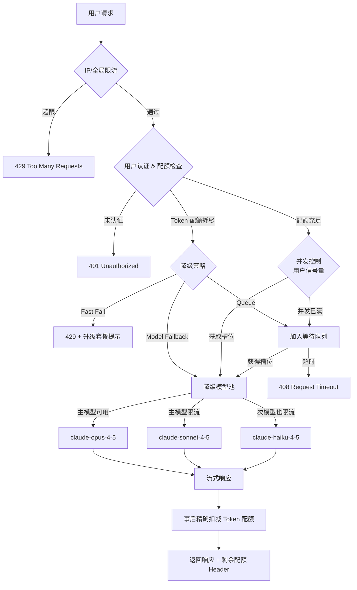

AI 应用限流、配额与背压需要把“机制是什么”“边界在哪里”“怎样验证”放在同一条学习路径中。本文以 [RFC 9110 HTTP Semantics — 429 Too Many Requests](https://www.rfc-editor.org/rfc/rfc9110.html#name-429-too-many-requests) 对“429 状态码与 Retry-After 语义”的说明为事实边界，并用 [Reactive Streams specification](https://www.reactive-streams.org/) 校准“异步流的非阻塞背压与有界需求信号”。文中的代码和工程方案用于解释这些机制；涉及具体版本、默认值或部署行为时，应再回到所链接的一手资料确认。


*图：AI 应用限流、配额与背压的核心组件、信息流与验证边界。*

---

LLM API 调用成本高昂，且提供商本身也有严格的速率上限（Rate Limit）；不做限流的 AI 应用面临三重风险：成本失控、被提供商封禁、遭恶意用户滥用。

## AI 限流与传统 API 限流的本质区别

传统 Web API 按**请求数（Requests Per Second，RPS）**计量，每次调用的资源消耗基本均匀。LLM API 则完全不同：计费单位是 **token**，而一次"请求"可以消耗 50 token（简单问候）或 50,000 token（长文档分析），差距达三个数量级。

| 对比维度 | 传统 API 限流 | AI 应用限流 |
|----------|--------------|------------|
| 计量单位 | 请求数（RPS/RPM） | Token 数（TPM）、偶尔叠加 RPM |
| 单次消耗均匀性 | 基本均匀 | 极度不均匀，差异可达 1000x |
| 响应延迟 | 毫秒级 | 秒级（2-30s），并发控制影响更大 |
| 预算可预测性 | 高（按次收费） | 低（输出 token 数在请求前未知） |
| 成本归因 | 简单（按调用次数） | 复杂（需区分 input/output token、缓存命中） |

另一个关键差异：LLM 调用往往是**流式响应（Streaming）**，响应完成前并不知道确切的 token 消耗量，这要求限流系统能够做**预估预扣**（optimistic reservation）+ **事后精确结算**的两阶段设计。

## 令牌桶算法（Token Bucket Algorithm）

令牌桶是 AI 限流场景最常用的算法。桶有固定容量 `C`，以速率 `r` 持续补充令牌；每次请求消耗若干令牌，桶空时请求被拒绝或等待。

**核心特性**：允许**突发流量**（burst）——当用户较长时间未使用时，令牌积累至上限，下一次可以密集发送多个请求而不被拒绝，这符合真实用户的使用习惯。

```python
import time
import threading

class TokenBucket:
    """
    单机版令牌桶，线程安全。
    rate: 每秒补充的令牌数
    capacity: 桶的最大容量（允许的突发量）
    """
    def __init__(self, rate: float, capacity: float):
        self.rate = rate
        self.capacity = capacity
        self._tokens = capacity          # 初始满桶
        self._last_refill = time.monotonic()
        self._lock = threading.Lock()

    def _refill(self) -> None:
        now = time.monotonic()
        elapsed = now - self._last_refill
        added = elapsed * self.rate
        self._tokens = min(self.capacity, self._tokens + added)
        self._last_refill = now

    def consume(self, tokens: float = 1.0) -> bool:
        """
        消耗指定数量的令牌。
        返回 True 表示允许，False 表示桶内令牌不足。
        """
        with self._lock:
            self._refill()
            if self._tokens >= tokens:
                self._tokens -= tokens
                return True
            return False

# 示例：每分钟补充 10,000 token，允许突发至 20,000 token
bucket = TokenBucket(rate=10_000 / 60, capacity=20_000)

# 模拟一次消耗 1500 token 的请求
if bucket.consume(1500):
    print("请求放行")
else:
    print("令牌不足，请稍后重试")
```

**时间复杂度**：O(1)，每次 `consume` 调用只做常数量运算，极为高效。

## 滑动窗口算法（Sliding Window）对比

滑动窗口统计**过去 N 秒内**的 token/请求总量，超过阈值则拒绝。与令牌桶的关键差异：

- 令牌桶关注**当前桶内剩余量**，允许积累后的突发
- 滑动窗口关注**时间窗口内的总消耗**，不允许突发超过窗口限额

```python
import time
from collections import deque

class SlidingWindowCounter:
    """
    基于时间戳队列的精确滑动窗口。
    适合中低并发场景；高并发建议用 Redis ZSet 实现。
    """
    def __init__(self, window_seconds: int, max_tokens: int):
        self.window_seconds = window_seconds
        self.max_tokens = max_tokens
        # 队列元素为 (timestamp, token_count)
        self._log: deque[tuple[float, int]] = deque()
        self._total = 0
        self._lock = threading.Lock()

    def allow(self, tokens: int) -> bool:
        now = time.monotonic()
        cutoff = now - self.window_seconds
        with self._lock:
            # 移除窗口外的记录
            while self._log and self._log[0][0] < cutoff:
                _, t = self._log.popleft()
                self._total -= t
            # 检查加上本次后是否超限
            if self._total + tokens > self.max_tokens:
                return False
            self._log.append((now, tokens))
            self._total += tokens
            return True
```

### 算法对比总表

| 算法 | 突发支持 | 精确度 | 实现复杂度 | 分布式适配 | 适用场景 |
|------|---------|--------|-----------|-----------|---------|
| 令牌桶（Token Bucket） | 是 | 高 | 中 | Redis 原子脚本 | 用户级限流，允许偶发高峰 |
| 滑动窗口（Sliding Window） | 否 | 最高 | 中 | Redis ZSet + Lua | 精确控制时间窗内总消耗 |
| 漏桶（Leaky Bucket） | 否 | 高 | 低 | 单机队列 | 保护下游服务，平滑流量输出 |
| 固定窗口（Fixed Window） | 是（边界效应） | 低 | 最低 | Redis INCR | 简单粗放场景，对精度要求低 |

> AI 应用推荐**令牌桶**（用户体验友好）+ **滑动窗口**（精确成本控制）双层叠加：前者做短时突发控制，后者做月度/日度 token 预算控制。

## 按用户配额（Per-User Quota）设计

### 配额维度

一个完整的用户配额体系通常包含两个独立维度，互相不可替代：

1. **请求数配额（Request Quota）**：防止高频骚扰，即使每次请求 token 很少
2. **Token 消耗配额（Token Quota）**：控制成本，是 AI 应用的核心配额

```typescript
interface UserQuota {
  userId: string;
  plan: "free" | "pro" | "enterprise";
  // 请求数配额
  requestLimit: {
    perMinute: number;
    perDay: number;
  };
  // Token 配额
  tokenLimit: {
    perDay: number;
    perMonth: number;
  };
  usage: {
    requestsToday: number;
    requestsThisMinute: number;
    tokensToday: number;
    tokensThisMonth: number;
  };
}

const PLAN_LIMITS: Record<UserQuota["plan"], Omit<UserQuota, "userId" | "plan" | "usage">> = {
  free: {
    requestLimit: { perMinute: 5,   perDay: 50    },
    tokenLimit:   { perDay: 20_000, perMonth: 100_000 },
  },
  pro: {
    requestLimit: { perMinute: 30,  perDay: 1_000  },
    tokenLimit:   { perDay: 500_000, perMonth: 5_000_000 },
  },
  enterprise: {
    requestLimit: { perMinute: 200, perDay: Infinity },
    tokenLimit:   { perDay: Infinity, perMonth: Infinity },
  },
};
```

### 配额重置策略

| 策略 | 说明 | 优点 | 缺点 |
|------|------|------|------|
| 每日重置（Daily Reset） | UTC 00:00 归零 | 简单，用户预期清晰 | 日切时刻可能出现并发峰值 |
| 每月重置（Monthly Reset） | 按自然月或账单周期 | 与计费周期对齐 | 月末可能出现突击消耗 |
| 滚动窗口（Rolling Window） | 始终统计过去 30 天 | 无边界效应，平滑 | 实现复杂，用户难以感知剩余量 |

```typescript
async function checkAndConsumeQuota(
  userId: string,
  estimatedInputTokens: number,
): Promise<{ allowed: boolean; reason?: string; remaining?: number }> {
  const quota = await getUserQuota(userId);
  const now = new Date();

  // 检查是否需要重置日配额（UTC 日期变更）
  if (isNewDay(quota.lastResetDate, now)) {
    await resetDailyQuota(userId);
    quota.usage.tokensToday = 0;
    quota.usage.requestsToday = 0;
  }

  const dailyTokensRemaining =
    quota.tokenLimit.perDay - quota.usage.tokensToday;

  // 注意：estimatedInputTokens 仅是 input 部分的预估；
  // output 实际消耗需在调用完成后异步扣减
  if (dailyTokensRemaining <= 0) {
    return { allowed: false, reason: "daily_token_limit_exceeded" };
  }

  if (estimatedInputTokens > dailyTokensRemaining) {
    return {
      allowed: false,
      reason: "insufficient_token_budget",
      remaining: dailyTokensRemaining,
    };
  }

  return { allowed: true, remaining: dailyTokensRemaining };
}
```

## 并发控制（Concurrency Control）

LLM 响应慢（2-30 秒），如果不限制并发数，单用户可以同时发起数十个请求，对上游提供商造成冲击且超出并发配额。

### 信号量（Semaphore）

```typescript
class Semaphore {
  private _queue: Array<() => void> = [];
  private _running = 0;

  constructor(private readonly max: number) {}

  async acquire(): Promise<() => void> {
    return new Promise((resolve) => {
      const tryAcquire = () => {
        if (this._running < this.max) {
          this._running++;
          // 返回 release 函数
          resolve(() => {
            this._running--;
            if (this._queue.length > 0) {
              this._queue.shift()!();
            }
          });
        } else {
          this._queue.push(tryAcquire);
        }
      };
      tryAcquire();
    });
  }
}

// 每个用户最多 3 个并发请求
const userSemaphores = new Map<string, Semaphore>();

async function callLLMWithConcurrencyControl(
  userId: string,
  prompt: string,
): Promise<string> {
  if (!userSemaphores.has(userId)) {
    userSemaphores.set(userId, new Semaphore(3));
  }
  const sem = userSemaphores.get(userId)!;
  const release = await sem.acquire();
  try {
    return await callLLM(prompt);
  } finally {
    release();
  }
}
```

### 优先级队列调度

企业套餐用户请求优先于免费用户，避免高流量场景下免费用户拖垮付费用户体验：

```typescript
type Priority = 1 | 2 | 3; // 1=enterprise, 2=pro, 3=free

interface QueuedRequest {
  priority: Priority;
  resolve: (value: string) => void;
  reject: (err: Error) => void;
  prompt: string;
  enqueuedAt: number;
}

// 优先级队列：priority 数值越小，越优先处理
const queue: QueuedRequest[] = [];
const MAX_QUEUE_SIZE = 500;
const MAX_WAIT_MS = 30_000; // 超时 30 秒直接 fail

function enqueue(req: Omit<QueuedRequest, "enqueuedAt">): void {
  if (queue.length >= MAX_QUEUE_SIZE) {
    req.reject(new Error("queue_full"));
    return;
  }
  queue.push({ ...req, enqueuedAt: Date.now() });
  // 按优先级升序、同优先级按入队时间升序排序
  queue.sort((a, b) =>
    a.priority !== b.priority
      ? a.priority - b.priority
      : a.enqueuedAt - b.enqueuedAt,
  );
}
```

## 降级策略（Degradation Strategy）

当限流触发时，系统需要有明确的降级路径，而不是简单粗暴地返回 429。

### 快速失败（Fast Fail）

最简单的策略，适合对延迟敏感的实时交互场景。立即返回错误，配合友好的 UI 提示（如"当前繁忙，请 30 秒后重试"）。

### 排队等待（Queue）

将请求放入等待队列，适合后台任务或用户可接受等待的场景。需要设置**最大等待时长**，超时后仍然失败。

### 降级到小模型（Model Fallback）

最具 AI 应用特色的降级策略：当主模型（如 claude-opus-4-5）配额耗尽或并发满载时，自动降级到更快更便宜的模型（如 claude-haiku-4-5）：

```typescript
type ModelTier = "primary" | "fallback" | "economy";

const MODEL_TIERS: Record<ModelTier, string> = {
  primary:  "claude-opus-4-5",
  fallback: "claude-sonnet-4-5",
  economy:  "claude-haiku-4-5",
};

async function callWithFallback(
  prompt: string,
  userId: string,
): Promise<{ response: string; modelUsed: string; degraded: boolean }> {
  for (const tier of ["primary", "fallback", "economy"] as ModelTier[]) {
    const model = MODEL_TIERS[tier];
    const quota = await checkModelQuota(model);

    if (!quota.available) continue;

    try {
      const response = await callLLM({ model, prompt });
      return {
        response,
        modelUsed: model,
        degraded: tier !== "primary",
      };
    } catch (err) {
      if (isRateLimitError(err)) continue;
      throw err; // 非限流错误直接抛出
    }
  }
  throw new Error("all_models_exhausted");
}
```

## 完整请求链路

一个请求从进入系统到得到响应，需经过多层控制：



## Redis 分布式令牌桶实现

单机令牌桶无法在多实例部署中共享状态，生产环境需要基于 Redis 的原子实现：

```python
import redis
import time

# Redis Lua 脚本：原子性地执行令牌桶消耗逻辑
# 避免 WATCH/MULTI/EXEC 乐观锁的重试开销
TOKEN_BUCKET_SCRIPT = """
local key        = KEYS[1]
local capacity   = tonumber(ARGV[1])   -- 桶容量
local rate       = tonumber(ARGV[2])   -- 补充速率（token/秒）
local now        = tonumber(ARGV[3])   -- 当前时间戳（秒，支持小数）
local requested  = tonumber(ARGV[4])   -- 本次请求的 token 数

-- 读取桶的当前状态（tokens, last_refill_time）
local bucket = redis.call('HMGET', key, 'tokens', 'last_refill')
local tokens      = tonumber(bucket[1]) or capacity
local last_refill = tonumber(bucket[2]) or now

-- 计算自上次补充以来新增的 token 数
local elapsed = math.max(0, now - last_refill)
local new_tokens = math.min(capacity, tokens + elapsed * rate)

if new_tokens >= requested then
    -- 允许请求，扣减 token
    local remaining = new_tokens - requested
    redis.call('HMSET', key, 'tokens', remaining, 'last_refill', now)
    redis.call('EXPIRE', key, math.ceil(capacity / rate) + 10)
    return {1, math.floor(remaining)}
else
    -- 拒绝请求，仅更新 token 数（不扣减）
    redis.call('HMSET', key, 'tokens', new_tokens, 'last_refill', now)
    redis.call('EXPIRE', key, math.ceil(capacity / rate) + 10)
    -- 返回 0（拒绝）及需等待的秒数
    local wait_seconds = math.ceil((requested - new_tokens) / rate)
    return {0, wait_seconds}
end
"""

class RedisTokenBucket:
    def __init__(
        self,
        client: redis.Redis,
        capacity: float,
        rate: float,
    ):
        self.client = client
        self.capacity = capacity
        self.rate = rate
        self._script = client.register_script(TOKEN_BUCKET_SCRIPT)

    def consume(self, key: str, tokens: float) -> tuple[bool, int]:
        """
        返回 (allowed, extra_info)
        allowed=True 时 extra_info 为剩余 token 数
        allowed=False 时 extra_info 为建议等待秒数
        """
        now = time.time()
        result = self._script(
            keys=[key],
            args=[self.capacity, self.rate, now, tokens],
        )
        allowed = result[0] == 1
        return allowed, int(result[1])


# 使用示例
r = redis.Redis(host="localhost", port=6379, decode_responses=True)
# 每分钟 10,000 token，允许突发至 20,000 token
bucket = RedisTokenBucket(r, capacity=20_000, rate=10_000 / 60)

user_key = "token_bucket:user:abc123"
allowed, info = bucket.consume(user_key, tokens=1500)
if allowed:
    print(f"放行，桶内剩余 token：{info}")
else:
    print(f"限流，建议 {info} 秒后重试")
```

**为何用 Lua 脚本而非 WATCH/MULTI/EXEC？**

Lua 脚本在 Redis 中是原子执行的，不会被其他命令插入。相比乐观锁，高并发下无需重试，延迟更低，适合对响应时间敏感的 API 中间件。

## 常见误区

**误区 1：只按请求数限流，忽视 token 计量**

结果：用户发送一次超大请求消耗大量 token，而限流器显示"还有 N 次可用"。AI 应用必须同时维护请求数和 token 数两个计数器。

**误区 2：用固定窗口代替滑动窗口**

固定窗口在窗口边界处存在"双倍突发"问题：用户可以在 00:59 消耗满额，再在 01:00 立即再次消耗满额，实际上在 2 秒内使用了 2 倍配额。AI 场景下这意味着双倍成本支出。

**误区 3：仅在 API 网关层限流，忽略应用层**

API 网关的限流粒度通常是 IP 或 API Key，无法感知业务语义（如用户套餐、feature flag）。AI 应用需在应用层追加基于业务逻辑的配额检查。

**误区 4：未处理 output token 的不确定性**

请求前只能预估 input token，output token 数在流式响应完成前未知。正确做法：请求发起时预扣一个保守上限，响应完成后对差额做**退款或补扣**（reconciliation）。

**误区 5：对所有用户使用相同的降级策略**

付费用户快速失败会严重损伤体验；免费用户排队等待则可能占用过多服务器资源。应根据用户套餐差异化降级：企业用户优先 + 快速失败提示升级，免费用户排队等待或模型降级。

## 最佳实践

- **双层限流**：网关层做粗粒度 IP/Key 保护，应用层做细粒度用户配额控制
- **Token 预扣+事后结算**：请求前基于 `max_tokens` 参数预扣配额，响应完成后按实际消耗精确结算差额
- **响应头透传剩余配额**：仿照 GitHub API，在响应中返回 `X-RateLimit-Remaining`、`X-RateLimit-Reset` 等 header，让前端可以主动降频或提示用户
- **限流指标可观测**：将限流触发次数、队列深度、降级比例接入 Prometheus/Grafana，及时发现异常流量
- **提供商 429 联动**：当上游 LLM 提供商返回 429 时，将本地令牌桶速率动态下调，并启用指数退避（exponential backoff）重试，避免雪崩
- **区分用户主动请求与系统批处理**：批处理任务使用独立的低优先级配额池，避免和实时交互共享资源

## 面试常问要点

**Q：令牌桶 vs 滑动窗口，AI 场景下如何选择？**

令牌桶允许突发（burst）：用户积累令牌后可以短时间密集调用，适合用户体验优先的场景（如聊天应用）。滑动窗口严格约束时间窗内的总消耗，无突发空间，适合成本控制优先的场景（如月度 token 预算）。AI 应用通常两者叠加：令牌桶控制短时突发，滑动窗口控制长周期总量。分布式环境下两者都需要 Redis + Lua 脚本保证原子性。

**Q：output token 数在请求前未知，如何做精确限流？**

采用两阶段设计：① 请求发起时，以 `max_tokens` 参数（用户设置的输出上限）做**预扣（reserve）**；② 流式响应完成后，读取 `usage.output_tokens` 计算实际消耗，执行**结算（reconcile）**——若实际低于预扣则退还差额，若（因非正常流程）超出则补扣。预扣可使用 Redis INCRBY，结算可在异步任务中处理，不阻塞响应返回。

**Q：如何防止限流绕过（如多账号轮换）？**

多维度叠加：IP 维度（检测同一 IP 下多账号注册行为）、设备指纹维度（浏览器/APP）、行为维度（请求间隔规律性检测）。对于严重滥用，可在应用层做账号关联分析，将同一实体的多账号纳入同一配额池。此外，免费套餐引入手机验证/信用卡验证等 friction，可大幅降低多账号滥用概率。

**Q：分布式令牌桶的 Lua 脚本为何比 WATCH/MULTI/EXEC 更优？**

WATCH/MULTI/EXEC 是乐观锁，高并发下频繁发生冲突时需要客户端重试，增加延迟和 Redis 负载。Lua 脚本在 Redis 服务端单线程原子执行，无并发冲突，无需重试，延迟恒定（O(1)），是生产环境限流的首选实现方式。

## 参考资料

- [RFC 9110 HTTP Semantics — 429 Too Many Requests](https://www.rfc-editor.org/rfc/rfc9110.html#name-429-too-many-requests)
- [Reactive Streams specification](https://www.reactive-streams.org/)
