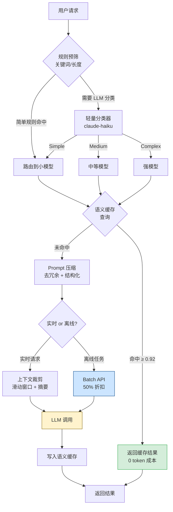

*图：沿图中的节点与箭头阅读，重点是输入/输出 token、缓存命中、并发与延迟拆成可测成本模型，避免无边界的优化结论。*

---

LLM API 按 token 计费，生产环境不加控制极易造成成本失控。系统性地应用路由、缓存、压缩、批处理等策略，可以在质量几乎不变的前提下将调用费用降低 50%–80%。

## 成本结构分析

[Amazon Bedrock token counting](https://docs.aws.amazon.com/bedrock/latest/userguide/count-tokens.html) 要求按实际模型和请求内容估算输入 token；字符数或固定倍率只能作为粗略预估，不能直接用于结算和配额门禁。


理解成本来源是优化的第一步。LLM 的计费模型通常由三个维度叠加：

| 费用类型 | 计费单位 | 典型单价区间（每百万 token） | 占比特征 |
|----------|----------|----------------------------|----------|
| Input Token | 输入 prompt 的 token 数 | $0.15 – $15 | 请求量大时是主要成本 |
| Output Token | 模型生成的 token 数 | $0.60 – $75 | 单价是 Input 的 3–5 倍 |
| 请求次数（API Calls） | 按次计费（较少见） | 依提供商而定 | 高并发场景不可忽视 |
| Embedding | 向量化 token 数 | $0.02 – $0.13 | RAG 管道中量大时显著 |

**关键结论**：Output token 单价远高于 Input token，控制输出长度的 ROI（投入产出比）通常高于压缩 Prompt。在多轮对话场景中，随着上下文窗口不断增长，Input token 成本会呈线性甚至超线性增长，上下文裁剪因此成为多轮对话系统的必选项。

## 模型分级路由（Model Routing）

不同任务对模型能力的需求差异悬殊。将所有请求都发送给最强模型，是生产环境中最常见的浪费。模型路由（Model Routing）的核心思路是：用任务复杂度匹配模型能力，而非用一把锤子敲所有钉子。

```
任务复杂度分级示例：
- 简单（Simple）：意图分类、格式转换、关键词提取、情感判断
- 中等（Medium）：一般问答、代码补全、RAG 综合回答
- 复杂（Complex）：多步推理、长文档深度分析、代码架构设计
```

**成本对比**：以 Anthropic 模型为例，claude-haiku-3-5 与 claude-opus-4 的 Input token 单价差距可达 20 倍以上。即便只有 30% 的请求可以降级到小模型，整体成本也能降低约 15%–25%。

路由器本身应使用最小模型完成分类，避免"用昂贵模型决定是否用昂贵模型"的悖论：

```typescript
type TaskTier = "simple" | "medium" | "complex";

interface RoutingConfig {
  simple: string;
  medium: string;
  complex: string;
}

const MODEL_ROUTING: RoutingConfig = {
  simple: "claude-haiku-3-5",    // 分类、格式化、摘要
  medium: "claude-sonnet-4",     // 问答、代码生成
  complex: "claude-opus-4",      // 复杂推理、长文档
};

// 用轻量模型 + 少样本提示做路由分类
async function classifyTaskTier(userMessage: string): Promise<TaskTier> {
  const response = await callLLM("claude-haiku-3-5", {
    system: `Classify the user request into one tier:
- simple: formatting, classification, keyword extraction
- medium: Q&A, code completion, summarization
- complex: multi-step reasoning, architecture design, long document analysis
Reply with only the tier name.`,
    user: userMessage,
    maxTokens: 10,
  });
  return response.trim() as TaskTier;
}

async function routedRequest(userMessage: string): Promise<string> {
  const tier = await classifyTaskTier(userMessage);
  const model = MODEL_ROUTING[tier];
  return callLLM(model, { user: userMessage });
}
```

**实践要点**：路由分类本身应在 P95 延迟 100ms 以内完成，否则延迟代价可能抵消成本收益。可以用规则引擎（消息长度、关键词匹配）做快速预筛，只有模糊边界情况才调用 LLM 分类器。

## 语义缓存（Semantic Cache）

精确匹配（Exact Cache）只能命中完全相同的 Prompt，在生产环境命中率通常低于 5%。语义缓存（Semantic Cache）通过向量相似度匹配语义相近的历史请求，命中率可提升至 20%–40%。

**原理**：将每次请求的 Prompt 编码为向量（Embedding），存入向量数据库。新请求到来时，计算其向量与库中历史向量的余弦相似度（Cosine Similarity）。相似度超过阈值则直接返回缓存答案，跳过 LLM 调用。

```typescript
interface CacheEntry {
  id: string;
  question: string;
  answer: string;
  embedding: number[];
  createdAt: number;
  ttl: number; // seconds
}

class SemanticCache {
  private readonly SIMILARITY_THRESHOLD = 0.92;

  constructor(
    private vectorStore: VectorStore,
    private embedFn: (text: string) => Promise<number[]>
  ) {}

  async get(question: string): Promise<string | null> {
    const embedding = await this.embedFn(question);
    const results = await this.vectorStore.search(embedding, { topK: 1 });

    if (
      results.length > 0 &&
      results[0].score >= this.SIMILARITY_THRESHOLD &&
      !this.isExpired(results[0].entry)
    ) {
      return results[0].entry.answer;
    }
    return null;
  }

  async set(question: string, answer: string, ttlSeconds = 3600): Promise<void> {
    const embedding = await this.embedFn(question);
    await this.vectorStore.upsert({
      id: crypto.randomUUID(),
      question,
      answer,
      embedding,
      createdAt: Date.now(),
      ttl: ttlSeconds,
    });
  }

  private isExpired(entry: CacheEntry): boolean {
    return Date.now() > entry.createdAt + entry.ttl * 1000;
  }
}

// 在 LLM 调用链中嵌入语义缓存
async function cachedLLMCall(question: string, cache: SemanticCache): Promise<string> {
  const cached = await cache.get(question);
  if (cached) {
    return cached; // 缓存命中，0 token 成本
  }

  const answer = await callLLM("claude-sonnet-4", { user: question });
  await cache.set(question, answer);
  return answer;
}
```

**阈值选择**：相似度阈值是语义缓存最关键的超参数。阈值 0.99 几乎等同于精确匹配；阈值 0.80 则可能把"北京天气"和"上海天气"视为同一问题。推荐从 0.92 开始，通过人工抽检缓存命中样本来校准，并持续监控"缓存误命中率"（返回了错误答案的比例）。

## Prompt 压缩（Prompt Compression）

[Amazon Bedrock prompt caching](https://docs.aws.amazon.com/bedrock/latest/userguide/prompt-caching.html) 通过复用稳定前缀减少重复处理，并单独统计缓存读写 token；它不等同于语义缓存，也不会缓存动态后缀的答案。


压缩输入 Prompt 是降低 Input token 成本的直接手段，有三个层次：

**层次一：去冗余（Deduplication）**

移除废话、重复说明和不必要的礼貌用语：

```
❌ 冗余版本（约 45 token）：
"你是一个非常有帮助、知识渊博的 AI 助手。请你帮我把下面这段文字翻译成英文，
谢谢你的帮助。文字内容如下："

✅ 压缩版本（约 8 token）：
"Translate to English:"
```

**层次二：结构化压缩（Structured Compression）**

用紧凑的结构替代自然语言描述，减少歧义的同时降低 token 数：

```python
# 原始：自然语言描述（~120 token）
original_prompt = """
请分析以下用户评论，判断其情感倾向是正面、负面还是中性。
同时提取出评论中提到的产品功能点，以及用户的主要诉求。
最后给出一个综合评分（1-5分）。
"""

# 压缩：结构化指令（~40 token）
compressed_prompt = """
Analyze comment. Return JSON:
{
  "sentiment": "positive|negative|neutral",
  "features": ["string"],
  "score": 1-5
}
"""
```

**层次三：摘要替换（Summarization）**

在多轮对话中，用摘要替换早期的详细历史记录：

```python
def compress_history(messages: list[dict], max_tokens: int = 2000) -> list[dict]:
    """当历史消息超过阈值时，用摘要替换早期消息"""
    total = count_tokens(messages)
    if total <= max_tokens:
        return messages

    # 保留最近 N 轮，对更早的历史生成摘要
    recent = messages[-6:]  # 保留最近 3 轮对话
    older = messages[:-6]

    summary_response = call_llm(
        model="claude-haiku-3-5",  # 用小模型做摘要，成本极低
        messages=[
            {"role": "user", "content": f"Summarize this conversation history in 3 sentences:\n{format_messages(older)}"}
        ]
    )

    summary_message = {
        "role": "system",
        "content": f"[Earlier conversation summary]: {summary_response}"
    }

    return [summary_message] + recent
```

**LLMLingua 等工具**：学术界提出了基于小模型打分的 token 级别压缩方案（如微软的 LLMLingua），可在保留语义的前提下将 Prompt 压缩 3–20 倍，适合超长文档场景。

## 批处理（Batch API）

对于不需要实时返回的离线任务，批处理（Batch API）是最省力的降本手段。主流提供商的 Batch API 定价约为实时 API 的 50%，延迟换成本。

适合批处理的典型场景：数据集标注、文章批量摘要、日志分析、离线推荐生成。

```typescript
interface BatchRequest {
  customId: string;
  model: string;
  messages: Message[];
  maxTokens: number;
}

async function batchProcess(articles: string[]): Promise<Map<string, string>> {
  const requests: BatchRequest[] = articles.map((article, i) => ({
    customId: `article-${i}`,
    model: "claude-haiku-3-5",
    messages: [{ role: "user", content: `Summarize in 2 sentences: ${article}` }],
    maxTokens: 150,
  }));

  // 提交批处理任务（异步，通常 1 小时内完成）
  const batchId = await submitBatch(requests);

  // 轮询或 Webhook 等待完成
  const results = await pollBatchResults(batchId);

  return new Map(results.map(r => [r.customId, r.content]));
}
```

**注意**：批处理任务通常有 24 小时完成时限，并非所有模型都支持 Batch API。提交前确认任务对延迟不敏感。

## 上下文裁剪（Context Pruning）

多轮对话中，历史消息会随轮次线性累积，使每次调用的 Input token 成倍增长。上下文裁剪（Context Pruning）通过三种策略控制上下文窗口大小：

**策略 A：滑动窗口（Sliding Window）**  
保留最近 N 轮对话，丢弃更早的历史。实现简单，但可能丢失重要的早期上下文。

**策略 B：重要性采样（Importance Sampling）**  
对每条历史消息打分，优先保留用户明确提及的偏好、关键决策点和错误纠正。可用小模型或启发式规则打分。

**策略 C：摘要替换（Summary Compression）**  
如上文 Prompt 压缩层次三所示，定期将早期对话压缩为摘要，以摘要形式注入后续对话。这是多轮对话系统中最平衡质量与成本的策略。

三种策略通常组合使用：滑动窗口作为硬性上限，重要性采样在窗口内决定保留哪些消息，摘要替换处理超出窗口的远古历史。

## 成本优化链路总览



## 各策略横向对比

| 策略 | 实现难度 | 潜在节省幅度 | 延迟影响 | 质量风险 | 最适用场景 |
|------|----------|-------------|----------|----------|-----------|
| 模型路由 | 中 | 20%–60% | 轻微增加（分类延迟） | 低（需校验降级质量） | 请求类型多样的通用应用 |
| 语义缓存 | 中高 | 10%–40% | 缓存命中时大幅降低 | 中（阈值设置不当有误答风险） | 高重复率的问答/客服系统 |
| Prompt 压缩 | 低 | 10%–30% | 无影响 | 低 | 所有场景，优先实施 |
| Batch API | 低 | 约 50% | 高（小时级延迟） | 无 | 离线数据处理、标注、分析 |
| 上下文裁剪 | 中 | 30%–70% | 轻微增加（摘要计算） | 中（摘要可能丢失细节） | 多轮对话、长会话系统 |
| Prompt Cache（原生） | 低 | 50%–90%（前缀部分） | 无 | 无 | 有固定长 System Prompt 的应用 |

## 常见误区

**误区一：只关注 Input token，忽视 Output token 成本**  
Output token 的单价通常是 Input 的 3–5 倍。在 Prompt 中明确约束输出格式和长度（如"用 JSON 格式回答，不超过 200 字"），效果往往比压缩 System Prompt 更显著。

**误区二：语义缓存阈值一次设定永不调整**  
语义相似度阈值需要根据业务语料持续校准。初期设置 0.92 只是起点，应建立"缓存误命中率"监控指标，定期人工抽检，在高质量要求的场景下适当提高阈值。

**误区三：对所有任务使用相同的模型路由规则**  
不同业务模块的"复杂度"定义不同：电商客服里的退款问题可能是"简单"，但医疗问答里的相同词汇可能需要"强模型"处理。路由规则应按业务域分别配置，而非全局统一。

**误区四：批处理适合所有非实时任务**  
Batch API 通常有 1–24 小时的处理延迟，且并非所有模型都支持。在任务量不足时，批处理的管理开销（任务提交、状态轮询、结果拼接）可能超过节省的成本。建议单次批处理量超过 100 个请求时再考虑使用。

**误区五：Prompt 压缩是一次性工作**  
随着功能迭代，System Prompt 容易累积大量历史遗留描述。应将 Prompt 长度（token 数）纳入 CI 检测指标，在 Prompt 超过特定阈值时触发告警，定期审查和精简。

## 最佳实践

1. **先监控，后优化**：在任何优化之前，先接入可观测平台（如 Langfuse、LangSmith），建立每请求成本基线。没有数据就没有优化方向。

2. **优先实施低风险策略**：Prompt 精简和结构化输出约束几乎零风险，应优先实施。语义缓存和模型路由需要充分测试才能上线。

3. **为每个优化策略建立回滚机制**：模型路由降级可能导致质量下降，语义缓存可能出现误命中。每个策略都应支持通过配置开关快速关闭。

4. **分阶段上线模型路由**：先在 10%–20% 的流量上灰度路由规则，观察质量指标（用户反馈、自动评估分数）无明显下降后再全量开放。

5. **区分"省成本"和"省预算"**：某些策略（如语义缓存）需要额外的向量数据库基础设施投入，应计算净节省而非毛节省。ROI = (节省的 LLM 费用) / (新增基础设施费用 + 开发维护成本)。

6. **输出长度约束与结构化输出结合使用**：`max_tokens` 设置硬上限，JSON Schema 约束格式，两者配合可以将 Output token 消耗降低 30%–50%，且通常不影响业务逻辑。

## 面试常问要点

**Q：如何系统性地降低 LLM 生产成本，从哪里入手？**  
答：先接入可观测平台获取成本基线，分析成本结构（Input/Output 各占多少比例、哪些接口调用量最大）。通常按优先级：①Prompt 精简和输出约束（低风险、立竿见影）→ ②Prompt Cache 配置（对有长 System Prompt 的应用效果显著）→ ③模型分级路由（需评估）→ ④语义缓存（需向量基础设施）→ ⑤批处理（适合离线任务）。

**Q：语义缓存和 Prompt Cache 有什么区别？**  
答：Prompt Cache 是提供商原生功能，当多次请求的 Prompt 前缀完全相同时，提供商缓存 KV 计算结果，后续请求的前缀部分以折扣价计费（如 Anthropic 为原价的 10%），无需任何客户端改造。语义缓存是应用层实现，通过向量相似度匹配语义相近的历史请求，完全跳过 LLM 调用（成本为 0），但需要自建向量数据库，且存在误命中风险。两者互补：Prompt Cache 解决固定前缀的重复计算，语义缓存解决相似问题的重复调用。

**Q：模型路由中如何保证降级后的质量？**  
答：核心是建立自动化质量评估体系。具体做法：①在灰度阶段对同一批请求同时调用大模型和小模型，用大模型的输出作为 ground truth 评估小模型的输出质量；②建立任务维度的质量基准（如代码生成的编译通过率、问答的 BERTScore）；③设置质量告警阈值，当小模型在某类任务上质量下降超过 5% 时，自动回退到大模型。质量评估应该是持续运行的，而非一次性的上线审批。

**Q：多轮对话中如何控制上下文成本增长？**  
答：三种策略组合使用：①滑动窗口作为硬性上限（如保留最近 8 条消息）；②对超出窗口的早期消息用小模型生成摘要，以 system message 形式注入；③对消息按重要性评分（用户明确偏好、关键决策优先保留）。关键指标是"每轮对话平均 Input token 数"，应监控其是否随轮次线性增长，若增长说明裁剪策略未生效。

## 参考资料

- [Amazon Bedrock token counting](https://docs.aws.amazon.com/bedrock/latest/userguide/count-tokens.html)
- [Amazon Bedrock prompt caching](https://docs.aws.amazon.com/bedrock/latest/userguide/prompt-caching.html)
