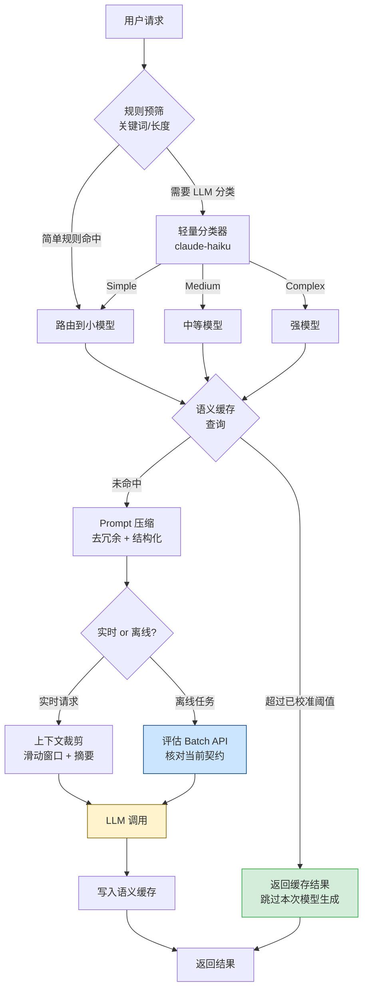

*图：沿图中的节点与箭头阅读，重点是输入/输出 token、缓存命中、并发与延迟拆成可测成本模型，避免无边界的优化结论。*

---

许多 LLM API 按输入、输出或缓存 token 计费，生产环境如果不记录用量，就很难解释预算变化。路由、缓存、压缩和批处理都可能降低某些工作负载的费用，但收益与质量影响必须用目标模型、真实请求分布和当期价格表测量，不能承诺通用降幅。

## 成本结构分析

[Amazon Bedrock token counting](https://docs.aws.amazon.com/bedrock/latest/userguide/count-tokens.html) 要求按实际模型和请求内容估算输入 token；字符数或固定倍率只能作为粗略预估，不能直接用于结算和配额门禁。


理解成本来源是优化的第一步。LLM 的计费模型通常由三个维度叠加：

| 费用类型 | 常见计量单位 | 核对方式 | 成本特征 |
|----------|--------------|----------|----------|
| Input Token | 输入 prompt 的 token 数 | 目标模型 tokenizer / 提供商计数接口 | 长上下文和多轮历史会累积 |
| Output Token | 模型生成的 token 数 | 响应 usage 与当期价格表 | 长回答或失控循环会放大用量 |
| 请求次数（API Calls） | 按次或按任务计费 | 提供商账单与请求日志 | 重试、路由和工具循环会增加次数 |
| Embedding | 向量化 token 或请求量 | Embedding 响应 usage 与价格表 | 批量索引时总量可能显著 |

**关键结论**：先把每种 token 的实际用量与当期单价相乘，再决定优化顺序。多轮对话若每轮都重发全部历史，输入 token 会随保留历史增长；是否裁剪以及如何裁剪，要同时满足质量、审计和延迟约束。

## 模型分级路由（Model Routing）

不同任务对模型能力的需求差异悬殊。将所有请求都发送给最强模型，是生产环境中最常见的浪费。模型路由（Model Routing）的核心思路是：用任务复杂度匹配模型能力，而非用一把锤子敲所有钉子。

```
任务复杂度分级示例：
- 简单（Simple）：意图分类、格式转换、关键词提取、情感判断
- 中等（Medium）：一般问答、代码补全、RAG 综合回答
- 复杂（Complex）：多步推理、长文档深度分析、代码架构设计
```

不同模型的能力、吞吐和计费可能不同。路由收益应按 `各路由请求量 × 对应模型实际单价` 计算，并在同一业务评估集上确认质量；模型名称、版本和价格都应放在配置中，而不是写死在策略里。

路由器本身应使用最小模型完成分类，避免"用昂贵模型决定是否用昂贵模型"的悖论：

```typescript
type TaskTier = "simple" | "medium" | "complex";

interface RoutingConfig {
  simple: string;
  medium: string;
  complex: string;
}

const MODEL_ROUTING: RoutingConfig = {
  simple: process.env.SMALL_MODEL!,
  medium: process.env.MEDIUM_MODEL!,
  complex: process.env.STRONG_MODEL!,
};

// 用轻量模型 + 少样本提示做路由分类
async function classifyTaskTier(userMessage: string): Promise<TaskTier> {
  const response = await callLLM(MODEL_ROUTING.simple, {
    system: `Classify the user request into one tier:
- simple: formatting, classification, keyword extraction
- medium: Q&A, code completion, summarization
- complex: multi-step reasoning, architecture design, long document analysis
Reply with only the tier name.`,
    user: userMessage,
    maxTokens: ROUTING_CONFIG.maxOutputTokens,
  });
  return response.trim() as TaskTier;
}

async function routedRequest(userMessage: string): Promise<string> {
  const tier = await classifyTaskTier(userMessage);
  const model = MODEL_ROUTING[tier];
  return callLLM(model, { user: userMessage });
}
```

**实践要点**：把路由分类的 P95 延迟纳入整条请求的延迟预算；允许的数值来自产品 SLO，而非通用常量。可以用规则引擎做快速预筛，只在模糊边界调用分类模型，并比较“增加的路由延迟”与“节省的推理费用”。

## 语义缓存（Semantic Cache）

精确匹配（Exact Cache）只命中规范化后完全相同的 key；语义缓存（Semantic Cache）尝试复用语义相近请求的答案。两者的命中率取决于请求重复度、TTL、租户隔离和相似度策略，应从真实流量日志计算，不能套用固定区间。

**原理**：将每次请求的 Prompt 编码为向量（Embedding），存入向量数据库。新请求到来时，计算其向量与库中历史向量的余弦相似度（Cosine Similarity）。相似度超过阈值则直接返回缓存答案，跳过 LLM 调用。

```typescript
interface CacheEntry {
  id: string;
  question: string;
  answer: string;
  embedding: number[];
  createdAt: number;
  ttl: number; // seconds
}

class SemanticCache {
  constructor(
    private vectorStore: VectorStore,
    private embedFn: (text: string) => Promise<number[]>,
    private similarityThreshold: number, // 由离线评估和误命中成本校准
  ) {}

  async get(question: string): Promise<string | null> {
    const embedding = await this.embedFn(question);
    const results = await this.vectorStore.search(embedding, {
      topK: CACHE_CONFIG.candidateCount,
    });

    if (
      results.length > 0 &&
      results[0].score >= this.similarityThreshold &&
      !this.isExpired(results[0].entry)
    ) {
      return results[0].entry.answer;
    }
    return null;
  }

  async set(question: string, answer: string, ttlSeconds: number): Promise<void> {
    const embedding = await this.embedFn(question);
    await this.vectorStore.upsert({
      id: crypto.randomUUID(),
      question,
      answer,
      embedding,
      createdAt: Date.now(),
      ttl: ttlSeconds,
    });
  }

  private isExpired(entry: CacheEntry): boolean {
    return Date.now() > entry.createdAt + entry.ttl * 1000;
  }
}

// 在 LLM 调用链中嵌入语义缓存
async function cachedLLMCall(question: string, cache: SemanticCache): Promise<string> {
  const cached = await cache.get(question);
  if (cached) {
    return cached; // 跳过本次 LLM 生成；仍有查询与缓存基础设施成本
  }

  const answer = await callLLM(CACHE_CONFIG.answerModel, { user: question });
  await cache.set(question, answer, CACHE_CONFIG.ttlSeconds);
  return answer;
}
```

**阈值选择**：相似度分数不是跨 embedding 模型通用的概率。用目标语料构造“可复用 / 不可复用”样本，按误命中的业务损失选择阈值，并持续监控命中率、误命中率和陈旧答案比例；更换 embedding 模型后必须重新校准。

## Prompt 压缩（Prompt Compression）

[Amazon Bedrock prompt caching](https://docs.aws.amazon.com/bedrock/latest/userguide/prompt-caching.html) 通过复用稳定前缀减少重复处理，并单独统计缓存读写 token；它不等同于语义缓存，也不会缓存动态后缀的答案。


压缩输入 Prompt 是降低 Input token 成本的直接手段，有三个层次：

**层次一：去冗余（Deduplication）**

移除废话、重复说明和不必要的礼貌用语：

```
❌ 冗余版本：
"你是一个非常有帮助、知识渊博的 AI 助手。请你帮我把下面这段文字翻译成英文，
谢谢你的帮助。文字内容如下："

✅ 压缩版本：
"Translate to English:"
```

**层次二：结构化压缩（Structured Compression）**

用紧凑的结构替代自然语言描述，减少歧义的同时降低 token 数：

```python
# 原始：自然语言描述
original_prompt = """
请分析以下用户评论，判断其情感倾向是正面、负面还是中性。
同时提取出评论中提到的产品功能点，以及用户的主要诉求。
最后给出一个综合评分（1-5分）。
"""

# 压缩：结构化指令
compressed_prompt = """
Analyze comment. Return JSON:
{
  "sentiment": "positive|negative|neutral",
  "features": ["string"],
  "score": 1-5
}
"""
```

**层次三：摘要替换（Summarization）**

在多轮对话中，用摘要替换早期的详细历史记录：

```python
def compress_history(
    messages: list[dict],
    max_tokens: int,
    recent_message_count: int,
    summary_model: str,
    summary_sentence_target: int,
) -> list[dict]:
    """当历史消息超过阈值时，用摘要替换早期消息"""
    total = count_tokens(messages)
    if total <= max_tokens:
        return messages

    # 保留最近 N 轮，对更早的历史生成摘要
    recent = messages[-recent_message_count:]
    older = messages[:-recent_message_count]

    summary_response = call_llm(
        model=summary_model,
        messages=[
            {"role": "user", "content": f"Summarize this conversation history in about {summary_sentence_target} sentences:\n{format_messages(older)}"}
        ]
    )

    summary_message = {
        "role": "system",
        "content": f"[Earlier conversation summary]: {summary_response}"
    }

    return [summary_message] + recent
```

基于小模型打分的 token 级压缩可以作为候选方案，但“文本更短”不等于“任务质量不变”。应使用目标模型的 tokenizer 记录压缩前后 token，并在任务级评估集上检查信息丢失和答案质量。

## 批处理（Batch API）

对于不需要实时返回的离线任务，可以评估提供商的 Batch API。它通常用更宽松的完成时限换取不同的吞吐或计费条件；是否便宜、支持哪些模型以及完成时限，以提交时的官方文档和价格表为准。

适合批处理的典型场景：数据集标注、文章批量摘要、日志分析、离线推荐生成。

```typescript
interface BatchRequest {
  customId: string;
  model: string;
  messages: Message[];
  maxTokens: number;
}

async function batchProcess(
  articles: string[],
  batchConfig: { model: string; summarySentences: number; maxOutputTokens: number },
): Promise<Map<string, string>> {
  const requests: BatchRequest[] = articles.map((article, i) => ({
    customId: `article-${i}`,
    model: batchConfig.model,
    messages: [{ role: "user", content: `Summarize in about ${batchConfig.summarySentences} sentences: ${article}` }],
    maxTokens: batchConfig.maxOutputTokens,
  }));

  // 提交批处理任务（异步；完成时限以提供商契约为准）
  const batchId = await submitBatch(requests);

  // 轮询或 Webhook 等待完成
  const results = await pollBatchResults(batchId);

  return new Map(results.map(r => [r.customId, r.content]));
}
```

**注意**：并非所有模型和请求形态都支持 Batch API。提交前确认完成时限、失败重试、结果顺序和取消语义，并确保任务能接受相应延迟。

## 上下文裁剪（Context Pruning）

多轮对话中，历史消息会随轮次线性累积，使每次调用的 Input token 成倍增长。上下文裁剪（Context Pruning）通过三种策略控制上下文窗口大小：

**策略 A：滑动窗口（Sliding Window）**  
保留最近 N 轮对话，丢弃更早的历史。实现简单，但可能丢失重要的早期上下文。

**策略 B：重要性采样（Importance Sampling）**  
对每条历史消息打分，优先保留用户明确提及的偏好、关键决策点和错误纠正。可用小模型或启发式规则打分。

**策略 C：摘要替换（Summary Compression）**  
如上文 Prompt 压缩层次三所示，定期将早期对话压缩为摘要，以摘要形式注入后续对话。这是多轮对话系统中最平衡质量与成本的策略。

三种策略通常组合使用：滑动窗口作为硬性上限，重要性采样在窗口内决定保留哪些消息，摘要替换处理超出窗口的远古历史。

## 成本优化链路总览



## 各策略横向对比

| 策略 | 主要收益如何测量 | 延迟影响 | 主要质量风险 | 更可能适用的场景 |
|------|------------------|----------|--------------|------------------|
| 模型路由 | 各路由实际 token 费用之和 | 增加分类步骤 | 错误降级 | 请求能力需求差异明显 |
| 语义缓存 | 命中后避免的模型费用减去检索成本 | 命中时可能降低 | 误命中、陈旧或跨租户泄漏 | 高重复且答案可复用的请求 |
| Prompt 压缩 | 压缩前后实际 token 与任务分数 | 可能增加预处理 | 丢失约束或证据 | 长且存在冗余的上下文 |
| Batch API | 与实时路径的同批账单对照 | 完成更晚 | 时效、失败恢复 | 可延迟的离线任务 |
| 上下文裁剪 | 每轮输入 token 与任务分数 | 摘要可能增加计算 | 遗忘早期约束 | 长会话 |
| Prompt Cache（原生） | 提供商返回的缓存读写 token | 依实现而定 | 缓存条件未满足 | 稳定长前缀 |

## 常见误区

**误区一：只关注 Input token，忽视 Output token 成本**  
不要假设输入和输出 token 的单价关系；读取目标模型的当期价格表，并按实际 usage 计算。明确输出格式和长度可以控制用量，但也要评估截断和信息遗漏。

**误区二：语义缓存阈值一次设定永不调整**  
语义相似度阈值需要根据业务语料持续校准。应建立"缓存误命中率"监控指标并抽检命中样本；模型、语料或业务损失函数变化后重新选阈值。

**误区三：对所有任务使用相同的模型路由规则**  
不同业务模块的"复杂度"定义不同：电商客服里的退款问题可能是"简单"，但医疗问答里的相同词汇可能需要"强模型"处理。路由规则应按业务域分别配置，而非全局统一。

**误区四：批处理适合所有非实时任务**  
Batch API 的完成时限和模型支持范围由提供商决定。在任务量较小时，任务提交、状态轮询与结果拼接的工程成本也可能抵消收益；是否启用应由端到端账单、延迟 SLO 与失败恢复演练共同决定，而不是固定请求数。

**误区五：Prompt 压缩是一次性工作**  
随着功能迭代，System Prompt 容易累积大量历史遗留描述。应将 Prompt 长度（token 数）纳入 CI 检测指标，在 Prompt 超过特定阈值时触发告警，定期审查和精简。

## 最佳实践

1. **先监控，后优化**：在任何优化之前，先接入可观测平台（如 Langfuse、LangSmith），建立每请求成本基线。没有数据就没有优化方向。

2. **从可验证的改动开始**：Prompt 精简、结构化输出、语义缓存和模型路由都可能改变质量；按预期收益、失败成本和回滚难度排序，并在上线前运行相应评估。

3. **为每个优化策略建立回滚机制**：模型路由降级可能导致质量下降，语义缓存可能出现误命中。每个策略都应支持通过配置开关快速关闭。

4. **分阶段上线模型路由**：使用由风险政策定义的灰度人群，观察质量、成本与延迟指标并满足预设退出条件后再扩大流量。

5. **区分"省成本"和"省预算"**：某些策略（如语义缓存）需要额外的向量数据库基础设施投入，应计算净节省而非毛节省。ROI = (节省的 LLM 费用) / (新增基础设施费用 + 开发维护成本)。

6. **输出长度约束与结构化输出结合使用**：`max_tokens` 设置硬上限，JSON Schema 约束格式；在目标任务上测量 token 变化、截断率和字段完整率，不能预设降幅或质量无损。

## 面试常问要点

**Q：如何系统性地降低 LLM 生产成本，从哪里入手？**  
答：先记录成本基线，分析 Input/Output、缓存读写和调用次数分别贡献多少。再按目标请求分布估算各策略的净收益与质量风险；Prompt 精简、Prompt Cache、模型路由、语义缓存和批处理没有跨业务通用的固定优先级。

**Q：语义缓存和 Prompt Cache 有什么区别？**  
答：Prompt Cache 是提供商能力，满足其缓存条件时会单独统计缓存读写 token；具体折扣、最小前缀和 TTL 以当期契约为准。[Amazon Bedrock prompt caching](https://docs.aws.amazon.com/bedrock/latest/userguide/prompt-caching.html)也明确区分缓存读取、写入和未缓存 token。语义缓存由应用按语义相似度复用历史答案，可能跳过一次模型生成，但仍有 embedding、检索和存储成本，并存在误命中与陈旧风险。

**Q：模型路由中如何保证降级后的质量？**  
答：核心是建立版本化评估集和回退条件。灰度时对新旧路由做配对评估，但不能把大模型输出直接当作 ground truth；确定性任务使用可执行判定，开放任务结合独立标注或经过校准的 Judge。各任务的告警阈值来自基线方差、业务损失和样本设计，触发时回退并分析切片。

**Q：多轮对话中如何控制上下文成本增长？**  
答：三种策略可以组合：①用按 token 预算配置的滑动窗口设上限；②对窗口外历史生成可追溯摘要；③按业务重要性保留偏好、关键决策和纠错。监控每轮输入 token、摘要遗漏率和任务成功率，确认成本下降没有破坏早期约束。

## 参考资料

- [Amazon Bedrock token counting](https://docs.aws.amazon.com/bedrock/latest/userguide/count-tokens.html)
- [Amazon Bedrock prompt caching](https://docs.aws.amazon.com/bedrock/latest/userguide/prompt-caching.html)
