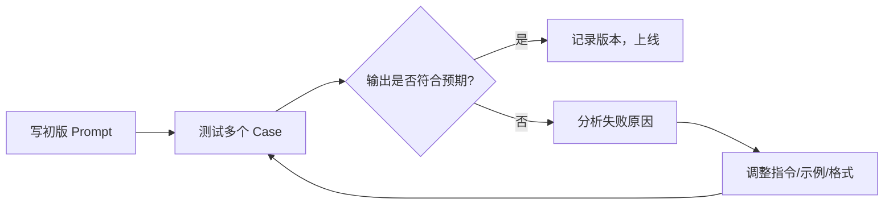

# Prompt 设计基础与原则

Prompt（提示词）是与 LLM 交互的主要接口。写好 Prompt 不是"凑词"，而是一门系统性的工程实践——清晰的指令、充足的上下文、合理的结构，能大幅提升模型输出的质量和一致性。

## 为什么 Prompt 很重要

同一个模型，面对不同的 Prompt，输出质量可能天壤之别。Prompt Engineering 的目标是：在不修改模型参数的前提下，通过设计输入来最大化输出质量。

```
差：「帮我写个函数」
好：「用 TypeScript 写一个函数，接收字符串数组，返回去重后按字母升序排列的数组，包含 JSDoc 注释和边界情况处理（空数组、非字符串元素）」
```

## 核心原则

### 1. 清晰、具体、无歧义

模型会"字面理解"你的指令。模糊的要求得到的是模糊的输出。

**不好：**
```
总结这篇文章
```

**好：**
```
用 3 句话总结以下文章的核心观点，面向技术背景的读者，
不要引用具体数字，重点提炼方法论。
```

明确指定：输出长度、受众、格式、重点、排除内容。

### 2. 提供足够的上下文

模型没有"背景知识"，你需要把相关信息显式放进 Prompt。

```typescript
// 带上下文的 Prompt 骨架
const prompt = `
你是一名高级前端工程师，负责 Code Review。

**代码背景：**
- 项目：React 18 + TypeScript 5 的 SPA
- 该组件负责用户登录表单，需处理异步验证

**待审查代码：**
\`\`\`tsx
${code}
\`\`\`

**请重点关注：**
1. 异步状态管理是否合理
2. 错误边界是否完整
3. TypeScript 类型是否准确
`
```

### 3. 角色设定（Persona）

给模型一个明确的角色，能让输出更加专业和一致：

```
你是一名拥有 10 年经验的系统架构师，擅长分布式系统设计。
请用专业但易懂的语言回答以下问题……
```

角色设定尤其适合需要特定专业视角的任务。注意：角色是引导，不是魔法——模型知识边界不会因角色而扩展。

### 4. 指定输出格式

未指定格式时，模型会自行决定。明确要求格式能减少后处理工作：

```
请以 JSON 格式返回，结构如下：
{
  "summary": "一句话总结",
  "keywords": ["关键词1", "关键词2"],
  "sentiment": "positive | negative | neutral"
}
不要输出 JSON 以外的内容。
```

### 5. 示例驱动

当纯文字描述难以表达预期输出时，直接给例子（详见 Few-Shot 文章）：

```
将以下句子从正式语气改为口语化语气：

输入：「本次会议旨在探讨产品迭代方向。」
输出：「这次开会主要聊聊产品怎么迭代。」

现在改写：「请各部门于本周五前提交季度报告。」
```

### 6. 分解复杂任务

复杂任务交给模型一次性完成往往效果差，拆成子步骤效果更好：

```
请按以下步骤分析这段代码：
步骤 1：识别代码的主要功能（1-2 句）
步骤 2：列出潜在的性能问题（用列表）
步骤 3：给出重构建议（代码示例）

请严格按步骤输出，每步用 ### 分隔。
```

## Prompt 的基本结构

一个完整的 Prompt 通常包含以下部分（非全部必须）：

```
[角色/身份]  你是……
[任务描述]  你的任务是……
[背景/上下文]  以下是相关信息：……
[约束条件]  要求/不要……
[输出格式]  请以……格式输出
[输入数据]  待处理内容：……
[示例]  例如：……
```

## 迭代优化方法

Prompt 设计是迭代工程，不是一次性写完：



**失败原因分类：**
- **模型理解偏差**：指令不够精确 → 重新描述或加示例
- **格式不符**：没有严格指定格式 → 加强格式约束
- **内容缺失**：信息不完整 → 补充上下文
- **过度发散**：约束不够 → 添加限制条件

## 常见误区

- **Prompt 越长越好**：不对。冗余信息会稀释关键指令，导致模型注意力分散
- **一个 Prompt 打天下**：不同任务需要专门设计，通用 Prompt 往往平庸
- **不测试边界情况**：正常 case 通过不代表所有 case 都能处理，要测试边界输入
- **忽视 System Prompt**：System Prompt 对行为约束更稳定，不要把所有内容都塞进 user 消息

## 面试常问

- Prompt 中的角色设定有什么实际作用？
- 如何系统地评估一个 Prompt 的质量？
- 当模型输出不稳定时，从哪些维度改进 Prompt？
- Prompt 和 Fine-tuning 各自适合什么场景？
- "幻觉"（Hallucination）问题用 Prompt 能在多大程度上缓解？
