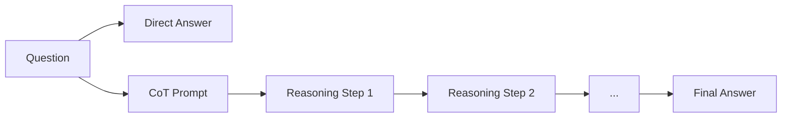

Chain-of-Thought（CoT，思维链）是一种让 LLM 在给出最终答案之前，先输出完整推理过程的 Prompt 技术。研究表明，CoT 能显著提升模型在数学计算、逻辑推理、多步决策等复杂任务上的准确率。

## 为什么 CoT 有效

LLM 是自回归模型（Autoregressive Model）——每个 token 只能依赖之前已生成的内容。如果直接要求输出答案，模型在生成过程中没有机会推演中间步骤。

CoT 的核心洞察：**让模型把中间步骤写出来，等于给自己提供了可依赖的"草稿纸"（scratchpad）**。

```
不用 CoT：
Q: 一家店有 12 个苹果，卖出 3 个，又进货原来数量的一半，现在有几个？
A: 13（错误）

用 CoT：
Q: 一家店有 12 个苹果，卖出 3 个，又进货原来数量的一半，现在有几个？
A: 先分步计算：
   1. 卖出后：12 - 3 = 9 个
   2. 进货量 = 原来 12 的一半 = 6 个
   3. 现在 = 9 + 6 = 15 个
   答案是 15 个。（正确）
```

## CoT 流程 vs 直接回答

下图展示了使用 CoT 与直接回答两种路径的对比：



直接回答路径短，但对复杂问题容易出错；CoT 路径更长，但每一步推理都作为下一步的上下文，大幅降低出错概率。

## CoT 的触发方式

### Zero-Shot CoT（零样本思维链）

最简单的方式：在 Prompt 末尾加入触发语句，无需提供任何示例。

```
请逐步思考，然后给出答案。
```

英文场景下常用的经典触发短语（来自 Wei et al. 2022）：

```
Let's think step by step.
```

```python
import anthropic

client = anthropic.Anthropic()

question = "一家店有 12 个苹果，卖出 3 个，又进货原来数量的一半，现在有几个？"

msg = client.messages.create(
    model="claude-opus-4-5",
    max_tokens=512,
    messages=[
        {
            "role": "user",
            "content": f"{question}\n\nLet's think step by step."
        }
    ]
)
print(msg.content[0].text)
```

### Few-Shot CoT（少样本思维链）

提供若干带有推理过程的完整示例，引导模型模仿推理格式：

```
示例：
问：小明有 5 元，买了 2 元的糖，又收到 3 元压岁钱，现在有多少钱？
思考过程：
  - 初始：5 元
  - 买糖后：5 - 2 = 3 元
  - 收到压岁钱后：3 + 3 = 6 元
答案：6 元

现在你来回答：
问：仓库有 100 件商品，出库 30 件，又入库原来库存量的 20%，现在有多少件？
```

Few-Shot CoT 效果通常优于 Zero-Shot CoT，但需要手工构造示例，成本更高。

## 三种 CoT 变体对比

| 方法 | 触发方式 | 推理成本 | 准确率 | 推荐场景 |
|------|---------|---------|--------|---------|
| Zero-Shot CoT | `Let's think step by step` | 低 | 中 | 快速原型、通用推理任务 |
| Few-Shot CoT | 提供带推理过程的示例 | 中 | 高 | 格式严格、需要特定推理风格 |
| Self-Consistency | 多次采样 + 多数投票 | 高（N 次调用）| 最高 | 高精度需求、数学/逻辑题 |

## Self-Consistency（自一致性）

单次 CoT 采样可能走错推理路径。Self-Consistency（Wang et al. 2022）的做法：

1. 用相同 Prompt 多次采样（temperature > 0 以获取多样性）
2. 对每次推理链提取最终答案
3. 多数投票（Majority Voting）选出最终答案

```python
import anthropic
from collections import Counter


def extract_answer(text: str) -> str:
    """从推理文本的最后一行提取最终答案。"""
    lines = text.strip().split("\n")
    return lines[-1].strip()


def self_consistency(question: str, n: int = 5) -> str:
    client = anthropic.Anthropic()
    answers = []
    for _ in range(n):
        msg = client.messages.create(
            model="claude-opus-4-5",
            max_tokens=512,
            messages=[
                {
                    "role": "user",
                    "content": (
                        f"{question}\n\n"
                        "Let's think step by step. "
                        "最后一行只写最终答案（数字或选项字母）。"
                    ),
                }
            ],
            temperature=0.7,  # 以官方文档为准
        )
        # extract final answer from reasoning
        answers.append(extract_answer(msg.content[0].text))

    most_common, count = Counter(answers).most_common(1)[0]
    print(f"[Self-Consistency] {n} 次采样结果：{Counter(answers)}")
    print(f"多数投票答案：{most_common}（出现 {count} 次）")
    return most_common


if __name__ == "__main__":
    q = "如果今天是周三，再过 100 天是周几？"
    result = self_consistency(q, n=5)
    print(f"最终答案：{result}")
```

### 为什么多数投票有效

不同的推理路径（reasoning paths）因不同的中间步骤而产生误差，但正确答案往往更集中。错误路径相对分散，多数投票可以过滤掉偶发性的推理错误。

## Tree of Thoughts（ToT，思维树）

ToT（Yao et al. 2023）是 CoT 的进一步扩展：

- CoT 是**线性链**：一条推理路径到底
- ToT 是**树形搜索**：在每个推理步骤生成多个候选分支，并使用启发式评估函数（或让模型自评）对各分支打分，通过 BFS/DFS 搜索最优解

适合场景：需要回溯（backtracking）的规划类任务、创意写作的结构规划、复杂数学证明。

实现复杂度较高，通常只用于离线高质量生成场景，不适合实时 API 调用。

## 适用场景与局限

**适合 CoT：**
- 数学计算、数量推理（Quantitative Reasoning）
- 多步骤逻辑推断（Multi-step Logic）
- 代码调试（逐步分析错误原因）
- 复杂决策（利弊权衡、规划排序）

**不适合 CoT：**
- 简单分类、情感分析——CoT 反而可能引入噪声
- 对延迟（latency）极敏感的实时场景——推理过程消耗大量 token
- 创意写作——推理链可能让文本生硬、失去流畅性
- 简单事实查询（"北京的首都是哪里？"）——直接回答更高效

## 常见错误 / 最佳实践

### 常见错误

1. **对简单任务滥用 CoT**：在情感分类等任务上强制 CoT，反而可能降低准确率并浪费 token。
2. **不验证推理链**：CoT 改善整体准确率，但不能保证每次推理正确。对关键任务要程序化验证结果，而不是盲目信任推理文本。
3. **Self-Consistency 采样数太少**：n=2 时多数投票意义不大，通常 n≥5 才有效果。
4. **Few-Shot 示例质量差**：示例中的推理过程如果有逻辑错误，会"教坏"模型。

### 最佳实践

- **先想后答**：要求模型把推理放在 `<thinking>` 标签内，最终答案放在 `<answer>` 标签，后处理时只取 `<answer>` 部分。
- **控制推理长度**：用 `max_tokens` 限制，或在 Prompt 中指定"推理不超过 200 字"，避免无意义的冗长输出。
- **temperature 与 Self-Consistency 配合**：采样时用 0.6–0.8，最终答案提取用 0（或直接取多数）。
- **任务难度匹配**：简单任务用 Zero-Shot，中等任务用 Few-Shot CoT，高精度需求用 Self-Consistency。

## 面试常问

- 为什么 CoT 能提升推理准确率？从自回归模型的 token 生成机制角度解释。
- Self-Consistency 和普通 CoT 有什么区别？多数投票为什么有效？
- 什么情况下 CoT 可能降低效果或不值得使用？
- Zero-Shot CoT 和 Few-Shot CoT 的触发方式有何差异，各自适合什么场景？
- Tree of Thoughts 与 CoT 的本质区别是什么？适合解决哪类问题？
- 如何在生产环境中使用 CoT 同时控制成本和延迟？

