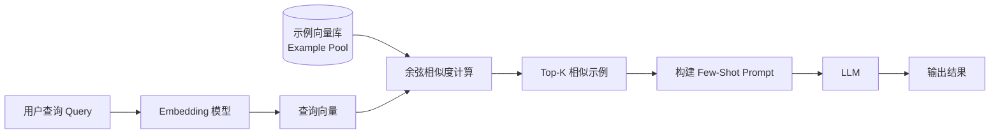

# Few-Shot 与 Zero-Shot 提示

Zero-Shot 和 Few-Shot 是 Prompt 设计的两种基本范式，描述了"向模型提供多少示例"来引导任务完成。理解两者的适用边界与动态示例选择（Dynamic Few-Shot）策略，是工程化 Prompt 的核心能力。

## 基本概念

### Zero-Shot 提示（零样本）

Zero-Shot 是指不提供任何示例，只描述任务，直接让模型完成。依赖模型在预训练（Pretraining）和指令微调（Instruction Tuning）阶段积累的通用能力。

```python
import anthropic

client = anthropic.Anthropic()

msg = client.messages.create(
    model="claude-opus-4-5",
    max_tokens=256,
    messages=[
        {
            "role": "user",
            "content": (
                "判断以下评论的情感倾向，输出 positive、negative 或 neutral：\n\n"
                "评论：「这款手机续航真的太棒了，用了两天才充一次电！」\n\n情感："
            ),
        }
    ],
)
print(msg.content[0].text)
```

**优点：**
- Prompt 简洁，token 消耗少
- 对通用任务（模型预训练时见过大量类似数据）效果已经很好

**局限：**
- 输出格式难以精确控制
- 对于罕见任务、特殊领域或需要遵循特定约定的场景效果差
- 输出风格不一致

### One-Shot 提示（单样本）

提供一个输入-输出示例，帮助模型理解期望的格式或风格，是 Few-Shot 的最小形态。

### Few-Shot 提示（少样本）

提供 2–8 个示例，让模型从示例中学习期望的行为，这种机制被称为**上下文学习（In-Context Learning，ICL）**。

```python
import anthropic

client = anthropic.Anthropic()

few_shot_prompt = """判断评论的情感倾向，用 JSON 格式输出。

示例 1：
输入：「快递很快，包装完好，满意！」
输出：{"sentiment": "positive", "reason": "物流和包装均满足预期"}

示例 2：
输入：「等了三周才到，卖家态度也很差。」
输出：{"sentiment": "negative", "reason": "配送时间过长，服务态度差"}

示例 3：
输入：「东西就那样，说不上好也说不上坏。」
输出：{"sentiment": "neutral", "reason": "无明显正面或负面体验"}

现在请分析：
输入：「这次购物体验还不错，但价格稍高。」
输出："""

msg = client.messages.create(
    model="claude-opus-4-5",
    max_tokens=256,
    messages=[{"role": "user", "content": few_shot_prompt}],
)
print(msg.content[0].text)
```

示例同时规定了：输出必须是 JSON；`reason` 字段的写作风格；如何处理混合情感。

## 为什么 Few-Shot 有效：In-Context Learning 机制

ICL 不是真正的"学习"（权重未更新），而是通过示例激活模型在预训练中习得的**任务模式识别能力**：

1. 示例揭示任务类型（分类、生成、翻译……）
2. 示例规定输入-输出的映射格式
3. 示例传达风格、语气、详细程度等隐式约束

这也解释了为什么示例质量比数量更重要——低质量或格式不一致的示例会传递错误的任务模式。

关键发现：
- 示例的**标签正确性**影响较小——即使标签随机化，模型也能学习输出格式（ICL 主要学习"数据分布和格式"）
- 示例的**格式一致性**影响很大
- 示例数量有**边际效应**——从 0 到 1 个示例的提升远大于从 4 到 5 个

## 示例选择策略

### 覆盖典型情况（Representative）

示例应涵盖任务的主要类型，尤其是模型容易出错的边界情况（edge cases）：

```
# 分类任务的示例应覆盖所有类别
# 翻译任务的示例应包含领域术语
# 代码生成的示例应包含异常处理模式
```

### 格式严格一致（Consistent Format）

所有示例必须遵循完全相同的格式。不一致的示例会让模型困惑：

```
# 错误：格式不一致
示例 1 输出：positive
示例 2 输出：{"sentiment": "negative"}

# 正确：格式统一
示例 1 输出：{"sentiment": "positive"}
示例 2 输出：{"sentiment": "negative"}
```

### 示例数量

- 通常 3–5 个示例效果最佳
- 示例过少（1 个）：格式约束力弱
- 示例过多（10+）：消耗大量 token，性价比低；且可能分散对指令的注意力
- 对于复杂任务，质量 > 数量

### 示例顺序（Ordering Matters）

研究显示，越靠近查询的示例对模型影响越大（**接近效应，Recency Bias**）。把最典型或最复杂的示例放在最后。

## Dynamic Few-Shot（动态示例选择）

硬编码固定示例有局限——面对多变的输入，固定示例未必总是最优。动态 Few-Shot 根据当前输入，从示例库中检索最相关的示例，再构建 Prompt。

### 检索流程



### Python 实现骨架

```python
from anthropic import Anthropic
import numpy as np


def embed(text: str) -> list[float]:
    """调用嵌入模型，返回向量（此处为占位，替换为实际嵌入 API）。"""
    raise NotImplementedError("请替换为实际的 embedding 实现")


def cosine_sim(a: list[float], b: list[float]) -> float:
    """计算两个向量的余弦相似度（Cosine Similarity）。"""
    a_arr = np.array(a)
    b_arr = np.array(b)
    norm = np.linalg.norm(a_arr) * np.linalg.norm(b_arr)
    if norm == 0:
        return 0.0
    return float(np.dot(a_arr, b_arr) / norm)


def dynamic_few_shot(query: str, example_pool: list[dict], k: int = 3) -> str:
    # 1. embed query and examples (use your preferred embedding model)
    query_emb = embed(query)
    example_embs = [embed(ex["input"]) for ex in example_pool]
    # 2. pick top-k by cosine similarity
    scores = [cosine_sim(query_emb, e) for e in example_embs]
    top_k = sorted(range(len(scores)), key=lambda i: scores[i], reverse=True)[:k]
    # 3. build prompt
    examples_text = "\n\n".join(
        f"Input: {example_pool[i]['input']}\nOutput: {example_pool[i]['output']}"
        for i in top_k
    )
    prompt = f"{examples_text}\n\nInput: {query}\nOutput:"
    client = Anthropic()
    msg = client.messages.create(
        model="claude-opus-4-5",
        max_tokens=256,
        messages=[{"role": "user", "content": prompt}],
    )
    return msg.content[0].text
```

### 工程落地建议

- 示例库（Example Pool）提前离线计算并存储向量（可用 Faiss、Pinecone、pgvector）
- 查询时只需对用户输入做一次嵌入，检索复杂度为 O(log N)（使用 ANN 近似最近邻）
- 示例数量 k 推荐 3–5，同时监控 token 上限

## 方法横向对比

| 方法 | 数据需求 | 推理成本 | 灵活性 | 推荐场景 |
|------|---------|---------|--------|---------|
| Zero-Shot | 无 | 低 | 高 | 通用任务、快速原型 |
| Few-Shot | 少量示例 | 中 | 高 | 格式/风格定制 |
| Fine-tuning | 大量标注数据 | 低（推理时） | 低 | 专有领域、高频调用 |

**经验法则：先用 Few-Shot 验证可行性，当任务固定且调用频率高时再评估 Fine-tuning 的 ROI。**

### Few-Shot vs Fine-tuning 决策矩阵

| 考量维度 | 倾向 Few-Shot | 倾向 Fine-tuning |
|---------|-------------|----------------|
| 数据量 | < 100 条示例 | > 500 条标注数据 |
| 任务稳定性 | 需求频繁变化 | 任务格式高度固定 |
| 调用频率 | 低频 / 实验阶段 | 日均百万级调用 |
| 推理延迟要求 | 宽松 | 严格（Prompt 越短越快）|
| 定制深度 | 格式/风格 | 领域知识、专有术语 |

## Few-Shot + CoT 组合

在 Few-Shot 示例中同时展示推理过程，形成 **Few-Shot CoT**（效果通常优于两者单独使用）：

```
示例：
输入：「数组 [3,1,4,1,5] 中的最大值是？」
思考：遍历数组，记录最大值：3→1（保持 3）→4（更新到 4）→1（保持 4）→5（更新到 5）。
输出：5
```

详细用法参见 CoT 思维链技巧文章。

## 常见错误 / 最佳实践

### 常见错误

1. **示例格式不统一**：不同示例用不同字段名或分隔符，导致模型输出格式混乱。
2. **示例全是正面案例**：缺少负例或边界案例，模型对异常输入处理不当。
3. **示例过多且质量低**：10+ 条质量平庸的示例不如 3 条高质量示例。
4. **动态检索 k 值过大**：塞入太多示例超出 context window 或稀释核心指令。
5. **忽略 Recency Bias**：把最重要的示例放在最前面，却因接近效应效果不如放在最后。

### 最佳实践

- **先 Zero-Shot 基准测试**：了解模型在没有示例时的表现，再判断 Few-Shot 的增益。
- **示例覆盖 label 分布**：分类任务中各类别示例数量尽量均衡，避免隐性偏差（bias）。
- **动态 Few-Shot 离线预计算嵌入**：避免每次请求都实时嵌入整个示例库。
- **使用清晰的分隔符**：`---`、`###` 或 XML 标签（`<example>`）明确示例边界。
- **Few-Shot 结合系统提示**：示例放在 user/assistant 对话轮次，任务说明放在 system prompt，职责分明。

## 面试常问

- Zero-Shot 和 Few-Shot 分别在什么情况下更适合？各有哪些局限？
- In-Context Learning（ICL）的本质是什么？为什么不更新权重也能"学习"？
- Few-Shot 示例的质量 vs 数量，哪个更重要？为什么？
- Dynamic Few-Shot 是什么，如何实现？核心技术挑战是什么？
- 什么时候应该从 Few-Shot 升级到 Fine-tuning？判断标准是什么？
- Recency Bias 对示例排序有什么影响，如何利用这一特性？
- Few-Shot Prompting 和 In-Context Learning 是同一回事吗？

> 部分内容参考《Hello-Agents》(datawhalechina)整理。
