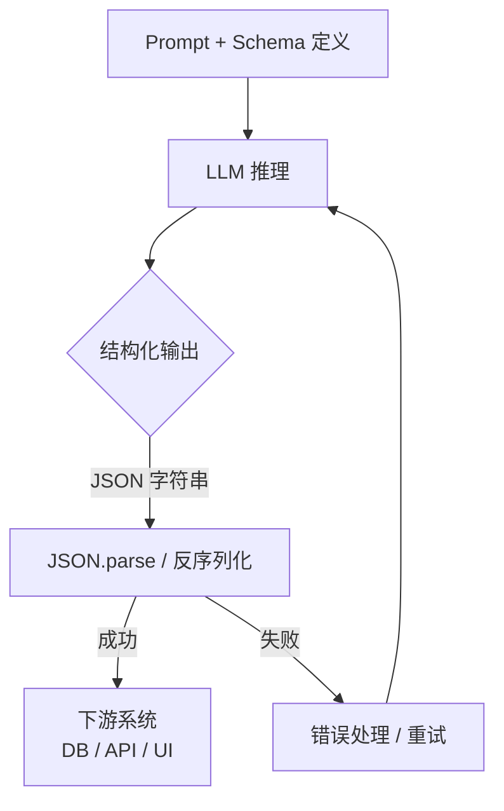

LLM 默认输出自然语言，但程序需要结构化数据。结构化输出（Structured Output）技术让模型的回复直接符合预定义的 JSON Schema，省去解析自然语言的麻烦，是 LLM 集成到业务系统的关键环节。

## 为什么需要结构化输出

在没有结构化约束时，LLM 的回答往往夹杂着额外的解释文字，导致下游系统需要复杂的正则匹配或二次解析。当输入文本或模型版本稍有变化，解析逻辑就可能失效，引发线上故障。

**结构化输出的核心价值：**
- 消除输出格式的不确定性（Format Reliability）
- 与下游系统直接集成——数据库入库、API 透传、UI 渲染
- 便于类型检查（Type Safety）和自动化测试
- 降低系统整体的解析失败率（Parse Error Rate）

以下流程图展示了从 Prompt 到下游消费的完整链路：



## 方法一：Prompt-only JSON（提示词约束）

最基础的方法是在系统提示词（System Prompt）或用户消息中明确要求输出 JSON，并给出格式示例：

```python
import anthropic
import json

client = anthropic.Anthropic()

prompt = """从以下文本中提取结构化信息，严格按照 JSON 格式返回，不要输出任何其他内容。

文本：「订单号 ORD-20241218-001，客户王芳，购买了 iPhone 15（2件），总金额约 9000 元。」

输出格式示例：
{
  "order_id": "string",
  "customer_name": "string",
  "items": [{"name": "string", "quantity": 1}],
  "total_amount": 0
}"""

response = client.messages.create(
    model="claude-opus-4-5",
    max_tokens=512,
    messages=[{"role": "user", "content": prompt}],
)

try:
    result = json.loads(response.content[0].text)
    print(result)
except json.JSONDecodeError:
    print("解析失败，原始输出：", response.content[0].text)
```

**优点：** 通用，任何模型都可用，无需特殊 API 参数。  
**缺点：** 模型仍可能在 JSON 前后输出额外文字，或产生语法错误，需要额外的防御性解析（Defensive Parsing）。

## 方法二：OpenAI Structured Outputs（结构化输出 API）

OpenAI 在 GPT-4o 系列模型上引入了原生的 Structured Outputs 功能，通过 `response_format` 参数传入 JSON Schema，使用语法约束（Grammar Constraint）在解码阶段强制输出符合 Schema 的 token 序列，从根本上消除格式错误。

```python
from openai import OpenAI
from pydantic import BaseModel

client = OpenAI()

class OrderInfo(BaseModel):
    order_id: str
    customer_name: str
    total_amount: float

completion = client.beta.chat.completions.parse(
    model="gpt-4o",
    messages=[
        {"role": "user", "content": "订单 ORD-001，客户王芳，金额 9000 元。"}
    ],
    response_format=OrderInfo,
)

order = completion.choices[0].message.parsed
print(order.order_id, order.customer_name, order.total_amount)
```

`response_format` 接受 Pydantic 模型或手写的 JSON Schema 字典。解码阶段的 token 掩码保证字段名、类型、枚举值均合规，是目前格式约束最强的方案。

## 方法三：OpenAI Function Calling / Tool Use（工具调用）

Function Calling（函数调用）是 OpenAI 最早引入的结构化机制，现已演进为 Tool Use（工具调用）。模型在需要调用外部能力时，会输出一段符合 `parameters` Schema 的 JSON，而非普通文字回复。

```python
from openai import OpenAI
import json

client = OpenAI()

tools = [
    {
        "type": "function",
        "function": {
            "name": "extract_user_info",
            "description": "提取用户基本信息",
            "parameters": {
                "type": "object",
                "properties": {
                    "name": {"type": "string", "description": "用户姓名"},
                    "age": {"type": "integer", "description": "用户年龄"},
                    "occupation": {"type": "string", "description": "职业"},
                },
                "required": ["name", "age", "occupation"],
            },
        },
    }
]

response = client.chat.completions.create(
    model="gpt-4o",
    messages=[
        {"role": "user", "content": "张三，28岁，软件工程师，北京。"}
    ],
    tools=tools,
    tool_choice={"type": "function", "function": {"name": "extract_user_info"}},
)

tool_call = response.choices[0].message.tool_calls[0]
user_info = json.loads(tool_call.function.arguments)
print(user_info)
# {"name": "张三", "age": 28, "occupation": "软件工程师"}
```

`tool_choice` 设为指定函数名可强制模型调用该工具，而非自由决策，适合将 Tool Use 当作纯结构化输出的手段。

## 方法四：Claude Tool Use（Anthropic 工具调用）

Claude 的工具调用（Tool Use）在机制上与 OpenAI Function Calling 类似，但 Schema 字段名略有差异：使用 `input_schema` 而非 `parameters`，工具调用结果存放在 `response.content` 列表中，类型为 `tool_use`。强制调用某个工具时使用 `tool_choice: {"type": "tool", "name": "..."}` 。

```python
import anthropic
import json

client = anthropic.Anthropic()

tools = [
    {
        "name": "extract_person",
        "description": "从文本中提取人物信息",
        "input_schema": {
            "type": "object",
            "properties": {
                "name": {"type": "string", "description": "姓名"},
                "age": {"type": "integer", "description": "年龄"},
                "occupation": {"type": "string", "description": "职业"},
            },
            "required": ["name"],
        },
    }
]

response = client.messages.create(
    model="claude-opus-4-5",
    max_tokens=1024,
    tools=tools,
    messages=[
        {"role": "user", "content": "张伟，35岁，是一名软件工程师。请提取他的信息。"}
    ],
)

for block in response.content:
    if block.type == "tool_use":
        print(json.dumps(block.input, ensure_ascii=False, indent=2))
# {
#   "name": "张伟",
#   "age": 35,
#   "occupation": "软件工程师"
# }
```

Claude 的工具调用同样受 Schema 约束，实测在嵌套对象、枚举字段上均能稳定输出合规 JSON。与 OpenAI 相比，Claude 会在思考阶段（`thinking` block，若开启）先推理再填充工具参数，有助于处理模糊输入。

## 四种方法对比

| 方法 | 约束强度 | API 支持 | 适用模型 | 典型用途 |
|------|---------|---------|---------|---------|
| Prompt-only JSON | 低（可能不合规） | 无需特殊 | 所有 | 快速原型 |
| OpenAI Structured Outputs | 高（grammar约束） | response_format | GPT-4o+ | 可靠解析 |
| OpenAI Function Calling | 高 | tools | GPT系列 | 工具调用 |
| Claude Tool Use | 高 | tools | Claude系列 | 工具调用/结构化提取 |

## JSON Schema 设计要点

JSON Schema 本身也是 Prompt 的一部分，写得好能显著提升模型的填充准确率。

### `required` 字段

明确声明哪些字段是必填的，模型会优先保证这些字段存在。非必填字段在无法从文本提取时，模型可以省略，避免凭空捏造（Hallucination）。

```json
{
  "type": "object",
  "properties": {
    "name": {"type": "string"},
    "age": {"type": "integer"},
    "email": {"type": "string"}
  },
  "required": ["name"]
}
```

### `type` 与 `enum`

`type` 限制数据类型，`enum` 进一步约束枚举值，两者配合可大幅减少无效输出：

```json
{
  "status": {
    "type": "string",
    "enum": ["pending", "shipped", "delivered", "cancelled"],
    "description": "订单状态"
  },
  "priority": {
    "type": "integer",
    "enum": [1, 2, 3],
    "description": "优先级：1=低，2=中，3=高"
  }
}
```

### `description` 引导模型理解语义

`description` 是写给模型看的"注释"，对于含义不直观的字段尤为重要：

```json
{
  "sentiment_score": {
    "type": "number",
    "description": "情感得分，范围 -1 到 1。-1 表示极负面，0 表示中性，1 表示极正面"
  },
  "confidence": {
    "type": "number",
    "description": "提取置信度，0~1 之间，低于 0.5 时建议人工复核"
  }
}
```

### 嵌套对象与数组

```json
{
  "type": "object",
  "properties": {
    "items": {
      "type": "array",
      "items": {
        "type": "object",
        "properties": {
          "name": {"type": "string", "description": "商品名称"},
          "quantity": {"type": "integer", "description": "购买数量"},
          "unit_price": {"type": "number", "description": "单价（元）"}
        },
        "required": ["name", "quantity"]
      },
      "description": "订单商品列表"
    }
  }
}
```

## 常见错误与最佳实践

### 常见错误

| 错误 | 后果 | 改进方式 |
|------|------|---------|
| Prompt-only 但不给格式示例 | 模型输出格式随机 | 提供完整的 JSON 示例 |
| `description` 为空或含糊 | 模型对字段语义猜测错误 | 写清楚单位、范围、枚举含义 |
| `required` 包含无法从文本中提取的字段 | 模型被迫编造数据 | 只将确定能提取的字段放入 required |
| 忽略解析错误 | 线上静默失败 | 始终包裹 try/except，记录原始输出 |
| Schema 嵌套过深（>5层） | 模型填充准确率下降 | 拆分为多次调用或扁平化 Schema |

### 最佳实践

1. **优先使用 Tool Use / Structured Outputs**，比 Prompt-only 更可靠，尤其在生产环境。
2. **每个字段都写 `description`**，把领域知识编码进 Schema 而非依赖模型猜测。
3. **`enum` 优先于 `string`**：能枚举的值一定要枚举，减少歧义。
4. **设置合理的 `max_tokens`**：结构化输出通常比自由文本短，避免因 token 限制导致 JSON 被截断。
5. **记录原始输出**：即使解析成功，也保存 `response.content` 原文，便于事后审计。
6. **防御性解析**：对 Prompt-only 方案，尝试先提取 markdown 代码块中的 JSON，再全文解析。

## 面试常问

- **为什么不能直接让模型输出 JSON，还需要专门的结构化输出机制？**  
  Prompt-only 方法依赖模型的"遵从指令"能力，模型可能在 JSON 前后输出额外文字，或产生语法错误。Structured Outputs / Tool Use 在解码阶段使用 Schema 约束 token 选择，从机制层面保证格式合规。

- **Function Calling 和 Structured Outputs 有什么区别？**  
  Function Calling 的语义是"调用外部工具"，模型决策是否调用；Structured Outputs 的语义是"按指定格式回复"，模型必须输出结构化内容。前者更适合 Agent 流程，后者更适合纯数据提取。

- **Claude Tool Use 和 OpenAI Function Calling 的主要差异？**  
  Schema 字段名不同（`input_schema` vs `parameters`）；强制调用语法不同（`tool_choice: {type: "tool"}` vs `{type: "function"}`）；Claude 的工具结果在 `content` 列表中，需要按 `type == "tool_use"` 过滤。

- **如何处理模型输出不符合 Schema 的情况？**  
  记录原始输出、触发重试（可在 Prompt 中说明上次输出有误）、或降级到人工处理队列。切勿静默吞掉错误。

- **JSON Schema 中 `description` 字段对模型有什么作用？**  
  `description` 直接出现在模型的上下文中，相当于字段级别的 Prompt，帮助模型理解字段语义，尤其对歧义字段（如 `score`、`type`、`status`）影响显著。

