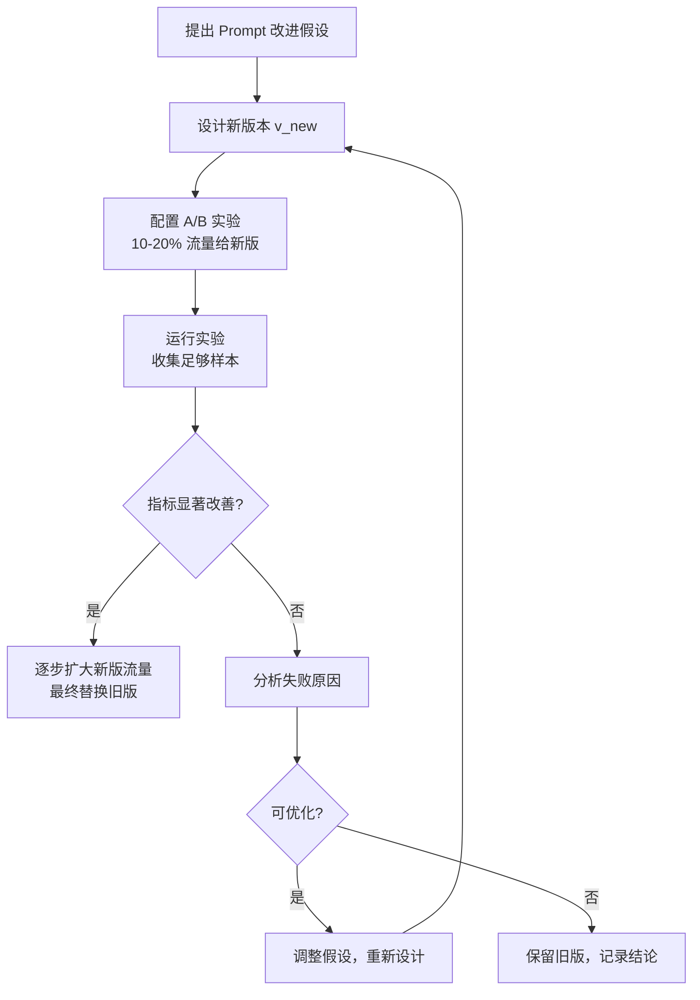

# Prompt 版本管理与 A/B 测试

Prompt 是 LLM 应用的核心资产之一，和代码一样需要版本管理、测试和迭代。缺乏管理的 Prompt 修改是线上事故的高发源头——"随手改了一句话"可能导致输出质量显著下降，且难以排查。

## 为什么 Prompt 需要版本管理

与普通代码不同，Prompt 的问题往往不在运行时报错，而是输出质量的悄然变化：

- 格式变了（原来输出 JSON，现在多了前缀文字）
- 语气变了（原来专业，现在随意）
- 遗漏了某类情况（某个 edge case 不再正确处理）
- 成本变了（token 数突然增加）

版本管理的目标：**可追溯、可回滚、可比较、可审计**。

## 版本管理策略

### 基础：文件化管理

最简单的起点是把 Prompt 从代码中分离，用独立文件或配置管理：

```
prompts/
├── v1/
│   ├── summarize.md
│   └── extract-order.md
├── v2/
│   ├── summarize.md
│   └── extract-order.md
└── current -> v2/    # 符号链接或配置指向当前版本
```

用 Git 管理这个目录，每次修改都留有记录。

### 版本标识约定

```typescript
interface PromptVersion {
  id: string           // 唯一标识，如 "summarize-v2.3"
  name: string         // 可读名称
  content: string      // Prompt 内容
  variables: string[]  // 使用的变量占位符
  createdAt: string    // 创建时间
  author: string       // 作者
  changelog: string    // 变更说明
}
```

### 代码中引用版本

```typescript
// 不要硬编码 Prompt，通过 ID 引用
import { promptRegistry } from './prompt-registry'

const response = await llmClient.complete({
  prompt: promptRegistry.get('summarize-v2.3').render({ text: input }),
  model: 'gpt-4o',
})

// 日志记录使用了哪个版本，便于问题排查
logger.info('LLM call', {
  promptId: 'summarize-v2.3',
  inputTokens: response.usage.prompt_tokens,
  outputTokens: response.usage.completion_tokens,
})
```

### 模板渲染

Prompt 中的变量用模板语法管理，避免字符串拼接：

```typescript
class PromptTemplate {
  constructor(private template: string) {}

  render(variables: Record<string, string>): string {
    return this.template.replace(
      /\{\{(\w+)\}\}/g,
      (_, key) => variables[key] ?? `{{${key}}}`
    )
  }
  
  getVariables(): string[] {
    const matches = this.template.matchAll(/\{\{(\w+)\}\}/g)
    return [...new Set([...matches].map(m => m[1]))]
  }
}

// 使用示例
const template = new PromptTemplate(`
你是一名代码审查助手。

代码语言：{{language}}
审查重点：{{focus}}

待审查代码：
\`\`\`{{language}}
{{code}}
\`\`\`
`)

const rendered = template.render({
  language: 'TypeScript',
  focus: '性能优化',
  code: userCode,
})
```

## A/B 测试框架

A/B 测试用于在两个（或多个）Prompt 版本之间进行对比，以数据为依据决定保留哪个版本。

### 基本结构

```typescript
interface PromptExperiment {
  experimentId: string
  variants: Array<{
    id: string
    promptVersion: string
    weight: number        // 流量分配权重，如 0.5 = 50%
  }>
  metrics: string[]      // 要追踪的指标
  startedAt: string
  endedAt?: string
}

class PromptABTestRouter {
  constructor(private experiment: PromptExperiment) {}
  
  selectVariant(requestId: string): string {
    // 基于请求 ID 做确定性分流（同一请求总是走同一变体）
    const hash = this.hash(requestId) % 100
    let cumulative = 0
    
    for (const variant of this.experiment.variants) {
      cumulative += variant.weight * 100
      if (hash < cumulative) return variant.id
    }
    
    return this.experiment.variants[0].id
  }
  
  private hash(str: string): number {
    let hash = 0
    for (let i = 0; i < str.length; i++) {
      hash = ((hash << 5) - hash) + str.charCodeAt(i)
      hash |= 0
    }
    return Math.abs(hash)
  }
}
```

### 指标收集

```typescript
interface PromptCallResult {
  experimentId: string
  variantId: string
  promptId: string
  requestId: string
  
  // 自动指标
  latencyMs: number
  inputTokens: number
  outputTokens: number
  cost: number
  
  // 业务指标（需人工评分或自动评估）
  qualityScore?: number    // 1-5 人工评分
  taskSuccess?: boolean    // 是否完成任务目标
  parseError?: boolean     // 是否解析失败
}

async function trackedLLMCall(
  input: string,
  router: PromptABTestRouter,
  requestId: string
): Promise<{ output: string; meta: PromptCallResult }> {
  const variantId = router.selectVariant(requestId)
  const variant = getVariant(variantId)
  const prompt = renderPrompt(variant.promptVersion, input)
  
  const start = Date.now()
  let parseError = false
  
  try {
    const response = await llmClient.complete({ prompt })
    const output = parseOutput(response.text)  // 可能抛出
    
    const meta: PromptCallResult = {
      experimentId: router.experiment.experimentId,
      variantId,
      promptId: variant.promptVersion,
      requestId,
      latencyMs: Date.now() - start,
      inputTokens: response.usage.prompt_tokens,
      outputTokens: response.usage.completion_tokens,
      cost: calcCost(response.usage),
      parseError: false,
    }
    
    metricsClient.record(meta)
    return { output, meta }
    
  } catch (e) {
    metricsClient.record({ ..., parseError: true })
    throw e
  }
}
```

### 评估指标设计

**自动指标（低成本）：**
- 格式符合率：输出是否能被正确 parse
- 延迟（TTFT、总时长）
- Token 消耗量（成本代理指标）
- 截断率：是否触发 max_tokens 限制

**质量指标（需要标注或 LLM-as-Judge）：**
- 准确率：对有标准答案的任务（分类、提取）
- 人工评分：1-5 分主观质量
- LLM 自动评分：用另一个模型评判输出质量

```typescript
// LLM-as-Judge 骨架
async function judgeOutput(
  task: string,
  output: string,
  rubric: string
): Promise<{ score: number; reason: string }> {
  const judgePrompt = `
你是一名严格的评审员。请根据以下评分标准，对 AI 输出打分（1-5分）。

任务要求：${task}
AI 输出：${output}
评分标准：${rubric}

请以 JSON 格式输出：{"score": 分数, "reason": "评分理由"}
`
  const result = await llmClient.complete({ prompt: judgePrompt, temperature: 0 })
  return JSON.parse(result.text)
}
```

## 决策流程



## 常见误区

- **"感觉好多了"就上线**：主观感受代替不了数据验证，尤其是罕见边界情况
- **用全量流量测试**：A/B 测试应从小流量开始，控制风险
- **测试样本不足**：样本量不足时统计结论不可信，宁可多跑几天
- **只看平均值**：关注 P95/P99 延迟和错误案例，均值可能掩盖严重问题
- **不记录 changelog**：Prompt 改动要像代码 commit 一样留文字说明

## 工具生态

市面上有专门的 Prompt 管理平台（如 LangSmith、PromptLayer、Brainlane 等），提供版本管理、实验追踪、评估 pipeline 等能力。对于规模较大的 LLM 应用，引入专门工具比自建更经济——**以官方最新文档为准**了解当前功能。

## 面试常问

- 为什么 Prompt 需要版本管理，和代码版本管理有什么区别？
- A/B 测试中如何保证分流的一致性（同一用户始终走同一变体）？
- LLM-as-Judge 评估方法有什么优缺点？
- 如何确定 A/B 测试的样本量是否足够？
- 生产环境中如何快速回滚一个有问题的 Prompt 版本？
