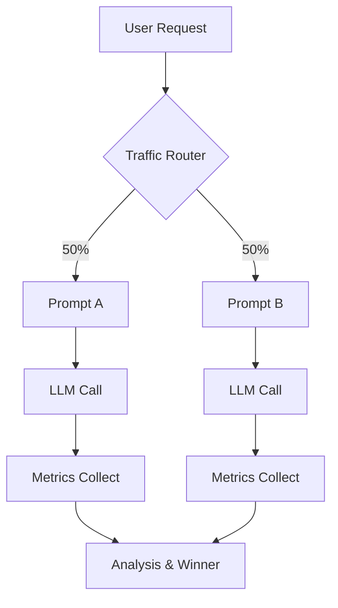

# Prompt 版本管理与 A/B 测试

Prompt 是 LLM 应用的核心资产，和代码一样需要版本管理、测试和迭代。"随手改了一句话"可能导致输出质量显著下降且难以排查——这是 LLM 线上事故的高发源头。

## 为什么 Prompt 需要版本管理

与普通代码不同，Prompt 的问题往往不在运行时报错，而是输出质量的悄然退化（Silent Regression）：

- **格式漂移（Format Drift）**：原来输出 JSON，现在多了前缀文字
- **语气变化（Tone Shift）**：原来专业严谨，现在随意口语
- **边界用例失效（Edge Case Regression）**：某类输入不再正确处理
- **成本膨胀（Cost Regression）**：Token 数突然增加导致费用上升

版本管理的目标：**可追溯（Traceable）、可回滚（Rollback）、可比较（Diff）、可审计（Auditable）**。

## 文件化版本管理

### 目录结构约定

将 Prompt 从代码中分离，用独立文件管理，并通过 Git 追踪变更历史：

```
prompts/
├── summarize/
│   ├── v1.0.yaml
│   ├── v1.1.yaml
│   └── v2.0.yaml       <- 当前生产版本
├── extract-order/
│   ├── v1.0.yaml
│   └── v1.1.yaml
└── registry.yaml       <- 各任务的"当前版本"指针
```

### YAML 模板文件示例

```yaml
# prompts/summarize/v2.0.yaml
id: summarize-v2.0
name: 文章摘要（v2.0）
model: claude-opus-4-5
created_at: "2025-06-01"
author: chenhao
changelog: "改进了对长文的处理，增加了字数限制指令"

system: |
  你是一名专业的内容编辑，擅长提炼文章核心要点。
  摘要应简洁、客观，不超过 {{ max_words }} 字。

user_template: |
  请为以下文章生成摘要：

  {{ article }}
```

### Jinja2 模板渲染（Python）

使用 Jinja2（模板引擎）对 YAML 中的模板变量进行渲染，避免字符串拼接带来的转义问题：

```python
from jinja2 import Template
import yaml
from pathlib import Path
import anthropic

def load_prompt(task: str, version: str) -> dict:
    path = Path(f"prompts/{task}/{version}.yaml")
    return yaml.safe_load(path.read_text(encoding="utf-8"))

def render_prompt(template_str: str, variables: dict) -> str:
    return Template(template_str).render(**variables)

# 使用示例
prompt_def = load_prompt("summarize", "v2.0")

system_prompt = render_prompt(prompt_def["system"], {"max_words": 200})
user_message = render_prompt(prompt_def["user_template"], {"article": "...文章正文..."})

client = anthropic.Anthropic()
response = client.messages.create(
    model=prompt_def["model"],
    max_tokens=512,
    system=system_prompt,
    messages=[{"role": "user", "content": user_message}],
)

# 日志记录使用了哪个版本，便于问题排查
print(f"[Prompt: {prompt_def['id']}] {response.content[0].text}")
```

将 `prompt_def["id"]`（如 `summarize-v2.0`）写入每次调用的日志，出现质量问题时可直接定位到具体的 Prompt 版本。

## A/B 测试框架

A/B 测试（A/B Testing）用于在两个 Prompt 版本之间进行对比，以数据为依据决定保留哪个版本，而非依赖主观感受。

### 流量分配（Traffic Splitting）

核心是**确定性分流**：同一个用户/请求 ID 始终路由到同一个变体（Variant），保证用户体验一致，同时避免同一用户的多次请求污染两组数据：

```python
import hashlib

def select_variant(request_id: str, variants: list[dict]) -> str:
    """
    基于请求 ID 的确定性哈希分流。
    variants: [{"id": "A", "weight": 0.5}, {"id": "B", "weight": 0.5}]
    """
    hash_val = int(hashlib.md5(request_id.encode()).hexdigest(), 16)
    bucket = (hash_val % 100) / 100.0  # 0.00 ~ 0.99

    cumulative = 0.0
    for variant in variants:
        cumulative += variant["weight"]
        if bucket < cumulative:
            return variant["id"]

    return variants[-1]["id"]

# 实验配置
experiment = {
    "id": "summarize-ab-001",
    "variants": [
        {"id": "control", "prompt_version": "v1.1", "weight": 0.5},
        {"id": "treatment", "prompt_version": "v2.0", "weight": 0.5},
    ]
}

variant_id = select_variant("user-request-abc123", experiment["variants"])
print(variant_id)  # 对同一 request_id 结果始终相同
```

### 样本量与统计显著性

A/B 测试需要足够的样本量才能得出可信结论。经验法则：

- 期望检测的效果越小，需要的样本量越大
- 通常需要至少 **200–500 个样本/组**才能检测到 5% 级别的差异
- 使用双样本 t 检验或 z 检验验证指标差异是否具有统计显著性（p < 0.05）
- 宁可多跑几天，不要在样本不足时草率结论

## 评估指标体系

### 三类评估方式对比

| 评估方式 | 成本 | 速度 | 可扩展性 | 可靠性 | 适用场景 |
|---------|------|------|---------|---------|---------|
| 人工评估（Manual Eval） | 高 | 慢 | 差 | 高 | 黄金标准、校准 |
| 自动化指标（Automated Eval） | 低 | 快 | 好 | 中（依赖指标设计） | 格式符合率、延迟、成本 |
| LLM-as-Judge（模型评审） | 中 | 快 | 好 | 中（存在偏差） | 主观质量、开放式任务 |

### 自动化指标收集（Python）

```python
import time
import json
import anthropic

def tracked_llm_call(prompt: str, variant_id: str, request_id: str) -> dict:
    """执行 LLM 调用并收集自动化指标。"""
    client = anthropic.Anthropic()

    start = time.time()
    response = client.messages.create(
        model="claude-opus-4-5",
        max_tokens=512,
        messages=[{"role": "user", "content": prompt}],
    )
    latency_ms = (time.time() - start) * 1000
    output_text = response.content[0].text

    # 格式符合率（以 JSON 任务为例）
    parse_success = True
    try:
        json.loads(output_text)
    except json.JSONDecodeError:
        parse_success = False

    metrics = {
        "variant_id": variant_id,
        "request_id": request_id,
        "latency_ms": round(latency_ms),
        "input_tokens": response.usage.input_tokens,
        "output_tokens": response.usage.output_tokens,
        "truncated": response.stop_reason == "max_tokens",
        "parse_success": parse_success,
    }

    return {"output": output_text, "metrics": metrics}
```

## LLM-as-Judge（模型即评审）

对于主观质量评估，可以用另一个 LLM 调用来对输出打分，替代（或补充）人工评估，大幅提升评估吞吐量。

```python
import anthropic
import json

JUDGE_PROMPT = """You are an impartial evaluator. Given a question and two answers (A and B),
determine which answer is better and explain why.

Question: {question}
Answer A: {answer_a}
Answer B: {answer_b}

Respond with JSON: {{"winner": "A" or "B", "reason": "..."}}"""

def llm_judge(question: str, answer_a: str, answer_b: str) -> dict:
    client = anthropic.Anthropic()
    response = client.messages.create(
        model="claude-opus-4-5",
        max_tokens=256,
        messages=[{
            "role": "user",
            "content": JUDGE_PROMPT.format(
                question=question, answer_a=answer_a, answer_b=answer_b
            )
        }],
    )
    return json.loads(response.content[0].text)

# 使用示例
result = llm_judge(
    question="请用两句话解释什么是机器学习。",
    answer_a="机器学习是让计算机从数据中自动学习规律的技术。它广泛应用于图像识别、推荐系统等领域。",
    answer_b="机器学习就是让电脑变聪明，可以做很多事情。",
)
print(result)
# {"winner": "A", "reason": "Answer A is more precise and includes concrete application examples."}
```

**LLM-as-Judge 的局限性：**
- 存在位置偏差（Position Bias）：倾向于偏好第一个回答
- 存在冗长偏差（Verbosity Bias）：倾向于偏好更长的回答
- 缓解方法：交换 A/B 顺序各跑一次，取一致结论；校准 Judge 模型与人工标注的相关性

## A/B 测试完整流水线



扩展后的流程还包括 LLM-as-Judge 的自动质量评分节点，可以并行接在 `Metrics Collect` 之后，形成全自动评估闭环。

## 工具生态

市面上有专门的 Prompt 管理平台，提供版本管理、实验追踪、评估 pipeline 等能力：

| 工具 | 核心能力 | 定位 |
|------|---------|------|
| LangSmith | Tracing、A/B 测试、Prompt Hub | LangChain 生态 |
| PromptLayer | 版本管理、成本追踪 | 轻量级 |
| Braintrust | 评估、数据集、Prompt 管理 | 独立评估平台 |
| Helicone | 成本监控、日志 | 代理层 |

对于规模较大的 LLM 应用，引入专门工具比自建更经济。**以官方最新文档为准**了解当前功能。

## 常见错误与最佳实践

### 常见错误

- **"感觉好多了"就上线**：主观感受代替不了数据验证，尤其是罕见边界情况
- **用全量流量测试**：A/B 测试应从 5–10% 小流量开始，控制风险，确认稳定后再扩量
- **样本量不足就下结论**：样本量不足时统计结论不可信，宁可多跑几天
- **只看平均值（Mean）**：关注 P95/P99 延迟和失败案例，均值可能掩盖严重的长尾问题
- **不记录 changelog**：Prompt 改动要像 git commit 一样留文字说明，注明"改了什么、为什么改"
- **测试时间太短**：避免在特定时段（如工作日高峰）做短期测试，日期效应会影响结论
- **Judge 模型与被评测模型相同**：应使用更强的模型或不同供应商的模型担任 Judge，减少自我偏袒

### 最佳实践

1. **Prompt 即代码（Prompts as Code）**：所有 Prompt 纳入 Git 版本控制，每次修改对应一个 commit
2. **先假设后测试**：改 Prompt 前先写下预期的改善假设，测试后对照假设分析结果
3. **多指标并行追踪**：同时追踪质量、延迟、成本三类指标，避免"优化了质量但成本翻倍"
4. **保留实验记录**：即使失败的实验也要记录结论，防止重复踩坑
5. **定期校准 LLM-as-Judge**：用人工标注集验证 Judge 模型与人类偏好的相关性（Pearson r > 0.7 为可用）

## 面试常问

- **为什么 Prompt 需要版本管理，和代码版本管理有什么区别？**  
  代码错误通常在运行时报错，Prompt 退化是输出质量的静默下降，更难被自动检测。且 Prompt 变更频率高、协作人员多（产品、算法、工程），更需要规范的变更管理流程。

- **A/B 测试中如何保证分流的一致性（同一用户始终走同一变体）？**  
  使用用户 ID 或请求 ID 做确定性哈希（如 MD5 取模），而非随机数。这样相同的 ID 每次都映射到相同的 bucket，保证用户体验一致性，同时数据统计不受重复访问污染。

- **LLM-as-Judge 评估方法有什么优缺点？**  
  优点是低成本、高吞吐、可自动化；缺点是存在位置偏差和冗长偏差，且评分受 Judge 模型能力和 Prompt 设计影响。需要定期与人工标注对齐校准。

- **如何确定 A/B 测试的样本量是否足够？**  
  使用幂分析（Power Analysis）预估所需样本量：确定期望检测的最小效果量、显著性水平（α=0.05）和统计功效（β=0.8），计算出最小样本量后再开始实验。

- **生产环境中如何快速回滚一个有问题的 Prompt 版本？**  
  如果 Prompt 版本与代码解耦（存放在配置/数据库），可以在不发布代码的情况下直接修改"当前版本"指针，实现秒级回滚。这也是将 Prompt 外置管理而非硬编码在代码中的核心理由之一。

> 部分内容参考《Hello-Agents》(datawhalechina)整理。
