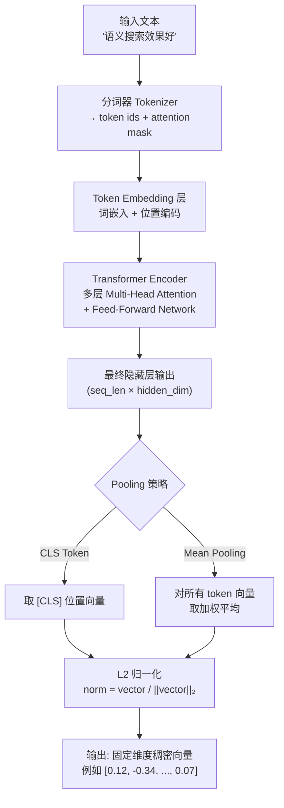

# Embedding 原理与向量相似度

## 1. 什么是 Embedding（嵌入）

在自然语言处理（NLP）中，计算机无法直接理解文字，必须将文字转换为数值表示。早期方案使用 **one-hot 编码**：词表有 10 万个词，每个词就是一个 10 万维的稀疏向量，其中只有一个位置为 1，其余全为 0。这种表示有两个致命缺点：维度爆炸，且任意两个词之间的余弦相似度都为 0，无法捕捉语义关系。

**Embedding（稠密向量表示）** 解决了这个问题。它将文本（词、句子、文档）映射为一个**固定长度的稠密向量**，例如 768 维或 1536 维。语义相近的文本在高维空间中距离更近，语义相反的文本距离更远。

> 直觉上，可以把 Embedding 空间想象成一个多维地图："苹果"和"橙子"在水果区，"北京"和"上海"在城市区，它们各自相互靠近，但两组之间距离较远。

核心特性：
- **语义相似性（Semantic Similarity）**：语义相近的文本向量余弦相似度高
- **向量运算（Vector Arithmetic）**：经典示例 `king - man + woman ≈ queen`
- **固定维度（Fixed Dimension）**：无论输入长短，输出向量维度相同
- **稠密表示（Dense Representation）**：大多数维度都有非零值，信息压缩表达

---

## 2. Embedding 模型工作原理

现代 Sentence Embedding 模型基于 **Transformer Encoder** 架构（如 BERT、RoBERTa）。其核心流程如下：



### 关键步骤解析

**分词（Tokenization）**：使用 BPE（Byte Pair Encoding）或 WordPiece 算法将文本切分为子词单元（subword tokens）。例如 "embedding" 可能被切分为 `["em", "##bed", "##ding"]`。

**多层自注意力（Multi-Head Self-Attention）**：每一层都让每个 token 关注序列中其他所有 token，捕捉长距离依赖关系。经过多层堆叠，上层向量已融合了丰富的上下文语义。

**池化（Pooling）**：将变长序列压缩为一个固定向量。主流方案：
- **CLS Pooling**：取 `[CLS]` 特殊符号的向量，BERT 原始设计用于分类任务
- **Mean Pooling**：对所有非 padding token 的向量取均值，实践中对语义相似度任务效果更稳定

**L2 归一化（L2 Normalization）**：将向量归一化到单位超球面上，使余弦相似度等价于点积，便于后续检索。

---

## 3. 向量相似度度量

获得文本向量后，需要一种数值度量来衡量两个向量的"相似程度"。常用指标有三种：

### 余弦相似度（Cosine Similarity）

$$\cos(\theta) = \frac{\mathbf{a} \cdot \mathbf{b}}{|\mathbf{a}| \cdot |\mathbf{b}|} = \frac{\sum_{i} a_i b_i}{\sqrt{\sum_i a_i^2} \cdot \sqrt{\sum_i b_i^2}}$$

只关注向量方向，忽略模长。归一化向量的余弦相似度等于点积。

### 点积（Dot Product）

$$\text{score} = \mathbf{a} \cdot \mathbf{b} = \sum_{i} a_i b_i$$

当向量已 L2 归一化时，点积与余弦相似度完全等价，计算速度更快（少两次开方）。

### 欧氏距离（Euclidean Distance / L2 Distance）

$$d(\mathbf{a}, \mathbf{b}) = \|\mathbf{a} - \mathbf{b}\|_2 = \sqrt{\sum_i (a_i - b_i)^2}$$

衡量空间中两点的绝对距离，距离越小越相似。

### 三种指标对比

| 指标 | 公式 | 取值范围 | 是否受模长影响 | 推荐场景 |
|------|------|----------|---------------|----------|
| 余弦相似度（Cosine Similarity） | $\cos(\theta) = \frac{\mathbf{a} \cdot \mathbf{b}}{\|\mathbf{a}\|\|\mathbf{b}\|}$ | [-1, 1] | 否（归一化方向） | 语义相似度、RAG 检索（最通用） |
| 点积（Dot Product） | $\mathbf{a} \cdot \mathbf{b}$ | $(-\infty, +\infty)$ | 是 | 向量已归一化时与余弦等价，ANN 加速检索 |
| 欧氏距离（Euclidean Distance） | $\|\mathbf{a}-\mathbf{b}\|_2$ | $[0, +\infty)$ | 是 | 聚类（K-Means）、异常检测 |

实际工程中，**余弦相似度**是语义检索最常见选择。向量数据库（如 Faiss、Milvus、Qdrant）通常对已归一化向量默认使用内积（等价于余弦）以利用 SIMD 加速。

---

## 4. Python 代码示例

以下示例展示调用 Embedding API、手动计算余弦相似度、以及批量检索。

```python
# 注意：OpenAI SDK 和模型名称以官方文档为准，以下为示意代码骨架
import numpy as np
from openai import OpenAI

client = OpenAI()  # 默认读取 OPENAI_API_KEY 环境变量


def get_embedding(text: str, model: str = "text-embedding-3-small") -> list[float]:
    """获取单条文本的 embedding 向量"""
    text = text.replace("\n", " ")  # 避免换行影响分词
    response = client.embeddings.create(input=[text], model=model)
    return response.data[0].embedding


def get_embeddings_batch(texts: list[str], model: str = "text-embedding-3-small") -> list[list[float]]:
    """批量获取 embedding，减少 API 调用次数"""
    texts = [t.replace("\n", " ") for t in texts]
    response = client.embeddings.create(input=texts, model=model)
    # 按原始顺序返回（API 不保证顺序，需用 index 排序）
    embeddings = sorted(response.data, key=lambda x: x.index)
    return [e.embedding for e in embeddings]


def cosine_similarity(vec_a: list[float], vec_b: list[float]) -> float:
    """手动计算余弦相似度"""
    a = np.array(vec_a)
    b = np.array(vec_b)
    # 分母加 1e-10 防止除以零
    return float(np.dot(a, b) / (np.linalg.norm(a) * np.linalg.norm(b) + 1e-10))


def batch_search(query: str, corpus: list[str], top_k: int = 3) -> list[dict]:
    """
    简单批量检索：对语料库做 embedding，找出与 query 最相似的 top_k 条
    生产环境应使用向量数据库替代暴力搜索
    """
    all_texts = [query] + corpus
    all_embeddings = get_embeddings_batch(all_texts)

    query_vec = np.array(all_embeddings[0])
    corpus_vecs = np.array(all_embeddings[1:])

    # 向量归一化后用点积替代余弦相似度，等价且更快
    query_norm = query_vec / (np.linalg.norm(query_vec) + 1e-10)
    corpus_norms = corpus_vecs / (np.linalg.norm(corpus_vecs, axis=1, keepdims=True) + 1e-10)
    scores = corpus_norms @ query_norm  # shape: (len(corpus),)

    top_indices = np.argsort(scores)[::-1][:top_k]
    return [
        {"text": corpus[i], "score": float(scores[i])}
        for i in top_indices
    ]


# --- 示例调用 ---
if __name__ == "__main__":
    query = "如何提高向量检索的召回率？"
    docs = [
        "混合检索结合稀疏和稠密向量可以提升召回率。",
        "今天天气很好，适合出门散步。",
        "调整 chunk size 和 overlap 可以改善 RAG 效果。",
        "余弦相似度是衡量向量相似性的常用指标。",
    ]

    results = batch_search(query, docs, top_k=2)
    for r in results:
        print(f"[{r['score']:.4f}] {r['text']}")
```

---

## 5. 模型选型考量

### 维度与性能权衡

向量维度直接影响存储开销和检索速度：
- **维度越高**：表达能力更强，但存储空间和计算量线性增长。1 亿条 1536 维 float32 向量约占 **576 GB**。
- **维度越低**：速度快、存储省，但信息损失可能影响精度。

常见维度：`text-embedding-3-small` 为 1536 维，可截断至 512；BGE-large-zh 为 1024 维；BGE-M3 支持最高 1024 维稠密向量。

### 模型选型对比

| 场景 | 推荐模型 | 备注 |
|------|----------|------|
| 中文语义检索 | BGE-large-zh-v1.5、text2vec-large-chinese | BAAI 开源，中文效果优秀 |
| 多语言/中英混合 | multilingual-e5-large、BGE-M3 | M3 支持 100+ 语言，稀疏+稠密混合 |
| 商业 API（英文为主） | text-embedding-3-small / 3-large | OpenAI，支持 MRL 维度截断 |
| 低延迟/端侧部署 | BGE-small-zh-v1.5、paraphrase-MiniLM | 轻量化，牺牲少量精度换速度 |

### 稀疏检索 vs 稠密检索

| 维度 | 稀疏检索（Sparse Retrieval） | 稠密检索（Dense Retrieval） |
|------|-----------------------------|-----------------------------|
| 代表算法 | BM25、TF-IDF | Sentence-BERT、BGE、E5 |
| 向量形式 | 高维稀疏（数万维，大多为 0） | 低维稠密（256-4096 维） |
| 关键词匹配 | 精确匹配，召回率高 | 语义匹配，泛化能力强 |
| 领域外效果 | 稳定 | 依赖训练数据分布 |
| 存储开销 | 倒排索引，较小 | 向量索引，较大 |
| 推荐使用 | 专业术语、代码、法律文本 | 日常语言、问答、语义搜索 |

生产中常采用**混合检索（Hybrid Search）**：同时运行 BM25 和稠密向量检索，用 RRF（Reciprocal Rank Fusion）融合排序结果，兼顾精确匹配与语义泛化。

---

## 6. Matryoshka 表示学习（MRL）

**Matryoshka Representation Learning（俄罗斯套娃表示学习，MRL）** 是 OpenAI `text-embedding-3` 系列使用的关键技术（参考论文：Kusupati et al., 2022）。

核心思想：训练时使用多尺度损失函数，使得向量的**前 k 维就是完整向量截断到 k 维后的最优表示**。换言之，1536 维向量的前 256 维已经包含了足够有意义的语义信息。

**实际价值**：
- 无需重新训练模型，直接截断向量维度即可降低存储和计算成本
- 例如 `text-embedding-3-large`（3072 维）截断至 256 维后，性能仍优于老版 `text-embedding-ada-002`（1536 维）
- 支持按需选择维度，实现**成本-精度弹性权衡**

```python
# MRL 截断示例（以官方文档为准）
response = client.embeddings.create(
    input="MRL 截断示例",
    model="text-embedding-3-small",
    dimensions=512  # 指定截断维度，API 直接返回 512 维向量
)
```

---

## 7. 常见误区与最佳实践

### 误区一：长文档直接 Embedding 效果差

Transformer Encoder 有输入长度限制（通常 512 tokens），超出部分会被截断，导致后半段内容完全丢失。

**最佳实践**：对长文档进行合理的 **chunking（分块）**，每块保持在模型最大输入长度的 80% 以内，相邻块设置适当的 overlap（重叠）以保留上下文连贯性。

### 误区二：Embedding 空间各向异性（Anisotropy）

研究发现（Ethayarajh, 2019），BERT 类模型的 token 向量分布高度非均匀，集中在一个狭窄锥形区域，导致随机两个向量余弦相似度普遍偏高（很多在 0.8 以上）。

**影响**：相似度分数的区分度下降，难以设置合理的相似度阈值。

**最佳实践**：优先选择专门微调过句向量任务的模型（如 BGE、E5、Sentence-BERT），而非直接使用预训练语言模型的原始 CLS 向量；必要时可使用 **Whitening 后处理**消除各向异性。

### 误区三：使用余弦相似度前未归一化

余弦相似度的数学定义已包含归一化，但在自行实现或使用某些库时容易忘记。未归一化直接使用点积，会导致模长大的向量得分虚高。

**最佳实践**：存入向量数据库前统一做 L2 归一化，此后使用点积即等价于余弦相似度，且计算更快。

### 误区四：相似度高不等于语义完全相同

高相似度表示语义方向接近，但不保证内容等价。"苹果很好吃"和"苹果公司股价上涨"在某些模型中相似度可能不低，因为它们共享"苹果"这一词。在严格的语义匹配场景下，应结合 **re-ranking（重排序）** 模型做精细化过滤。

---

## 面试常问

**Q1：余弦相似度和欧氏距离有什么区别，分别适用什么场景？**

余弦相似度衡量向量的**方向差异**，不受向量模长影响；欧氏距离衡量向量在空间中的**绝对距离**，受模长影响。对于语义检索任务，文本向量经 L2 归一化后模长为 1，此时两者等价（$d_{L2}^2 = 2(1 - \cos\theta)$）。实际选型：语义相似度/RAG 检索优先余弦相似度；K-Means 聚类等几何意义明确的任务可用欧氏距离。

**Q2：one-hot 编码和 Embedding 的核心区别是什么？**

one-hot 编码是高维稀疏向量，维度等于词表大小（通常数万到数十万），任意两个词向量正交，无法表达语义关系，且维度随词表膨胀。Embedding 是低维稠密向量（几百到几千维），通过模型训练习得语义表示，语义相近的词向量距离更近。本质上，one-hot 是索引，Embedding 是经过信息压缩的语义坐标。

**Q3：RAG 中 chunk 大小如何影响 Embedding 质量？**

chunk 太大：超出模型最大输入长度会截断，且单个向量需压缩过多信息，语义焦点分散，检索精度下降。chunk 太小：单个块缺乏上下文，可能包含不完整语义，匹配时噪声增多。一般建议：chunk 大小控制在 256-512 tokens，相邻块保留 10%-15% 的 overlap，对于结构化文档（如代码、表格）可按自然边界分块而非固定长度。

**Q4：两段文本相似度很高，是否意味着语义完全相同？**

不一定。高相似度仅表示两段文本在 Embedding 空间的方向接近，存在以下反例：（1）**多义词混淆**：不同语境下的"苹果"被表示为相近向量；（2）**表层词汇重叠**：共享大量词汇但逻辑相反的句子（如"今天涨价了"vs"今天没有涨价"）相似度可能偏高；（3）**模型训练偏差**：领域外文本的 Embedding 可能落入相近区域。解决方案：在检索后增加**交叉编码器（Cross-Encoder）重排序**步骤，Cross-Encoder 将 query 和 document 一起输入，直接建模两者交互，精度远高于双编码器。

---

> 部分内容参考《Hello-Agents》(datawhalechina)整理。
