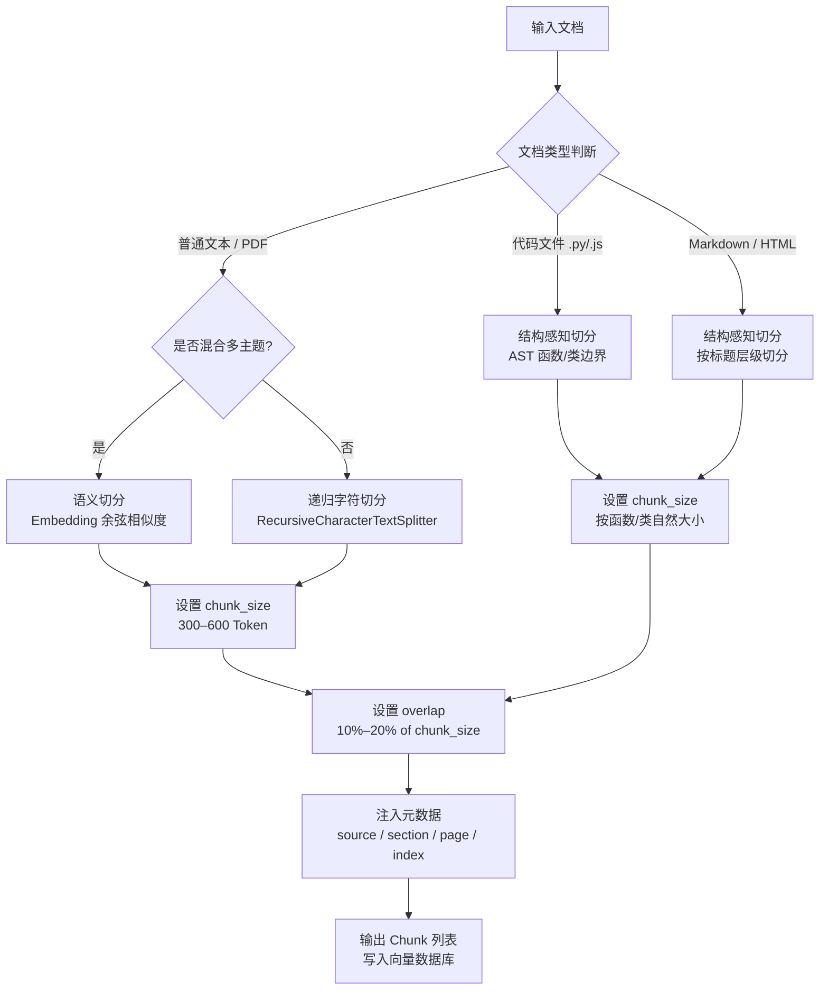

在构建检索增强生成（RAG, Retrieval-Augmented Generation）系统时，如何将原始文档切分成合适的片段，往往决定了整个系统的天花板。LLM 的上下文窗口有限，不可能将整个知识库一次性塞入 Prompt；而检索阶段返回的片段质量，直接决定最终答案的准确性。分块策略的核心矛盾有两条：**粒度与语义完整性的权衡**（太小丢语义，太大引入噪声）以及**均匀切分与结构感知的权衡**（固定长度实现简单，但往往割裂段落或代码）。

---

## 一、为什么分块至关重要

### 1.1 上下文窗口的约束

主流 LLM 的上下文窗口从 4K 到 128K Token 不等。即便是最大的窗口，面对数百万字的知识库也无能为力。RAG 的核心思路是"先检索再生成"，只把最相关的片段送入上下文。分块的质量直接影响：

- **召回率**：语义完整的块更容易被向量检索命中；
- **精确率**：过大的块引入大量无关内容，干扰 LLM 推理；
- **延迟与成本**：块的大小决定了每次检索传入的 Token 数量。

### 1.2 两大核心矛盾

| 矛盾维度 | 极端情况 A | 极端情况 B |
|---|---|---|
| 粒度 vs 语义完整性 | 按字符截断，快速但割裂句意 | 整段/整页，语义完整但噪声大 |
| 均匀 vs 结构感知 | 固定 512 Token，实现简单 | 按 Markdown 标题/代码函数边界切分，精准但复杂 |

---

## 二、主流分块策略详解

### 2.1 固定大小切分（Fixed-size Chunking）

最简单的策略：按固定字符数或 Token 数截断，不考虑语义边界。

**优点**：实现极简，速度快，适合快速原型。
**缺点**：可能在句子中间截断，导致语义不完整；对结构化文档（如代码、表格）破坏严重。

```python
def fixed_size_chunking(text: str, chunk_size: int = 500, overlap: int = 50) -> list[str]:
    """按固定字符数切分文本，支持重叠窗口"""
    chunks = []
    start = 0
    while start < len(text):
        end = start + chunk_size
        chunks.append(text[start:end])
        start += chunk_size - overlap  # 滑动步长 = chunk_size - overlap
    return chunks

# 示例
text = "这是一段很长的文档内容..." * 100
chunks = fixed_size_chunking(text, chunk_size=200, overlap=20)
print(f"共生成 {len(chunks)} 个块，首块预览: {chunks[0][:50]}")
```

---

### 2.2 句子级切分（Sentence-based Chunking）

以自然句子边界（句号、问号、感叹号）为切分点，将若干句子组合成一个块，直到接近目标长度上限。

**优点**：保留完整句意，不会在句子中间截断；适合新闻、论文等叙述性文本。
**缺点**：句子长度差异大，导致块大小不均匀；对中文分句依赖标点符号的准确性。

```python
import re

def sentence_based_chunking(text: str, max_chunk_size: int = 400) -> list[str]:
    """按句子边界切分，合并到接近目标长度"""
    # 中英文句子分割（简化版）
    sentences = re.split(r'(?<=[。！？.!?])\s*', text)
    sentences = [s.strip() for s in sentences if s.strip()]

    chunks, current_chunk = [], ""
    for sentence in sentences:
        if len(current_chunk) + len(sentence) <= max_chunk_size:
            current_chunk += sentence
        else:
            if current_chunk:
                chunks.append(current_chunk)
            current_chunk = sentence
    if current_chunk:
        chunks.append(current_chunk)
    return chunks
```

---

### 2.3 递归字符切分（Recursive Character Splitting）

LangChain 中 `RecursiveCharacterTextSplitter` 所采用的策略：按优先级依次尝试多种分隔符（`\n\n` > `\n` > `.` > ` `），优先在段落边界切分，找不到则降级到行，再降级到句子，最后才按空格截断。

**优点**：在尽量保留语义结构的前提下，兼顾长度控制；通用性强，是实践中最常用的默认策略。
**缺点**：对 Markdown、代码等高度结构化内容仍有不足；参数调优需要经验。

```python
from langchain.text_splitter import RecursiveCharacterTextSplitter

def recursive_split(text: str, chunk_size: int = 500, chunk_overlap: int = 50) -> list[str]:
    """
    使用 LangChain RecursiveCharacterTextSplitter 进行递归切分
    分隔符优先级: 段落 > 行 > 句子 > 单词
    """
    splitter = RecursiveCharacterTextSplitter(
        chunk_size=chunk_size,
        chunk_overlap=chunk_overlap,
        separators=["\n\n", "\n", "。", ".", " ", ""],  # 中文优先加句号
        length_function=len,
    )
    chunks = splitter.split_text(text)
    return chunks

# 示例
sample_doc = """
## 第一章 简介

这是第一章的内容，包含多个段落。

第二段内容在这里。

## 第二章 深入探讨

这里是第二章的详细内容。
"""
result = recursive_split(sample_doc, chunk_size=100, chunk_overlap=10)
for i, chunk in enumerate(result):
    print(f"[Chunk {i}] {repr(chunk[:60])}")
```

---

### 2.4 语义切分（Semantic Chunking）

将文本按句子编码为向量，计算相邻句子之间的余弦相似度，在相似度骤降处（即语义跳变点）切分。这是最"智能"的策略，切出的块在语义上高度内聚。

**优点**：切分点对应真实的语义边界，块内语义最完整；对混合主题的长文档效果显著。
**缺点**：需要对每个句子做 Embedding，计算成本高；对 Embedding 模型质量依赖强。

```python
import numpy as np
from sentence_transformers import SentenceTransformer

def semantic_chunking(text: str, model_name: str = "BAAI/bge-small-zh-v1.5",
                      threshold: float = 0.7) -> list[str]:
    """
    语义切分：在余弦相似度骤降处切分文本
    threshold: 低于此值视为语义跳变点
    """
    model = SentenceTransformer(model_name)
    sentences = [s.strip() for s in text.split("。") if s.strip()]

    if len(sentences) <= 1:
        return sentences

    # 编码所有句子
    embeddings = model.encode(sentences, normalize_embeddings=True)

    # 计算相邻句子余弦相似度（已归一化，点积即余弦相似度）
    similarities = [
        float(np.dot(embeddings[i], embeddings[i + 1]))
        for i in range(len(embeddings) - 1)
    ]

    # 在低相似度处切分
    chunks, current = [], [sentences[0]]
    for i, sim in enumerate(similarities):
        if sim < threshold:
            chunks.append("。".join(current) + "。")
            current = [sentences[i + 1]]
        else:
            current.append(sentences[i + 1])
    if current:
        chunks.append("。".join(current) + "。")

    return chunks
```

---

### 2.5 结构感知切分（Structure-aware Chunking）

针对具有明确结构的文档（Markdown、HTML、代码文件），按结构边界切分。Markdown 文档按 `#`/`##`/`###` 标题层级切分；Python/JavaScript 代码按函数或类定义边界切分（借助 AST）。

**优点**：切分结果与文档的逻辑单元完全对齐，语义最完整；保留标题上下文，有利于后续元数据注入。
**缺点**：需针对不同格式单独开发解析逻辑；结构层级不规范的文档效果差。

```python
import ast

def chunk_python_by_function(source_code: str) -> list[dict]:
    """按函数/类边界切分 Python 代码（使用 AST）"""
    tree = ast.parse(source_code)
    lines = source_code.splitlines()
    chunks = []

    for node in ast.walk(tree):
        if isinstance(node, (ast.FunctionDef, ast.AsyncFunctionDef, ast.ClassDef)):
            start = node.lineno - 1
            end = node.end_lineno
            code_block = "\n".join(lines[start:end])
            chunks.append({
                "type": type(node).__name__,
                "name": node.name,
                "content": code_block,
                "start_line": start + 1,
                "end_line": end,
            })
    return chunks
```

---

## 三、重叠窗口（Chunk Overlap）

跨块的关键信息往往位于切分边界附近。引入重叠窗口（Overlap），让相邻块共享一段内容，可以有效避免上下文断裂。

**经验法则**：重叠量通常为 `chunk_size` 的 10%–20%。例如 `chunk_size=500`，`overlap=50~100`。

```
原始文本:  |<------- Chunk 1 (500 chars) ------->|
                                   |<overlap>|
                                   |<------- Chunk 2 (500 chars) ------->|
                                                            |<overlap>|
                                                            |<------ Chunk 3 ------>|

ASCII 示意:
文本流:  [============================][============================][==================]
Chunk1:  [==========CHUNK-1===========]
Chunk2:               [======OVERLAP======CHUNK-2====================]
Chunk3:                                        [====OVERLAP====CHUNK-3================]
```

重叠的代价是存储和检索时的冗余。若 overlap 过大（>30%），相邻块几乎相同，会显著增加向量库体积并降低检索多样性。

---

## 四、元数据注入（Metadata Enrichment）

每个块不仅要存储文本内容，还应附加结构化元数据，用于后续的过滤（Filter）和来源归因（Attribution）。

```python
def build_chunk_with_metadata(
    content: str,
    source_file: str,
    section_title: str,
    page_number: int,
    chunk_index: int,
) -> dict:
    """为每个文本块注入元数据"""
    return {
        "content": content,           # 实际文本内容
        "metadata": {
            "source": source_file,     # 来源文件路径，如 "docs/guide.md"
            "section": section_title,  # 所在章节标题，如 "第三章 安装指南"
            "page": page_number,       # PDF 页码或文档逻辑页
            "chunk_index": chunk_index,# 在文档中的顺序编号
            "char_count": len(content),# 字符数，用于调试
        }
    }

# 示例输出
chunk = build_chunk_with_metadata(
    content="RecursiveCharacterTextSplitter 会按段落优先切分...",
    source_file="docs/langchain-guide.md",
    section_title="文本切分策略",
    page_number=3,
    chunk_index=7,
)
# 检索时可按 metadata.source 过滤，只检索特定文档
```

元数据注入后，RAG 系统可以实现：
- **来源过滤**：只在某个文件或章节中检索；
- **答案归因**：回答时标注"来自《xxx》第 N 页"；
- **结果排序**：优先返回最新章节的内容。

---

## 五、策略对比

| 策略 | 实现复杂度 | 语义完整性 | 适合场景 | 计算开销 |
|---|---|---|---|---|
| 固定大小切分（Fixed-size） | 低 | 低 | 快速原型、纯文本流水账 | 极低 |
| 句子级切分（Sentence-based） | 低–中 | 中 | 新闻、论文、叙述性文本 | 低 |
| 递归字符切分（Recursive） | 中 | 中–高 | 通用文档、技术博客（**默认首选**） | 低 |
| 语义切分（Semantic） | 高 | 高 | 混合主题长文、学术文献 | 高（需 Embedding） |
| 结构感知切分（Structure-aware） | 高 | 最高 | Markdown 文档、代码库、HTML | 中（需解析器） |

---

## 六、分块决策流程



---

## 七、不同内容类型的分块建议

### 7.1 代码（Code）

不要按字符截断代码。以函数或类为最小切分单元，使用 AST 解析。单个函数超过目标 chunk_size 时，保留完整函数而不强制截断（宁可超长，不可破坏语法）。每个块的元数据应包含函数名、文件路径、行号。

### 7.2 表格（Table）

Markdown 或 HTML 表格不适合直接向量化，应先转换为自然语言描述。例如将表格行转为"产品 A 的价格为 99 元，库存为 500 件"，再进行切分。

### 7.3 FAQ 文档

问答对（Q+A）应作为原子单元保留，不可将问题和答案分入两个块。若 Q+A 对过长，允许适度截断答案，但问题必须保留在块头部。

### 7.4 技术文档（Technical Docs）

推荐使用递归字符切分，`chunk_size` 设置为 300–500 Token，`overlap` 设为 50–100 Token。同时结合 Markdown 标题作为元数据的 `section` 字段，方便后续按章节过滤。

---

## 八、常见误区与最佳实践

**误区 1：chunk_size 越大越好**
大块包含更多信息，但向量化后语义被"稀释"，相似度计算不够精准，召回质量反而下降。建议从 300–500 Token 起步，通过评估指标迭代调整。

**误区 2：overlap 可以省略**
省略 overlap 会导致跨块边界的信息丢失，尤其是长推理链中的关键过渡句。10%–20% 的 overlap 是低成本的保险策略。

**误区 3：所有文档用同一策略**
代码、表格、FAQ、叙述文本对切分策略的需求截然不同。生产系统应根据文档类型路由到不同的切分器。

**最佳实践**：构建"切分评估集"——准备若干典型问题，用不同策略切分后分别测试召回率和答案准确率，以数据驱动策略选型。

---

## 九、面试常问

**Q1：如何调优 chunk_size 和 overlap 参数？**

A：首先明确目标指标（如 Hit Rate@5、MRR），然后准备 50–100 个典型问答对作为评估集。以 256、512、1024 Token 三档 chunk_size 分别建库，固定 overlap=10%，运行评估取最优值。overlap 的调优类似：固定 chunk_size，用 0%、10%、20% 三档对比。实践中 512 Token + 10% overlap 是一个可靠起点。

**Q2：语义切分与固定大小切分相比，优势和代价分别是什么？**

A：语义切分的优势在于切分边界对齐真实的语义跳变点，块内语义高度内聚，向量检索精度更高；劣势是需要对每个句子做 Embedding，预处理成本是固定切分的数十倍，且依赖 Embedding 模型的质量。对于语言风格统一、主题单一的文档，两者差距不大；对于混合了多个主题的长篇文档，语义切分优势明显。

**Q3：检索命中了，但最终答案仍然不准确，可能是什么原因？**

A：常见原因有三：（1）**块内噪声过多**：chunk_size 过大，检索到的块包含大量无关内容，干扰 LLM 推理；（2）**关键信息跨块分布**：答案所需的信息分散在相邻两个块中，单块不完整，需要加大 overlap 或使用父块检索（Parent Document Retrieval）；（3）**元数据未利用**：检索时未对来源或章节做过滤，引入了来自不同版本文档的矛盾信息。

**Q4：对于代码库的 RAG，有什么特殊的分块建议？**

A：代码库不能用通用文本切分策略。推荐：（1）以函数或类为原子单元，用 AST 解析而非字符截断；（2）每个块的元数据包含函数签名、文件路径、所属类名，方便按模块过滤；（3）对超长函数（>1000 Token），可拆分为函数签名+文档注释 和 函数体 两个块，保证函数契约在第一个块中完整呈现；（4）建议同时索引代码和对应的 docstring/注释，用自然语言查询可以命中代码块。

---

