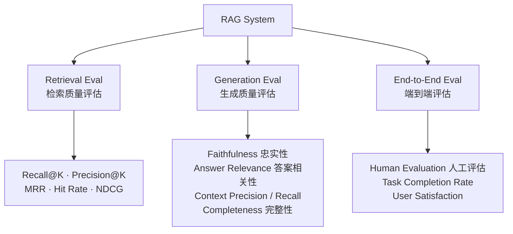

RAG 系统的评估之所以困难，在于检索器（Retriever）和生成器（Generator）紧密耦合——任何一个环节的缺陷都可能以同样的症状呈现；更棘手的是，语言模型擅长生成流畅的回答，即使答案完全是凭空捏造的幻觉（Hallucination），也难以被人眼直接识别。因此，RAG 评估必须拆解指标、分层衡量，才能真正定位问题根源。

---

## 一、评估分解：拆开才能看清 (Evaluation Decomposition)

核心洞察：将整体管道拆分为「检索质量评估」和「生成质量评估」两个独立维度，再加上端到端的整体评估，三者互为补充。



这种分解的价值在于：当端到端指标下降时，能快速定位是检索层还是生成层出了问题，避免盲目调整。

---

## 二、检索质量指标 (Retrieval Quality Metrics)

### Recall@K（召回率）

在返回的 Top-K 个文档中，相关文档占所有相关文档的比例。

$$\text{Recall@K} = \frac{|\text{Retrieved Relevant} \cap \text{All Relevant}|}{|\text{All Relevant}|}$$

### Precision@K（精确率）

Top-K 结果中，相关文档所占的比例。

$$\text{Precision@K} = \frac{|\text{Retrieved Relevant}|}{K}$$

### MRR（Mean Reciprocal Rank，平均倒数排名）

关注第一个相关文档出现的排名位置，排名越靠前分数越高。

$$\text{MRR} = \frac{1}{|Q|} \sum_{i=1}^{|Q|} \frac{1}{\text{rank}_i}$$

其中 $\text{rank}_i$ 是第 $i$ 个查询中第一个相关文档的排名位置。

### Hit Rate（命中率）

二元指标：Top-K 中是否出现了至少一个相关文档。简单直观，常用于快速冒烟测试。

$$\text{Hit Rate} = \frac{\text{Queries with at least one relevant doc in Top-K}}{|Q|}$$

### NDCG（Normalized Discounted Cumulative Gain）

NDCG 考虑了文档的「分级相关性」（graded relevance）和排名位置的折损，是最综合的检索指标。排名越靠前的相关文档权重越高；同时允许相关性不是非 0 即 1，而是有多个级别（如 0/1/2）。

---

### Python 示例：计算 Recall@K 与 MRR

```python
def recall_at_k(retrieved_ids: list[str], relevant_ids: set[str], k: int) -> float:
    """
    计算 Recall@K
    retrieved_ids: 检索器返回的文档 ID 列表（按相关性排序）
    relevant_ids: 标注的相关文档 ID 集合
    k: 取前 k 个结果
    """
    if not relevant_ids:
        return 0.0
    top_k = set(retrieved_ids[:k])
    hits = top_k & relevant_ids
    return len(hits) / len(relevant_ids)


def mrr(retrieved_ids_list: list[list[str]], relevant_ids_list: list[set[str]]) -> float:
    """
    计算多个查询的 MRR
    retrieved_ids_list: 每个查询的检索结果列表
    relevant_ids_list:  每个查询对应的相关文档集合
    """
    reciprocal_ranks = []
    for retrieved, relevant in zip(retrieved_ids_list, relevant_ids_list):
        rr = 0.0
        for rank, doc_id in enumerate(retrieved, start=1):
            if doc_id in relevant:
                rr = 1.0 / rank
                break
        reciprocal_ranks.append(rr)
    return sum(reciprocal_ranks) / len(reciprocal_ranks) if reciprocal_ranks else 0.0


# 示例用法
retrieved = ["doc3", "doc1", "doc5", "doc2", "doc4"]
relevant  = {"doc1", "doc2"}

print(f"Recall@5: {recall_at_k(retrieved, relevant, k=5):.2f}")  # 1.00
print(f"Recall@3: {recall_at_k(retrieved, relevant, k=3):.2f}")  # 0.50
print(f"MRR:      {mrr([retrieved], [relevant]):.2f}")           # 0.50 (doc1 at rank 2)
```

---

## 三、生成质量指标 (Generation Quality Metrics)

生成质量的评估更为复杂，通常需要借助 LLM-as-Judge（大模型作为评判者）来自动化打分。

- **Faithfulness（忠实性 / Groundedness）**：答案中的每一个声明都必须有检索上下文的支撑。这是抵御幻觉的核心指标。一个高忠实性的系统不会生成上下文之外的内容。
- **Answer Relevance（答案相关性）**：答案是否切题，直接回答了用户的问题。注意：一个答案可以是「正确的」但「不相关的」（回答了另一个问题）。
- **Context Precision（上下文精确率）**：检索到的上下文中，有多少比例对生成正确答案是必要的？噪声上下文越少越好。
- **Context Recall（上下文召回率）**：生成正确答案所需的所有信息，是否都已被检索到？
- **Completeness（完整性）**：上下文中包含的相关信息，是否都被体现在了答案中？

---

## 四、RAGAS 框架：自动化 RAG 评估

[RAGAS](https://github.com/explodinggradients/ragas) 是目前最流行的开源 RAG 评估框架，核心特点是**无需人工标注、全自动使用 LLM-as-Judge 打分**，覆盖 Faithfulness、Answer Relevancy、Context Precision、Context Recall 等关键指标。

### RAGAS 使用示例

```python
from ragas import evaluate
from ragas.metrics import (
    faithfulness,
    answer_relevancy,
    context_precision,
    context_recall,
)
from datasets import Dataset

# 构建评估数据集
# 每条样本需要: question, answer, contexts, ground_truth
data = {
    "question":     ["什么是 RAG？", "Transformer 的注意力机制是什么？"],
    "answer":       ["RAG 是检索增强生成...", "注意力机制通过 Q/K/V 计算..."],
    "contexts":     [
        ["RAG 全称 Retrieval Augmented Generation，..."],
        ["Transformer 使用自注意力机制...", "Q/K/V 矩阵用于..."],
    ],
    "ground_truth": ["RAG 结合检索和生成两个步骤...", "注意力机制计算序列中各位置的权重..."],
}

dataset = Dataset.from_dict(data)

# 执行评估（内部调用 LLM 打分，默认使用 OpenAI）
results = evaluate(
    dataset=dataset,
    metrics=[faithfulness, answer_relevancy, context_precision, context_recall],
)

print(results.to_pandas())
# 输出各指标得分，取值 0~1，越高越好
```

> 注意：具体指标定义和 API 以 [RAGAS 官方文档](https://docs.ragas.io) 为准，版本迭代较快。

**RAGAS 的局限性**：LLM 评判者本身存在偏好偏差（Positional Bias、Verbosity Bias），对同一输出可能给出不一致的评分，且与人工判断存在差异。建议定期抽样进行人工校准。

---

## 五、LLM-as-Judge 模式 (LLM as Evaluator)

使用强大的模型（如 GPT-4、Claude）作为评判者，对生成结果进行打分是当前最具扩展性的方案。

### Faithfulness 评分 Prompt 模板

```
你是一个严格的事实核查员。
请判断以下【答案】中的每个陈述是否能从【上下文】中得到支持。

【问题】: {question}

【上下文】:
{context}

【答案】:
{answer}

请逐条列出答案中的声明，并标注每条声明是否被上下文支持（支持/不支持）。
最后给出 0.0~1.0 的忠实性分数（支持的声明数 / 总声明数）。
只输出 JSON 格式：{"statements": [...], "score": 0.x}
```

**优点**：无需标注数据，可大规模自动化评估，灵活定制评估维度。  
**缺点**：评判模型本身有偏差，存在评估成本，不同模型版本结果可能不一致。

---

## 六、综合指标对照表

| 指标 | 评估维度 | 是否需要标注 | 适用场景 | 局限性 |
|------|----------|-------------|----------|--------|
| Recall@K | 检索层 | 需要相关文档标注 | 确保重要信息被召回 | 忽略排名质量 |
| Precision@K | 检索层 | 需要相关文档标注 | 控制噪声上下文 | 忽略未召回的相关文档 |
| MRR | 检索层 | 需要相关文档标注 | 关注首个相关结果排名 | 只看第一个命中 |
| NDCG | 检索层 | 需要分级相关性标注 | 最全面的检索评估 | 标注成本高 |
| Faithfulness | 生成层 | 不需要（LLM 判断） | 幻觉检测 | LLM judge 有偏差 |
| Answer Relevance | 生成层 | 不需要（LLM 判断） | 答案切题性 | 无法判断事实正确性 |
| Context Precision | 检索+生成 | 不需要（LLM 判断） | 上下文噪声控制 | 依赖 judge 质量 |
| Context Recall | 检索+生成 | 需要 ground truth | 信息覆盖完整性 | 需要参考答案 |

---

## 七、优化杠杆地图 (Optimization Lever Map)

当某个指标偏低时，对应的优化方向如下：

| 症状 | 根因定位 | 优化措施 |
|------|----------|----------|
| **Recall@K 低** | 检索层：相关文档没被召回 | 优化分块策略（Chunking）、换用更强的 Embedding 模型、引入混合搜索（Hybrid Search） |
| **Faithfulness 低** | 生成层：模型产生幻觉 | 在 Prompt 中显式约束「仅使用上下文回答」、降低 temperature、增加 Reranker 过滤无关文档 |
| **Answer Relevance 低** | 生成层+查询理解 | 优化 Query 理解（HyDE / Query Rewrite）、改进 Prompt 指令清晰度 |
| **Precision@K 高但 Recall@K 低** | 检索层：K 太小或检索策略单一 | 增大 K 值、使用混合搜索（稀疏 + 稠密） |
| **Context Recall 低** | 检索层：关键信息分散在多个文档 | 调整分块粒度、使用父子分块（Parent-Child Chunking） |

---

## 八、优化闭环 (The Optimization Loop)

持续改进 RAG 系统需要建立可重复、可量化的评估流程：

### 步骤

1. **构建黄金数据集（Golden Dataset）**：收集 100~500 对有代表性的 QA 样本，标注 ground truth 答案和相关文档 ID。数据集应覆盖边界情况和领域核心问题。

2. **离线回归测试**：每次修改（Embedding 模型、分块策略、Prompt）后，在黄金数据集上自动跑完整评估，防止指标退化。

3. **线上 A/B 测试**：将新策略以小流量灰度上线，收集真实用户行为信号（点赞/点踩、会话完成率）。

4. **人工抽样校验**：定期（如每周）抽取 20~50 条线上结果做人工评审，校准自动化指标与真实质量的偏差。

```python
# 自动化评估管道伪代码
def run_eval_pipeline(config: dict, golden_dataset: list[dict]) -> dict:
    """
    config: 包含 embedding_model, chunk_size, top_k, prompt_template 等配置
    golden_dataset: [{"question": ..., "ground_truth": ..., "relevant_doc_ids": {...}}, ...]
    """
    results = []
    for sample in golden_dataset:
        # 1. 检索
        retrieved = retrieve(sample["question"], config)

        # 2. 生成
        answer = generate(sample["question"], retrieved, config["prompt_template"])

        # 3. 计算检索指标
        recall = recall_at_k(
            [doc["id"] for doc in retrieved],
            sample["relevant_doc_ids"],
            k=config["top_k"]
        )

        # 4. 计算生成指标（调用 LLM judge）
        faithfulness_score = llm_judge_faithfulness(
            question=sample["question"],
            context=retrieved,
            answer=answer
        )

        results.append({
            "question": sample["question"],
            "recall_at_k": recall,
            "faithfulness": faithfulness_score,
        })

    # 汇总
    avg_recall       = sum(r["recall_at_k"]  for r in results) / len(results)
    avg_faithfulness = sum(r["faithfulness"] for r in results) / len(results)

    return {"recall@k": avg_recall, "faithfulness": avg_faithfulness, "config": config}
```

---

## 常见误区与最佳实践 (Common Pitfalls & Best Practices)

**误区一：只优化单一指标**  
Recall@K 和 Precision@K 存在天然权衡：盲目增大 K 可以提升召回，但会引入噪声上下文，导致 Faithfulness 下降。最佳实践是设定多个核心指标的下限，进行多目标优化。

**误区二：无校准地信任 LLM-as-Judge**  
LLM 评判者存在位置偏差（先呈现的答案更易获得高分）、冗长偏差（更长的答案得分更高）等问题。最佳实践是定期用人工标注的子集对自动评分进行校准，报告一致性（Agreement Rate）。

**误区三：跳过评估阶段，仅凭肉眼判断**  
手工检查 10~20 条回答无法代表整体分布，容易被显眼的好例子迷惑。最佳实践是在任何上线前先建立基线评估，所有改动都通过自动化流程验证。

**最佳实践总结**  
- 从最小可行黄金数据集（50~100 条）开始，逐步扩充
- 优先保证 Faithfulness（幻觉是最严重的质量风险）
- 检索层和生成层分别建立基线，独立优化
- 评估框架本身也需要版本管理，记录每次变更

---

## 面试常问 (Interview Q&A)

**Q1：Faithfulness 和 Answer Relevance 有什么区别？**  
A：两者评估的维度不同。**Faithfulness（忠实性）** 衡量答案中的每个陈述是否有检索上下文的支撑，核心是防止幻觉——答案不能编造上下文之外的内容。**Answer Relevance（答案相关性）** 衡量答案是否切题，即答案是否直接回答了用户的问题。一个答案可以同时具备高忠实性但低相关性（例如从上下文中找到了真实信息，但回答了一个不相关的问题），也可以高相关但低忠实（直接回答了问题，但引入了上下文之外的内容）。两者都高才是好的 RAG 输出。

**Q2：在没有标注数据的情况下，如何评估 RAG 系统？**  
A：可以采用以下策略：① 使用 **LLM-as-Judge**（如 RAGAS）对 Faithfulness 和 Answer Relevance 进行无监督评分，这两个指标不需要 ground truth；② 使用合成数据生成（Synthetic Data Generation）——让 LLM 基于已有文档自动生成 QA 对，作为临时评估集；③ 利用用户行为信号（点赞/点踩、会话放弃率）作为代理指标；④ 对需要 ground truth 的指标（如 Context Recall），优先投入标注资源构建最小黄金集（50~100 条）。

**Q3：当 RAG 质量不好时，应该从哪里开始优化？**  
A：建议按以下顺序排查：**第一步**，先跑检索层指标（Recall@K、Hit Rate）。如果 Recall@K 很低，说明相关文档根本没被召回，生成质量再好也无济于事——此时应优先优化分块策略、Embedding 模型或引入混合搜索。**第二步**，如果检索指标合格，再看 Faithfulness——低 Faithfulness 意味着生成器在产生幻觉，通常通过修改 Prompt（强制约束使用上下文）和加 Reranker 解决。**第三步**，最后看 Answer Relevance——如果答案忠实但不切题，则需要改善查询理解模块（Query Rewriting / HyDE）。遵循「先检索后生成」的优化顺序，避免在错误层面反复调试。

**Q4：RAGAS 的核心原理是什么？它有什么局限？**  
A：RAGAS 的核心思路是用一个强大的 LLM（评判者模型）来自动化地计算那些本来需要人工标注才能得到的指标。例如计算 Faithfulness 时，RAGAS 会让 LLM 将答案分解为若干原子陈述（Atomic Claims），再逐一判断每条陈述是否被上下文支撑，最后统计支撑比例。局限性主要有三点：① LLM judge 本身有偏差（冗长偏差、位置偏差），与人工判断不总是一致；② 评估过程本身消耗 Token，有一定成本；③ RAGAS 的指标定义和计算方式随版本迭代变化较快，不同版本间结果可能不可比。

---

